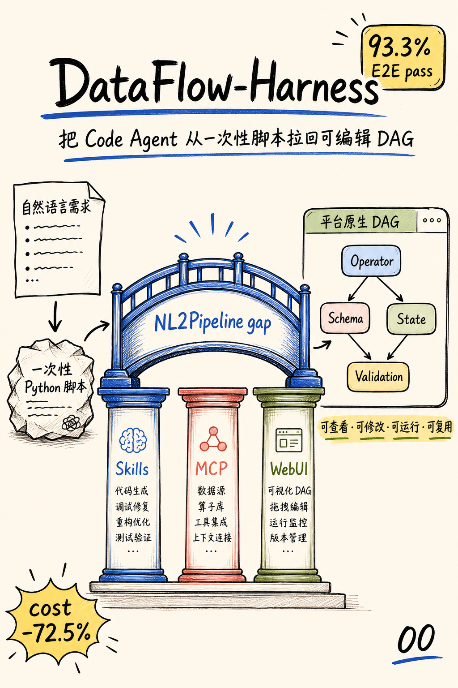
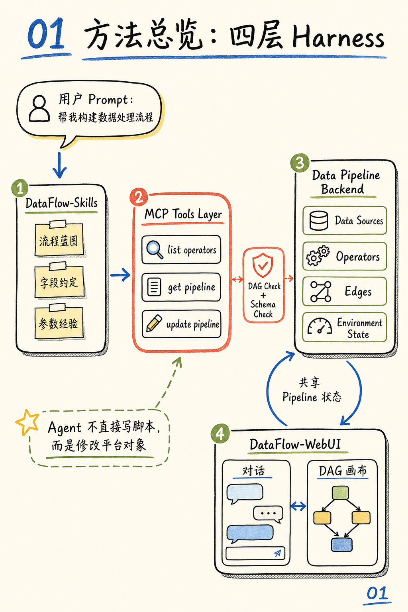
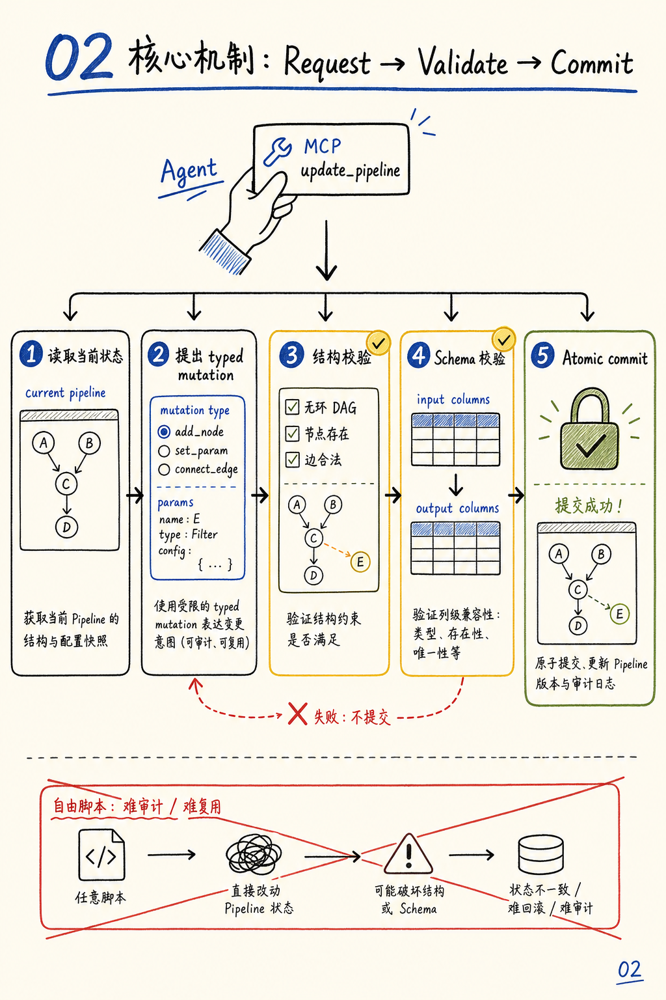
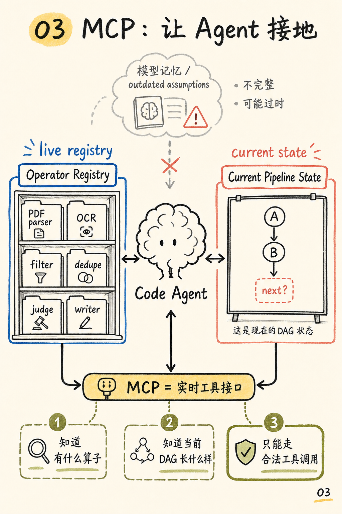
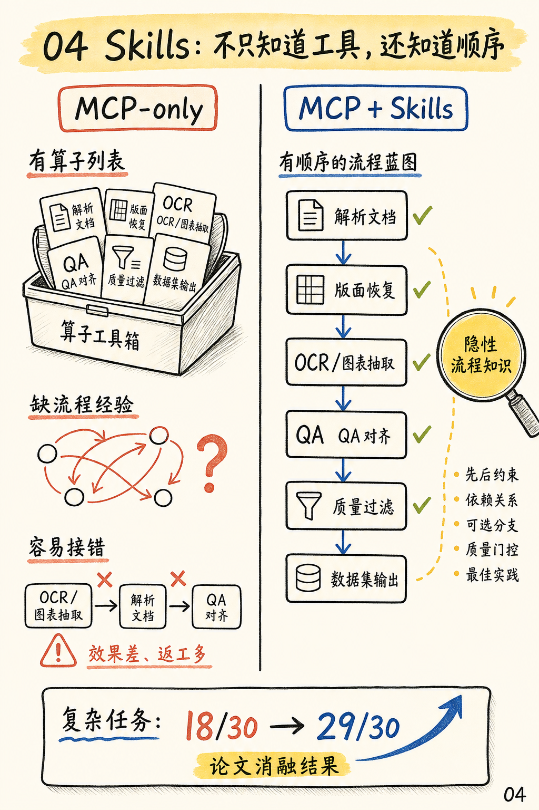
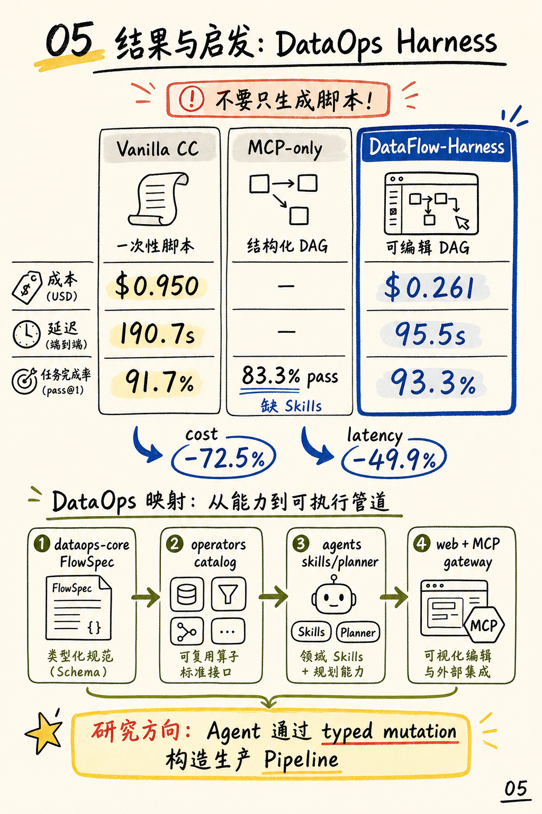

# DataFlow-Harness 的工程启发

这篇笔记来自对微信文章《数据准备账单大降72.5%！北大系团队最新Harness项目开源，冲上Hugging Face日榜第二》和论文 [DataFlow-Harness: A Grounded Code-Agent Platform for Constructing Editable LLM Data Pipelines](https://arxiv.org/abs/2607.16617) 的阅读。

我觉得它最有价值的提醒，不是“再做一个会写代码的 Agent”，而是：**把数据流水线构建变成 Agent 可以安全编辑的系统**。

换句话说，下一步不应该先追求更强的脚本生成，而应该做一个 pipeline harness：Agent 通过 typed mutation 修改 pipeline spec/DAG；系统负责 operator registry、schema 校验、DAG 校验、dry-run、commit、rollback 和审计。

## 从脚本到 Harness

DataFlow-Harness 要解决的是自然语言到 pipeline 之间的缺口。这个缺口如果靠一次性脚本来跨，就很难复用、很难审计，也很难让人继续编辑。

Harness 的关键，是把 Operator、Schema、State、Validation 放进同一个生产式编辑环境里。Agent 不是在外面自由发挥，而是在系统内部提交受约束的 pipeline 变更。

## Agent 被系统约束

论文的架构可以看成四层：

1. 用户提出数据准备需求。
2. DataFlow-Skills 提供领域流程知识。
3. MCP 工具层暴露 operator、pipeline state 和更新接口。
4. Pipeline Backend/WebUI 保持权威状态，并提供可视化编辑。

这里最重要的是 Backend 是权威状态源。Agent 每次修改 pipeline，都要通过工具接口和验证流程，而不是直接生成一段无法追踪的代码。

## Typed Mutation 是核心机制

这一步最值得借鉴：Agent 不直接写最终脚本，而是提出 `add_node`、`set_param`、`connect_edge` 这类结构化变更。

系统先读取当前状态，再验证 mutation 是否满足 DAG 约束和 Schema 约束。通过后才 atomic commit；失败就不提交。这比“生成脚本然后祈祷能跑”更接近真正的工程系统。

## MCP 让 Agent 接地

MCP 的角色不是简单暴露几个工具，而是让 Agent 同时知道三件事：

1. 当前有哪些 operator 可以用。
2. 当前 DAG 已经长什么样。
3. 哪些工具调用是合法的。

这能减少模型凭记忆猜接口、猜状态、猜约束。对数据流水线系统来说，operator、执行后端和验证规则都应该变成一个实时可查询、可校验的系统接口。

## Skills 把流程知识显式化

论文里的消融结果很有启发：MCP-only 有工具列表，但复杂任务仍然容易接错。Skills 的价值，是把“先后顺序、依赖关系、质量门控、最佳实践”变成可复用的流程知识。

这对复杂数据准备很关键。Skills 不应该只是提示词片段，而应该逐渐沉淀成 runtime recipes：每个 recipe 都描述 operator 顺序、参数策略、质量门、失败恢复和可观察性要求。

## 一条更通用的研究路线

我建议把下一步研究方向定成 **Pipeline Harness**，按下面的顺序推进：

1. **M0: MCP gateway**
   暴露 `list_operators`、`get_pipeline`、`update_pipeline`、`validate_pipeline`、`dry_run_plan`，把 pipeline spec 和 validator 变成 Agent 可调用的系统接口。

2. **M1: typed mutation grammar**
   定义 Agent 只能提交的结构化变更：新增节点、修改参数、连接边、替换 operator、插入质量门、回滚变更。所有 mutation 都要有 schema 和审计日志。

3. **M2: operator catalog**
   把各类 operator 和 execution backend 的能力做成可检索 registry：输入输出 schema、资源需求、失败模式、推荐组合、示例 pipeline。

4. **M3: pipeline Skills/recipes**
   先沉淀 3-5 个高价值场景：文档解析数据集、表格清洗、RAG 语料构建、训练数据过滤、评测集生成。每个 recipe 都描述 operator 顺序、参数策略、质量门和回滚点。

5. **M4: Web + DAG human-in-loop**
   在 WebUI 里做可视化 diff：Agent 提议修改，人可以看 DAG、参数、schema 影响，再确认提交。

6. **M5: benchmark**
   建一个 Pipeline-Harness benchmark。指标不要只看代码能不能跑，而要看 construction pass rate、cost、latency、editability、rollback correctness、human repair effort。

一句话版本：

**下一步不要先追“更强 Agent”，而要先把数据流水线构建变成 Agent 可安全编辑的系统：typed pipeline mutation + live operator registry + validation-first commit + domain Skills。**
