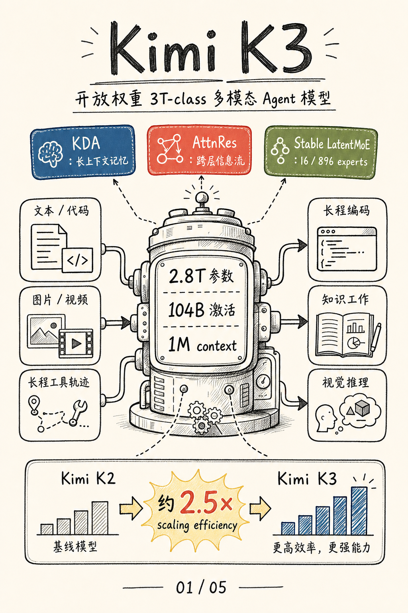
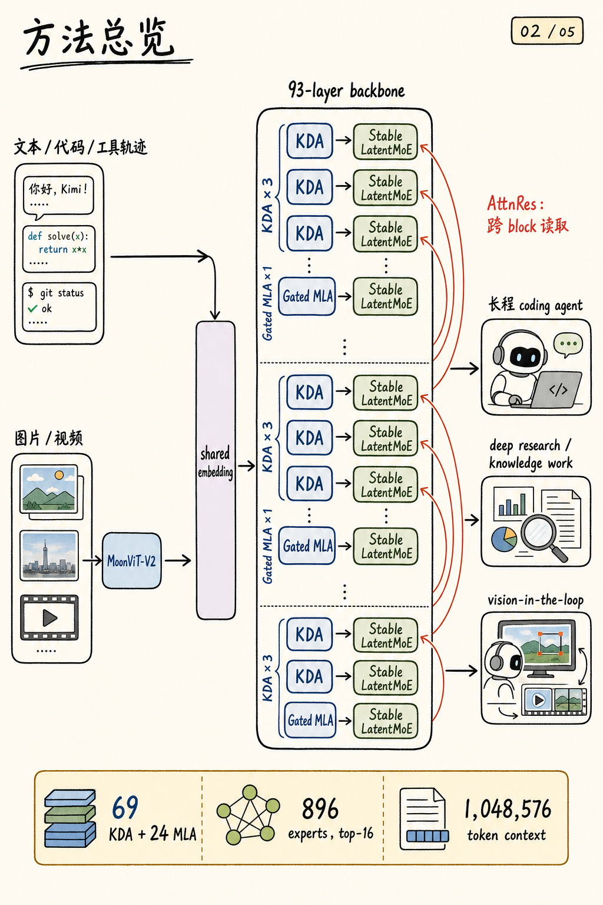
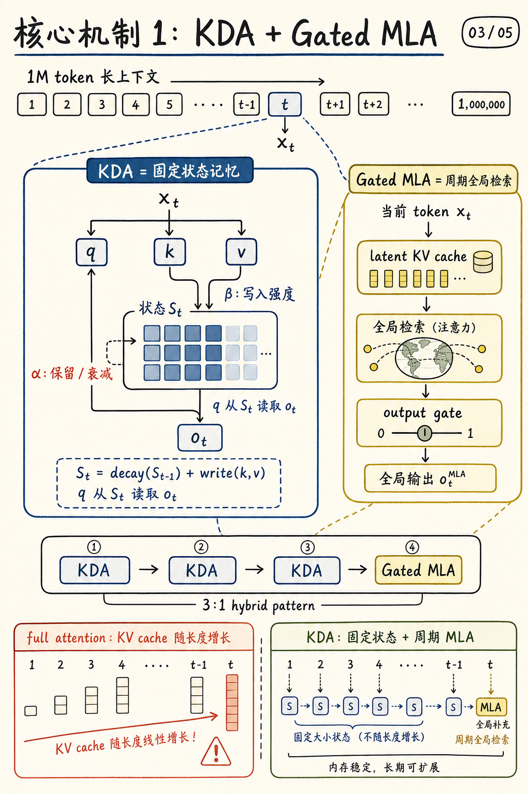
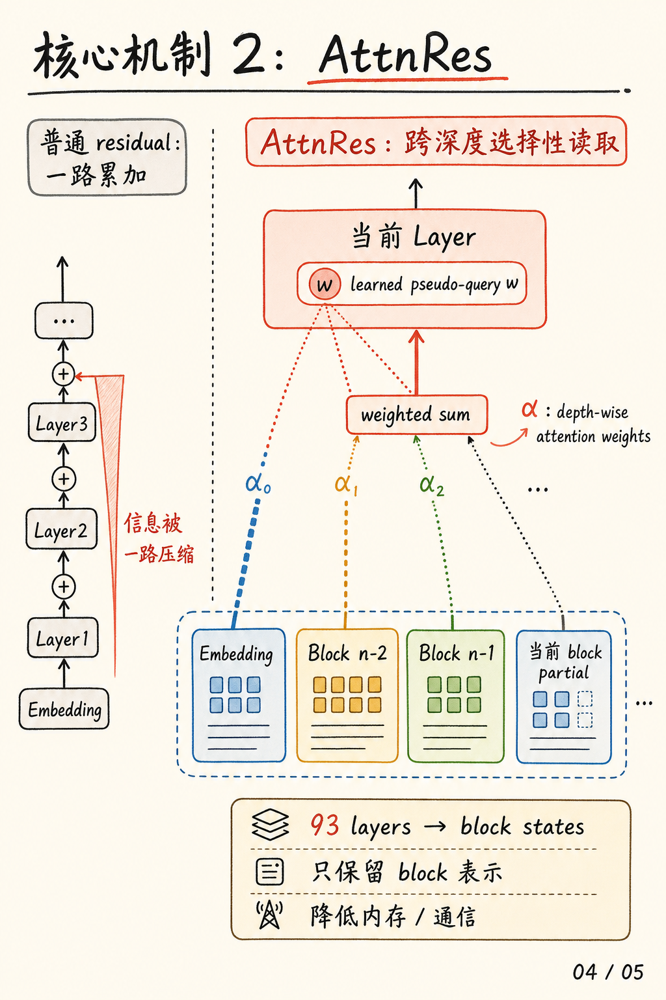
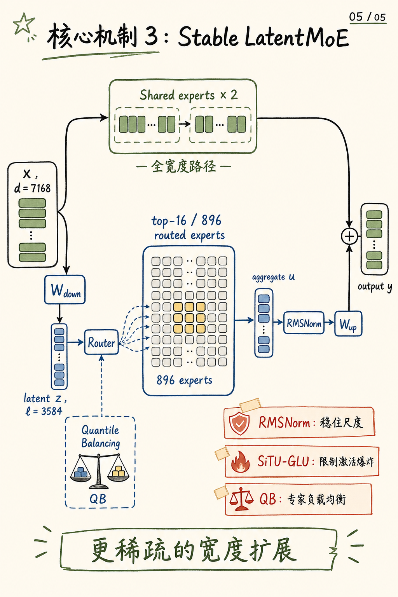

# Kimi K3 图解笔记

这篇笔记来自对 Hugging Face 模型卡 [moonshotai/Kimi-K3](https://huggingface.co/moonshotai/Kimi-K3) 和技术报告 [Kimi K3: Open Frontier Intelligence](https://www.alphaxiv.org/abs/2607.kimi-k3-report) 的阅读。

我觉得 Kimi K3 最值得拆开的地方，不只是“参数很大”，而是它把三个维度的扩展揉成了一套工程结构：

1. **序列维度**：KDA 负责固定状态长上下文建模，Gated MLA 负责周期性全局检索。
2. **深度维度**：AttnRes 让当前层选择性读取前面 block，不再只依赖线性 residual 累加。
3. **宽度维度**：Stable LatentMoE 用 latent-space routing 扩大专家池，同时用稳定化组件控制训练和路由风险。

## 封面

Kimi K3 是开放权重的 2.8T 参数原生多模态 MoE 模型，用 KDA、AttnRes 和 Stable LatentMoE 支撑 1M token 长上下文与 agentic 工作流。

## 方法总览

文本、代码、工具轨迹直接进入共享 embedding；图像和视频先经过 MoonViT-V2，再由 projector 接入同一个 backbone。

主体 backbone 由 `KDA × 3 → Gated MLA × 1` 的混合 attention 节奏构成，并在每层后接 Stable LatentMoE。AttnRes 在深度方向把前面 block 的信息重新取回。

## KDA + Gated MLA

KDA 是长上下文的主力机制，用固定大小状态 `S_t` 保存历史信息；`α` 控制保留或衰减，`β` 控制写入强度。

Gated MLA 周期性插入，提供全局 token 检索能力。这个 3:1 hybrid pattern 的核心价值是：大多数层避免随上下文线性膨胀的 KV cache，同时仍保留周期性全局交互。

## Attention Residuals

普通 residual 是一路累加，容易把不同深度的信息压进单一状态。AttnRes 把“attention”用在网络深度上：当前层用 learned pseudo-query `w` 对 embedding 和前面 block states 计算权重 `α`，再加权汇总成当前层输入。

K3 采用 block-level 表示，降低保留全部层输出带来的内存和通信成本。

## Stable LatentMoE

Stable LatentMoE 把输入分成两条路：shared experts 处理 full-width 表示，routed path 先降到 latent dimension，再从 896 个 routed experts 中为每个 token 选择 16 个。

RMSNorm 稳住尺度，SiTU-GLU 限制激活爆炸，Quantile Balancing 让专家负载更均衡。
