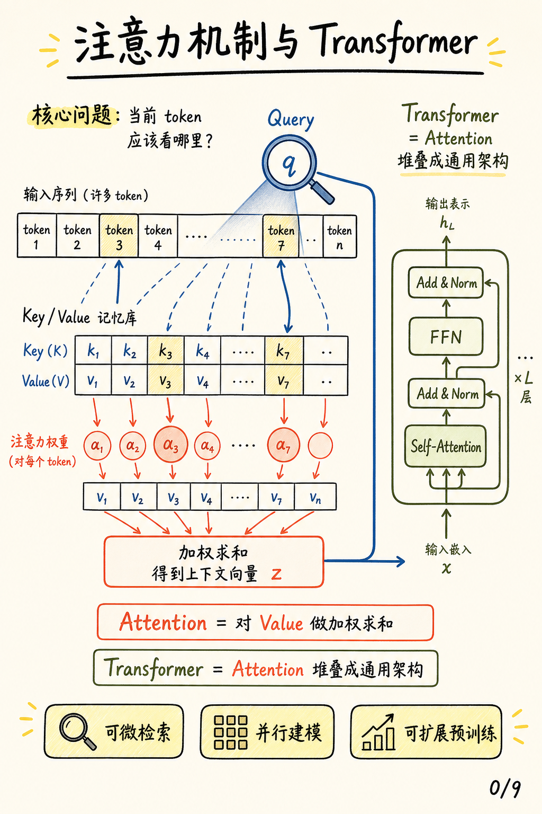
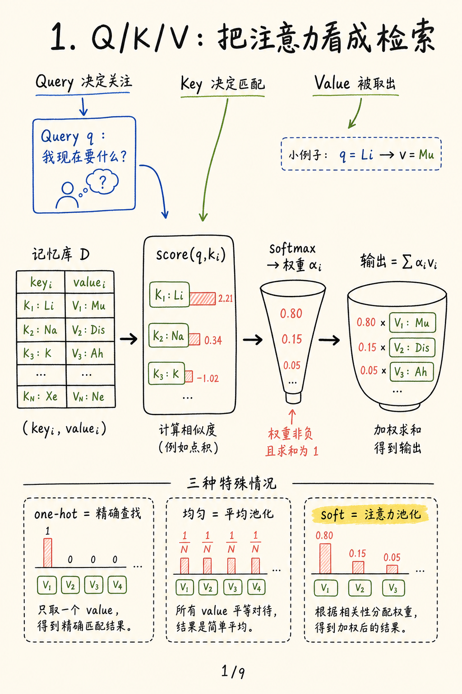
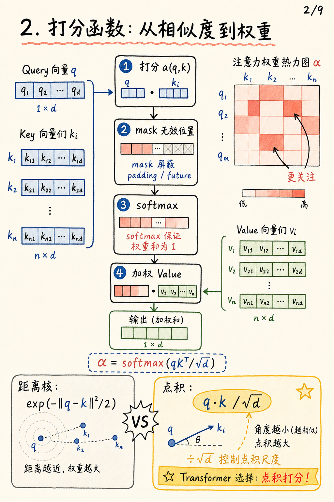
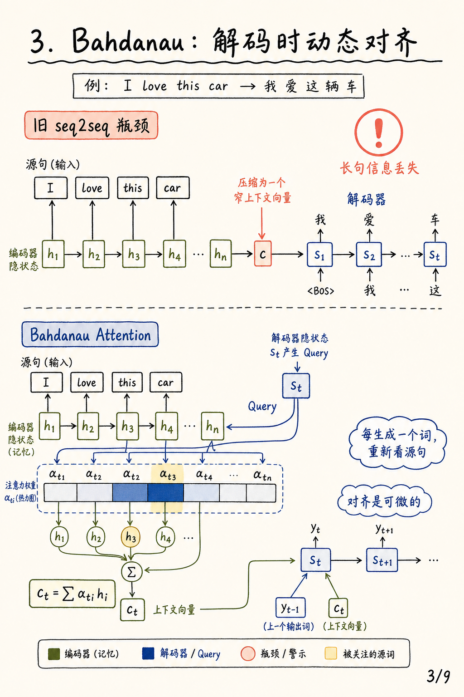
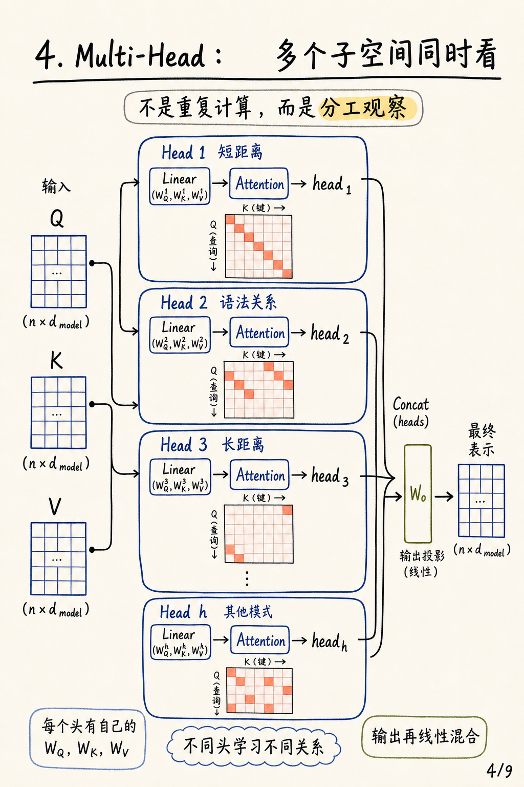
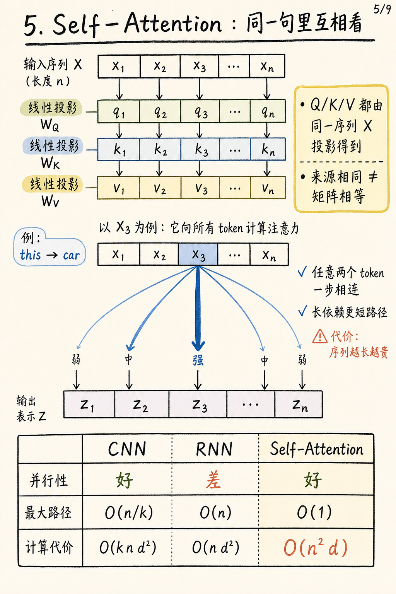
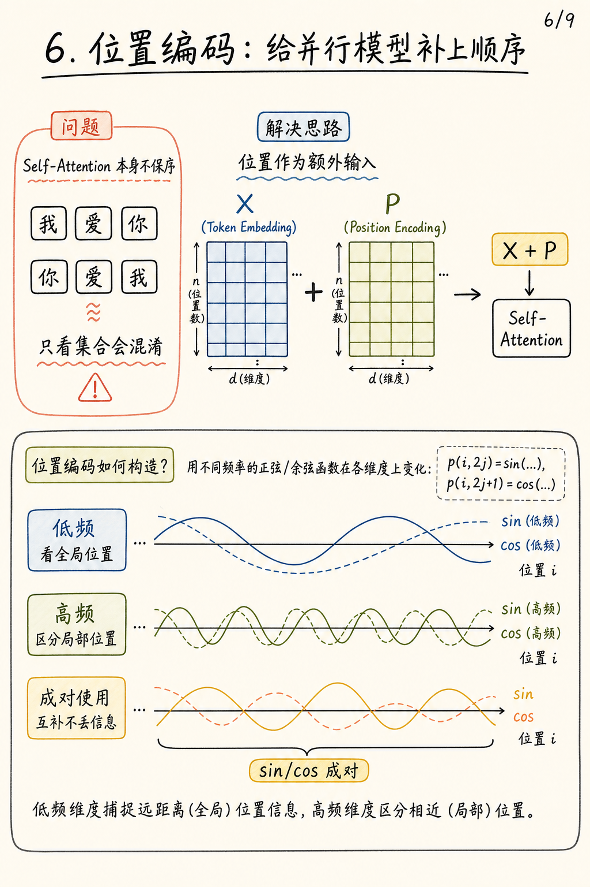
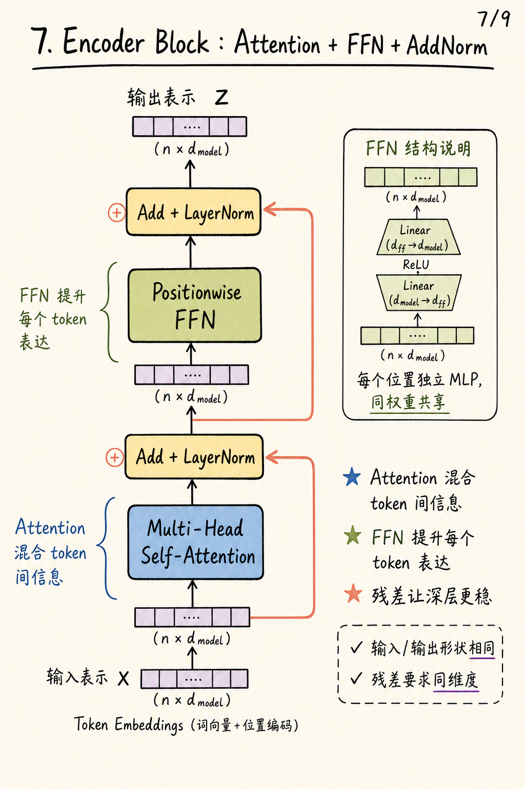
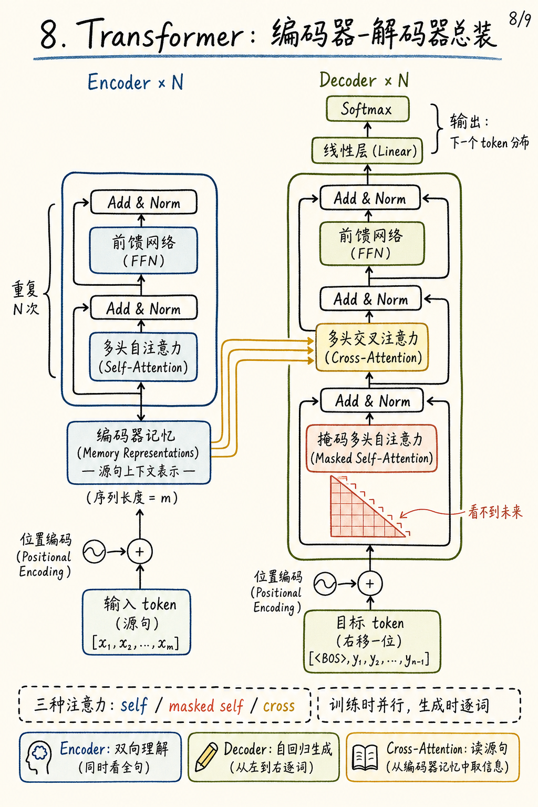
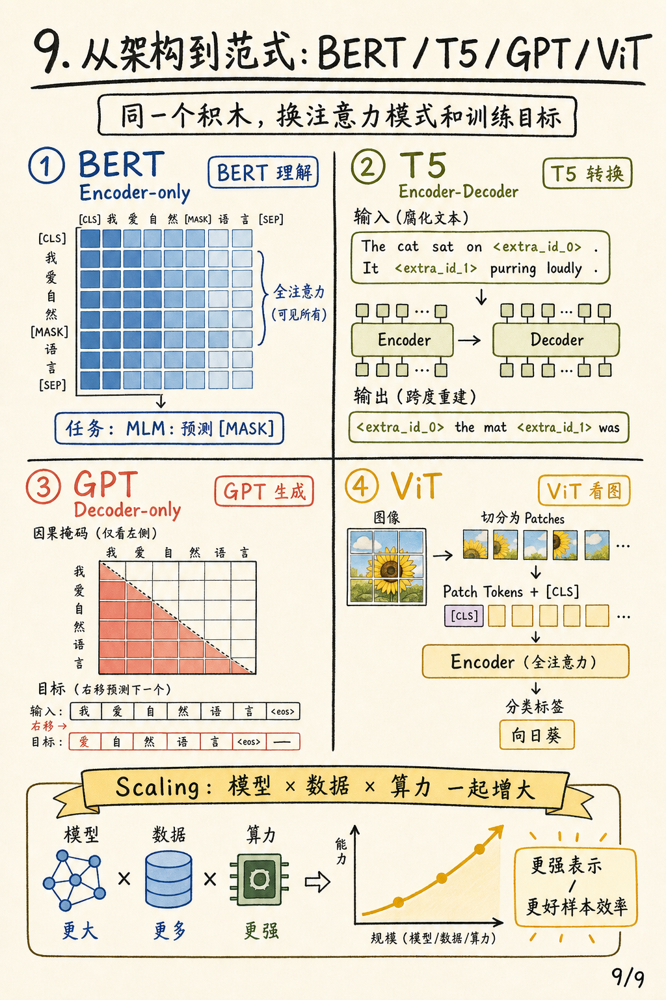

# Attention Mechanisms and Transformers 图解

标题：[Attention Mechanisms and Transformers](https://d2l.ai/chapter_attention-mechanisms-and-transformers/index.html)

来源：Dive into Deep Learning 1.0.3，第 11 章

作者：D2L 项目作者群，核心作者包括 Aston Zhang, Zachary C. Lipton, Mu Li, Alexander J. Smola

代码状态：官方已开源，仓库为 [d2l-ai/d2l-en](https://github.com/d2l-ai/d2l-en)；本文引用本章 Markdown 源文件与 PyTorch 代码段。

说明：原链接是教材章节而非单篇论文。本文按“论文深度解析”的方式处理，把它视为一篇关于注意力机制、Transformer、ViT 与大规模预训练的系统综述式技术论文。

### 一句话总结

D2L 第 11 章的主线是：先把注意力解释成可微的键值检索，再把手工相似度推进到可学习的点积/加性注意力，随后用多头、自注意力、位置编码、残差归一化和前馈网络搭出 Transformer，最后说明同一套结构怎样迁移到视觉和大规模预训练。

<pre class="mermaid">flowchart TB
    A[&quot;Variable-size input&quot;] --&gt; B[&quot;QKV attention pooling&quot;]
    B --&gt; C[&quot;Scoring: kernel, additive, scaled dot&quot;]
    C --&gt; D[&quot;Multi-head parallel subspaces&quot;]
    D --&gt; E[&quot;Self-attention over tokens&quot;]
    E --&gt; F[&quot;Position encoding adds order&quot;]
    F --&gt; G[&quot;Transformer encoder-decoder&quot;]
    G --&gt; H[&quot;ViT: image patches as tokens&quot;]
    G --&gt; I[&quot;Pretraining: BERT, T5, GPT&quot;]</pre>

## 0. 图解版速览

下面这组中文 sketchnote 用 10 页把本章主线拆开：先把 attention 理解成 Q/K/V 检索，再进入打分函数、Bahdanau 动态对齐、多头注意力、自注意力、位置编码、Transformer block，最后收束到 BERT、T5、GPT 和 ViT。

### 0.1 封面：Attention 到 Transformer



Attention 的核心问题是：当前 token 应该看哪里？Transformer 的核心做法是把这个“按需取证”的操作堆叠成可训练、可并行、可扩展的通用架构。

### 0.2 Q/K/V：把注意力看成检索



Query 表示当前问题，Key 决定匹配，Value 承载要被取出的内容。注意力输出不是硬查找某一项，而是对所有 Value 做 soft 加权求和。

### 0.3 打分函数：从相似度到权重



注意力计算可以看成四步：打分、mask、softmax、加权 Value。缩放点积注意力里的 `÷√d` 用来控制点积尺度，避免 softmax 过早饱和。

### 0.4 Bahdanau：解码时动态对齐



Bahdanau attention 打破了普通 seq2seq 的固定上下文瓶颈：decoder 每生成一个词，都会用当前状态重新查询 encoder 的所有 hidden states。

### 0.5 Multi-Head：多个子空间同时看



多头不是重复计算，而是让不同投影子空间分别学习不同关系；最后再把各个 head 的结果拼接并线性混合。

### 0.6 Self-Attention：同一句里互相看



Self-attention 让任意两个 token 一步相连，长距离依赖路径变短，但也带来 `O(n^2 d)` 的序列长度平方代价。Q/K/V 都由同一序列投影得到，但三者不是同一个矩阵。

### 0.7 位置编码：给并行模型补上顺序



Self-attention 本身不保序，因此需要把位置编码加到 token embedding 上。正弦/余弦位置编码用不同频率同时表达全局位置和局部差异。

### 0.8 Encoder Block：Attention + FFN + AddNorm



Encoder block 里，attention 负责混合 token 间信息，positionwise FFN 负责提升每个 token 的表示，残差和 LayerNorm 则让深层堆叠更稳定。

### 0.9 Transformer：编码器-解码器总装



完整 Transformer 同时使用 encoder self-attention、decoder masked self-attention 和 cross-attention。mask 防止 decoder 偷看未来，cross-attention 负责读取源句记忆。

### 0.10 从架构到范式：BERT / T5 / GPT / ViT



同一个 Transformer 积木，换掉 attention pattern 和训练目标，就会变成不同范式：BERT 偏理解，T5 偏转换，GPT 偏生成，ViT 把图像 patch 当 token。

## 1. 研究背景与动机

这一章要解决的第一个问题不是“Transformer 怎么写”，而是更基础的：当输入规模不固定、信息分布也不均匀时，神经网络应该如何从一堆候选信息里按需取用内容。传统 CNN 对固定分辨率图像很自然，RNN 可以逐步处理序列，但两者都把“信息如何被选择”隐藏在结构里。D2L 的切入点是把选择机制显式化。

早期序列到序列机器翻译把源句子压缩到一个固定长度上下文向量，然后让解码器依靠这个向量逐词生成目标句。短句尚可，长句就会出现容量瓶颈：编码器最后状态必须同时记住词义、顺序、依存关系和可供生成时访问的细节。第 11.4 节用 Fig. 11.4.1 说明了这种普通 seq2seq 的信息通道：encoder state 是唯一传递给 decoder 的信息。

注意力机制的动机正是打破这个瓶颈。它不再要求编码器把所有内容压进一个向量，而是保留所有时刻的表示，让解码器在每一步生成时动态选择相关片段。Bahdanau attention 在这个意义上并不是一个“小模块”，而是一个架构观念的改变：模型的记忆可以被显式查询，查询本身还能被梯度训练。

D2L 把这一观念抽象成 queries, keys, values。query 是当前问题，key 是可检索项目的索引，value 是真正被汇总的内容。这个框架的好处是同一段“查询代码”可以作用在任意大小的数据库上，而不是把数据库先压成一个固定长度摘要。Fig. 11.1.1 展示的正是这一点：输出是 values 的线性组合，权重来自 query 与 keys 的兼容性。

Transformer 的关键进步是把“动态查询”从 encoder-decoder 对齐推广到序列内部的全局交互。每个 token 同时产生 query、key、value，所有 token 两两计算相关性。这让长距离依赖的路径长度从 RNN 的 $\mathcal{O}(n)$ 变成 $\mathcal{O}(1)$，同时保留高度并行的矩阵乘法形式。代价也清楚：长度为 $n$ 的序列会产生 $n \times n$ 的注意力矩阵。

## 2. 预备知识

注意力池化的核心定义可以写成：

$$
\mathrm{Attention}(\mathbf{q}, \mathcal{D})
= \sum_{i=1}^{m} \alpha(\mathbf{q}, \mathbf{k}_i)\mathbf{v}_i,
\quad
\mathcal{D}=\{(\mathbf{k}_1,\mathbf{v}_1),\ldots,(\mathbf{k}_m,\mathbf{v}_m)\}.
$$

这里 $\mathbf{q}$ 是查询，$\mathbf{k}_i$ 是第 $i$ 个键，$\mathbf{v}_i$ 是对应值，$\alpha$ 是注意力权重。人话解释：模型不是直接返回某个 value，而是先判断每个 key 和当前 query 有多匹配，再把所有 value 按权重加起来。

为了让权重非负且和为 1，最常见做法是 softmax：

$$
\alpha(\mathbf{q}, \mathbf{k}_i)
=
\frac{\exp(a(\mathbf{q}, \mathbf{k}_i))}
{\sum_j \exp(a(\mathbf{q}, \mathbf{k}_j))}.
$$

其中 $a(\mathbf{q},\mathbf{k}_i)$ 是注意力评分函数。评分函数决定“匹配”怎样被计算，softmax 决定这些匹配分数怎样变成概率式权重。注意，softmax 不是注意力的全部；它只是把评分归一化的一种常用方式。

第 11.2 节用 Nadaraya-Watson kernel regression 做桥梁。若每个训练样本的特征是 key，标签是 value，新样本位置是 query，则估计函数为：

$$
f(\mathbf{q})
=
\sum_i \mathbf{v}_i
\frac{\alpha(\mathbf{q}, \mathbf{k}_i)}
{\sum_j \alpha(\mathbf{q}, \mathbf{k}_j)}.
$$

这个公式说明，现代注意力并非凭空出现。它和半个多世纪前的核回归共享“相似者贡献更多”的思想。区别在于，核回归多用手工设计的相似度，例如 Gaussian、Boxcar、Epanechnikov；Transformer 学到的是 token 表示空间以及在该空间中的相似度。

## 3. 方法详解

### 3.1 从核相似度到缩放点积注意力

第 11.3 节先把 Gaussian kernel 的指数项拆开：

$$
a(\mathbf{q}, \mathbf{k}_i)
=
-\frac{1}{2}\|\mathbf{q}-\mathbf{k}_i\|^2
=
\mathbf{q}^{\top}\mathbf{k}_i
-\frac{1}{2}\|\mathbf{k}_i\|^2
-\frac{1}{2}\|\mathbf{q}\|^2.
$$

在 softmax 里，最后一项只依赖 query，对所有 key 一样，归一化后不会改变相对权重。如果 key 的范数也被规范化约束，那么主导项就是 $\mathbf{q}^{\top}\mathbf{k}_i$。这就是点积注意力从距离注意力自然出现的原因：它不是随手替代，而是把距离里的主要可变项抽出来。

问题在于维度 $d$ 增大时，随机 query 和 key 的点积方差也会变大，softmax 会更容易饱和。因此 D2L 引入缩放点积注意力：

$$
a(\mathbf{q}, \mathbf{k}_i)=\frac{\mathbf{q}^{\top}\mathbf{k}_i}{\sqrt{d}}.
$$

这条公式的直觉是：把维度带来的数值膨胀除回去，让 softmax 的输入维持在可训练的尺度。否则，一个过大的分数就可能把注意力分布压成近似 one-hot，梯度会变得很不友好。

批量矩阵写法是 Transformer 的工程核心：

$$
\mathrm{softmax}\left(\frac{\mathbf{Q}\mathbf{K}^{\top}}{\sqrt{d}}\right)\mathbf{V}
\in \mathbb{R}^{n\times v}.
$$

其中 $\mathbf{Q}\in\mathbb{R}^{n\times d}$ 表示 $n$ 个 query，$\mathbf{K}\in\mathbb{R}^{m\times d}$ 表示 $m$ 个 key，$\mathbf{V}\in\mathbb{R}^{m\times v}$ 表示 $m$ 个 value。人话解释：先一次性算出所有 query 对所有 key 的打分矩阵，再把这个矩阵当权重去加权 values。

源码对应如下，来自官方源文件 `chapter_attention-mechanisms-and-transformers/attention-scoring-functions.md:334`：

```python
class DotProductAttention(nn.Module):  #@save
    """Scaled dot product attention."""
    def __init__(self, dropout):
        super().__init__()
        self.dropout = nn.Dropout(dropout)

    def forward(self, queries, keys, values, valid_lens=None):
        d = queries.shape[-1]
        scores = torch.bmm(queries, keys.transpose(1, 2)) / math.sqrt(d)
        self.attention_weights = masked_softmax(scores, valid_lens)
        return torch.bmm(self.dropout(self.attention_weights), values)
```

这段代码把公式翻译得很直接：`torch.bmm` 计算 $\mathbf{Q}\mathbf{K}^{\top}$，`/ math.sqrt(d)` 执行缩放，`masked_softmax` 处理 padding 或因果遮罩，最后再乘以 values。

### 3.2 Masked softmax：把无效 token 从注意力里拿掉

序列任务里常见 padding：同一批样本为了对齐长度，会把短句补上空 token。模型不应把这些 token 当真实内容。因此 D2L 用 valid lengths 控制 softmax，只让前 $l$ 个真实 token 参与：

$$
\sum_{i=1}^{n}\alpha(\mathbf{q},\mathbf{k}_i)\mathbf{v}_i
\quad\Rightarrow\quad
\sum_{i=1}^{l}\alpha(\mathbf{q},\mathbf{k}_i)\mathbf{v}_i.
$$

工程实现不是写很多条件分支，而是把被遮住的位置设为 $-10^6$ 一类极小值。经过指数函数后，这些位置对 softmax 的贡献近似为 0。这个细节很关键：它让注意力仍然可以用高度优化的矩阵算子跑在 GPU 上。

### 3.3 加性注意力与 Bahdanau attention

当 query 和 key 维度不同，点积不再自然适用。加性注意力先把二者映射到同一隐藏空间，再用一个小 MLP 给出兼容性分数：

$$
a(\mathbf{q},\mathbf{k})
=
\mathbf{w}_v^{\top}
\tanh(\mathbf{W}_q\mathbf{q}+\mathbf{W}_k\mathbf{k}).
$$

$\mathbf{W}_q$ 和 $\mathbf{W}_k$ 是可学习投影，$\mathbf{w}_v$ 把隐藏表示压成一个标量分数。人话解释：点积注意力要求 query 和 key 已经在同一坐标系里，加性注意力允许模型先学一个共同比较空间。

Bahdanau attention 把这一机制放进 RNN encoder-decoder。第 $t'$ 个解码步的上下文变量为：

$$
\mathbf{c}_{t'}
=
\sum_{t=1}^{T}\alpha(\mathbf{s}_{t'-1},\mathbf{h}_t)\mathbf{h}_t.
$$

这里 $\mathbf{s}_{t'-1}$ 是上一时刻 decoder hidden state，作为 query；encoder 的所有 hidden states $\mathbf{h}_t$ 同时作为 keys 和 values。Fig. 11.4.2 展示了这条路径：decoder 不再只依赖固定 context，而是在每一步从 encoder states 中重新聚合上下文。

在代码上，D2L 的 `Seq2SeqAttentionDecoder` 每个解码步都会重新构造 query，调用 `AdditiveAttention`，然后把 context 和当前输入 embedding 拼接后送进 GRU。这个设计对应 `chapter_attention-mechanisms-and-transformers/bahdanau-attention.md:159` 及之后的 PyTorch 实现。

### 3.4 多头注意力：不是多算几遍，而是多组表示子空间

单个注意力头只能在一个表示空间里度量相似性。多头注意力的想法是，让同一组 tokens 经由 $h$ 组不同线性投影进入不同子空间，每个头独立计算注意力，最后拼接并线性变换。第 11.5 节的 Fig. 11.5.1 给出了这个结构。

$$
\mathbf{h}_i
=
f(\mathbf{W}_i^{(q)}\mathbf{q},
  \mathbf{W}_i^{(k)}\mathbf{k},
  \mathbf{W}_i^{(v)}\mathbf{v})
\in\mathbb{R}^{p_v},
\quad i=1,\ldots,h.
$$

$$
\mathbf{W}_o
\begin{bmatrix}
\mathbf{h}_1\\
\vdots\\
\mathbf{h}_h
\end{bmatrix}
\in\mathbb{R}^{p_o}.
$$

人话解释：不同头可以分别捕捉短程关系、长程关系、语法关系或语义关系。D2L 的实现还强调一个工程点：不要真的用 Python 循环逐头计算，而是通过 reshape 和 permute 把 heads 合并到 batch 维度，实现并行。

源码对应如下，来自 `chapter_attention-mechanisms-and-transformers/multihead-attention.md:162`：

```python
class MultiHeadAttention(d2l.Module):  #@save
    """Multi-head attention."""
    def __init__(self, num_hiddens, num_heads, dropout, bias=False, **kwargs):
        super().__init__()
        self.num_heads = num_heads
        self.attention = d2l.DotProductAttention(dropout)
        self.W_q = nn.LazyLinear(num_hiddens, bias=bias)
        self.W_k = nn.LazyLinear(num_hiddens, bias=bias)
        self.W_v = nn.LazyLinear(num_hiddens, bias=bias)
        self.W_o = nn.LazyLinear(num_hiddens, bias=bias)

    def forward(self, queries, keys, values, valid_lens):
        queries = self.transpose_qkv(self.W_q(queries))
        keys = self.transpose_qkv(self.W_k(keys))
        values = self.transpose_qkv(self.W_v(values))
```

真正的关键在 `transpose_qkv`：输入从 `(batch_size, steps, num_hiddens)` 变成 `(batch_size * num_heads, steps, num_hiddens / num_heads)`。这一步让“多头”看起来像更大的 batch，直接复用同一个点积注意力实现。

### 3.5 自注意力：让序列内部任意两点直接通信

自注意力把 Q、K、V 都从同一个序列来。给定输入 tokens $\mathbf{x}_1,\ldots,\mathbf{x}_n$，每个位置的输出为：

$$
\mathbf{y}_i
=
f(\mathbf{x}_i,
(\mathbf{x}_1,\mathbf{x}_1),\ldots,(\mathbf{x}_n,\mathbf{x}_n))
\in\mathbb{R}^{d}.
$$

这个公式意味着第 $i$ 个 token 的下一层表示可以直接聚合所有 token。D2L 在 Fig. 11.6.1 中比较 CNN、RNN、自注意力：CNN 并行但路径随层数增长，RNN 路径长且串行，自注意力并行且任意两点路径为 1。

| 架构 | 计算复杂度 | 顺序操作 | 最大路径长度 | 解读 |
| --- | --- | --- | --- | --- |
| 1D CNN | $\mathcal{O}(knd^2)$ | $\mathcal{O}(1)$ | $\mathcal{O}(n/k)$ | 局部归纳偏置强，长程依赖需堆叠层数。 |
| RNN | $\mathcal{O}(nd^2)$ | $\mathcal{O}(n)$ | $\mathcal{O}(n)$ | 天然有顺序，但难以并行，长距离梯度路径长。 |
| Self-attention | $\mathcal{O}(n^2d)$ | $\mathcal{O}(1)$ | $\mathcal{O}(1)$ | 全局交互最直接，但序列很长时平方复杂度成为瓶颈。 |

这个表是理解 Transformer 成功与局限的枢纽。它解释了为什么 Transformer 在中等长度序列上极强，也解释了为什么后续会出现 Longformer、Swin Transformer、稀疏注意力、线性注意力等大量变体。

### 3.6 位置编码：自注意力并不知道顺序

自注意力本身对输入顺序不敏感。如果交换 token 顺序，只要 Q、K、V 的集合一样，纯注意力层很难区分位置。因此 Transformer 需要把顺序作为额外输入。D2L 介绍的是原始 Transformer 的固定正弦位置编码：

$$
\begin{aligned}
p_{i,2j} &= \sin\left(\frac{i}{10000^{2j/d}}\right),\\
p_{i,2j+1} &= \cos\left(\frac{i}{10000^{2j/d}}\right).
\end{aligned}
$$

$i$ 是位置，$j$ 是维度索引，$d$ 是 embedding 维度。人话解释：每个位置被编码成一串不同频率的正弦/余弦信号；低维变化快，高维变化慢，类似二进制位在不同频率上翻转。Fig. 11.6.2 和 Fig. 11.6.3 用曲线与热力图展示了这种频率结构。

更妙的是，相对位置也能通过线性变换表达。令 $\omega_j=1/10000^{2j/d}$，对固定偏移 $\delta$ 有：

$$
\begin{bmatrix}
\cos(\delta\omega_j) & \sin(\delta\omega_j)\\
-\sin(\delta\omega_j) & \cos(\delta\omega_j)
\end{bmatrix}
\begin{bmatrix}
p_{i,2j}\\
p_{i,2j+1}
\end{bmatrix}
=
\begin{bmatrix}
p_{i+\delta,2j}\\
p_{i+\delta,2j+1}
\end{bmatrix}.
$$

这个公式说的是：从位置 $i$ 到 $i+\delta$ 的变化可以看成二维平面里的旋转，而且旋转矩阵不依赖 $i$。这给模型学习相对距离提供了线性可读的结构。

### 3.7 Transformer：把注意力做成可堆叠的深层网络

第 11.7 节的 Fig. 11.7.1 是整章的结构中心。Transformer 是 encoder-decoder 架构，但两个部分都由注意力模块堆叠而成。encoder block 有两个子层：multi-head self-attention 和 positionwise feed-forward network。每个子层外面都有 residual connection 和 layer normalization。

positionwise feed-forward network 是同一个两层 MLP 作用在所有位置上：

$$
\mathrm{FFN}(\mathbf{x})
=
\mathbf{W}_2\,\mathrm{ReLU}(\mathbf{W}_1\mathbf{x}+\mathbf{b}_1)+\mathbf{b}_2.
$$

它不混合不同 token，只在每个 token 的特征维度上做非线性变换。token 间通信由 attention 负责，token 内特征变换由 FFN 负责。这个分工让 Transformer block 简洁、可堆叠、易并行。

encoder block 的 PyTorch 实现来自 `chapter_attention-mechanisms-and-transformers/transformer.md:450`：

```python
class TransformerEncoderBlock(nn.Module):  #@save
    """The Transformer encoder block."""
    def __init__(self, num_hiddens, ffn_num_hiddens, num_heads, dropout,
                 use_bias=False):
        super().__init__()
        self.attention = d2l.MultiHeadAttention(num_hiddens, num_heads,
                                                dropout, use_bias)
        self.addnorm1 = AddNorm(num_hiddens, dropout)
        self.ffn = PositionWiseFFN(ffn_num_hiddens, num_hiddens)
        self.addnorm2 = AddNorm(num_hiddens, dropout)

    def forward(self, X, valid_lens):
        Y = self.addnorm1(X, self.attention(X, X, X, valid_lens))
        return self.addnorm2(Y, self.ffn(Y))
```

decoder block 比 encoder 多一个 cross-attention 子层。第一层是 masked self-attention，用已经生成的目标 tokens 作为 Q/K/V；第二层是 encoder-decoder attention，用 decoder hidden states 作为 query，用 encoder outputs 作为 keys 和 values；第三层是 FFN。

D2L 的 decoder mask 在训练时构造 `dec_valid_lens`，让第 $t$ 个目标位置只能看见 $1,\ldots,t$。对应代码来自 `chapter_attention-mechanisms-and-transformers/transformer.md:804`：

```python
if self.training:
    batch_size, num_steps, _ = X.shape
    dec_valid_lens = torch.arange(
        1, num_steps + 1, device=X.device).repeat(batch_size, 1)
else:
    dec_valid_lens = None

X2 = self.attention1(X, key_values, key_values, dec_valid_lens)
Y = self.addnorm1(X, X2)
Y2 = self.attention2(Y, enc_outputs, enc_outputs, enc_valid_lens)
Z = self.addnorm2(Y, Y2)
return self.addnorm3(Z, self.ffn(Z)), state
```

这段代码就是 causal decoding 的落地形态：训练时目标句所有位置并行计算，但通过 mask 保证每个位置不能偷看未来；推理时逐步生成，缓存已经生成的 key/value。

### 3.8 Vision Transformer：把图像切成 token

第 11.8 节把 Transformer 从文本扩展到图像。ViT 的核心动作是 patchify：输入图像高 $h$、宽 $w$、通道数 $c$，patch 尺寸为 $p\times p$，则 patch 数量为：

$$
m=\frac{hw}{p^2}.
$$

每个 patch 展平成长度 $cp^2$ 的向量，再投影成 token embedding。然后添加一个特殊的 `<cls>` token，让它通过自注意力聚合所有 patch 信息，最后用该 token 做分类。Fig. 11.8.1 展示了这个流程：图像 patch 变成序列，序列进入 Transformer encoder，`<cls>` 输出进入分类头。

D2L 的实现把 patch embedding 写成一个卷积：kernel size 和 stride 都等于 patch size。这不是回到 CNN，而是用卷积高效完成“无重叠切块 + 线性投影”。源码对应 `chapter_attention-mechanisms-and-transformers/vision-transformer.md:103`。

### 3.9 大规模预训练：同一骨架的三种用法

第 11.9 节把 Transformer 分成三种预训练模式。encoder-only 代表是 BERT：所有 token 双向互看，适合分类、标注、抽取式问答等理解任务。encoder-decoder 代表是 T5：encoder 读输入，decoder 生成输出，适合翻译、摘要、统一 text-to-text 任务。decoder-only 代表是 GPT 系列：只保留因果 self-attention，按语言模型目标预测下一个 token。

这三种模式的区别不只是“有没有 encoder”。真正差异在 attention pattern：BERT 可以看双向上下文；T5 的 encoder 双向、decoder 因果，并通过 cross-attention 看输入；GPT 只有因果注意力，靠 prompt 和上下文学习把任务描述、示例与输入统一成续写问题。Fig. 11.9.1、Fig. 11.9.3、Fig. 11.9.6 分别说明了这三种注意力模式。

## 4. 实验分析

D2L 这一章不是标准 benchmark paper，因此实验更偏教学验证：小规模机器翻译验证 Bahdanau attention 与 Transformer 的机制，Fashion-MNIST 验证 ViT 的基本实现，大规模预训练小节则引用已有研究展示 scaling 行为。下面把最有信息量的数据整理成表。

| 模型 | 训练设置 | 样例输入 | D2L 展示输出 | BLEU | 解读 |
| --- | --- | --- | --- | --- | --- |
| Bahdanau attention seq2seq | MTFraEng, batch 128, hidden 256, 2 layers, dropout 0.2, 30 epochs, lr 0.005 | go . | va ! | 1.000 | 短命令句完全对齐。 |
| Bahdanau attention seq2seq | 同上 | i lost . | j'ai perdu . | 1.000 | 代词和动词短语正确。 |
| Bahdanau attention seq2seq | 同上 | he's calm . | il court . | 0.000 | attention 帮助对齐，但小数据训练仍可能语义错译。 |
| Bahdanau attention seq2seq | 同上 | i'm home . | je suis chez moi . | 1.000 | 常见短句能生成完整目标短语。 |

Bahdanau 实验最有价值的不是平均 BLEU，而是 attention heatmap。第 11.4 节在翻译 “i'm home .” 时可视化每个 decoder query 对 source key positions 的权重，说明生成不同目标 token 时，模型确实在选择不同源词。它验证的是机制，不是宣称一个强翻译系统。

| 模型 | 训练设置 | 样例输入 | D2L 展示输出 | BLEU | 解读 |
| --- | --- | --- | --- | --- | --- |
| Transformer seq2seq | MTFraEng, batch 128, hidden 256, 2 blocks, 4 heads, dropout 0.2, 30 epochs, lr 0.001 | go . | va ! | 1.000 | 短句直接收敛。 |
| Transformer seq2seq | 同上 | i lost . | je perdu . | 0.687 | 大意正确，但法语助动词缺失。 |
| Transformer seq2seq | 同上 | he's calm . | il est mouillé . | 0.658 | 结构正确，语义词错；说明架构不是数据充分性的替代品。 |
| Transformer seq2seq | 同上 | i'm home . | je suis chez moi . | 1.000 | 固定短语处理良好。 |

Transformer 在这个小实验中不是为了和 Bahdanau 公平竞赛。它验证了三个工程事实：第一，encoder self-attention weights 的形状可以组织成 `(num_blks, num_heads, num_steps, num_steps)`；第二，decoder self-attention 的上三角会被遮住，保持自回归；第三，encoder-decoder attention 会遵守源序列 valid length，不看 padding。

| 预训练模式 | 代表模型 | D2L 记录的规模信息 | 主要任务形态 | 技术含义 |
| --- | --- | --- | --- | --- |
| Encoder-only | BERT | 350M 参数，250B training tokens | 理解、分类、标注、问答 | 双向上下文适合表示学习。 |
| Encoder-only | RoBERTa | 同量级模型，2000B tokens | 改进 BERT 式预训练 | 更多数据和目标调整可显著改变表现。 |
| Encoder-decoder | T5 | C4 上 1000B tokens；T5-11B 为 11B 参数 | 统一 text-to-text | 任务描述进入 encoder，decoder 生成任意长度输出。 |
| Decoder-only | GPT-2 | 1.5B 参数，40GB text | 语言建模、零样本/少样本任务 | 同一模型可通过 prompt 执行多任务。 |
| Decoder-only | Chinchilla | 70B 参数，1.4T tokens | 大语言模型 | 相比只堆参数，更长训练和更多 tokens 可能更重要。 |
| Decoder-only | PaLM | 540B 参数，780B tokens | 推理、多语言、BIG-Bench | 规模化继续推动能力边界。 |

这张表对应第 11.9 节的核心论断：Transformer 的优势不只来自单次前向结构，也来自它在参数、数据和算力同时增长时表现出平滑 scaling。Fig. 11.9.9、Fig. 11.9.10、Fig. 11.9.11 分别从参数/数据/计算、样本效率、GPT-3 验证损失角度展示了这一现象。

## 5. 讨论

这章最值得记住的不是某一个类名，而是一条抽象路径：检索式汇聚变成可微层，手工相似度变成可学习相似度，单头相似度变成多子空间相似度，序列间对齐变成序列内全局交互，最后通过预训练把同一套结构扩展到多任务和多模态。

Transformer 的设计很“薄”：attention 混合 token，FFN 变换特征，residual 保留信息路径，layer norm 稳定深层训练，positional encoding 注入顺序。薄结构的好处是可组合、可并行、易扩展；坏处是缺少特定领域归纳偏置时，通常更依赖数据规模。

ViT 小节正好说明这一点。在 Fashion-MNIST 或 ImageNet 这类相对传统视觉设置里，CNN 的平移不变性与局部性很有价值。ViT 在小数据上不一定赢 ResNet；当数据和模型变大时，Transformer 的可扩展性才开始覆盖归纳偏置不足的代价。Swin Transformer 的窗口化注意力则是在 Transformer 与 CNN prior 之间做折中。

预训练小节也提醒我们，架构不是全部。BERT、T5、GPT 的主要区别来自 attention pattern 和目标函数：masked language modeling 训练双向理解，span corruption 训练 text-to-text 生成，causal language modeling 训练续写能力。模型能力是架构、数据、目标、规模和对齐方法共同作用的结果。

## 6. 局限分析

第一，D2L 这一章不是实验论文，因此没有统一 benchmark、统计显著性分析或系统消融。Bahdanau 与 Transformer 的机器翻译实验使用小型 English-French 数据集，适合教学验证，不适合直接推导“某架构在真实翻译系统中更优”的结论。

第二，作者在第 11.6 节明确指出，自注意力对序列长度有平方复杂度，长序列会变慢并消耗大量内存。这个限制不是实现小瑕疵，而是 $\mathbf{Q}\mathbf{K}^{\top}$ 产生 $n\times n$ 交互矩阵的结构性代价。

第三，作者在 ViT 小节也指出，小数据集上的 ViT 不一定超过 ResNet，因为 Transformer 缺少卷积中的平移不变性和局部性。这是视觉任务里的重要边界：如果数据和预训练规模不足，纯注意力并不自动优于带有强归纳偏置的 CNN。

第四，attention heatmap 的可解释性要谨慎。D2L 在第 11.1 节把大权重作为“选择相关组件”的直觉，但这只是直觉。注意力权重可以帮助观察模型行为，却不能单独构成因果解释。

第五，大规模预训练小节承认 scaling 如何协同增加参数、数据和计算仍有争议。Kaplan scaling law 与 Chinchilla-style compute-optimal scaling 的差异说明，模型变大不是唯一方向，数据预算和训练步数同样改变结论。

## 7. 结论

如果把整章压缩成一个研究贡献，它不是“发明 Transformer”，而是把注意力机制的来龙去脉讲成了一条可复现的工程链路：QKV 抽象定义了问题，softmax scoring 给出可微选择，multi-head 扩展表示子空间，self-attention 完成全局交互，position encoding 补上顺序，encoder-decoder block 组成可训练深层架构，ViT 与预训练证明这种架构可以跨模态、跨任务扩展。

从学习角度看，这一章的价值在于它把 Transformer 拆回若干小而可验证的组件。你不需要先相信大模型的魔法；只要沿着公式和代码看下去，就会发现所谓 Transformer 其实是几个简单原则的精密组合。

> **Transformer 的核心不是“注意所有东西”，而是“让每一步计算都能学会该向哪里取证”。**

## 8. 主要来源

- [D2L Chapter 11: Attention Mechanisms and Transformers](https://d2l.ai/chapter_attention-mechanisms-and-transformers/index.html)

- [11.1 Queries, Keys, and Values](https://d2l.ai/chapter_attention-mechanisms-and-transformers/queries-keys-values.html)

- [11.2 Attention Pooling by Similarity](https://d2l.ai/chapter_attention-mechanisms-and-transformers/attention-pooling.html)

- [11.3 Attention Scoring Functions](https://d2l.ai/chapter_attention-mechanisms-and-transformers/attention-scoring-functions.html)

- [11.4 The Bahdanau Attention Mechanism](https://d2l.ai/chapter_attention-mechanisms-and-transformers/bahdanau-attention.html)

- [11.5 Multi-Head Attention](https://d2l.ai/chapter_attention-mechanisms-and-transformers/multihead-attention.html)

- [11.6 Self-Attention and Positional Encoding](https://d2l.ai/chapter_attention-mechanisms-and-transformers/self-attention-and-positional-encoding.html)

- [11.7 The Transformer Architecture](https://d2l.ai/chapter_attention-mechanisms-and-transformers/transformer.html)

- [11.8 Transformers for Vision](https://d2l.ai/chapter_attention-mechanisms-and-transformers/vision-transformer.html)

- [11.9 Large-Scale Pretraining with Transformers](https://d2l.ai/chapter_attention-mechanisms-and-transformers/large-pretraining-transformers.html)

- [Official D2L GitHub repository](https://github.com/d2l-ai/d2l-en)
