# D2L 注意力机制与 Transformer 图解笔记

这篇笔记来自 [Dive into Deep Learning 第 11 章 Attention Mechanisms and Transformers](https://d2l.ai/chapter_attention-mechanisms-and-transformers/index.html)。严格说，它不是单篇论文，而是一章教材：D2L 先从注意力机制的第一性原理讲起，再一步步走到 Transformer、ViT 和大规模预训练。

我觉得这章最值得抓住的主线是：

> 注意力机制把神经网络中的信息读取改造成“用 query 匹配 key，再按权重汇聚 value”的可微检索过程；Transformer 则把这个检索过程扩展成可并行、多头、带位置编码、可堆叠的通用序列建模架构。

下面按 12 张图把这条线拆开。

## 1. 从注意力到 Transformer

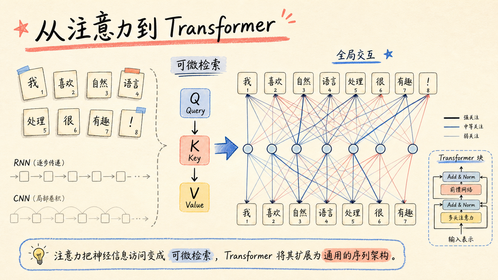

注意力机制最容易被误解成一个拟人化比喻：模型“注意”到了哪里。这个说法有帮助，但不够精确。

更好的理解是：**注意力是一种可微检索**。

传统全连接层的读取方式是固定的。训练完成后，某个输入位置到某个输出位置的权重基本固定。注意力的读取方式是动态的：对于当前输入，模型先临时算出 query 和所有 key 的匹配程度，再决定从每个 value 里拿多少信息。

这件事看似只是换了一种加权方式，实际上很关键。它让模型在不同样本上形成不同的信息连接图。Transformer 的后续成功，基本都建立在这个动态连接图之上。

## 2. 为什么需要注意力

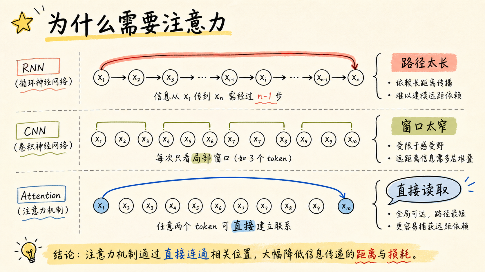

D2L 在讲 self-attention 时，会把 CNN、RNN 和 self-attention 放在一起比较。这个比较很重要，因为它解释了注意力不是凭空冒出来的“更高级模块”，而是为了解决信息路径的问题。

RNN 的问题是路径长。第一个 token 的信息要影响很后面的 token，通常要经过很多步状态传递。理论上可以传过去，实践里梯度、记忆和优化都会让远距离依赖变难。

CNN 的问题是窗口局部。卷积每次只看附近区域，想让远距离 token 发生交互，就要靠多层堆叠扩大感受野。

注意力的变化在于：任意两个 token 可以直接建立连接。也就是说，远距离依赖不再一定要沿着序列一步步传，也不一定要靠很多层卷积慢慢扩散。相关信息可以直接被读出来。

## 3. Q/K/V：可微检索

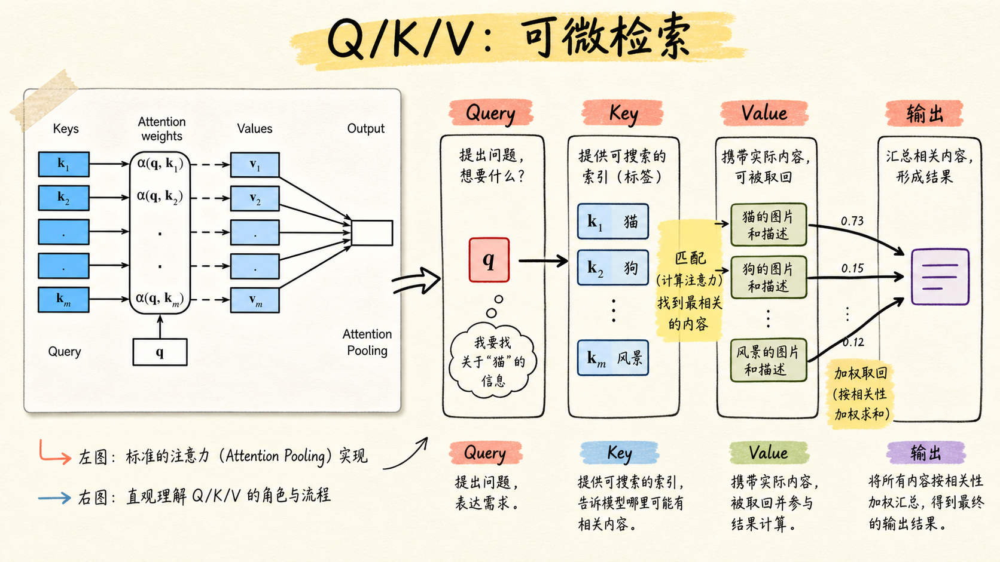

Q/K/V 是理解注意力机制的核心抽象。

- `Query`：当前状态提出的问题，表示“我现在想找什么”。
- `Key`：候选信息暴露出来的索引，表示“我可以怎样被匹配”。
- `Value`：真正被取回的内容，表示“匹配后要贡献什么信息”。

在 Transformer 里，Q/K/V 往往都来自同一个 token 表示的不同线性投影。这意味着同一个 token 会同时扮演三种角色：它可以向别人发问，也可以被别人匹配，还可以把自己的内容贡献给别人。

这比“注意力权重是一张热力图”更底层。热力图只是结果，Q/K/V 才是这个结果怎么产生的。

## 4. 注意力池化公式

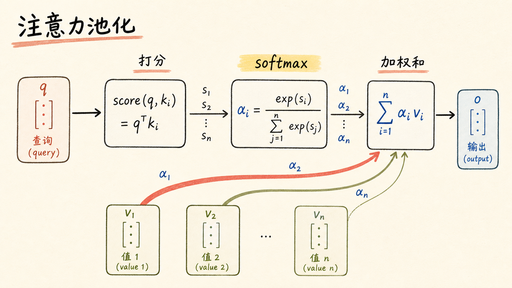

注意力池化可以写成：

```text
f(q, (k1, v1), ..., (km, vm)) = sum_i alpha(q, ki) vi
alpha(q, ki) = softmax(a(q, ki))
```

这里有三步：

1. 用打分函数 `a(q, k)` 计算 query 和 key 的匹配分数。
2. 用 `softmax` 把分数变成非负、和为 1 的权重。
3. 用这些权重对 values 加权求和。

所以注意力输出本质上是 values 的加权平均。它不是从候选里硬选一个，而是在所有候选之间做软选择。这个“软”很重要，因为整个过程可导，可以端到端训练。

## 5. 两种打分函数

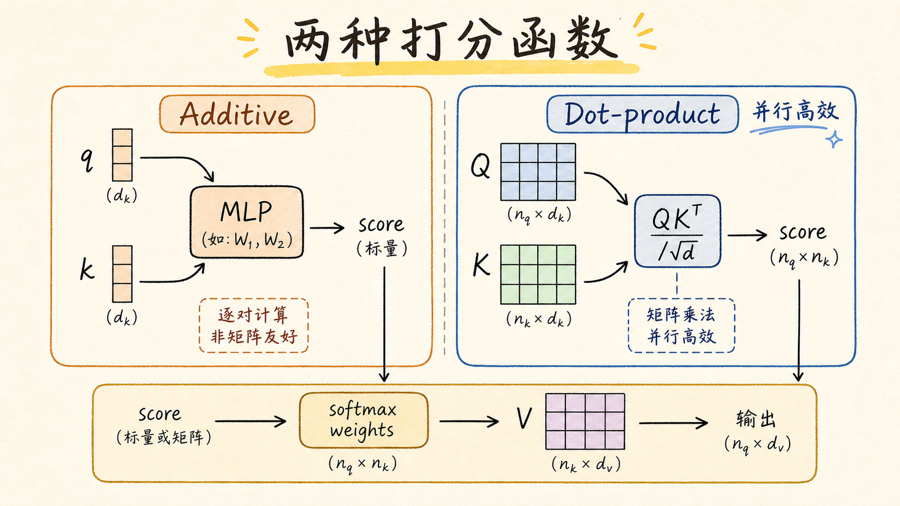

D2L 讲了两类经典打分函数：加性注意力和缩放点积注意力。

加性注意力把 query 和 key 放进一个小网络里算分数。它的表达能力不错，也很适合早期 seq2seq 里的 decoder 状态和 encoder 状态匹配。

缩放点积注意力使用矩阵乘法：

```text
softmax(QK^T / sqrt(d)) V
```

这里的 `QK^T` 一次性算出所有 query-key 匹配分数。除以 `sqrt(d)` 是为了控制 logits 的尺度。如果维度 `d` 很大，点积的方差也会变大，softmax 容易变得过尖，梯度变小，训练不稳定。

Transformer 选择缩放点积注意力，不只是因为公式漂亮，更因为它非常适合矩阵并行计算。

## 6. Bahdanau：Decoder 会回头看

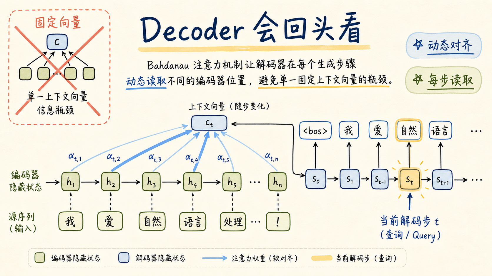

在早期 encoder-decoder 模型里，一个常见瓶颈是：encoder 把整个输入序列压成一个固定上下文向量，decoder 再靠这个向量生成输出。

这个设计的问题很明显。输入越长，固定向量越难装下所有信息。

Bahdanau attention 的关键变化是：decoder 每生成一步，都可以用当前 decoder 状态作为 query，动态读取 encoder 的不同位置。生成第一个词时可能看源句开头，生成后面的词时可能看源句中间或结尾。

这就是注意力最早在机器翻译里大放异彩的原因：它把“固定摘要”变成了“逐步检索”。

## 7. Multi-Head：多张关系图

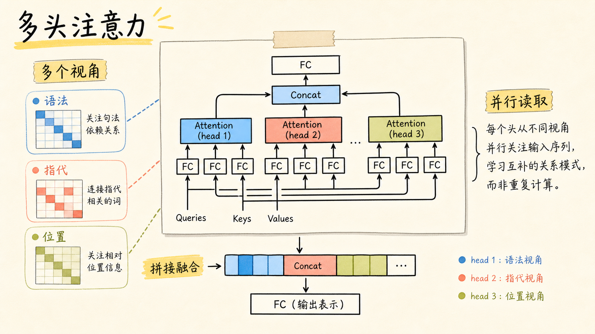

多头注意力常被误解成“多个注意力模型投票”。这个说法不太准确。

更好的理解是：**多个 head 在不同子空间里学习不同关系**。

单头注意力只有一张匹配图，很难同时表达语法依赖、指代关系、局部邻近、长程依赖和实体属性。多头注意力会先把输入投影到多个子空间，让每个 head 各自计算注意力，再把输出拼接融合。

直觉上，多头机制让模型同时拥有多张关系图。某个 head 可能偏向局部位置，另一个 head 可能偏向指代关系，还有一个 head 可能捕捉句法结构。模型不需要事先被规定这些分工，但训练后可能自然学出这样的功能分化。

## 8. Self-Attention：序列内部全连接

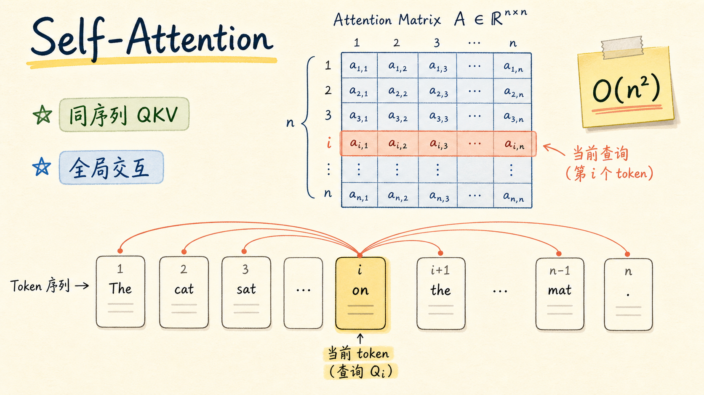

Self-attention 的特殊之处在于 Q、K、V 都来自同一个序列。

对长度为 `n` 的序列，每个 token 都可以作为 query 去读取同一序列里的所有 key/value。于是会形成一张 `n x n` 的注意力矩阵。矩阵里的第 `i` 行表示第 `i` 个 token 如何读取所有 token。

这带来两个结果：

1. 全局感受野天然存在。每个 token 一层内就能读到所有 token。
2. 计算和显存代价通常随长度近似二次增长，也就是 `O(n^2)`。

这就是为什么 Transformer 强大，也解释了为什么长上下文模型需要对 attention 做各种优化。

## 9. 位置编码：给顺序一个坐标

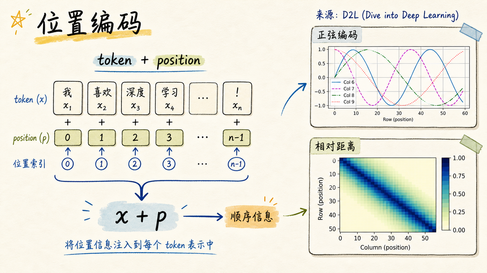

纯 self-attention 有一个很微妙的问题：它本身没有顺序感。

如果只看 attention 的计算，交换两个 token 的位置，只要对应表示也跟着交换，模型并不会天然知道谁在前、谁在后。它看到的是一组 token 之间的匹配关系，而不是带顺序的句子。

位置编码的作用，就是把顺序信息注入 token 表示：

```text
输入表示 = token embedding + positional encoding
```

经典 Transformer 使用正弦和余弦位置编码。它的好处不只是给每个位置一个不同向量，还让模型更容易根据不同频率的组合推断相对距离。后来的 RoPE、ALiBi 等方法，也是围绕“怎样让模型理解位置和相对距离”这个问题继续发展。

## 10. Transformer Block：可堆叠骨架

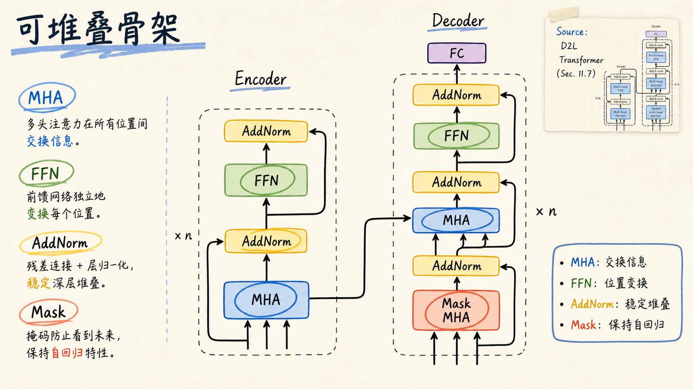

Transformer block 的结构逻辑其实很清楚：

```text
输入
-> Multi-Head Self-Attention
-> Add & Norm
-> Position-wise FFN
-> Add & Norm
```

每个部分都有明确分工。

- `MHA` 负责 token 之间的信息交换。
- `FFN` 负责每个位置内部的非线性特征变换。
- `AddNorm` 通过残差连接和归一化稳定深层训练。
- `Mask` 用在 decoder 自回归生成里，避免当前位置看到未来 token。

Encoder 和 decoder 的差异，主要在 decoder 多了 masked self-attention，以及从 encoder 输出读取信息的 cross-attention。这个架构看上去像模块堆叠，但真正的优点是：它既能并行训练，又能稳定加深、放大。

## 11. ViT：图像也能变 token

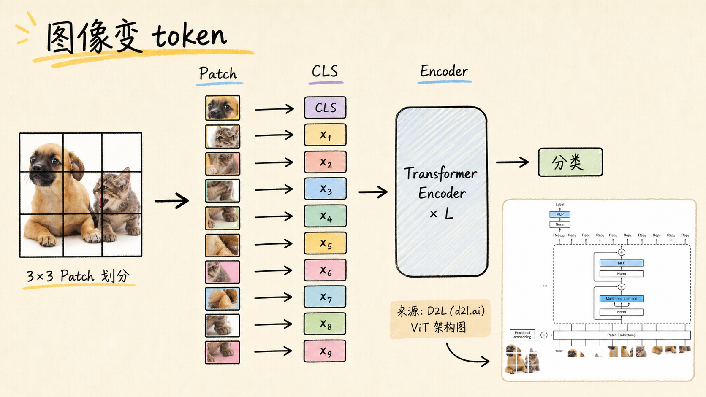

ViT 的思想很直接：既然 Transformer 擅长处理 token 序列，那就把图像也变成 token 序列。

做法是：

1. 把图像切成固定大小的 patch。
2. 把每个 patch 展平成向量，再映射成 patch embedding。
3. 加入一个用于分类的 `CLS` token。
4. 加上位置编码，送进 Transformer encoder。

这说明 Transformer 不是只能处理自然语言。它更像一种通用的 token mixing 架构。只要能把输入切成 token，并定义好位置和训练目标，就可以把 Transformer 用到文本、图像、语音、多模态等场景。

## 12. 从结构到基础模型

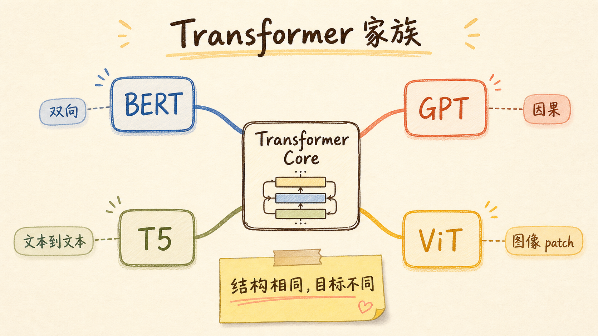

BERT、GPT、T5、ViT 都可以放在同一张地图里看。

- `BERT`：encoder-only，双向上下文，常用 masked language modeling 学表征。
- `GPT`：decoder-only，因果 mask，自回归预测下一个 token，擅长生成。
- `T5`：encoder-decoder，把任务统一成 text-to-text。
- `ViT`：把图像切成 patch token，用 Transformer encoder 处理视觉序列。

这些模型的共同点是 Transformer core。它们的差别主要不在“是不是 Transformer”，而在输入如何 token 化、attention mask 怎么设、训练目标是什么、数据规模和任务设定如何。

所以，如果只记一个结论，我会记这个：

> Transformer 不是一个单独的 NLP 模型，而是一种把 token 表示、全局交互、位置机制和可堆叠训练组织起来的通用计算骨架。

## 常见误区

1. **注意力权重不等于可靠解释**。注意力图可以帮助观察模型行为，但不能直接当成因果解释。
2. **Transformer 不是完全不需要位置**。它不需要循环或卷积来传递顺序，但仍然需要显式或隐式的位置机制。
3. **多头注意力不是简单重复**。多头的价值是让模型在多个子空间里并行学习不同关系。
4. **ViT 不只是把 CNN 换成 Transformer**。更核心的变化是把图像转成 patch token，并依赖大规模数据或预训练获得强性能。

## 参考

- [D2L: Attention Mechanisms and Transformers](https://d2l.ai/chapter_attention-mechanisms-and-transformers/index.html)
- [Attention Is All You Need](https://arxiv.org/abs/1706.03762)

