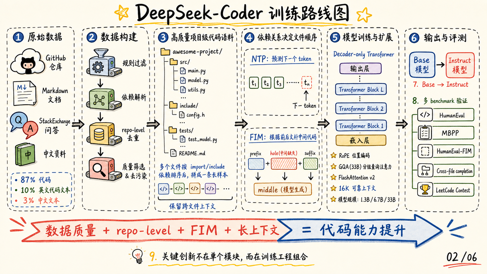
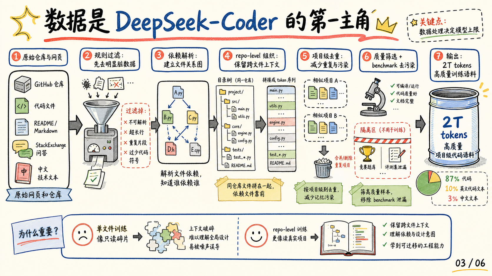
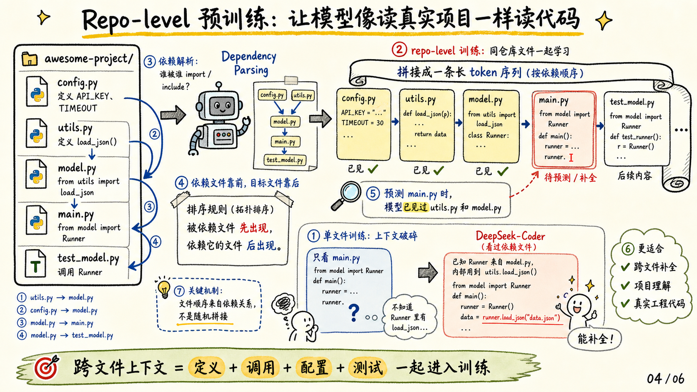
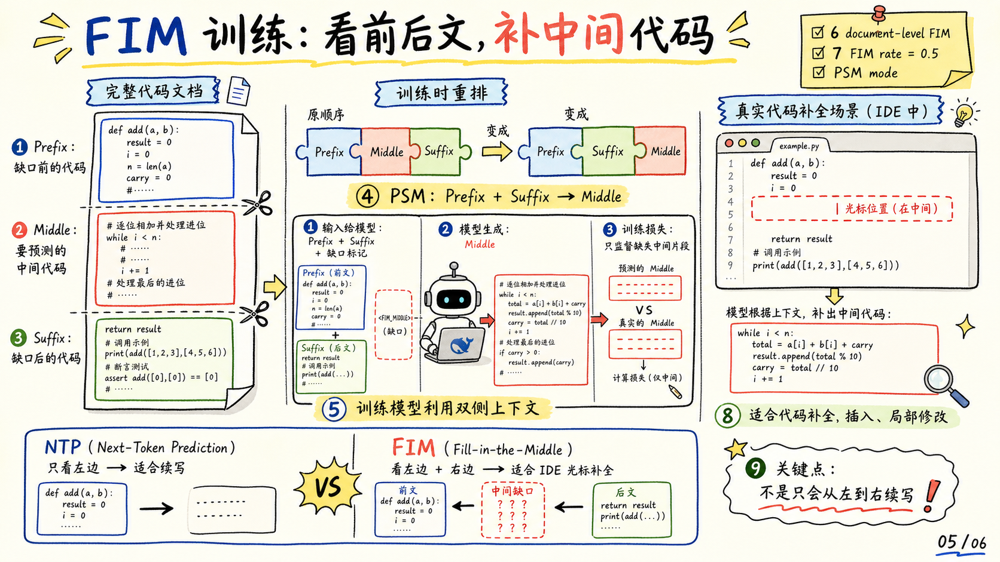

# DeepSeek-Coder 图解笔记

这篇笔记来自论文 [DeepSeek-Coder: When the Large Language Model Meets Programming](https://arxiv.org/abs/2401.14196)。

我觉得这篇论文最值得拆开的地方，不是某个新的 Transformer block，而是它把代码大模型训练讲成了一套工程组合：

1. **数据工程**：用项目级清洗、依赖解析、去重和去污染构建 2T tokens 的代码训练集。
2. **Repo-level 预训练**：让同一仓库的相关文件一起进入上下文，模型不再只看孤立代码片段。
3. **FIM 训练**：让模型看前后文补中间代码，更贴近 IDE 光标补全和局部修改。

## 封面

DeepSeek-Coder 的一句话贡献：用高质量 repo-level 代码语料、FIM、16K 长上下文和多尺度模型，构建商用友好的开源代码大模型。

## 方法总览

整条路线是“原始仓库与文本 -> 数据构建 -> repo-level 样本 -> NTP/FIM 预训练 -> Base/Instruct 模型 -> 多 benchmark 验证”。

这篇论文的关键创新不在单个模块，而在训练工程组合。数据质量、项目级上下文、FIM 目标和长上下文能力一起决定了最终代码能力。

## 数据构建流水线

论文把数据作为第一主角。代码语料经过规则过滤、依赖解析、项目级组织、项目级去重、质量筛选和 benchmark 去污染，最终形成 2T tokens 的训练集。

最重要的是 repo-level 组织：单文件训练像只读碎片，repo-level 训练更像读一个真实项目，能保留定义、调用、配置和测试之间的关系。

## Repo-level 预训练

Repo-level 训练让同一仓库的相关文件一起进入上下文。依赖文件先出现，目标文件后出现；模型预测目标文件时，已经看过定义、配置、工具函数和测试线索。

这个设计直接服务真实工程代码。很多代码补全问题不是“下一行是什么”，而是“这个项目里已有的接口、约定和依赖应该怎么用”。

## FIM 训练

FIM 把完整代码切成 prefix、middle、suffix，再以 PSM 形式让模型根据前后文预测中间片段。

相比纯 next-token prediction，FIM 更贴近 IDE 里的真实交互：用户经常在函数中间插入代码、改局部逻辑、根据后续调用补前面的实现。

## 关键结果与边界

实验结果形成一条证据链：高质量代码语料提升基础代码生成，repo-level 训练改善跨文件补全，FIM 提升补中间能力，指令微调增强对话式编程和竞赛题表现。

论文也保留了边界意识：评测不能覆盖真实开发全部能力，最新 LeetCode 题仍需警惕数据污染风险；33B Instruct 在部分代码任务上接近或超过 GPT-3.5 水平，但仍低于 GPT-4。

## 三个要点

1. **数据质量是地基**：代码大模型能力很大程度来自高质量、多语言、项目级代码语料。
2. **repo-level 上下文很关键**：模型不只学单个文件，而是学习真实项目中的定义、依赖、调用和测试关系。
3. **FIM 对齐真实补全需求**：代码模型必须能看前后文补中间，而不只是从左到右续写。
