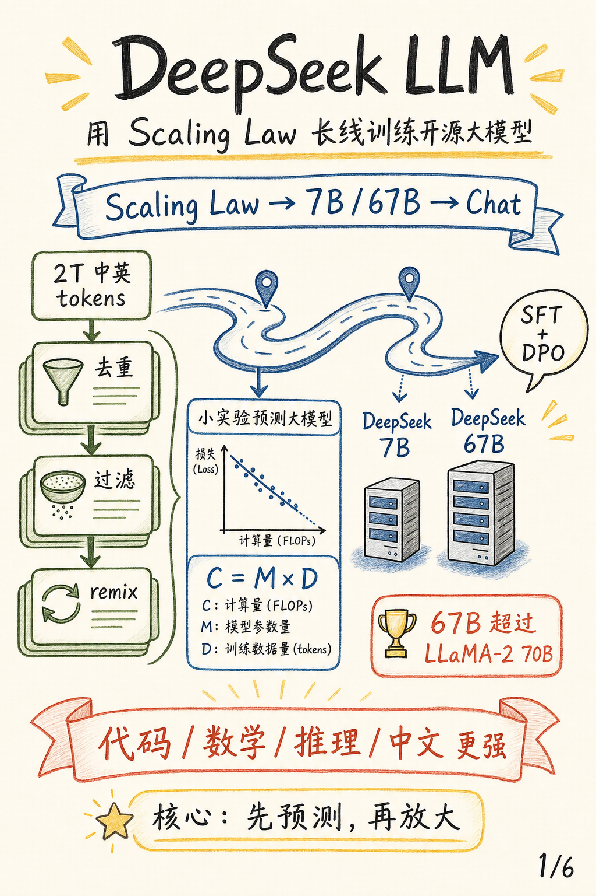
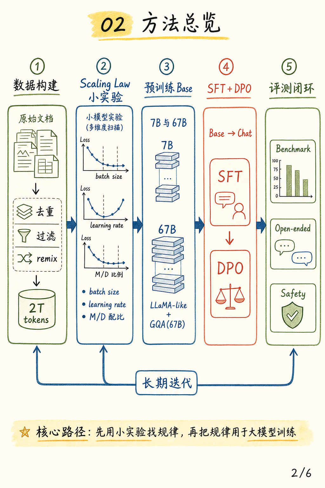
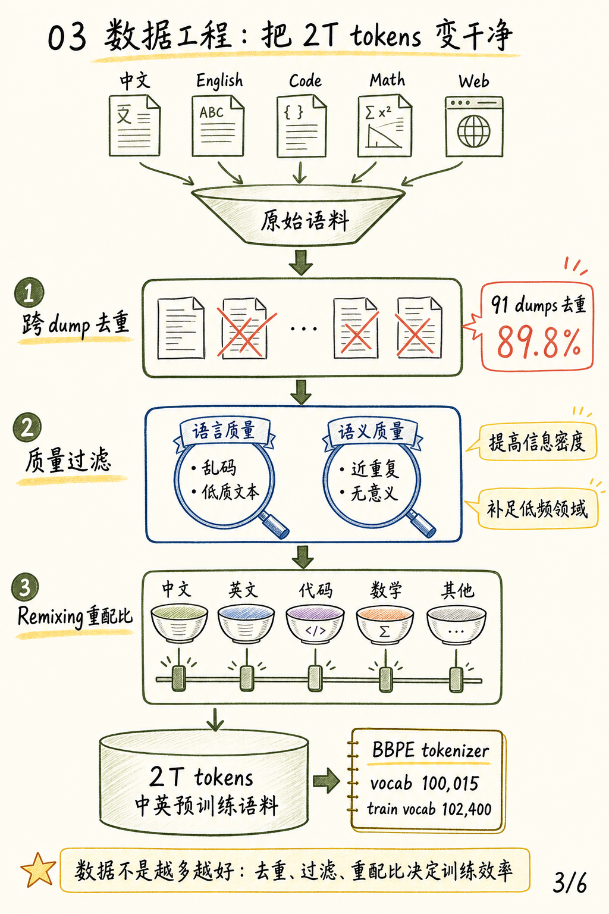
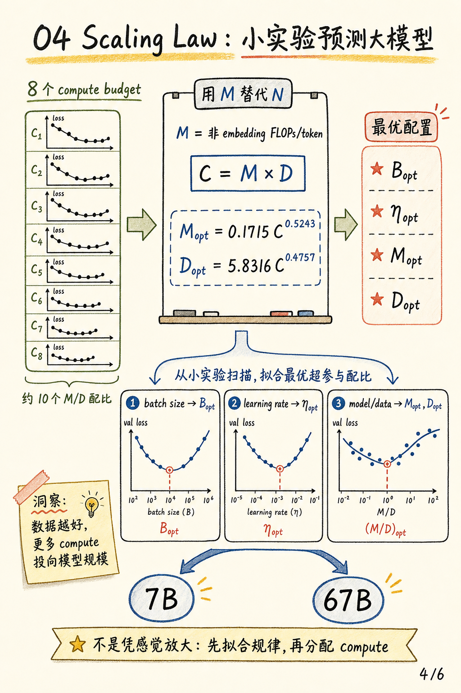
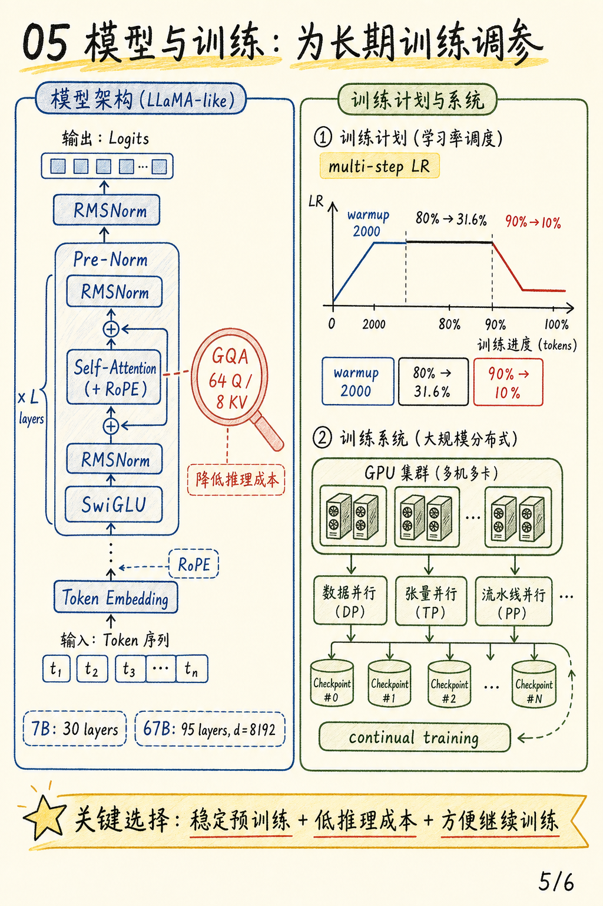
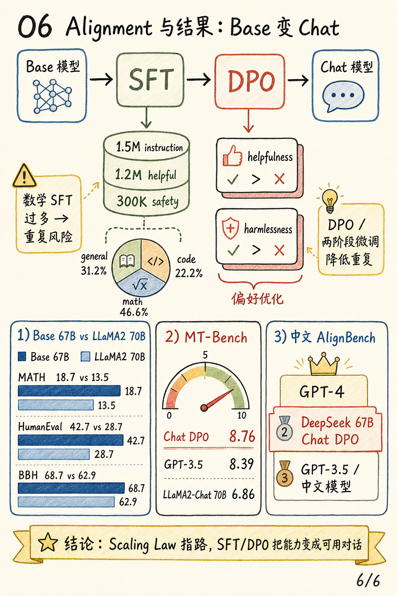

# DeepSeek LLM: Scaling Open-Source Language Models with Longtermism 图解

这篇笔记来自论文 [DeepSeek LLM: Scaling Open-Source Language Models with Longtermism](https://arxiv.org/abs/2401.02954)。

我觉得这篇论文最值得拆开的，不是某个新的 Transformer block，而是它把大模型训练讲成了一套长期主义工程方法：

1. **数据工程**：2T 中英 tokens 不是简单堆量，而是经过去重、过滤和 remixing。
2. **Scaling Law**：先用小实验估计 batch size、learning rate、模型规模和数据量之间的关系。
3. **训练决策**：把 scaling law 的预测落到 7B/67B，再用 SFT + DPO 做 Chat 模型。

## 封面

DeepSeek LLM 的一句话贡献：先用 scaling law 找到训练规律，再把规律用于 7B/67B 开源大模型，并通过 SFT + DPO 做成 Chat 模型。

## 方法总览

整篇论文可以看成一条闭环：数据构建、scaling law 小实验、预训练 Base、SFT/DPO 对齐、benchmark/open-ended/safety 评测。

这里的 “longtermism” 很关键。它不是只训练一次模型，而是把数据、scale、训练策略、alignment 和评测组织成可持续迭代的系统。

## 数据工程

论文先构建 2T tokens 的中英预训练语料。数据流程主要包括去重、质量过滤和 remixing。

最值得注意的是去重范围。论文报告，跨 91 个 Common Crawl dumps 去重能过滤掉 89.8% 的重复文档。这个数字说明：训练数据的有效信息密度，往往比原始 token 数更重要。

## Scaling Law

这篇论文的方法贡献主要在 scaling law。

DeepSeek 没有只用参数量 `N` 表示模型规模，而是使用 non-embedding FLOPs/token `M`。这样可以把 attention 计算纳入模型规模估计，同时排除 vocabulary computation 的干扰。

论文用小规模实验拟合出不同 compute budget 下的最优 batch size、learning rate、模型规模和数据量。可以把它理解成：先用便宜的小实验找到趋势，再把趋势用于昂贵的大模型训练。

## 模型与训练

模型架构整体沿用 LLaMA-like 设计，包括 Pre-Norm、RMSNorm、SwiGLU 和 RoPE。67B 模型使用 GQA，降低推理时 KV cache 和 attention 的开销。

训练策略上，DeepSeek 使用 multi-step learning rate schedule，而不是把学习率平滑降到很低。这种设计更适合 continual training：后续如果要继续训练模型，学习率还保留着可操作空间。

## Alignment 与结果

Base 模型训练完成后，DeepSeek 用约 150 万条中英 instruction 数据做 SFT，其中包括约 120 万 helpful 数据和 30 万 safety 数据。之后再用 DPO 优化 helpfulness 和 harmlessness。

结果上，67B Base 在数学、代码、推理和中文能力上相对 LLaMA-2 70B 有明显优势。Chat DPO 版本在 MT-Bench 上达到 8.76，高于论文中报告的 GPT-3.5 8.39。

## 三个要点

1. **数据质量会改变 scaling 决策**：高质量数据下，新增 compute 更应该投向模型规模，而不是只堆更多 token。
2. **论文核心是训练决策体系**：它的创新点不是单个新模块，而是从小实验到大模型训练的一整套放大方法。
3. **Longtermism 是闭环**：数据、scale、训练策略、alignment 和评测互相反馈，支撑模型长期迭代。
