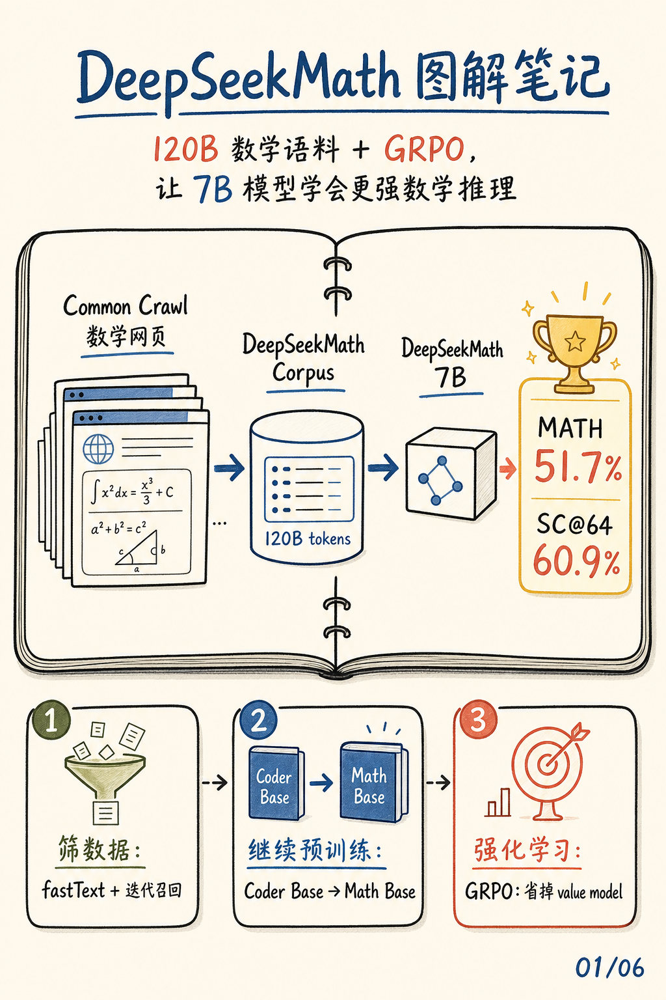
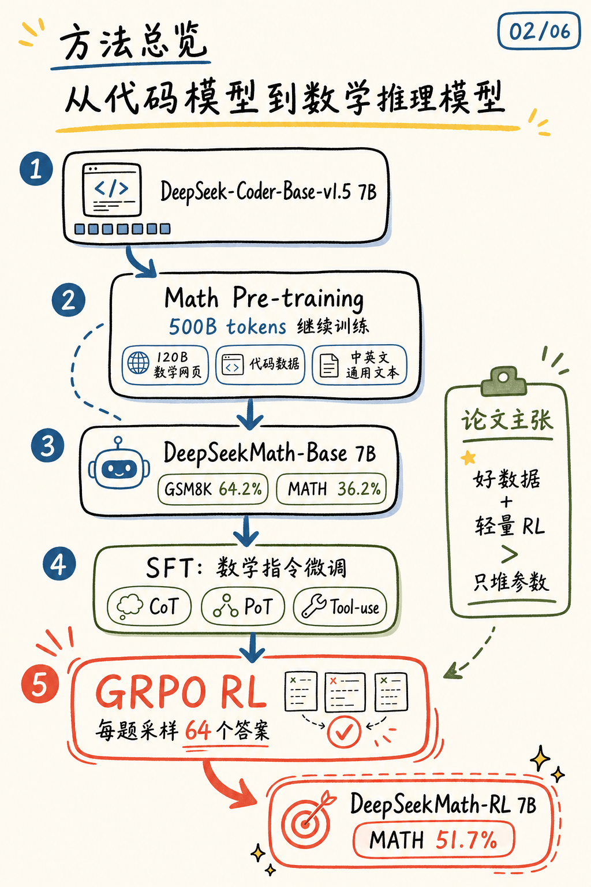
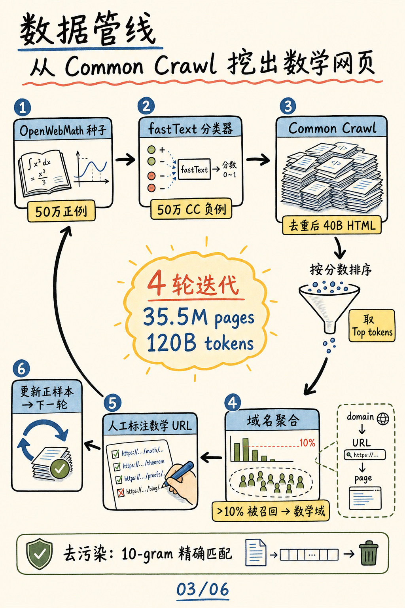
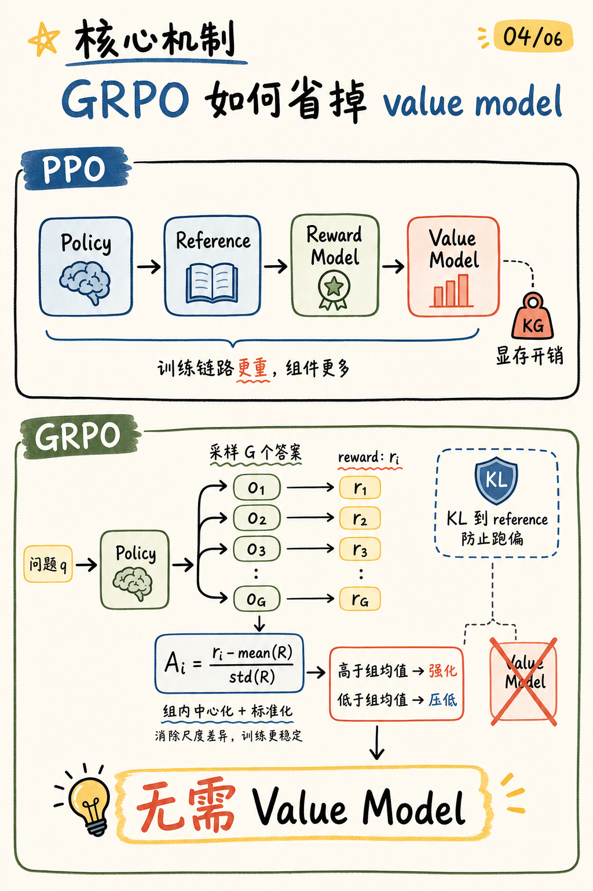
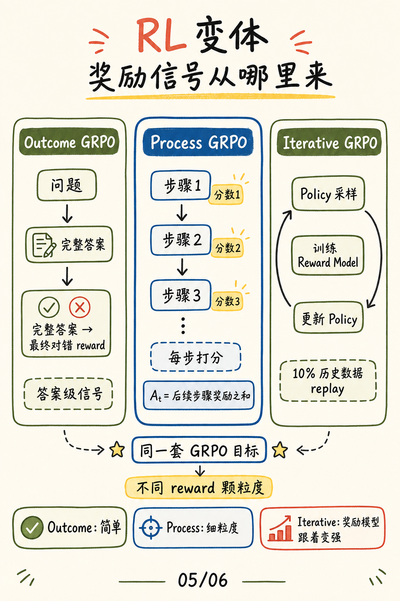
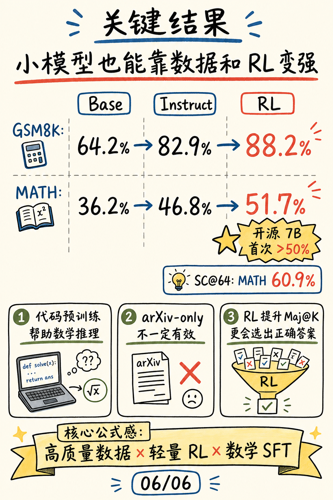

# DeepSeekMath: Pushing the Limits of Mathematical Reasoning in Open Language Models

这篇笔记来自论文 [DeepSeekMath: Pushing the Limits of Mathematical Reasoning in Open Language Models](https://arxiv.org/abs/2402.03300)。

我觉得这篇论文最值得拆开的，不只是“做了一个数学模型”，而是它把数学推理能力拆成了一条很清楚的工程链路：

1. **数据召回**：从 Common Crawl 里挖出高质量数学网页，构建 120B tokens 的 DeepSeekMath Corpus。
2. **继续预训练**：从 DeepSeek-Coder-Base-v1.5 7B 出发，用数学网页、代码和通用文本混合训练。
3. **强化学习**：提出 GRPO，用组内相对 reward 省掉 value model，降低数学 RL 的训练成本。

## 封面

DeepSeekMath 的一句话贡献：用 120B 数学网页语料和 GRPO，把 7B 开源模型的数学推理能力推到一个很强的位置。

## 方法总览

整篇论文可以看成一条训练流水线：从 DeepSeek-Coder-Base-v1.5 7B 出发，先做数学继续预训练，得到 DeepSeekMath-Base；再用数学指令数据做 SFT，最后通过 GRPO 强化学习得到 DeepSeekMath-RL。

这里的关键不是单点技巧，而是组合拳：代码模型提供基础推理和工具使用能力，数学语料补上领域知识，SFT 提供解题格式，GRPO 再把模型往“更容易产出正确答案”的方向推。

## 数据管线

DeepSeekMath Corpus 不是简单抓网页。论文先用 OpenWebMath 做初始正例，配合 Common Crawl 负例训练 fastText 分类器；然后在 Common Crawl 里召回高分网页，再按域名聚合，把被大量召回的域名作为候选数学域。

人工标注数学 URL 后，新的正样本会回流到下一轮分类器训练。4 轮迭代后，论文得到 35.5M 数学网页，约 120B tokens。为了避免 benchmark 泄漏，作者还用 10-gram 精确匹配做去污染。

## GRPO vs PPO

GRPO 是这篇论文最值得记住的机制。传统 PPO 通常需要 policy、reference、reward model 和 value model。value model 要额外训练和推理，会带来显存与计算开销。

GRPO 的做法是：对同一个问题采样一组答案，用这些答案的 reward 均值和标准差做组内归一化。高于组均值的答案被强化，低于组均值的答案被压低。这样不需要单独的 value model，也能估计 advantage。

## RL 变体

论文比较了三种 reward 颗粒度。Outcome GRPO 只看最终答案是否正确；Process GRPO 给每个推理步骤打分；Iterative GRPO 则让 policy 和 reward model 互相迭代，同时加入历史数据 replay 保持训练稳定。

可以把三者理解成同一套 GRPO 目标函数下的不同监督信号：答案级信号最简单，过程级信号更细，迭代式信号更适合 reward model 跟着 policy 一起进化。

## 关键结果

结果上，DeepSeekMath-RL 7B 在 GSM8K / MATH 上从 Instruct 的 82.9% / 46.8% 提升到 88.2% / 51.7%，64-sample self-consistency 在 MATH 上达到 60.9%。

论文里还有两个很有意思的经验结论。第一，代码预训练确实帮助数学推理，尤其帮助 tool-integrated reasoning。第二，只用 arXiv 数据继续训练并不一定有效，数学网页数据的召回质量更关键。

## 三个要点

1. **数据胜在召回管线**：DeepSeekMath Corpus 的价值来自迭代式数学网页挖掘，而不是随便堆 Common Crawl。
2. **GRPO 降低 RL 成本**：组内相对 reward 替代 value model，让数学 RL 更轻。
3. **RL 更会筛答案**：论文观察到 RL 更明显提升 Maj@K，也就是更会从多个候选解里选出正确答案，而不一定立刻扩大 Pass@K 的解题覆盖面。
