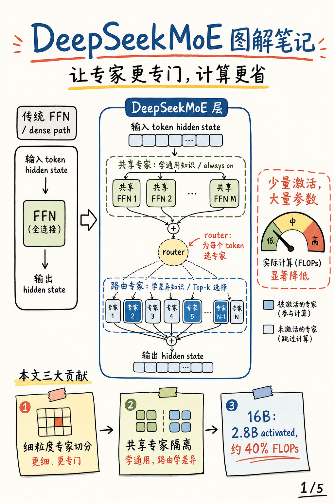
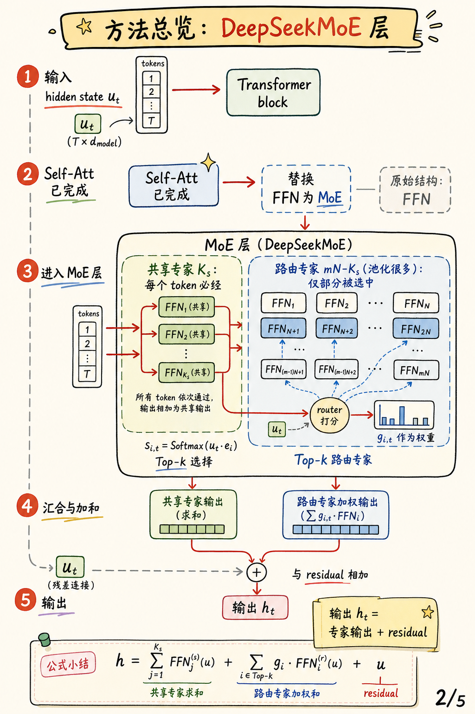
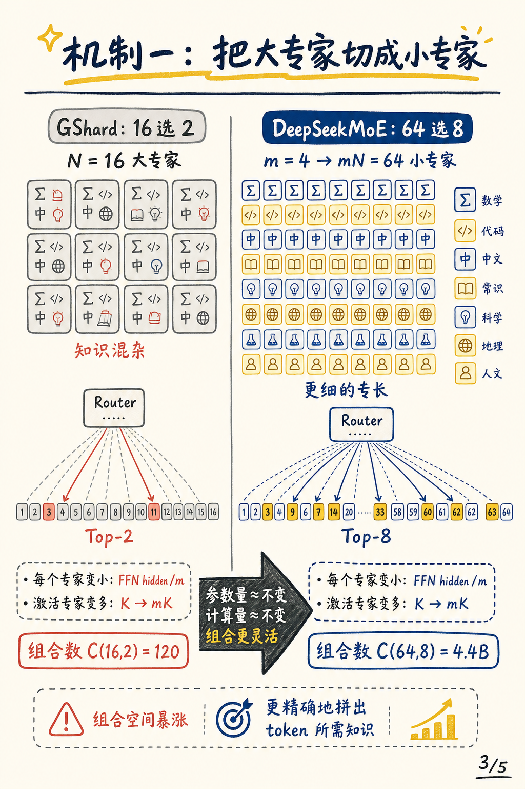
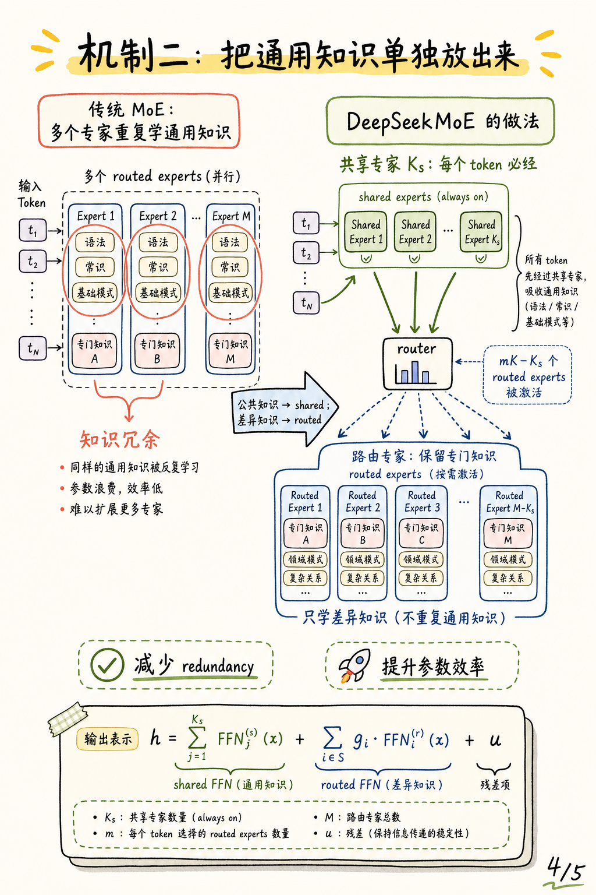
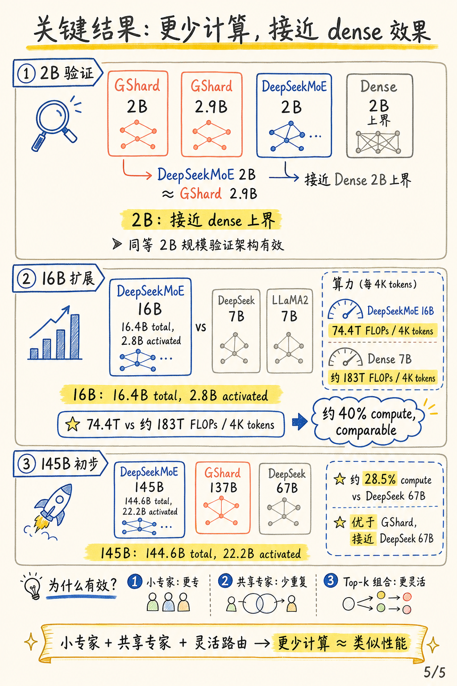

# DeepSeekMoE: Towards Ultimate Expert Specialization in Mixture-of-Experts Language Models 图解

这篇笔记来自论文 [DeepSeekMoE: Towards Ultimate Expert Specialization in Mixture-of-Experts Language Models](https://arxiv.org/abs/2401.06066)。

我觉得这篇论文最值得拆开的，不是“MoE 参数更多”，而是它把专家专门化这件事讲成了一个结构问题：

1. **知识混杂**：专家太少、太大时，一个专家会被迫塞进很多不同类型的知识。
2. **知识冗余**：不同 routed experts 都会重复学习通用知识，浪费专家参数。
3. **组合不够灵活**：传统 top-k routing 的专家组合空间有限，token 很难拿到刚好合适的一组专家。

## 封面



DeepSeekMoE 的一句话贡献：把专家切得更细，再把通用知识交给共享专家，让 routed experts 更专门、更少重复。

## 方法总览



DeepSeekMoE 仍然是在 Transformer block 里替换 FFN 部分。一个 token 的 hidden state 先经过 self-attention，再进入 MoE 层。

MoE 层里有两条路径：共享专家总是被激活，用来吸收通用知识；路由专家由 router 根据 token 表示打分，再通过 Top-k 选择其中一部分。最后两类专家输出加权汇合，并通过 residual 得到输出 hidden state。

可以把核心公式粗略记成：

```text
h = shared experts output + routed experts weighted output + residual
```

## 细粒度专家切分



传统 GShard 类 MoE 可以理解为从 `N` 个大专家里选 `K` 个。DeepSeekMoE 把每个专家按 FFN hidden dimension 切成 `m` 个小专家，于是专家数从 `N` 变成 `mN`。

为了保持计算量基本不变，它也把激活专家数从 `K` 增加到 `mK`。论文里的例子很直观：`N=16, Top-2` 只有 `C(16,2)=120` 种组合；如果每个专家拆成 4 个小专家，就变成 `64 选 8`，组合空间约 `4.4B`。

这个机制的关键不是“多算一点”，而是在近似相同的专家参数和计算预算下，让每个 token 能拼出更细、更准的一组知识模块。

## 共享专家隔离



如果所有专家都靠 router 选择，那么很多 routed experts 会反复学习同一类通用知识，比如语法、常识、基础模式。这会让专家之间变得冗余，也削弱“专门化”的意义。

DeepSeekMoE 的做法是拿出 `K_s` 个共享专家，每个 token 都必须经过它们；剩下的 routed experts 只负责更差异化、更上下文相关的知识。这样公共知识被集中，路由专家就能更专注。

## 关键结果



论文用三个尺度验证这个设计：

DeepSeekMoE 2B 在验证实验中接近同规模 dense 模型上界，并可匹配更大的 GShard 2.9B。DeepSeekMoE 16B 有 16.4B 总参数，但每次只激活约 2.8B 参数；论文报告它以约 40% 的计算量达到 DeepSeek 7B 和 LLaMA2 7B 附近的表现。145B 初步实验里，DeepSeekMoE 145B 以约 28.5% 的计算量接近 DeepSeek 67B，并明显优于 GShard 137B。

## 三个要点

1. **小专家更专**：细粒度切分让不同知识更容易分散到不同专家。
2. **共享专家少重复**：通用知识集中处理，减少 routed experts 间的冗余。
3. **灵活路由更准**：更多小专家组合让每个 token 更容易拿到合适的计算路径。
