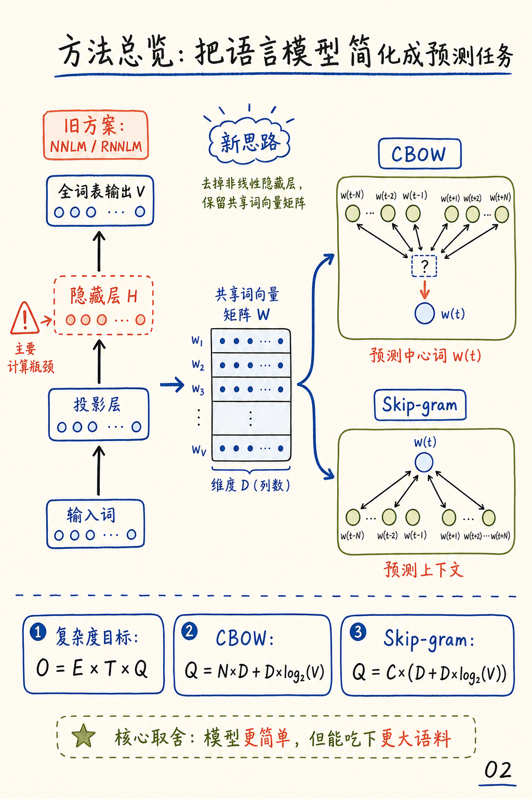
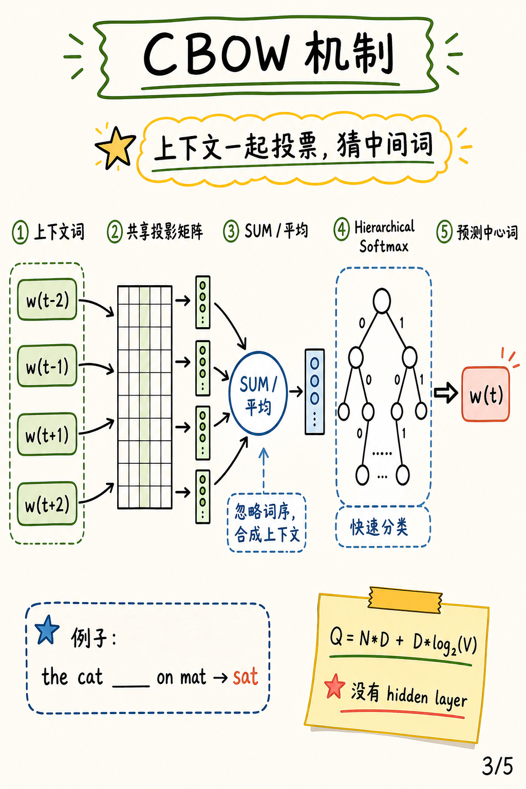
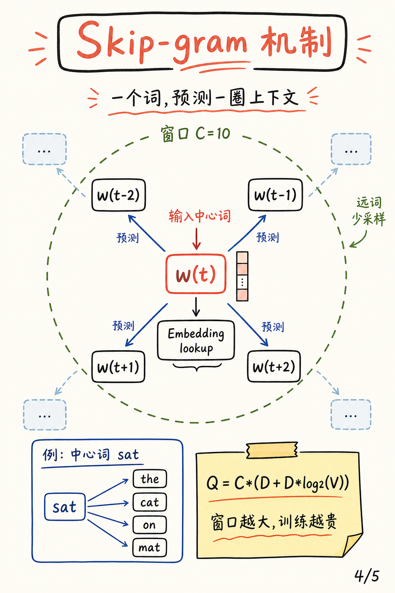

# Efficient Estimation of Word Representations in Vector Space

论文：[Efficient Estimation of Word Representations in Vector Space](https://arxiv.org/abs/1301.3781)，Tomas Mikolov, Kai Chen, Greg Corrado, Jeffrey Dean，ICLR 2013 Workshop Poster。

代码状态：论文 v3 的 Follow-Up Work 指向 [Google Code word2vec](https://code.google.com/p/word2vec/)。这篇笔记使用其 GitHub 导出镜像 [tmikolov/word2vec](https://github.com/tmikolov/word2vec)，本地克隆 commit 为 `20c129a`。代码是已公开状态，包含 CBOW、Skip-gram、hierarchical softmax，以及后续扩展的 negative sampling、subsampling 和 phrase 工具。

资料说明：我读取了 arXiv 摘要页、arXiv PDF 与 HTML 全文；旧论文在 `arxiv.org/html/1301.3781` 没有可用转换页，因此用 ar5iv HTML 全文辅助校对。

<div class="summary-box">
  <strong>一句话总结：</strong>这篇论文的关键贡献，是把词向量训练从昂贵的神经语言模型中抽离出来，删掉最耗算的非线性隐藏层，用 CBOW 和 Skip-gram 两个浅层 log-linear 架构，在大语料上以更低复杂度学到能稳定表达语义和句法关系的向量空间。
</div>

## 图解速览


这篇论文的核心不是“第一次提出词向量”，而是把词向量训练做成足够轻量的工程工具：输入文本序列，经过 CBOW / Skip-gram 两个预测任务，输出能保留语义方向的向量空间。



传统 NNLM / RNNLM 的瓶颈在隐藏层和大词表输出。本文的关键取舍是去掉昂贵的非线性隐藏层，保留共享词向量矩阵，再用 hierarchical softmax 把输出层成本压到树路径长度。



CBOW 用上下文预测中心词。它把窗口里的上下文词查表成向量，求和或平均成一个上下文表示，再预测中间词。这个机制忽略词序，但训练快，句法规律表现尤其稳定。



Skip-gram 用中心词预测周围词。一个中心词会展开成多个监督信号，因此比 CBOW 慢一些，但能给语义关系和稀有词更多训练机会。


论文最有说服力的评测，是把语义和句法关系变成向量类比题：先做向量运算，再找最近词，完全命中才算对。这让“词向量里有线性关系”从漂亮例子变成了可批量计分的实验。

## 研究背景与动机

2013 年以前，连续词向量已经不是新概念。Bengio 等人的 neural probabilistic language model 已经说明，可以用一个投影层把 one-hot 词索引映射到稠密向量，再通过神经网络预测语言模型概率。Collobert、Weston、Mnih、Huang 等工作也展示了词向量在 NLP 任务中的价值。问题在于，这些模型通常把词向量学习绑定在更复杂的语言模型上：要预测下一个词，要计算隐藏层，要处理巨大词表输出层。词向量是有价值的，但获取它们的成本很高。

论文的出发点并不是重新定义“语义是什么”，而是回答一个非常工程化的问题：如果目标只是学到可迁移、可比较、可做向量代数的词表示，是否真的需要完整的神经语言模型？作者观察到，在传统 NNLM 和 RNNLM 中，真正拖慢训练的主要部分并不是从 one-hot 到向量的查表，而是投影层之后的 dense hidden layer 和输出层计算。只要删掉或弱化这些部分，模型就能把同样的算力投到更大的语料、更高维的向量和更大的词表上。

这正是标题里 Efficient 的含义。论文强调目标是在 <q>very large data sets</q> 上估计词表示，而不是在小语料上训练一个更复杂的网络。这个姿态后来影响极大：Word2Vec 让词向量从研究者手里的模型组件，变成了工业界和开源社区都能训练、下载、复用的基础资产。

当时主流 NLP 系统仍大量使用离散词特征、N-gram、词表索引和人工模板。离散表示的优点是简单、鲁棒、可扩展；缺点是没有天然的相似性结构。系统知道 Paris 和 Berlin 是两个不同 token，却不知道它们和 city、country、capital 之间的关系。连续向量的承诺是：相似词可以在空间中靠近，关系也可以用方向表达。

论文最打动人的地方，是它没有只用“相似词列表”证明词向量好，而是构造了一个更严苛的 semantic-syntactic analogy 测试集。模型不仅要知道 France 和 Italy 相似，还要在 Paris - France + Italy 这种向量运算后找到 Rome。这让词向量质量从“看起来相似”变成了可以批量计算准确率的任务。

## 预备知识

为了读懂这篇论文，需要先区分三件事：词向量、语言模型、训练目标。词向量是每个词对应的稠密实数向量；语言模型是给定上下文预测词序列概率的模型；训练目标则决定模型如何从语料中更新向量。传统 NNLM 同时做三件事，而本文的策略是：保留“用上下文预测词”或“用词预测上下文”的自监督信号，但尽量简化网络结构。

论文把不同架构的训练复杂度统一写成：

$$
O = E \times T \times Q
$$

这里 $E$ 是训练 epoch 数，$T$ 是训练集中 token 数，$Q$ 是每个训练样本需要访问或更新的参数量。人话解释：总训练成本等于“扫几遍数据”乘以“数据有多大”再乘以“每个样本有多贵”。Word2Vec 的核心策略就是压低 $Q$，然后允许 $T$ 和向量维度 $D$ 变大。

另一个关键概念是 hierarchical softmax。普通 softmax 要在大小为 $V$ 的词表上归一化，词表若有一百万词，每次预测都很贵。hierarchical softmax 把词表组织成二叉树，预测一个词等价于沿根到叶子的路径做若干次二分类。若使用 Huffman tree，高频词路径更短，平均计算量会进一步下降。

<pre class="mermaid">flowchart TB
    A["One-hot word ids"] --> B["Shared embedding table"]
    B --> C1["CBOW<br/>context to center word"]
    B --> C2["Skip-gram<br/>center word to context"]
    C1 --> D["Hierarchical softmax<br/>Huffman path"]
    C2 --> D
    D --> E["Dense word vectors<br/>semantic and syntactic regularities"]
</pre>

## 方法详解

### 1. 从 NNLM/RNNLM 的复杂度里找到真正瓶颈

论文第 2 节先分析已有神经语言模型。Feedforward NNLM 的输入是 $N$ 个历史词，每个词查到 $D$ 维向量后拼接成 $N \times D$ 的投影层，再连接到 $H$ 维非线性隐藏层，最后预测词表输出。其每个样本复杂度被写为：

$$
Q = N \times D + N \times D \times H + H \times V
$$

这个公式对应论文 Eq. (2)。$N \times D$ 是查表和拼接的代价，$N \times D \times H$ 是投影层到隐藏层的矩阵乘，$H \times V$ 是输出层。即使输出层可用 hierarchical softmax 降低，$N \times D \times H$ 仍然很重。作者的判断是：如果词向量学习的主要需求是关系结构，而不是完整语言模型概率，那么这层 hidden layer 可能不是必要成本。

RNNLM 则用隐藏状态记忆历史，不需要固定上下文长度 $N$，但每个时间步要更新 recurrent hidden state。论文给出复杂度：

$$
Q = H \times H + H \times V
$$

这是 Eq. (3)。$H \times H$ 是 recurrent matrix 的核心开销，$H \times V$ 是输出层。RNNLM 的优势是理论上可以建模更长依赖，但在本文关注的词向量训练中，它训练慢，且在 semantic analogy 上并不占优。

这一步分析奠定了全文的技术路线：本文不试图让模型表达能力更复杂，而是用更低复杂度换取更大规模训练。这个判断在当时并不保守，因为神经网络研究天然偏向增加非线性和容量。作者反其道而行之，认为对于词向量，保留足够的线性结构可能更重要。

### 2. CBOW：用上下文的平均向量预测中心词

Continuous Bag-of-Words，简称 CBOW，是论文第 3.1 节提出的第一个新架构。它与 feedforward NNLM 相似，仍使用上下文词作为输入，但删除了非线性隐藏层，并共享所有上下文位置的投影矩阵。上下文词向量被投影到同一个空间后取平均，用这个平均表示预测中心词。

论文 Figure 1 把 CBOW 和 Skip-gram 并排画出：CBOW 的箭头从周围词指向当前词，Skip-gram 的箭头从当前词指向周围词。这个 Figure 1 是理解全文的核心图，因为它说明两种模型不是复杂网络，而是方向相反的局部预测任务。

CBOW 的训练复杂度为：

$$
Q = N \times D + D \times \log_2(V)
$$

这是论文 Eq. (4)。$N \times D$ 来自读取并平均 $N$ 个上下文向量；$D \times \log_2(V)$ 来自 hierarchical softmax 路径上的二分类。人话解释：CBOW 每看一个中心词，只需要把窗口里的词向量求平均，再沿树路径更新若干个输出节点，不需要 dense hidden layer。

CBOW 的重要设计是“bag-of-words”：它忽略上下文词序。四个左词和四个右词都会贡献到同一个投影向量，模型不区分某个词在左边还是右边。这牺牲了部分句法顺序信息，却带来两个收益。第一，平均操作非常快；第二，它让模型更关注局部词共现的稳定统计，而不是具体位置模板。

源码中的 CBOW 分支几乎就是论文文字的直接实现。下面片段来自本地克隆的 `/tmp/paper_code_word2vec/word2vec.c:435-463`，它先收集窗口内词向量，求平均得到 `neu1`，再沿 Huffman 路径进行 hierarchical softmax 更新。

```c
if (cbow) {  //train the cbow architecture
  cw = 0;
  for (a = b; a < window * 2 + 1 - b; a++) if (a != window) {
    c = sentence_position - window + a;
    if (c < 0) continue;
    if (c >= sentence_length) continue;
    last_word = sen[c];
    if (last_word == -1) continue;
    for (c = 0; c < layer1_size; c++) neu1[c] += syn0[c + last_word * layer1_size];
    cw++;
  }
  if (cw) {
    for (c = 0; c < layer1_size; c++) neu1[c] /= cw;
    if (hs) for (d = 0; d < vocab[word].codelen; d++) {
      f = 0;
      l2 = vocab[word].point[d] * layer1_size;
      for (c = 0; c < layer1_size; c++) f += neu1[c] * syn1[c + l2];
      g = (1 - vocab[word].code[d] - f) * alpha;
      for (c = 0; c < layer1_size; c++) syn1[c + l2] += g * neu1[c];
    }
  }
}
```

这里 `syn0` 是输入词向量矩阵，`neu1` 是上下文平均后的 projection layer，`syn1` 是 hierarchical softmax 的输出节点向量。论文说 CBOW 的 projection layer 是共享的，代码里体现为所有上下文位置都访问同一个 `syn0` 表，而不是每个位置一套权重。

### 3. Skip-gram：用中心词预测周围词

Skip-gram 是论文第 3.2 节提出的第二个架构。它把 CBOW 的预测方向反过来：输入当前中心词，预测窗口内若干上下文词。用形式化写法，可以把目标理解为最大化：

$$
\frac{1}{T}\sum_{t=1}^{T}\sum_{-C \leq j \leq C,\,j \neq 0}\log p(w_{t+j}\mid w_t)
$$

这条公式不是论文编号公式，而是对论文第 3.2 节文字的标准化表达。$w_t$ 是中心词，$w_{t+j}$ 是它前后窗口里的上下文词，$C$ 是最大窗口半径。人话解释：模型每看到一个词，就把它当线索，训练它去猜附近可能出现的词。

论文给出的 Skip-gram 复杂度是：

$$
Q = C \times (D + D \times \log_2(V))
$$

这是 Eq. (5)。相比 CBOW，Skip-gram 每个中心词要预测多个上下文位置，因此多了 $C$ 这个因子。它训练更慢，但对稀有词和语义关系往往更强。原因很直观：CBOW 把多个上下文词平均成一个信号，适合高频、句法类规律；Skip-gram 让一个中心词分别面对多个上下文标签，给每个词更多独立训练机会。

论文还说，距离中心词越远的上下文通常相关性越弱，因此训练样本会对远距离词做更少采样。源码中对应的是 `b = next_random % window` 以及循环边界 `a = b` 到 `window * 2 + 1 - b`：随机缩短窗口，使近邻更常出现，远邻更少出现。

```c
} else {  //train skip-gram
  for (a = b; a < window * 2 + 1 - b; a++) if (a != window) {
    c = sentence_position - window + a;
    if (c < 0) continue;
    if (c >= sentence_length) continue;
    last_word = sen[c];
    if (last_word == -1) continue;
    l1 = last_word * layer1_size;
    for (c = 0; c < layer1_size; c++) neu1e[c] = 0;
    if (hs) for (d = 0; d < vocab[word].codelen; d++) {
      f = 0;
      l2 = vocab[word].point[d] * layer1_size;
      for (c = 0; c < layer1_size; c++) f += syn0[c + l1] * syn1[c + l2];
      g = (1 - vocab[word].code[d] - f) * alpha;
      for (c = 0; c < layer1_size; c++) neu1e[c] += g * syn1[c + l2];
      for (c = 0; c < layer1_size; c++) syn1[c + l2] += g * syn0[c + l1];
    }
    for (c = 0; c < layer1_size; c++) syn0[c + l1] += neu1e[c];
  }
}
```

这段代码里需要特别注意一个命名差异：在论文 Figure 1 中，Skip-gram 是“中心词预测周围词”；而在代码循环中，变量 `word` 是当前句子位置上的词，`last_word` 是窗口中被遍历到的上下文词。代码使用 `l1 = last_word * layer1_size`，结合对 `vocab[word]` 路径的更新，体现的是对每个中心/上下文二元对做训练。不同版本 word2vec 源码和后续负采样解释中，输入/输出矩阵的命名容易让读者困惑，抓住“一个词预测另一个词”这个局部二分类路径即可。

### 4. Hierarchical softmax：把一百万类分类改成一条树路径

论文第 2.1 节专门解释为什么使用 Huffman tree。普通 softmax 的输出层需要对所有 $V$ 个词计算分数，词表越大越贵。hierarchical softmax 把每个词编码为从根到叶的一串 0/1 决策，因此预测一个词只需更新路径上的节点。若树平衡，路径长度约为 $\log_2(V)$；若用 Huffman tree，高频词路径更短，实际平均路径还会低于平衡树。

对某个目标词 $w$，hierarchical softmax 可以写作：

$$
p(w \mid h)=\prod_{i=1}^{L(w)}\sigma\left(s_i \, u_i^\top h\right)
$$

这里 $h$ 是 CBOW 的上下文平均向量或 Skip-gram 的输入词向量，$u_i$ 是路径第 $i$ 个内部节点的向量，$s_i \in \{-1,1\}$ 表示向左或向右的二分类标签，$L(w)$ 是词 $w$ 的路径长度。人话解释：原来要在百万词中直接挑一个，现在只需沿着树做若干次“往左还是往右”的判断。

源码中的 Huffman tree 构建位置是 `/tmp/paper_code_word2vec/word2vec.c:205-266`。实现先按词频排序，再反复合并两个最小 count 节点，最后给每个词写入 `code` 和 `point`。注释里保留了一个小拼写错误：高频词会得到 <q>short uniqe binary codes</q>。这正是论文中“频率越高路径越短”的工程落点。

```c
void CreateBinaryTree() {
  long long a, b, i, min1i, min2i, pos1, pos2, point[MAX_CODE_LENGTH];
  char code[MAX_CODE_LENGTH];
  long long *count = (long long *)calloc(vocab_size * 2 + 1, sizeof(long long));
  long long *binary = (long long *)calloc(vocab_size * 2 + 1, sizeof(long long));
  long long *parent_node = (long long *)calloc(vocab_size * 2 + 1, sizeof(long long));
  for (a = 0; a < vocab_size; a++) count[a] = vocab[a].cn;
  for (a = vocab_size; a < vocab_size * 2; a++) count[a] = 1e15;
  pos1 = vocab_size - 1;
  pos2 = vocab_size;
  for (a = 0; a < vocab_size - 1; a++) {
    /* merge two smallest nodes */
  }
  for (a = 0; a < vocab_size; a++) {
    vocab[a].codelen = i;
    vocab[a].point[0] = vocab_size - 2;
  }
}
```

代码还包含 negative sampling，但要与本文区分清楚。论文 1301.3781 的主要实验使用 hierarchical softmax；negative sampling 是后续 NIPS 2013 论文《Distributed Representations of Words and Phrases and their Compositionality》的重要扩展。GitHub 镜像里的 `negative` 默认值为 5，说明公开代码已经吸收了后续版本的训练技巧。因此本文在解释 1301.3781 时，以 hierarchical softmax 为主；讨论代码时标注 negative sampling 是后续扩展。

### 5. 类比评测：从相似词展示到可计分任务

论文第 4 节最重要的方法论贡献，是把词向量评测做成了 analogy 问题。传统展示方式是列出 France 的最近邻，比如 Italy、Germany 等。这种展示很直观，但很难系统比较模型。本文构造 Semantic-Syntactic Word Relationship test set，包含 5 类语义关系和 9 类句法关系，共 8869 个语义问题和 10675 个句法问题。

类比求解的公式是：

$$
X = vector(\text{``biggest''}) - vector(\text{``big''}) + vector(\text{``small''})
$$

然后在向量空间中找与 $X$ 余弦相似度最高、且不等于题目输入词的词。人话解释：如果 biggest - big 表示“最高级变化”这个方向，把这个方向加到 small 上，就应该靠近 smallest。论文要最大化的是这种 <q>linear regularities among words</q>，而不只是最近邻相似度。

这个评测在源码里对应 `/tmp/paper_code_word2vec/compute-accuracy.c:112-120`。它读入四元组 $a:b :: c:d$，计算 $b-a+c$，再枚举词表找点积最高的词。

```c
for (a = 0; a < size; a++)
  vec[a] = (M[a + b2 * size] - M[a + b1 * size]) + M[a + b3 * size];
TQS++;
for (c = 0; c < words; c++) {
  if (c == b1) continue;
  if (c == b2) continue;
  if (c == b3) continue;
  dist = 0;
  for (a = 0; a < size; a++) dist += vec[a] * M[a + c * size];
}
```

这里有一个容易被忽略的严格性：答案必须精确匹配目标词，近义词也算错。论文在 Table 1 附近说明，当前模型没有显式形态学输入，因此达到 100% 准确率几乎不可能。这个评测很苛刻，但正因为苛刻，才让不同模型的差异更清楚。

## 实验分析

论文的实验不是一个单点结果，而是逐层回答三个问题：向量维度和训练数据如何共同影响准确率？CBOW/Skip-gram 与 NNLM/RNNLM 相比如何？如果上大规模数据和并行训练，简单模型能否超过更复杂模型？

### 1. 维度与数据规模：二者必须一起增加

Table 2 使用 CBOW，在受限 30k 词表上比较不同维度和训练 token 数。结果清楚显示：只加数据或只加维度都会遇到边际收益下降，而同时增加二者才最有效。

| CBOW 维度 / 训练词数 | 24M | 49M | 98M | 196M | 391M | 783M |
| --- | ---: | ---: | ---: | ---: | ---: | ---: |
| 50 | 13.4 | 15.7 | 18.6 | 19.1 | 22.5 | 23.2 |
| 100 | 19.4 | 23.1 | 27.8 | 28.7 | 33.4 | 32.2 |
| 300 | 23.2 | 29.2 | 35.3 | 38.6 | 43.7 | 45.9 |
| 600 | 24.0 | 30.1 | 36.5 | 40.8 | 46.6 | 50.4 |

这张表的解读不能停在“600 维更好”。更重要的是，50 维从 391M 到 783M 只涨 0.7 个点，而 600 维同样增加数据涨 3.8 个点。高维模型有能力吸收更多数据，低维模型很快容量饱和。反过来，在 24M 词上，300 维到 600 维只涨 0.8 个点，说明没有足够数据时加维度也不划算。

这其实是后来大模型 scaling 讨论的早期形态：模型容量和数据规模需要匹配。本文没有建立现代 scaling law 的完整数学框架，但已经用实验展示了“数据与维度互相制约”的事实。

### 2. 架构对比：Skip-gram 的语义优势非常突出

Table 3 在同样 320M 训练词、82K 词表、640 维向量的条件下比较 RNNLM、NNLM、CBOW、Skip-gram。这里的控制变量非常关键，因为它把架构差异从数据规模差异中分离出来。

| Architecture | Semantic Accuracy | Syntactic Accuracy | MSR Syntactic Test | 主要结论 |
| --- | ---: | ---: | ---: | --- |
| RNNLM | 9 | 36 | 35 | 句法可用，语义弱 |
| NNLM | 23 | 53 | 47 | 优于 RNNLM，但训练复杂 |
| CBOW | 24 | 64 | 61 | 句法最佳，语义接近 NNLM |
| Skip-gram | 55 | 59 | 56 | 语义准确率大幅领先 |

这张表是论文最有力的结果之一。Skip-gram 的 semantic accuracy 从 NNLM 的 23 提升到 55，几乎翻倍；CBOW 的 syntactic accuracy 达到 64，超过 NNLM 的 53。也就是说，删掉非线性隐藏层并没有让表示质量崩掉，反而在关键评测上更好。

为什么 Skip-gram 对语义更强？一个合理解释是，语义关系通常依赖更稀疏、更广泛的共现证据。Skip-gram 让每个中心词分别预测多个上下文词，稀有词也能从多个二元训练事件中受益。CBOW 把上下文平均，训练信号更平滑，因此在形态变化、词性变化等句法规律上表现更稳定。

### 3. 与公开词向量对比：效率转化为质量

Table 4 把本文模型与当时公开词向量比较。最值得注意的是，Skip-gram 300 维只用 783M 训练词，就达到 53.3 total accuracy，高于 6B 训练词的 Our NNLM 100 维总分 50.8。这里的关键不是 Skip-gram 数据更少却更强，而是它把计算用在更直接的词向量目标上。

| 模型 | 维度 | 训练词数 | Semantic | Syntactic | Total |
| --- | ---: | ---: | ---: | ---: | ---: |
| Collobert-Weston NNLM | 50 | 660M | 9.3 | 12.3 | 11.0 |
| Mikolov RNNLM | 640 | 320M | 8.6 | 36.5 | 24.6 |
| Our NNLM | 100 | 6B | 34.2 | 64.5 | 50.8 |
| CBOW | 300 | 783M | 15.5 | 53.1 | 36.1 |
| Skip-gram | 300 | 783M | 50.0 | 55.9 | 53.3 |

从这张表看，CBOW 不是所有场景都胜出。它速度快，句法尚可，但 semantic accuracy 只有 15.5，低于 Our NNLM 的 34.2。Skip-gram 才是语义关系上的明显突破。这也是后来实践中“训练快用 CBOW，效果尤其语义关系用 Skip-gram”的经验来源。

### 4. Epoch 与数据：多看新数据胜过重复旧数据

Table 5 比较三轮训练和一轮训练。一个重要结果是：1 epoch Skip-gram 300 维在 1.6B 词上达到 53.8，总分略高于 3 epoch Skip-gram 300 维在 783M 词上的 53.3，训练时间却从 3 天降到 2 天。CBOW 也有类似现象：1 epoch、1.6B 词的总分 36.1，与 3 epoch、783M 词相同，但时间从 1 天降到 0.6 天。

| 设置 | 训练词数 | Semantic | Syntactic | Total | 训练时间 |
| --- | ---: | ---: | ---: | ---: | --- |
| 3 epoch CBOW 300 | 783M | 15.5 | 53.1 | 36.1 | 1 天 |
| 1 epoch CBOW 300 | 1.6B | 16.1 | 52.6 | 36.1 | 0.6 天 |
| 3 epoch Skip-gram 300 | 783M | 50.0 | 55.9 | 53.3 | 3 天 |
| 1 epoch Skip-gram 300 | 1.6B | 52.2 | 55.1 | 53.8 | 2 天 |
| 1 epoch Skip-gram 600 | 783M | 56.7 | 54.5 | 55.5 | 2.5 天 |

这说明 Word2Vec 的有效训练信号高度依赖语料覆盖。重复扫同一批 token 可以继续优化，但在大规模语料条件下，模型更需要看到更多不同上下文。这个结论也解释了为什么本文不断强调效率：只有每个样本足够便宜，才可能把训练重点从“重复拟合小数据”转向“吸收更多真实文本”。

### 5. 分布式训练：简单模型在大规模下释放优势

Table 6 使用 DistBelief 分布式框架，在 Google News 6B 语料上比较 NNLM、CBOW 和 Skip-gram。结果显示，1000 维 CBOW 用 2 天 × 140 CPU cores 达到 63.7 total accuracy；1000 维 Skip-gram 用 2.5 天 × 125 CPU cores 达到 65.6；而 NNLM 100 维用 14 天 × 180 CPU cores 只有 50.8。

| 模型 | 维度 | 训练词数 | Semantic | Syntactic | Total | 训练成本 |
| --- | ---: | ---: | ---: | ---: | ---: | --- |
| NNLM | 100 | 6B | 34.2 | 64.5 | 50.8 | 14 天 × 180 cores |
| CBOW | 1000 | 6B | 57.3 | 68.9 | 63.7 | 2 天 × 140 cores |
| Skip-gram | 1000 | 6B | 66.1 | 65.1 | 65.6 | 2.5 天 × 125 cores |

这张表把论文的标题兑现了：效率不是牺牲质量，而是质量的前提。NNLM 结构更复杂，但训练成本太高，无法同等规模地增加维度和数据。CBOW/Skip-gram 结构更简单，却能在固定时间内使用更高维向量、更大语料、更大词表，最终准确率更高。

### 6. Sentence Completion 与互补性

论文还在 Microsoft Research Sentence Completion Challenge 上测试 Skip-gram。单独 Skip-gram 得到 48.0，低于 average LSA similarity 的 49，也低于 log-bilinear model 的 54.8 和 RNNLMs 的 55.4。但 Skip-gram 与 RNNLMs 加权组合后达到 58.9，超过当时已报告结果。

| Architecture | Accuracy | 解读 |
| --- | ---: | --- |
| 4-gram | 39 | 局部统计不足以解决语义填空 |
| Average LSA similarity | 49 | 全局主题相似性有帮助 |
| Log-bilinear model | 54.8 | 语言模型目标更适合句子填空 |
| RNNLMs | 55.4 | 序列建模能力最强 |
| Skip-gram | 48.0 | 单独不是句子概率模型 |
| Skip-gram + RNNLMs | 58.9 | 词向量关系与序列概率互补 |

这个结果很重要，因为它防止读者误解 Word2Vec。Skip-gram 学到的是局部上下文共现下的词表示，不是完整句子概率模型。它不一定单独解决所有语言理解任务，但能作为特征与 RNNLM 互补。Word2Vec 后来的成功，也很大程度来自这种“可作为通用表示接入其他系统”的性质。

## 代码对应与复现边界

官方 README 明确说，该工具实现了 Continuous Bag-of-Words 和 Skip-gram，并允许用户指定向量维度、窗口大小、训练算法、频繁词下采样阈值、线程数和输出格式。这与论文第 3 节的模型描述、第 4 节的大规模训练关注点是一致的。

训练入口在 `word2vec.c:640-715`。命令行参数 `-size` 对应向量维度 $D$，`-window` 对应上下文窗口 $C$ 或 $N$，`-cbow` 选择 CBOW/Skip-gram，`-hs` 控制 hierarchical softmax，`-negative` 控制后续扩展的 negative sampling，`-threads` 对应多线程训练。

源码里的学习率衰减也能对应论文实验设置。论文第 4.2 节说使用起始学习率 0.025 并线性下降到接近 0；代码在 `word2vec.c:397-398` 中用训练进度线性更新 `alpha`，并设定最小值为起始值的 0.0001。公开代码里 CBOW 默认学习率被设为 0.05，这是后续工具版本的工程默认值，和论文中某些实验设置不完全一致。

需要明确的复现边界有三点。第一，论文报告的 DistBelief 分布式实现没有在该仓库公开；GitHub 代码是单机多线程 C/C++ 工具，训练速度和配置与论文初版报告不同。第二，Google News 6B 和某些 LDC 语料不是随代码发布的开放数据，读者不能仅凭仓库完全复现实验表。第三，仓库包含 negative sampling、phrase detection、subsampling 等后续工作组件，不能把这些全部归功于 1301.3781 的原始方法。

尽管如此，核心思想可复现程度很高。CBOW 的上下文平均、Skip-gram 的窗口预测、Huffman hierarchical softmax、向量类比评测，都能在公开代码中找到直接实现。对于理解 Word2Vec，这已经足够关键：论文给出模型和实验论证，代码给出高效工程化路径。

## 讨论：这篇论文真正改变了什么

第一，它改变了词向量的生产方式。此前词向量常被视为神经语言模型训练过程中的中间产物；本文把它变成独立目标。只要有大语料，就可以用一个浅层模型快速训练词向量，再把这些向量用于机器翻译、信息检索、问答、情感分析等任务。

第二，它让“语义关系可以线性表达”成为可实验验证的主张。King - Man + Woman = Queen 这类例子后来被过度传播，有时甚至被浪漫化。但论文真正做的是系统构造 14 类关系测试，并用精确匹配准确率比较模型。它不是只讲一个漂亮例子，而是把漂亮例子变成了评测协议。

第三，它展示了一种很现代的工程哲学：更简单的模型，如果复杂度结构正确，反而能通过规模获得更强能力。本文没有追求更深网络，而是删除 hidden layer、共享 projection、使用 Huffman tree，把每个训练样本变便宜。这个思路与后来的许多大规模学习经验相通：模型结构并不总是越复杂越好，瓶颈位置决定了扩展能力。

第四，它把词向量的可用性和社区传播速度大幅提高。论文 v3 的 Follow-Up Work 说明，作者后来发布了单机多线程代码，并公开超过 140 万个 named entity 向量，训练语料超过 100B words。论文甚至展望 CBOW 和 Skip-gram 可以训练到 <q>one trillion words</q>。这种工程开放性，是 Word2Vec 成为基础工具的重要原因。

## 局限分析

作者自述的第一类局限来自评测任务。论文在 Table 1 附近明确指出，答案必须完全匹配，近义词会被算错；同时模型没有输入词内部形态结构，因此达到 100% 准确率几乎不可能。这个限制尤其影响句法类问题，例如比较级、最高级、复数、过去式等关系。如果模型不知道字符或子词结构，只靠词级共现学习 morphology，天然会浪费大量数据。

作者自述的第二类局限来自类比准确率本身。Table 8 后的讨论承认，这些关系例子的准确率不错，但 <q>there is clearly a lot of room for further improvements</q>。使用一个关系样例构造方向向量很脆弱；论文说如果用十个样例平均关系向量，最佳模型在 semantic-syntactic test 上能绝对提升约 10 个百分点。这说明单样本类比并不是关系表示的上限。

我的独立判断是，本文最大的方法局限是词向量静态性。每个词只有一个向量，bank 在 river bank 和 central bank 中共享表示，多义词只能被压成一个折中点。对 2013 年的任务来说，这已经很强；但从后来的 ELMo、BERT、GPT 系列看，语境化表示才更适合处理多义和长程依赖。

第二个独立判断是，CBOW/Skip-gram 的词序建模能力有限。CBOW 显式忽略词序；Skip-gram 虽然使用窗口距离采样，但仍是局部共现目标，不是句法树或完整句子概率模型。这解释了为什么 Skip-gram 在 Sentence Completion 单独只有 48.0，却能与 RNNLM 互补：它擅长词关系，不擅长完整句子选择。

第三个局限是评测污染和语料依赖。Google News、LDC corpora、公开 analogy 集之间可能存在领域重合，且所有结果高度依赖英语新闻语料。论文构造的 14 类关系非常有影响力，但并不能覆盖语言理解的全部现象，也不能直接推广到低资源语言、形态复杂语言或专业领域术语。

## 结论

《Efficient Estimation of Word Representations in Vector Space》不是第一篇提出词向量的论文，却是让词向量真正规模化、工具化、评测化的一篇论文。它的核心创新不在复杂模型，而在问题重构：既然目标是高质量词表示，就删掉不必要的语言模型复杂度，把计算预算交给更大的语料、更高维的向量、更大的词表和更直接的预测任务。

CBOW 和 Skip-gram 的历史意义，也不只是“发明了 Word2Vec”。更准确地说，它们把分布式表示从神经网络语言模型的附属品，推进为后续 NLP 系统的默认输入层。它们证明了一个朴素但强大的原则：当表示空间被正确训练，语义和句法关系会以可计算的几何结构浮现出来。

<div class="golden">Word2Vec 的真正启发是：表示学习的力量，有时来自更少的结构和更多的有效数据。</div>

## 参考资料

1. [arXiv 摘要页：1301.3781](https://arxiv.org/abs/1301.3781)
2. [ar5iv HTML 全文：Efficient Estimation of Word Representations in Vector Space](https://ar5iv.labs.arxiv.org/html/1301.3781)
3. [arXiv PDF：1301.3781](https://arxiv.org/pdf/1301.3781)
4. [Google Research publication page](https://research.google/pubs/efficient-estimation-of-word-representations-in-vector-space/)
5. [官方代码导出镜像：tmikolov/word2vec](https://github.com/tmikolov/word2vec)
6. [后续 negative sampling / phrase 扩展论文](https://research.google/pubs/distributed-representations-of-words-and-phrases-and-their-compositionality/)
