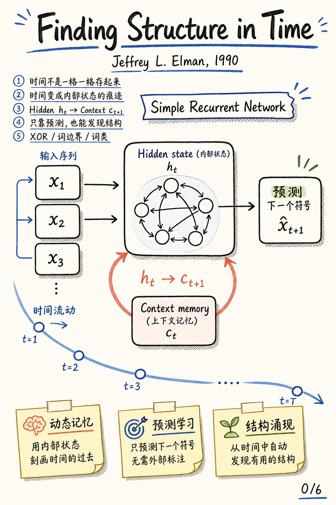
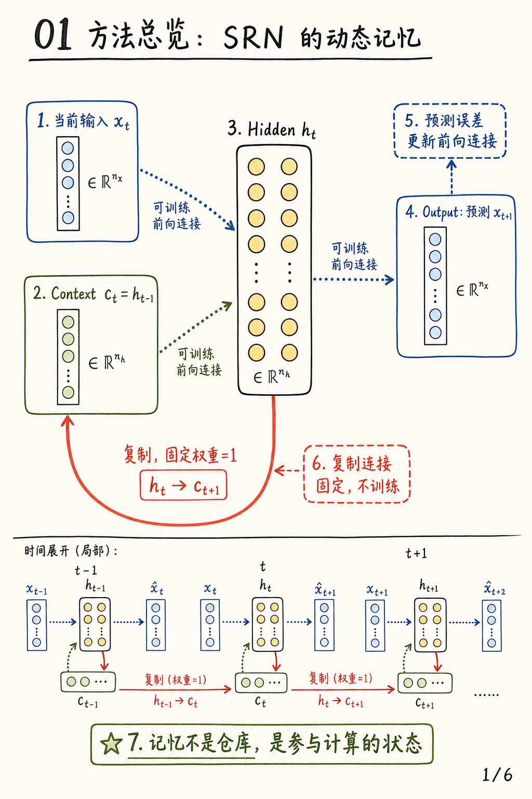
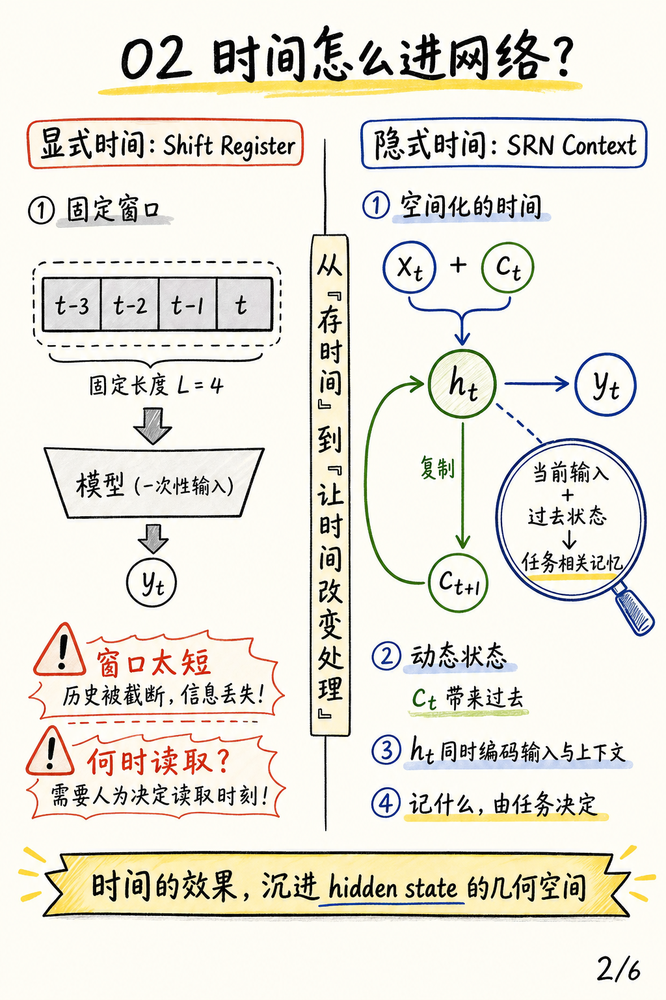
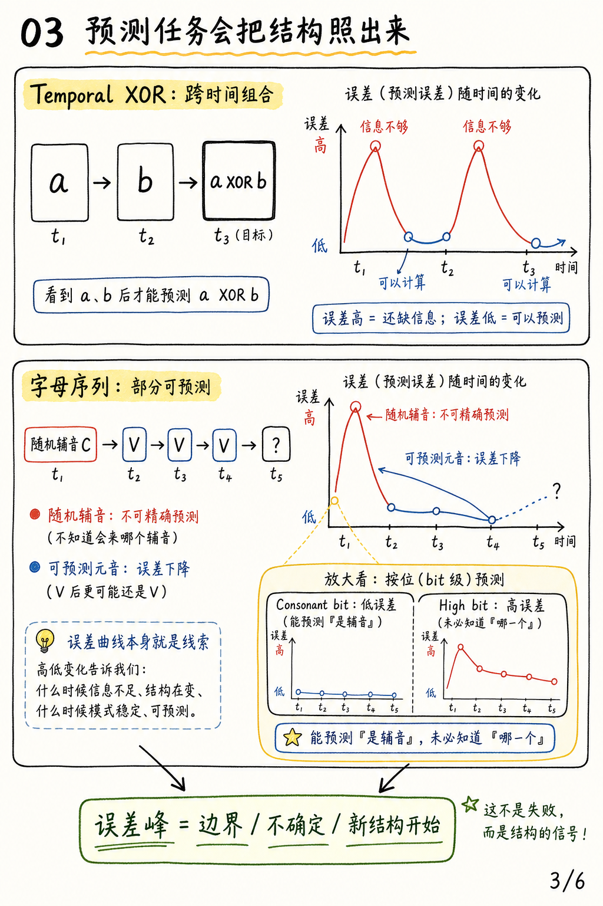
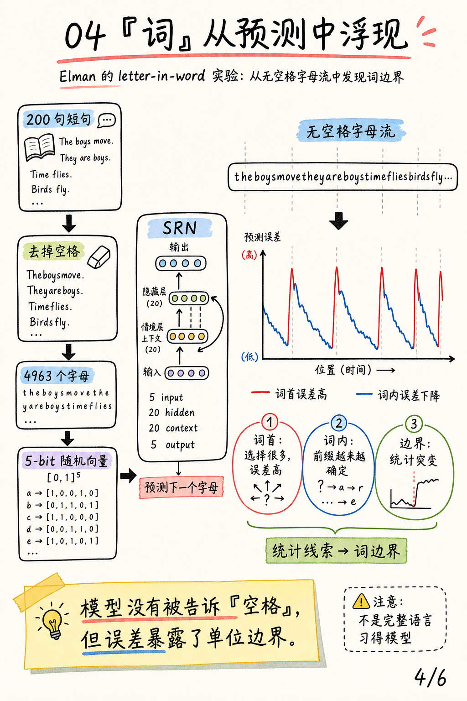
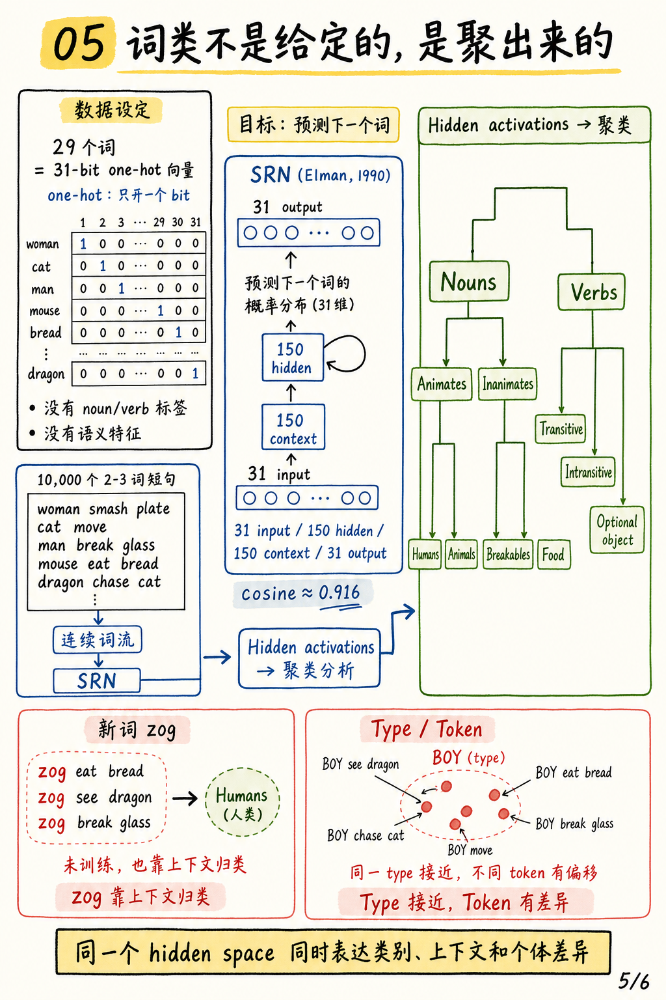

# Finding Structure in Time 动态记忆图解

论文：[Finding Structure in Time](https://doi.org/10.1207/s15516709cog1402_1)

作者：Jeffrey L. Elman

期刊：Cognitive Science, 1990

### 一句话总结

这篇论文的核心想法是：时间不必被显式塞进固定窗口，网络可以把上一时刻的 hidden state 复制到 context units，让过去作为当前计算的一部分参与下一步预测。只靠预测下一个符号，模型就能从序列中抽出边界、类别和上下文结构。

## 0. 封面：时间藏在状态里

SRN 的漂亮之处在于机制很小：把 `h_t` 复制成下一步的 `c_{t+1}`。但这个小回环让网络开始拥有动态记忆，时间变成内部状态的痕迹。

## 1. 方法总览：SRN 的动态记忆

Simple Recurrent Network 在当前输入 `x_t` 之外，还接收上一时刻 hidden state 的副本 `c_t = h_{t-1}`。网络输出对下一步 `x_{t+1}` 的预测，预测误差更新前向连接；hidden 到 context 的复制连接固定权重为 1。关键点是：记忆不是一个独立仓库，而是参与下一步计算的状态。

## 2. 时间怎么进网络？

传统的 shift register 把时间空间化成固定长度窗口，容易遇到窗口长度和读取时机的问题。SRN 则把过去压缩到 context 中，让当前输入和过去状态共同塑造 hidden representation。时间的作用沉进了 hidden state 的几何空间。

## 3. 预测误差暴露结构

Temporal XOR 和字母序列实验都说明，误差曲线不是简单的失败记录。误差高的位置往往表示信息不足、边界或新结构开始；误差低的位置表示序列中存在可利用的规律。网络还能做部分预测，例如知道“接下来是辅音”，但不一定知道“具体是哪一个辅音”。

## 4. 从无空格字母流发现词边界

在 letter-in-word 实验中，句子被拼成无空格字母流，每个字母用随机向量表示，SRN 只做下一字母预测。词首选择空间大，误差高；词内前缀越来越确定，误差下降。模型没有被明确告知“空格”，但误差的统计突变暴露了单位边界。

## 5. 词类、zog 与 type/token

在词序实验中，每个词是 31-bit one-hot 编码，编码本身不含名词、动词或语义类别信息。网络通过预测下一个词的概率分布，在 hidden activations 中形成可聚类结构：Nouns/Verbs、Animates/Inanimates、Humans/Animals 等层级会浮现出来。新词 `zog` 即使不训练，只要出现在类似 `man` 的上下文中，也会靠上下文落到 human noun 附近。type/token 的差异也能在同一个 hidden space 中表达：同一词的不同出现彼此接近，但会因上下文产生细微偏移。

## 3 个核心要点

1. **时间表示**：时间不必显式编码成输入窗口；它可以通过内部状态的连续变换影响处理。
2. **学习信号**：下一步预测是很强的自监督信号，能把序列中的边界、规律和类别关系显露出来。
3. **表征空间**：分布式 hidden representation 可以同时表达类别、上下文和个体差异，这为词类发现与 type/token 区分提供了连接主义解释。
