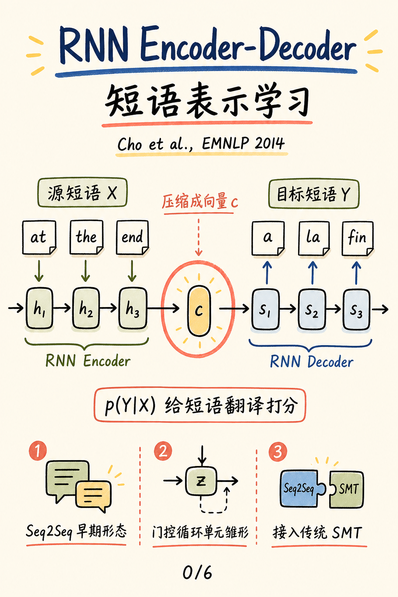
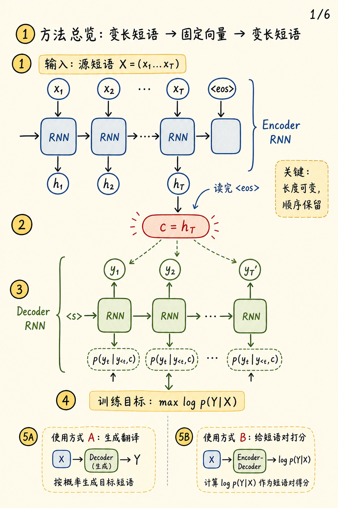
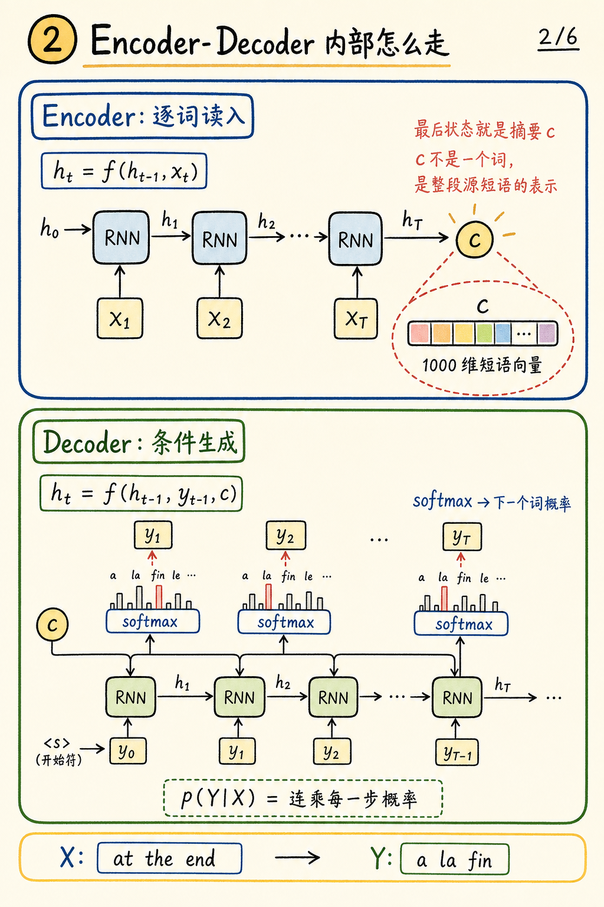
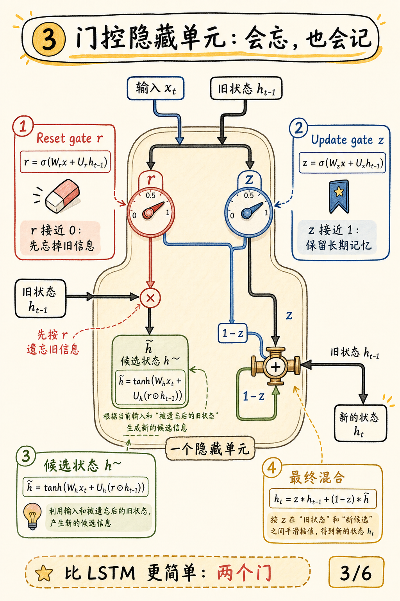
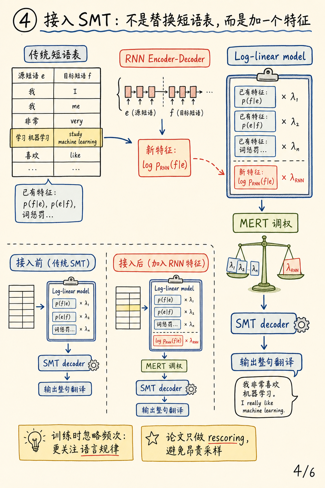
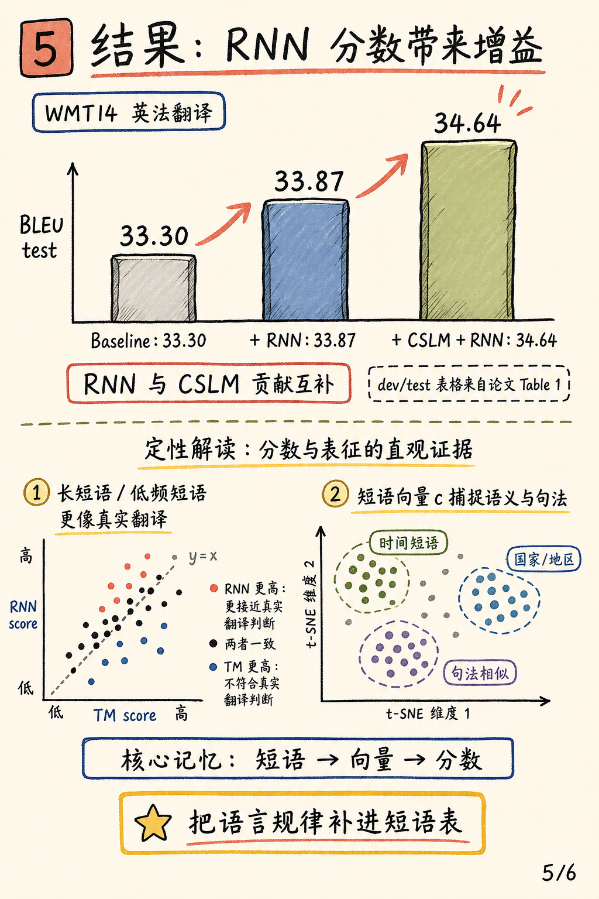

# Learning Phrase Representations using RNN Encoder-Decoder for Statistical Machine Translation 图解

论文：[Learning Phrase Representations using RNN Encoder-Decoder for Statistical Machine Translation](https://arxiv.org/abs/1406.1078)

作者：Kyunghyun Cho, Bart van Merrienboer, Caglar Gulcehre, Dzmitry Bahdanau, Fethi Bougares, Holger Schwenk, Yoshua Bengio

会议：EMNLP 2014

### 一句话总结

这篇论文把源短语压缩成连续向量 `c`，再用另一个 RNN 解码或打分目标短语，并把 `p(Y|X)` 作为传统短语翻译系统里的新增特征。它也是早期 Seq2Seq 和 GRU 思想的重要节点。

## 0. 封面

论文主线很清楚：源短语 `X` 进入 encoder，被压缩成上下文向量 `c`，再由 decoder 生成目标短语 `Y`，同时得到短语翻译概率 `p(Y|X)`。

## 1. 方法总览

RNN Encoder-Decoder 学习的是条件概率 `p(Y|X)`。训练时最大化短语对的条件 log-likelihood；训练后既可以生成目标短语，也可以给已有短语对打分。

## 2. Encoder-Decoder 内部流程

encoder 逐词更新隐藏状态，读到 `<eos>` 后把最后状态作为 `c`。decoder 每一步都在 `c` 和前一个目标词条件下预测下一个词，所以整句概率就是每一步词概率的连乘。

## 3. 门控隐藏单元

论文提出的隐藏单元有两个门：`reset gate r` 控制旧状态是否参与候选状态，`update gate z` 控制新旧状态如何混合。这个结构后来常被视为 GRU 的早期形式。

## 4. 接入传统 SMT

论文没有直接替换短语表，而是把 `log p_RNN(f|e)` 作为 log-linear model 的一个新增特征，再和传统短语概率、词惩罚等特征一起用 MERT 调权。

## 5. 关键结果

在 WMT14 英法翻译上，test BLEU 从 baseline `33.30` 提升到 `+RNN 33.87`，再到 `+CSLM+RNN 34.64`。定性分析也显示，RNN 分数更像是在捕捉语言规律，而不只是复现短语表频次。

## 3 个核心要点

1. **结构贡献**：用 encoder 把变长源短语映射成固定向量 `c`，再用 decoder 条件生成目标短语。
2. **机制贡献**：提出带 reset/update gate 的隐藏单元，让 RNN 更容易学习“该忘什么、该保留什么”。
3. **系统贡献**：把神经短语分数作为传统 SMT 的额外特征，带来可测的 BLEU 提升，并与 CSLM 互补。
