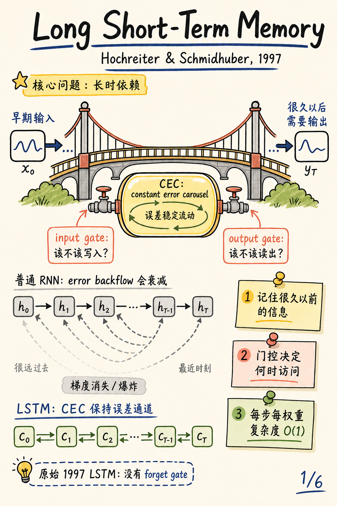
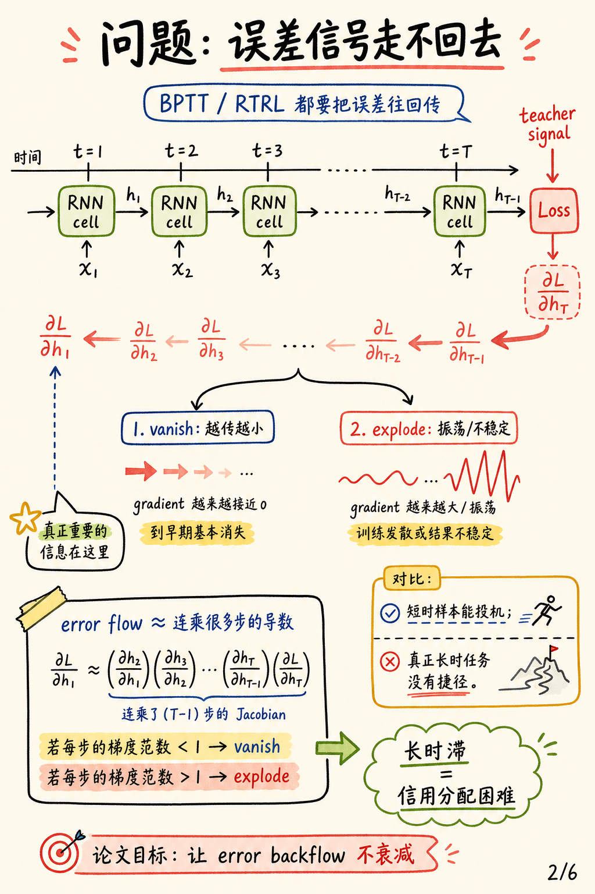
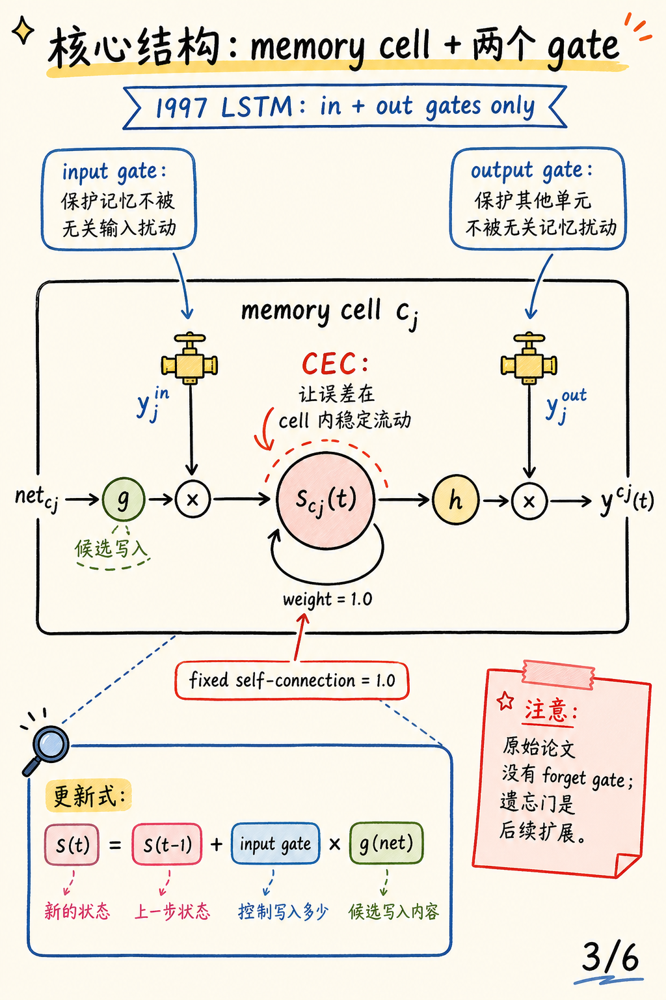
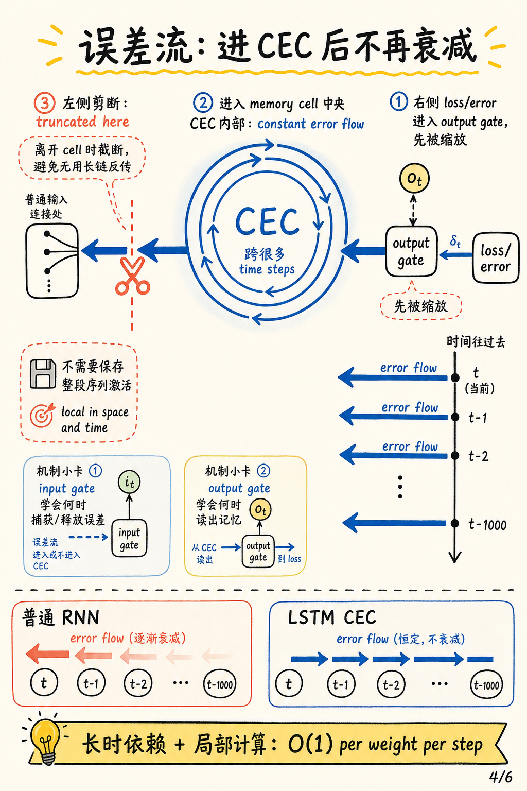
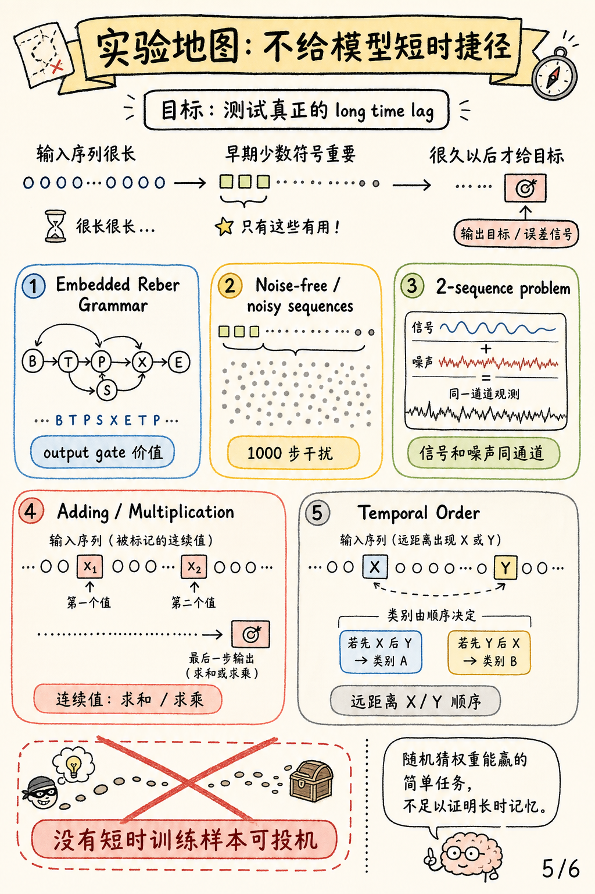
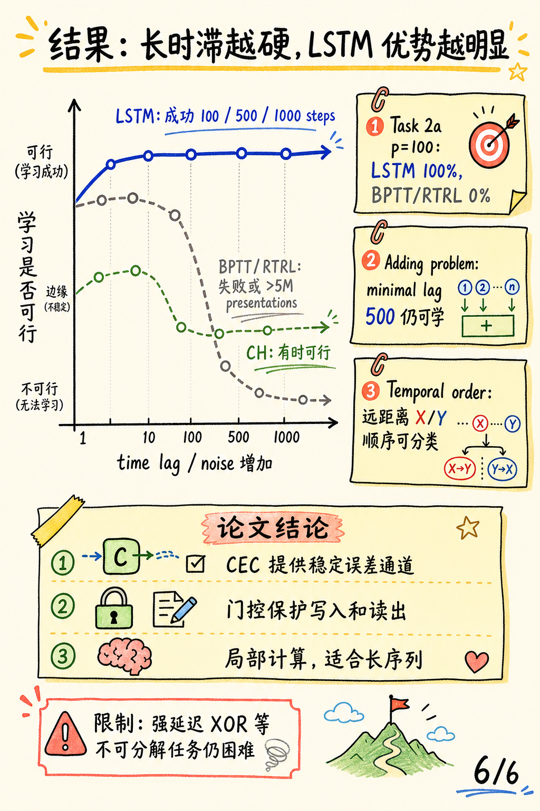

# Long Short-Term Memory 论文图解

论文：[Long Short-Term Memory](https://ieeexplore.ieee.org/abstract/document/6795963)

作者：Sepp Hochreiter, Jürgen Schmidhuber

期刊：Neural Computation, 1997

### 一句话总结

这篇论文用 **constant error carousel**（CEC）让误差在 memory cell 内沿固定自连接稳定流动，再用 **input gate** 和 **output gate** 控制什么时候写入、什么时候读出，从而让 RNN 能学习普通 BPTT/RTRL 很难处理的长时依赖。

## 0. 封面

论文主线很直接：普通 RNN 的 error backflow 会随着时间跨度变长而衰减或爆炸；LSTM 的目标是给误差开一条更稳定的内部通道。

## 1. 普通 RNN 的问题

BPTT 和 RTRL 都需要把误差沿时间往回传。时间跨度越长，误差越容易在连乘导数中指数级衰减或爆炸，早期关键输入拿不到足够清晰的训练信号。

## 2. 原始 LSTM 的 memory cell

原始 LSTM 的核心是带固定自连接的 memory cell：自连接权重为 `1.0`，构成 CEC。input gate 保护记忆不被无关输入扰动，output gate 保护其他单元不被当前无关记忆扰动。

一个容易混淆但很重要的历史细节：**1997 年这篇原始 LSTM 论文没有 forget gate**。遗忘门是后续扩展，不应直接套用现代三门 LSTM 来解释这篇论文。

## 3. CEC 内的误差流

误差进入 memory cell 后，可以沿着 CEC 的内部状态稳定流过很多 time steps；当误差试图离开 cell 回到普通连接时才被截断。这个设计让 LSTM 同时获得长时信用分配能力和局部计算复杂度。

## 4. 实验任务地图

论文不是只在一个 benchmark 上报分数，而是构造多类任务来排除“短时捷径”：噪声干扰、连续值存储、加法/乘法、以及远距离符号顺序分类。很多设置没有短时训练样本可投机，逼模型真正处理 long time lag。

## 5. 关键结果

当时间滞后和噪声变强时，LSTM 仍能学习；BPTT/RTRL 在长时滞任务上很快失败或训练量不可行。论文也保持了清醒的限制意识：强延迟 XOR 等不可分解任务仍然困难。

## 3 个核心要点

1. **CEC 是核心发明**：固定自连接让误差在 memory cell 内保持稳定，而不是一路衰减。
2. **两个门解决访问冲突**：input gate 控制写入，output gate 控制读出，避免无关输入和无关记忆互相干扰。
3. **原始 LSTM 不等于现代教材版**：这篇 1997 论文没有 forget gate，理解时要回到 CEC + input/output gate 的历史结构。
