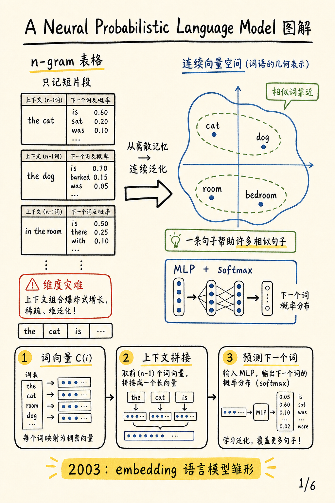
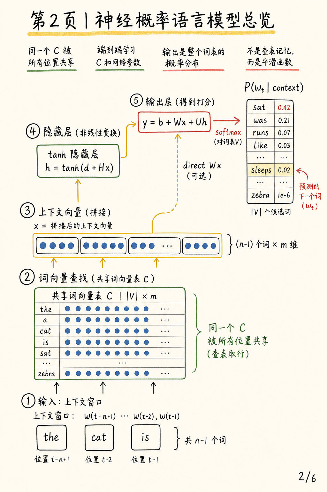
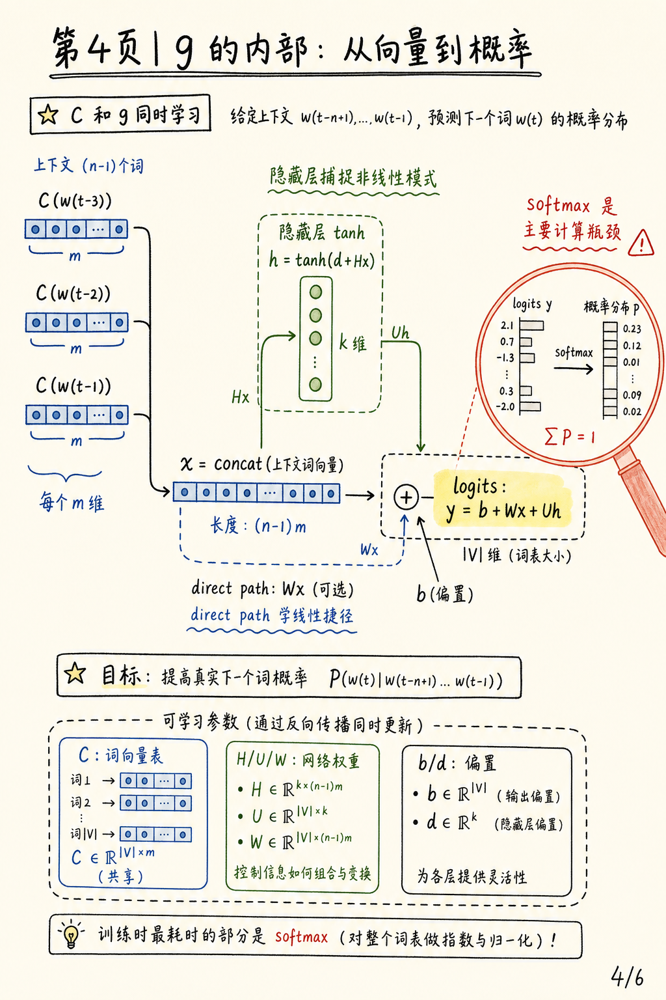
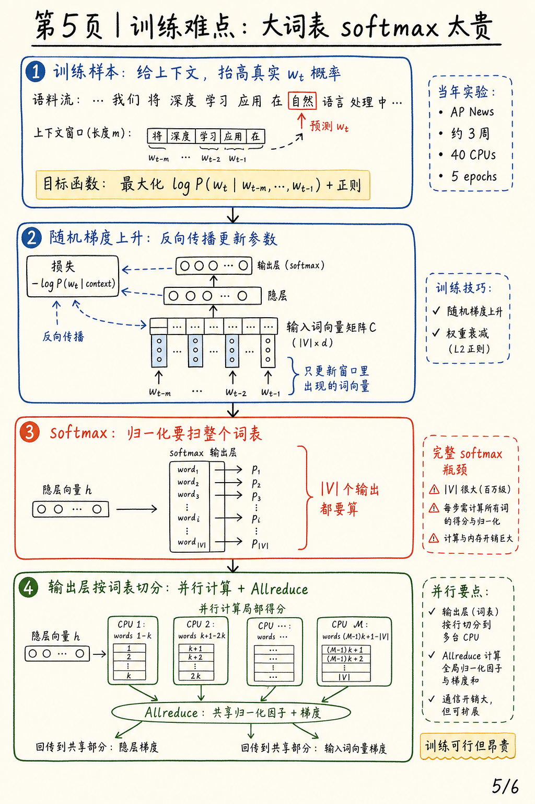
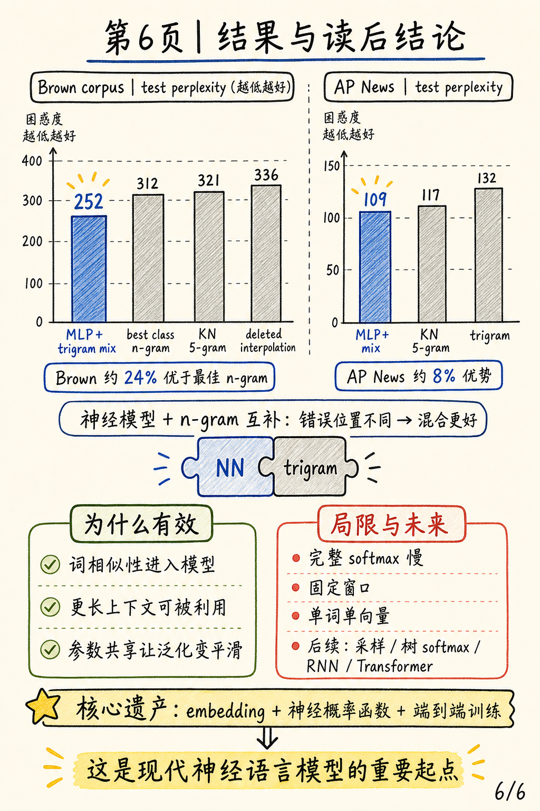

# A Neural Probabilistic Language Model 深度解读

论文：[A Neural Probabilistic Language Model](https://jmlr.org/papers/volume3/bengio03a/bengio03a.pdf)，Yoshua Bengio, Réjean Ducharme, Pascal Vincent, Christian Jauvin，JMLR 2003。

代码状态：论文没有给出官方开源仓库。我检索到一个非官方 MATLAB 复现 [selimfirat/neural-probabilistic-language-model](https://github.com/selimfirat/neural-probabilistic-language-model)，下面的源码对应只把它作为参考实现，不把它误认为原论文代码。

<div class="summary-box">
  <strong>一句话总结：</strong>这篇论文把语言模型从“统计短片段出现次数”推进到“学习词的连续向量表示，再用光滑神经网络预测下一个词”：它不是只改了一个模型结构，而是把词嵌入、神经概率建模、联合训练和大规模 softmax 工程问题放进了同一个框架里。
</div>

## 图解阅读笔记：6 张图先抓主线

这组图解按论文的方法逻辑来读：先看它如何从 n-gram 的离散记忆转向连续向量空间，再看模型结构、泛化机制、训练瓶颈和实验结果。

### 1. 从 n-gram 到 embedding 语言模型



这篇论文的历史位置，是把语言模型从“查离散短片段表格”推进到“词向量 + 神经概率函数”。它没有发明今天意义上的大语言模型，但已经把 embedding、上下文向量、MLP 和 softmax 放在了同一条端到端训练链路里。

### 2. 神经概率语言模型总览



模型先用共享词向量表 `C` 查出上下文中每个词的稠密向量，再把这些向量拼接成 `x`，经过隐藏层和可选 direct path，最后用 softmax 得到整个词表上的下一个词概率分布。

### 3. 泛化机制：一句话影响一片邻居


论文最核心的直觉在这里：如果 `cat` 和 `dog`、`room` 和 `bedroom` 在向量空间里靠近，那么一个训练句子不只提高自身概率，也会提高许多语义和语法相近句子的概率。

### 4. `g` 的内部：从向量到概率



概率函数 `g` 可以拆成两条路径：隐藏层路径捕捉非线性组合，direct path 学更直接的线性映射。两者汇入 logits 之后，再通过 softmax 归一化为下一个词概率。

### 5. 训练难点：大词表 softmax 太贵



训练目标是最大化真实下一个词的 log probability，同时更新词向量和网络权重。真正昂贵的是完整 softmax：每一步都要扫整个词表，因此论文专门讨论了把输出层按词表切分到多 CPU 上并行计算。

### 6. 结果与读后结论



实验上，神经模型在 Brown 和 AP News 上都优于强 n-gram 基线；与 trigram 混合还能继续提升，说明神经模型和 n-gram 的错误模式有互补性。

## 1. 研究背景与动机

统计语言模型的目标，是给一个词序列分配概率。若一句话写作 $w_1,w_2,\ldots,w_T$，最自然的分解方式是把整句概率写成一串条件概率的乘积：

$$
\hat{P}(w_1^T)=\prod_{t=1}^{T}\hat{P}(w_t\mid w_1^{t-1})
$$

这条公式说的是：要评估一整句话有多可能出现，可以逐词预测“在前面所有词已经出现的情况下，下一个词是什么”。这也是从 n-gram 到 Transformer 语言模型都没有离开的基本问题。

困难在于词是离散变量，而且词表很大。论文在引言中用一个极端数字说明这种离散组合爆炸：如果词表大小是 100,000，要建模 10 个连续词的联合分布，潜在组合量接近 $100000^{10}$。这就是论文反复强调的 <q>curse of dimensionality</q>：训练集中出现过的句子只是巨大句子空间里的极小部分。

传统 n-gram 模型通过马尔可夫近似把长历史截断，只看最近 $n-1$ 个词：

$$
\hat{P}(w_t\mid w_1^{t-1})\approx \hat{P}(w_t\mid w_{t-n+1}^{t-1})
$$

人话解释：模型不再试图记住所有历史，而是查“最近几个词”构成的上下文表。例如 trigram 只看前两个词。这让统计估计变得可行，却牺牲了长距离上下文，也无法知道 dog 和 cat、room 和 bedroom 在语义或句法上有相近角色。

n-gram 的泛化方式，本质上是把训练集中见过的一元、二元、三元短片段“拼接”到新句子里。这个思路在工程上非常强，尤其结合 deleted interpolation、Kneser-Ney smoothing、class-based n-gram 后，长期是语音识别和信息检索里的主力。但它对“相似词”没有天然连续性：见过 “The cat is walking in the bedroom”，并不会自动高效地泛化到 “A dog was running in a room”。

Bengio 等人的出发点很清楚：如果每个词不只是一个符号，而是一个可学习的连续向量，那么相似词就可以在向量空间中靠近；如果概率函数又是一个对输入向量平滑变化的函数，那么一个训练句子就能提高许多相邻句子的概率。论文结论中把这种思想称为用分布式表示反击维度灾难，因为 <q>each training sentence informs the model</q> about many neighboring sentences。

## 2. 预备知识

**困惑度**（perplexity）是本文报告的核心指标。若模型对测试集真实词给出的平均概率越高，平均负对数似然越低，困惑度越低。直观地说，困惑度可以理解为模型在每一步“等效地犹豫于多少个候选词之间”。困惑度 252 比 336 更好，意味着模型在真实文本上更少意外。

**分布式表示**（distributed representation）不是 one-hot 编码。one-hot 用一个维度表示一个词，词与词之间几乎没有共享结构；分布式表示用 $m$ 个实数共同表示一个词，$m$ 远小于词表大小 $|V|$。一个维度不对应一个确定标签，而是许多潜在语义、句法或共现属性的混合。

**softmax** 把每个候选词的未归一化分数 $y_i$ 变成概率。它保证所有词的概率为正且总和为 1，但代价是每次都要对词表里的所有候选词求和。这个代价正是本文工程部分最吃力的地方。

## 3. 方法总览

论文把语言模型函数拆成两个部分。第一部分是查表函数 $C$，把词表中每个词 $i$ 映射为一个 $m$ 维实向量：

$$
C(i)\in\mathbb{R}^{m}
$$

这里 $C$ 在实现上就是一个 $|V|\times m$ 的矩阵。矩阵第 $i$ 行是词 $i$ 的可训练词向量。论文 Figure 1 展示的 “Matrix C look-up Table” 就是后来深度学习框架里 embedding layer 的祖先形态。

第二部分是概率函数 $g$。它接收上下文词向量的拼接，输出下一个词的条件概率分布。论文把组合形式写成：

$$
f(i,w_{t-1},\ldots,w_{t-n+1})
=g(i,C(w_{t-1}),\ldots,C(w_{t-n+1}))
$$

这条公式是整篇论文的核心：模型不直接把离散词组合映射到概率，而是先把上下文词映射到连续空间，再在连续空间里学习条件分布。

<pre class="mermaid">flowchart LR
    Context["context words"] --> Lookup["shared C lookup"]
    Lookup --> X["concat vector x"]
    X --> Hidden["tanh hidden layer"]
    X --> Direct["optional direct W"]
    Hidden --> Logits["logits y"]
    Direct --> Logits
    Logits --> Softmax["softmax over V"]
    Softmax --> Next["next word distribution"]
</pre>

训练目标是最大化训练语料上的正则化平均对数似然：

$$
L=\frac{1}{T}\sum_t \log f(w_t,w_{t-1},\ldots,w_{t-n+1};\theta)+R(\theta)
$$

人话解释：模型每看到一个真实下一个词，就调整参数，让这个真实词的预测概率变大；$R(\theta)$ 是正则项，用来抑制过拟合。论文实验中对神经网络权重和词向量矩阵 $C$ 使用 weight decay，但不惩罚偏置。

## 4. 创新一：联合学习词向量和语言模型

本文之前，已经有词聚类、LSI、信息检索中的向量空间表示等方法。区别在于，这篇论文不是先在另一个目标上学好词表示，再把它塞进语言模型；它把词表示 $C$ 和概率函数 $g$ 放在同一个似然目标下联合训练。

这个选择非常关键。若词向量是为了文档共现或词类聚类而学，它未必最适合预测下一个词；而本文的 $C$ 是被语言建模误差直接塑形的。哪个词应该靠近、哪些维度该表达句法或语义相似性，不由人工定义，而由“能否提升真实下一个词概率”来决定。

这也是为什么论文强调分布式表示可以提供组合泛化。假设 cat 和 dog 的向量接近，walking 和 running 的向量接近，bedroom 和 room 的向量接近；由于后续网络是连续且相对平滑的，一个训练句子附近的一大批替换句也会获得更高概率。n-gram 必须见过某些短片段，神经模型则可以通过向量邻近关系跨片段共享统计强度。

这种思想后来成为 word embedding、NNLM、RNNLM、word2vec、Transformer token embedding 的共同底座。当然，后来的模型在上下文建模和训练效率上远远超过本文，但“词的表示应该随预测目标一起学习”这个方向，在 2003 年已经被这篇论文表达得很完整。

## 5. 创新二：用光滑神经网络表示条件概率

论文主要实验采用一个带单隐层的前馈神经网络。上下文词向量先拼接成输入 $x$：

$$
x=(C(w_{t-1}),C(w_{t-2}),\ldots,C(w_{t-n+1}))
$$

这里的 $x$ 长度为 $(n-1)m$。如果模型阶数 $n=5$，每个词向量 $m=60$，则输入层就是最近 4 个词向量拼成的 240 维向量。

网络对词表中每个候选词输出一个 logit，即未归一化对数概率：

$$
y=b+Wx+U\tanh(d+Hx)
$$

这条公式对应论文式 (1)。$b$ 是输出偏置，$W$ 是从词向量输入到输出的可选直接连接，$H$ 和 $d$ 定义 tanh 隐层，$U$ 把隐层映射到词表大小的输出空间。若不使用直接连接，$W$ 被设为 0。

再经过 softmax 得到下一个词概率：

$$
\hat{P}(w_t\mid w_{t-1},\ldots,w_{t-n+1})
=\frac{e^{y_{w_t}}}{\sum_i e^{y_i}}
$$

这条公式的直觉是：真实词 $w_t$ 的分数越高，它的概率越高；但概率还要和词表里所有词的分数竞争。Figure 1 在视觉上也把这个计算瓶颈标出来：大部分计算发生在 softmax 输出层。

论文列出的参数集合为：

$$
\theta=(b,d,W,U,H,C)
$$

其中 $C$ 是词向量矩阵，其他参数是概率函数。参数量为 $|V|(1+nm+h)+h(1+(n-1)m)$，主导项是 $|V|(nm+h)$。这比枚举所有词序列组合要好得多，因为它随词表和上下文窗口线性增长，而不是随组合数指数增长。

训练使用随机梯度上升：

$$
\theta\leftarrow\theta+\epsilon
\frac{\partial \log \hat{P}(w_t\mid w_{t-1},\ldots,w_{t-n+1})}{\partial \theta}
$$

人话解释：每个训练位置都提供一次信号，把真实下一个词的概率往上推。由于输入窗口只包含少量词，只有这些词对应的 $C(w)$ 行需要被更新；没有出现在当前上下文里的词向量无需访问。

## 6. 创新三：把可行性问题放到论文中心

这篇论文不只是提出模型，还认真处理了当时很现实的训练代价。n-gram 查询某个条件概率时，不必显式计算全词表的所有概率；但神经 softmax 需要对 $|V|$ 个词求输出分数和归一化常数。

在 AP News 实验设置中，词表 $|V|=17,964$，隐藏单元 $h=60$，模型阶数 $n=6$，词向量维度 $m=100$。论文估计单样本计算中，输出层加权和约占 99.7%。这个数字解释了为什么作者选择参数并行：让每个 CPU 负责一块输出词，而不是让每个 CPU 持有完整模型反复同步。

论文的并行算法分为前向和后向两步。每个处理器先为自己负责的词块计算 $y_j$ 和 $p_j=e^{y_j}$，再通过 Allreduce 汇总 softmax 分母 $S$，最后归一化 $p_j/S$。反向传播时，各处理器更新自己词块对应的输出参数，并共享对隐藏层和词向量层的梯度。

从今天看，这段工程讨论很像后来的 vocabulary parallelism、sampled softmax、hierarchical softmax、negative sampling 等效率路线的前史。本文的主模型本身没有解决大词表 softmax 的根本成本，但它把瓶颈定位得非常准确：神经语言模型的统计泛化更强，代价是把困难从稀疏计数表转移到了密集矩阵计算。

## 7. 与 n-gram 基线的差异

论文在 Section 4.1 里给出了 deleted interpolation trigram 的形式：

$$
\hat{P}(w_t\mid w_{t-1},w_{t-2})=
\alpha_0(q_t)p_0+\alpha_1(q_t)p_1(w_t)+\alpha_2(q_t)p_2(w_t\mid w_{t-1})+\alpha_3(q_t)p_3(w_t\mid w_{t-1},w_{t-2})
$$

这条公式的意思是：当 trigram 上下文频率高时，更信任三元统计；当上下文稀疏时，退回 bigram、unigram，甚至均匀分布。权重 $\alpha_i(q_t)$ 由上下文频率分箱决定，并用验证集上的 EM 估计。

这种 n-gram 方案很强，因为它很好地处理了稀疏计数。但它的“相似性”只能通过词类聚类或后退规则间接表达。本文神经模型的相似性则是连续、共享、任务驱动的：cat 和 dog 不必属于同一个硬类别，只要向量空间中接近，就能产生相近预测效果。

论文还测试了与 trigram 的概率混合。多个 MLP 行的 “mix=yes” 都优于对应 “mix=no”。这说明神经模型和 n-gram 犯错位置不同：n-gram 擅长局部固定搭配和频率表，神经模型擅长通过分布式表示跨上下文泛化。二者平均后，困惑度进一步下降。

## 8. 参考实现源码对应

再次强调：下面代码来自非官方 MATLAB 复现，不是 Bengio 等人的原始代码。它的价值在于帮助把论文公式映射成现代读者容易识别的计算流程。

第一段对应论文 Figure 1 和式 (1)：one-hot 上下文词先查 embedding 矩阵 $C$，拼接为 $x$；再过隐层；最后 softmax 输出下一个词分布。

```matlab
% /tmp/paper_code_bengio_nplm/nlpm.m:192-205
e = [ew.' * x1; ew.' * x2; ew.' * x3];
vs = hw.' * [e; 1];
v = logistic(vs);
ys = ow.' * [v; 1];
y = softmax(ys);
```

这里的 `ew` 对应词向量矩阵 $C$，`hw` 对应输入到隐藏层的权重，`ow` 对应隐藏层到输出词表的权重。复现代码用 logistic 激活，而论文主公式用 tanh；这属于实现差异，不改变“embedding lookup → hidden layer → softmax”的结构对应。

第二段对应随机梯度更新：真实 one-hot 目标 `d` 与预测分布 `y` 形成误差信号，再依次更新输出层、隐藏层和 embedding 权重。

```matlab
% /tmp/paper_code_bengio_nplm/nlpm.m:108-123
err = d - y;
ds = dsoftmax(y);
lg_y = ds .* err;
delta_ow = delta_ow + (lr * lg_y * [vs; 1].').';
dl = dlogistic(v);
lg_h = dl .* ow(1:P, :) * lg_y;
delta_hw = delta_hw + (lr * lg_h * [e; 1].').';
lg_e = hw * lg_h;
lg_e = lg_e(1:D);
delta_ew = delta_ew + (lr * lg_e * (x1 + x2 + x3).').';
```

论文算法描述中，当前窗口里的词向量 $C(w_{t-k})$ 被梯度更新；这段代码里的 `delta_ew` 就是 embedding 矩阵的累计更新。复现代码把三个上下文词的 one-hot 向量相加来更新词向量，这是一种简化实现；论文原算法会按输入位置块更新对应的 $C(w_{t-k})$。

## 9. 实验设置

论文使用两个语料。Brown corpus 有 1,181,041 个词，前 800,000 个用于训练，接着 200,000 个用于验证，最后 181,041 个用于测试。原始词表 47,578，低频词合并后降到 $|V|=16,383$。

AP News 语料来自 1995 和 1996 年 Associated Press 新闻文本，训练集约 13,994,528 个词，验证集 963,138 个词，测试集 963,071 个词。原始词表 148,721，经小写化、数字归一化、低频词和专名映射后降到 $|V|=17,964$。

训练细节也很能反映时代特征。Brown 上约 10 到 20 个 epoch 后收敛，使用 early stopping；AP News 上只跑了 5 个 epoch，却已经花了约三周和 40 个 CPU。这个成本解释了为什么论文把并行实现写成一个独立章节，而不是只在附录里略过。

## 10. 实验结果一：Brown corpus

| 模型 | 上下文阶数 n | 隐藏单元 h | 词向量维度 m / 类数 | 混合 trigram | 验证困惑度 | 测试困惑度 |
| --- | ---: | ---: | ---: | --- | ---: | ---: |
| MLP1 | 5 | 50 | 60 | 否 | 284 | 268 |
| MLP2 | 5 | 50 | 60 | 是 | 275 | 257 |
| MLP6 | 5 | 50 | 30 | 是 | 273 | 259 |
| MLP8 | 3 | 50 | 30 | 是 | 284 | 270 |
| MLP10 | 5 | 100 | 30 | 是 | 265 | 252 |
| Deleted interpolation trigram | 3 | - | - | - | 352 | 336 |
| Kneser-Ney back-off | 5 | - | - | - | 332 | 321 |
| Class-based back-off | 3 | - | 500 | - | 326 | 312 |

Table 1 最强的结论是：最佳神经模型 MLP10 的测试困惑度为 252，显著低于 deleted interpolation trigram 的 336，也低于最佳 class-based n-gram 的 312 和 Kneser-Ney 5-gram 的 321。若按“基线相对神经模型高多少”看，deleted interpolation trigram 高 33%，最佳 class-based n-gram 高约 24%。这不是小幅调参收益，而是建模假设变化带来的差距。

Table 1 还支持三个更细的判断。第一，隐藏层有用：例如 MLP1 测试困惑度 268，去掉隐藏单元的 MLP3 为 310。第二，更长上下文对神经模型有用：同样 $h=50,m=30$ 且混合 trigram 时，$n=5$ 的 MLP6 测试困惑度 259，$n=3$ 的 MLP8 为 270；而 n-gram 从 3 到 5 阶几乎没有带来收益。第三，混合 trigram 始终改善神经模型，例如 MLP1 从 268 降到 MLP2 的 257。

为什么更长上下文对神经模型更有效？因为 n-gram 的高阶上下文更稀疏，很多 5-gram 组合在训练集里根本没出现；神经模型虽然也只看固定窗口，但上下文词先进入共享向量空间，模型可以把相似上下文映射到相近状态，从而从更长窗口中获得有用信息而不被稀疏性完全压垮。

## 11. 实验结果二：AP News

| 模型 | 上下文阶数 n | 隐藏单元 h | 词向量维度 m | 混合 trigram | 验证困惑度 | 测试困惑度 |
| --- | ---: | ---: | ---: | --- | ---: | ---: |
| MLP10 | 6 | 60 | 100 | 是 | 104 | 109 |
| Deleted interpolation trigram | 3 | - | - | - | 126 | 132 |
| Kneser-Ney back-off | 3 | - | - | - | 121 | 127 |
| Kneser-Ney back-off | 4 | - | - | - | 113 | 119 |
| Kneser-Ney back-off | 5 | - | - | - | 112 | 117 |

Table 2 显示，在更大的 AP News 语料上，神经模型测试困惑度 109，优于 Kneser-Ney 5-gram 的 117，也优于 deleted interpolation trigram 的 132。差距比 Brown 上小，但仍然明显；尤其考虑到 AP 只训练了 5 个 epoch，作者没有看到明显过拟合迹象，说明结果并非简单来自过度拟合小数据。

更大的语料也让本文的工程局限更突出。AP 的神经模型需要约三周、40 个 CPU 才完成有限训练。这使得“统计效果更好”和“计算成本更高”同时成立。论文不是轻松宣称神经网络全面胜利，而是在非常诚实地展示：模型把泛化问题做得更优雅，但代价是训练和推理要穿过大词表 softmax。

## 12. Figure 与 Table 的角色

**Figure 1** 是全文方法的压缩图：上下文词索引先查共享矩阵 $C$，再进入 tanh 层和 softmax 层。它的重要性不在画得复杂，而在于明确了三个后来成为标准组件的部件：embedding lookup、非线性上下文组合、全词表归一化。

**Table 1** 是 Brown corpus 上的主证据。它不仅比较最佳困惑度，还通过 MLP1 到 MLP10 的变化展示隐藏层、上下文长度、直接连接和 trigram 混合的影响。因此，Table 1 同时承担“模型胜过基线”和“哪些结构有效”的双重作用。

**Table 2** 是规模证据。它表明本文方法不是只在一百万词级别的小语料上奏效，也能在 1500 万词级别语料上超过 Kneser-Ney。虽然今天看 1500 万词不大，但在 2003 年用全词表神经 softmax 训练，这是非常现实的可行性证明。

## 13. 扩展：能量模型与 OOV

论文 Section 5.1 讨论了一个能量模型变体。主模型只给输入上下文词使用词向量，而输出词主要由输出层参数表示；这意味着输出词之间的语义或句法相似性没有被同样利用。能量模型让输出词也通过 $C(w_t)$ 参与计算。

能量函数写作：

$$
E(w_{t-n+1},\ldots,w_t)=v\cdot\tanh(d+Hx)+\sum_{i=0}^{n-1}b_{w_{t-i}}
$$

这里低能量表示词序列更可能，高能量表示更不可能。对应条件概率通过对候选输出词归一化得到：

$$
\hat{P}(w_t\mid w_{t-1},\ldots,w_{t-n+1})
=\frac{e^{-E(w_{t-n+1},\ldots,w_t)}}{\sum_i e^{-E(w_{t-n+1},\ldots,w_{t-1},i)}}
$$

这类想法与 Hinton 的 products of experts 和最大熵模型有关。它预示了后来很多把输入词和输出词都嵌入同一空间的语言模型思想，也触及 output embedding 和 energy-based modeling 的方向。

能量模型还被作者用于讨论未登录词。若新词 $j\notin V$ 出现在上下文中，可以用当前上下文下其他词向量的概率加权平均初始化：

$$
C(j)\leftarrow \sum_{i\in V}C(i)\hat{P}(i\mid w_{t-1}^{t-n+1})
$$

直觉是：如果某个新词出现在一个上下文里，那么它的初始向量可以靠近“模型本以为可能出现的那些词”。这不是现代子词建模，但已经是从上下文推断未知词表示的早期想法。

## 14. 方法适用边界

本文方法适合需要从离散符号组合中学习平滑泛化的任务。只要符号之间存在可共享的潜在结构，分布式表示就能用有限样本覆盖更多组合。语言尤其适合，因为词有语义相似、句法角色、搭配关系和主题关联。

但本文主模型仍是固定窗口模型。它能把窗口从 trigram 扩到 5-gram 或 6-gram，并在实验中获得收益，却不能自然保留整段历史。作者在未来工作里明确提到 time-delay 或 recurrent neural networks，原因正是固定窗口会漏掉段落主题、篇章结构和长距离依赖。

另一个边界是全词表归一化。模型每预测一个词，都要竞争整个词表。词表一旦从一万级变为百万级，softmax 成本会成为主要障碍。论文提到树结构、只传播部分输出词梯度、重要性采样等方向；后来的 hierarchical softmax、NCE、negative sampling 和 sampled softmax 都沿着这个问题继续走。

## 15. 局限分析

**作者自述局限一：速度。**论文在未来工作中直接指出，训练和识别速度仍需要改进。AP News 实验三周训练 5 个 epoch 的成本已经说明，当时硬件和算法还不足以让这种模型成为轻量替代品。作者后来也提到 importance sampling 可带来 100 倍加速，这说明主论文方案本身还不是最终高效解。

**作者自述局限二：一词一向量处理不了多义词。**论文明确说 <q>polysemous words are probably not well served</q>，因为每个词只对应连续语义空间中的一个点。bank 既可以是银行也可以是河岸，单一向量会混合不同词义。现代上下文化表示，如 ELMo、BERT、GPT 的上下文 token 表示，正是在这个问题上走得更远。

**独立判断一：实验主要证明困惑度，不等于完整应用收益。**论文提到语言模型会影响语音识别、翻译和信息检索，也引用了 speech recognition 的相关工作，但本文主实验本身仍是 perplexity。困惑度是合理代理指标，却不能完全代表下游任务效果、延迟、内存和部署复杂度。

**独立判断二：模型的结构瓶颈很明显。**固定窗口前馈网络无法像 RNN 或 Transformer 那样复用任意长度历史；softmax 输出层没有从根本上避免 $|V|$ 级计算；主模型输出词没有共享输入词的 embedding 结构。这些限制并不削弱论文贡献，反而说明它更像一块地基：把方向铺对了，但上层建筑还要十多年演化。

## 16. 这篇论文的长期意义

从历史位置看，这篇论文的意义不只是“第一个表现好的神经语言模型之一”。更重要的是，它把几个后来深度 NLP 的基本信念组织成可训练、可比较、可工程化的系统：符号要进入连续空间，表示要和任务目标一起学，概率预测要用可微模型端到端优化，大规模计算瓶颈要正面处理。

论文结尾说，未来统计语言模型可以把 <q>tables of conditional probabilities</q> 替换为更紧凑、更平滑的分布式表示。这个判断后来被验证得非常彻底：从 word2vec 到神经机器翻译，从 RNNLM 到 Transformer LM，语言模型越来越少依赖显式计数表，越来越依赖可学习表示和密集计算。

当然，今天再看本文，模型结构很朴素，数据规模很小，训练极慢，也没有注意力机制。但这不影响它的清晰性。它回答的问题依旧尖锐：当离散组合空间巨大、训练样本稀疏时，模型如何把一个观察到的句子经验迁移到大量未见句子？本文的答案是：学习共享的连续表示，并让概率函数在这个空间里平滑泛化。

## 17. 结论

《A Neural Probabilistic Language Model》的核心贡献可以压缩成三点：第一，提出并实证了词的分布式表示可以在语言模型目标下联合学习；第二，用神经网络把上下文词向量映射到全词表条件概率，从而获得比强 n-gram 更好的泛化；第三，认真处理了大词表 softmax 和并行训练问题，证明这种路线在当时硬件条件下虽然昂贵但可行。

如果用今天的眼光给它定位，它不是 Transformer 的直接前身结构，却是神经语言模型思想的关键奠基论文。它让语言模型从“查表和回退”开始转向“表示和泛化”。这一步之后，后来的模型才有空间继续追问更长上下文、更高效率、更大语料和更强生成能力。

<div class="golden">这篇论文真正打开的门，是让语言模型不再只记住哪些词曾经相邻，而是开始学习词与词为什么可以相互替换、相互暗示、相互解释。</div>

## 参考来源

1. Yoshua Bengio, Réjean Ducharme, Pascal Vincent, Christian Jauvin. [A Neural Probabilistic Language Model](https://jmlr.org/papers/volume3/bengio03a/bengio03a.pdf). JMLR, 2003.
2. 非官方参考实现：[selimfirat/neural-probabilistic-language-model](https://github.com/selimfirat/neural-probabilistic-language-model)，其中 README 说明其为 Bengio NPLM 的 MATLAB implementation，核心文件为 `nlpm.m`。
