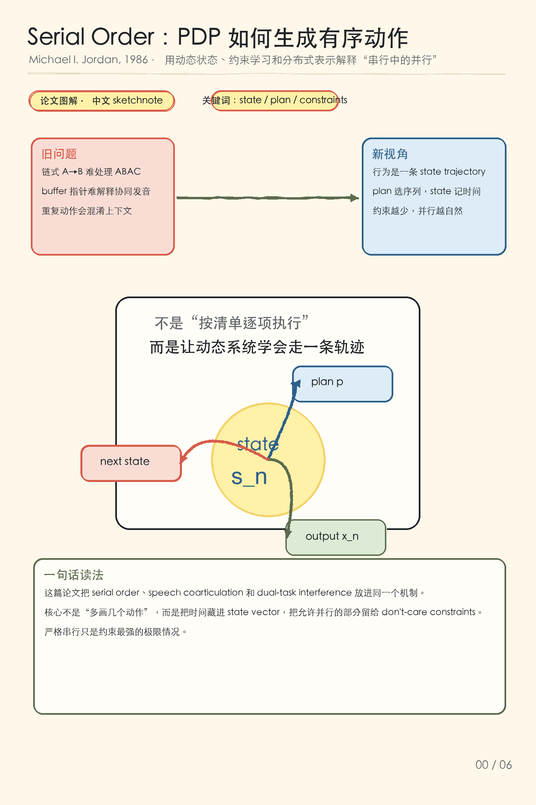
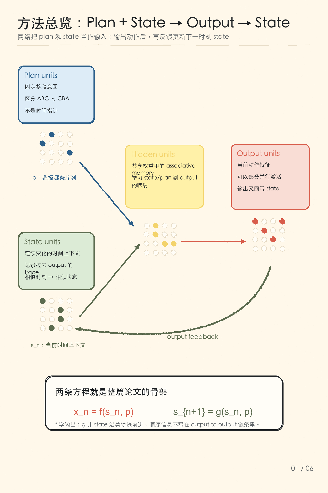
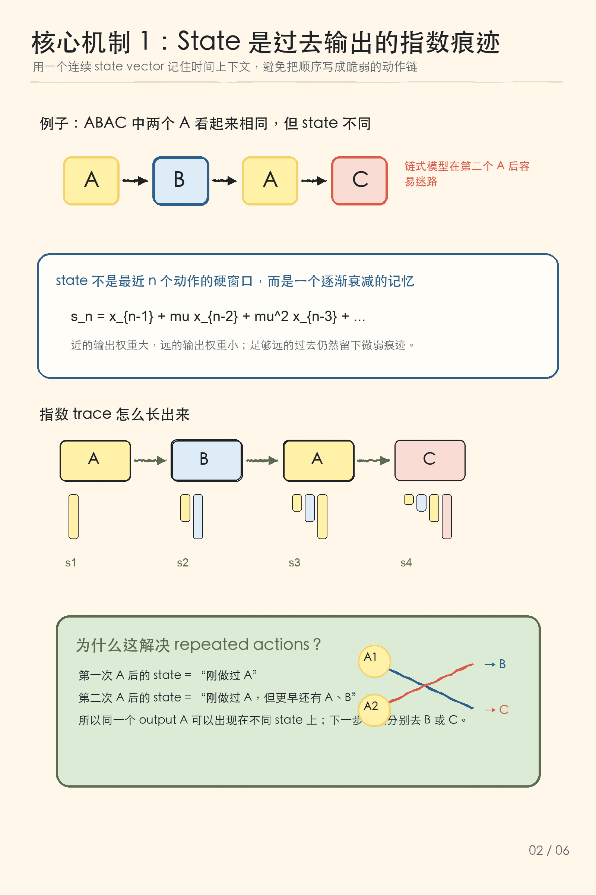
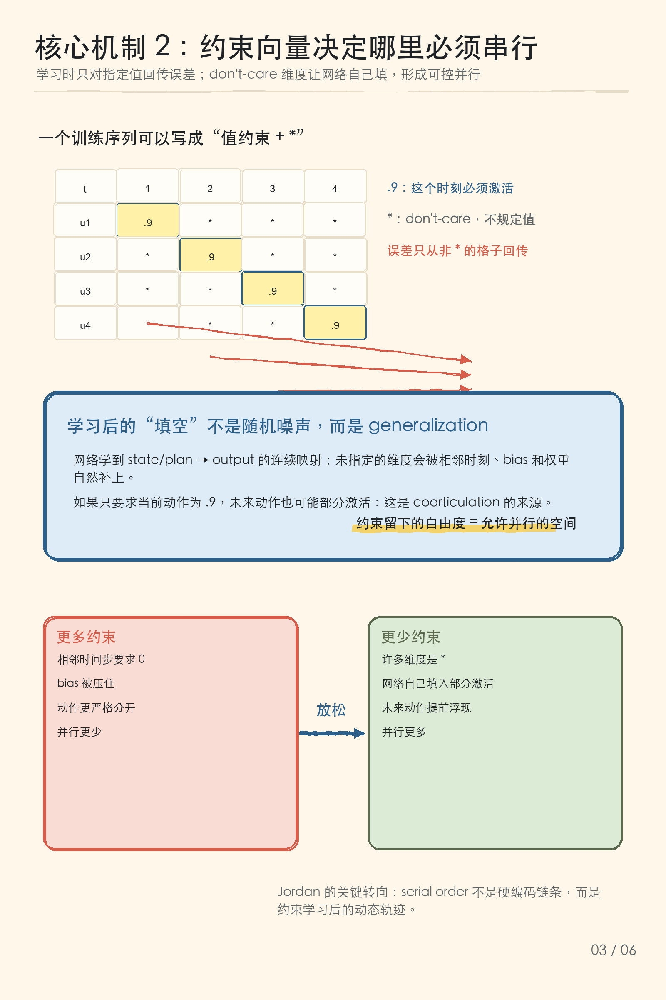
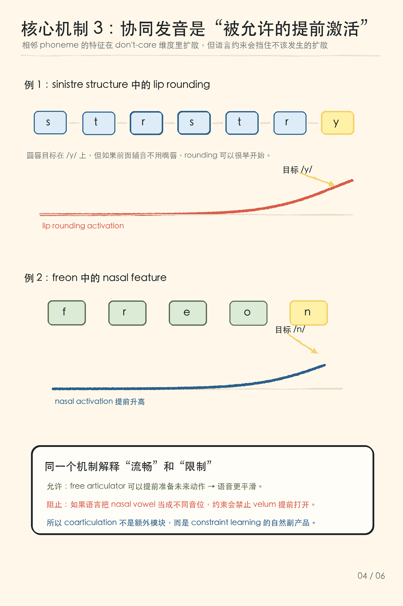
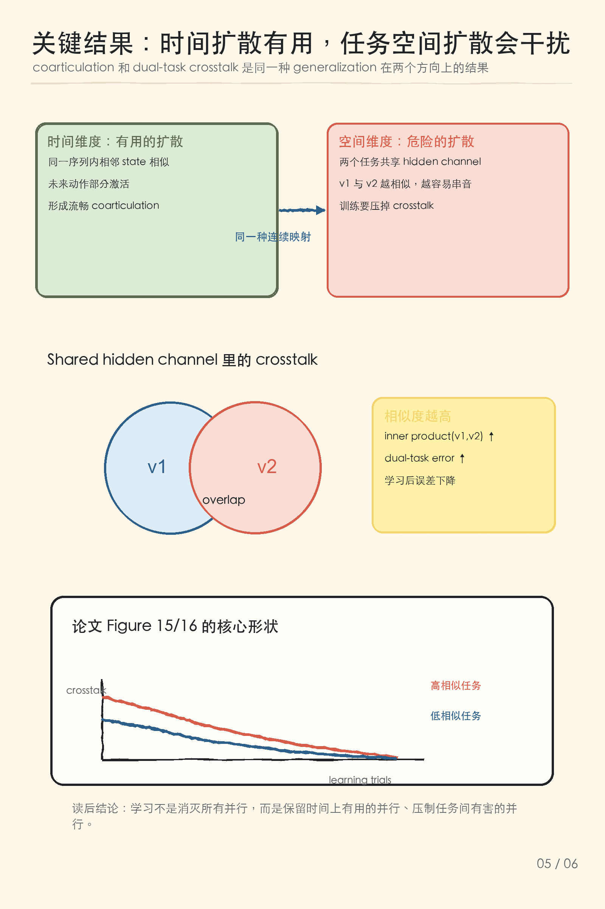

# Serial Order PDP 图解笔记

论文：[Serial Order: A Parallel Distributed Processing Approach](https://cseweb.ucsd.edu/~gary/PAPER-SUGGESTIONS/Jordan-TR-8604-OCRed.pdf)，Michael I. Jordan，Institute for Cognitive Science, UCSD，1986。

  <strong>一句话总结：</strong>这篇论文把 serial order、speech coarticulation 和 dual-task interference 放进同一个连接主义动态系统里：顺序不是写在动作到动作的链条中，而是由 plan 选择序列、state 表示时间上下文、constraint vectors 在学习中限制哪些输出必须严格满足。

## 图解速览

### 1. 串行中的并行

Jordan 要解决的问题不是“网络能不能输出 A-B-C”，而是更难的一组现象：同一个动作可以出现在不同上下文里，未来动作会提前影响当前动作，两个任务并行时又会互相干扰。论文的回答是：把行为看成 state space 里的轨迹，而不是一串显式指令。

### 2. Plan + State → Output → State

网络中有两个关键输入：`plan p` 指定要执行哪条序列，`state s_n` 表示当前时间上下文。输出 `x_n` 产生当前动作特征后，又反馈到 state，形成下一时刻的状态。顺序信息不在 output-to-output 链条里，而在 state trajectory 和 output function 的组合里。

### 3. State 是过去输出的指数痕迹

论文用 exponential trace 解释 state：近处输出权重大，远处输出权重小，但遥远过去仍然留下弱痕迹。这让 repeated actions 变得可处理：ABAC 里的两个 A 可以对应不同 state，所以第一个 A 后能去 B，第二个 A 后能去 C。

### 4. Constraint vectors 与 don't-care

学习时，desired output 不是每个维度都被指定。某些维度要求达到具体值，例如 `.9`；某些维度是 `*`，也就是 don't-care，不回传误差。未指定维度会由网络的连续映射自然填入，这就是并行性出现的空间。约束越多，行为越接近严格串行；约束越少，未来或相邻动作越容易部分激活。

### 5. Coarticulation 是被允许的提前激活

语音协同发音在这篇论文里不是一个额外模块，而是 constraint learning 的自然结果。比如 `sinistre structure` 中，圆唇特征可以在目标元音之前很早开始；`freon` 中，鼻音特征也可以提前升高。但这种提前不是无条件的：如果语言约束把某个提前动作变成音位差异，网络必须学会阻止它。

### 6. Dual-task crosstalk：同一种泛化的反面

coarticulation 是时间维度上有用的扩散；dual-task interference 是任务空间里有害的扩散。两个任务共享 hidden channel 时，如果表征 `v1` 和 `v2` 很相似，就会产生更强 crosstalk。论文模拟显示，任务越相似，初始干扰越大，但通过训练可以把双任务误差降下来。

## 方法拆解

这篇论文最核心的拆分是：**state 和 output 必须分开表示**。如果只用一个 activation 值同时表示“动作顺序”和“动作并行影响”，重复动作、提前影响和上下文变化都会混在一起。Jordan 的方案是给系统两个向量：state vector 负责时间位置和上下文，output vector 负责当前动作特征。

形式上可以把网络读成两条关系：

$$
x_n = f(s_n, p)
$$

$$
s_{n+1}=g(s_n,p)
$$

这里 `p` 是 plan，`s_n` 是状态，`x_n` 是输出动作。`f` 学会在给定 plan 和 state 时输出什么动作；`g` 让状态随时间前进。论文后续的许多现象，都是这两个函数的连续性和学习约束带来的结果。

第二个关键点是 **learning with don't-care conditions**。传统监督学习常常假设每个输出维度都有目标值；Jordan 这里允许目标向量只规定一部分维度。被规定的维度强制满足顺序，被留空的维度让网络利用 generalization 自行填补。这样，严格串行行为就不再是默认状态，而是约束足够强时的极限情况。

第三个关键点是 **相似性结构**。相似 state 会产生相似 output：这既能解释相邻动作之间的平滑过渡，也会解释错误和干扰。时间上相近的 state 相似，于是未来动作能提前浮现；任务空间里两个隐藏表征相似，于是双任务会串音。论文真正漂亮的地方，是把这两类现象当成同一个机制的两个方向。

## 三个读后要点

1. **时间不是程序计数器**：state vector 本身就是时间上下文，顺序由轨迹体现，而不是由显式动作链体现。
2. **并行不是补丁**：coarticulation 来自未约束维度上的自然泛化，严格串行只是更强约束下的结果。
3. **泛化有两面**：相似 state 带来流畅行为，相似任务表征也带来 crosstalk；学习的作用是保留前者、压制后者。
