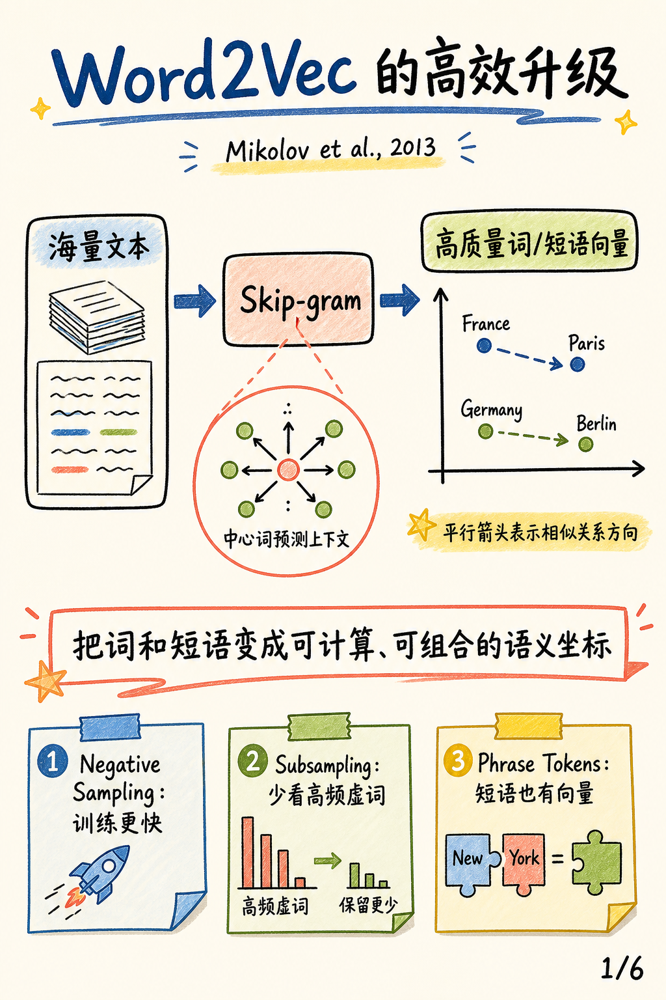
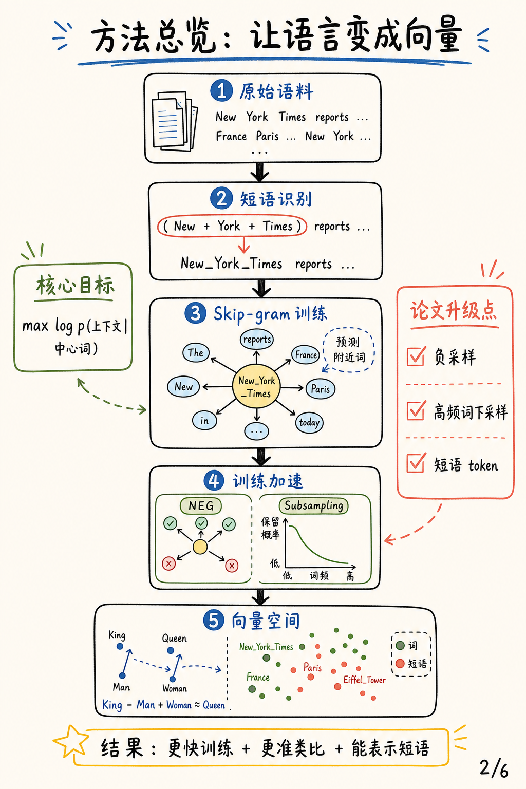
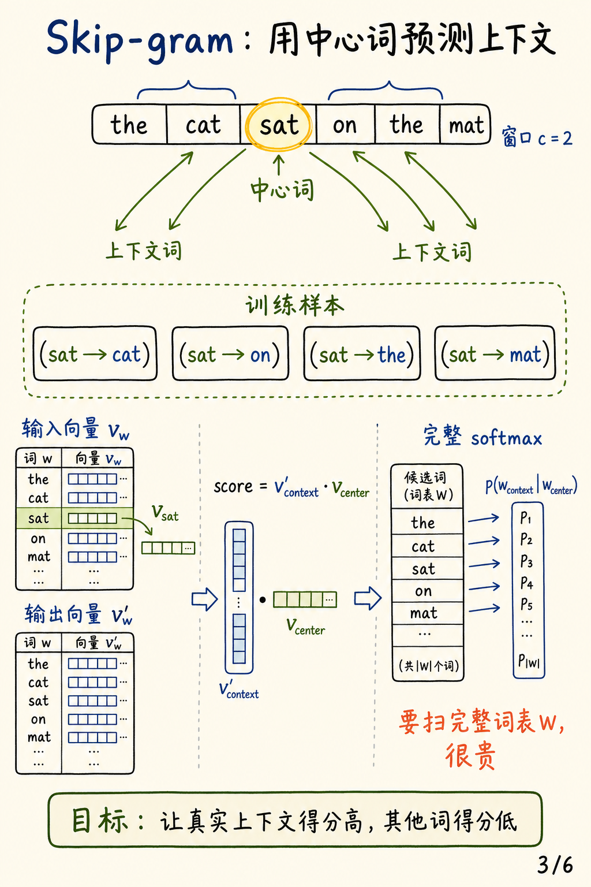
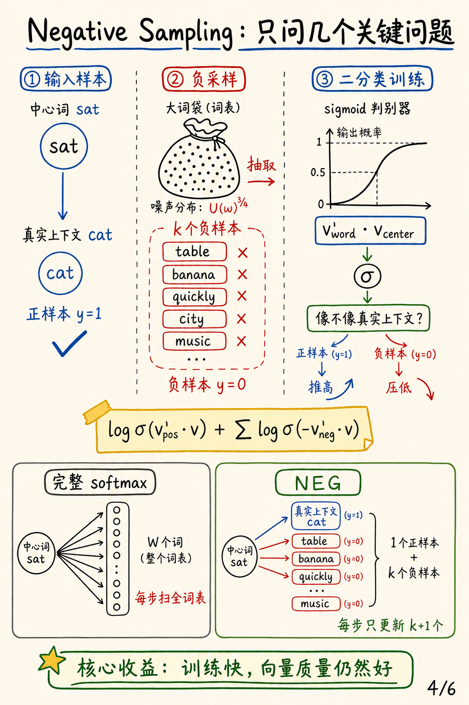
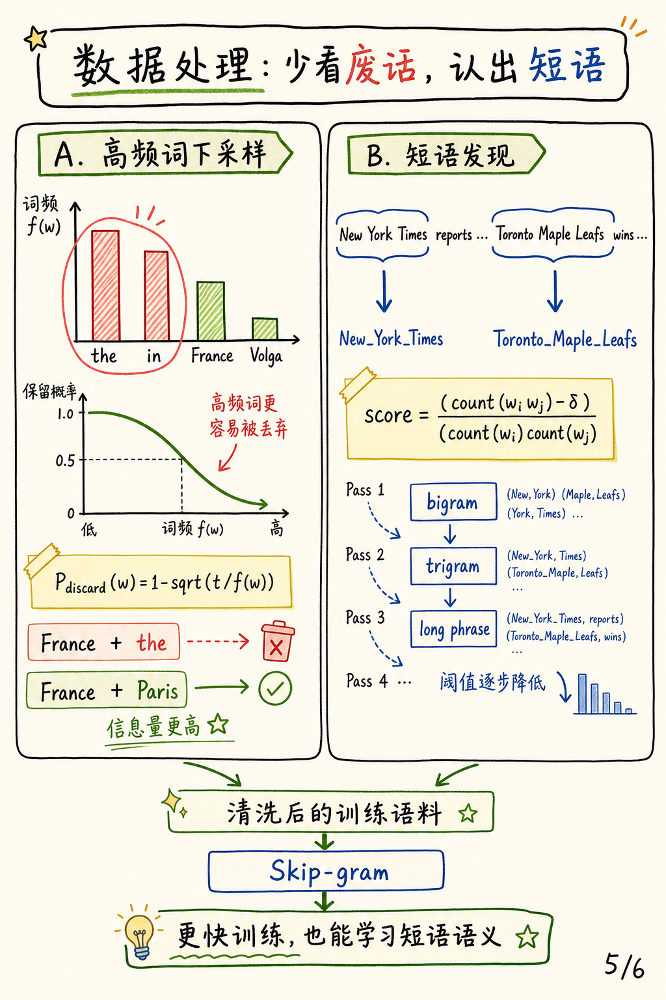
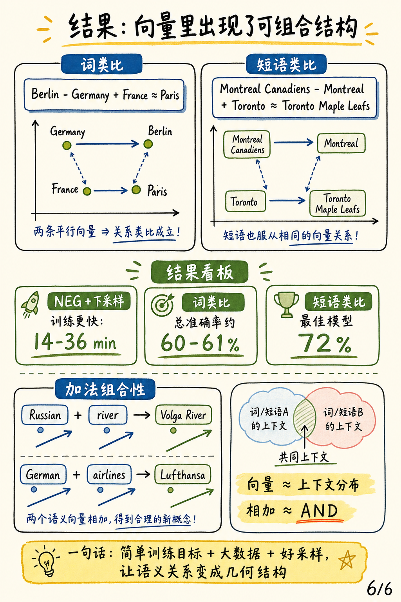

# Distributed Representations of Words and Phrases and their Compositionality

论文：[Distributed Representations of Words and Phrases and their Compositionality](https://arxiv.org/abs/1310.4546)，Tomas Mikolov, Ilya Sutskever, Kai Chen, Greg Corrado, Jeffrey Dean，NIPS 2013。

### 一句话总结

这篇论文不是重新发明 Word2Vec，而是把 Skip-gram 打磨成真正适合大规模语料的训练方法：用 **Negative Sampling** 替代昂贵的完整 softmax，用 **高频词下采样** 减少低信息量 token 的干扰，再用 **短语发现** 把 `New_York_Times` 这类固定搭配当作单个 token 来学习。

## 图解阅读笔记：6 张图先抓主线

这组图解按论文的方法逻辑来读：先看整体贡献，再拆 Skip-gram 训练目标、Negative Sampling、高频词下采样、短语发现，最后回到类比实验和向量组合性。

### 1. Word2Vec 的高效升级

主线是“海量文本 -> Skip-gram -> 高质量词/短语向量”。底部三张便签对应论文最重要的三个升级：Negative Sampling、高频词下采样、短语 token 化。

### 2. 方法总览：让语言变成向量

这页把整篇论文的方法压成一条流水线：先从原始语料识别短语，再用 Skip-gram 预测附近词，并通过 NEG 与 subsampling 加速训练，最后得到可用于类比和组合的向量空间。

### 3. Skip-gram：用中心词预测上下文

Skip-gram 的核心是从中心词生成多个“中心词 -> 上下文词”训练样本。完整 softmax 需要扫完整词表，因此当词表达到十万到千万量级时，训练代价很高。

### 4. Negative Sampling：只问几个关键问题

Negative Sampling 把“预测所有词”改成“区分真实上下文和噪声词”。每个正样本只搭配少量负样本，训练时只更新 `k+1` 个词相关的向量，因此速度大幅提升。

### 5. 数据处理：少看废话，认出短语

高频词下采样减少 “the / in” 这类信息量低的训练信号；短语发现把 “New York Times” 这类固定搭配合成单个 token。前者让训练更快，后者让模型能直接学习短语语义。

### 6. 结果：向量里出现了可组合结构

论文用词类比、短语类比和向量加法展示向量空间里的线性结构。关键直觉是：向量近似表示上下文分布，两个向量相加时，会突出它们共同支持的上下文。

## 3 个核心要点

1. **Skip-gram 的训练目标很简单**：用中心词预测上下文词，但完整 softmax 在大词表上太贵。
2. **NEG 和 subsampling 是效率关键**：前者只比较真实上下文和少量噪声词，后者减少高频虚词带来的重复训练信号。
3. **短语向量让语义组合更自然**：把固定搭配合成 token 后，模型不只会学单词，也能学 `Toronto_Maple_Leafs` 这类短语的整体语义。

## 和前一篇 Word2Vec 论文的关系

如果说 [Efficient Estimation of Word Representations in Vector Space](./2026-07-29-efficient-estimation-of-word-representations-in-vector-space.html) 解决的是“怎样用 CBOW / Skip-gram 高效学词向量”，这篇论文解决的是“怎样让 Skip-gram 在更大语料上训练得更快，并扩展到短语”。两篇合起来，才更接近后来大家熟悉的 Word2Vec 工具体系。
