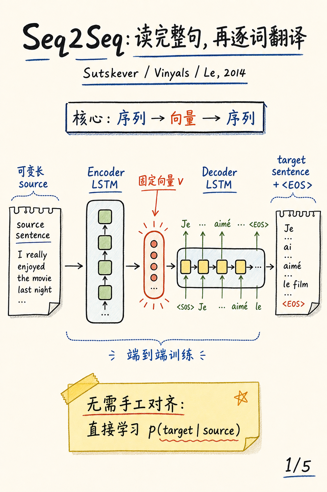
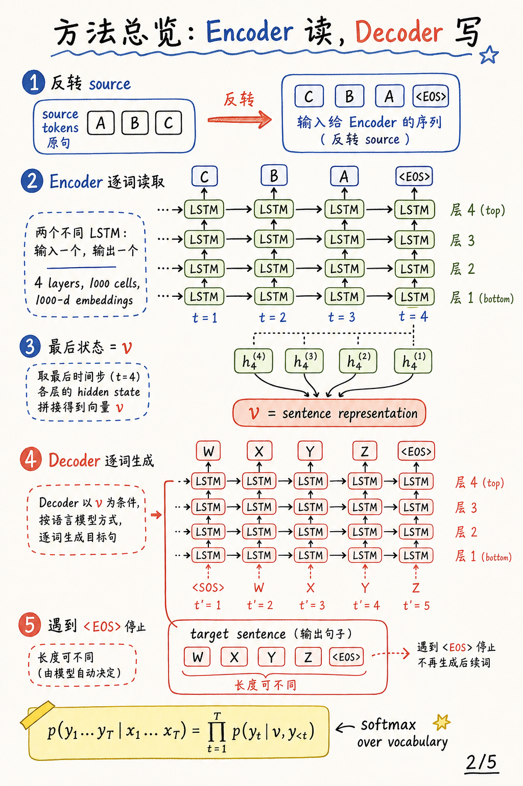
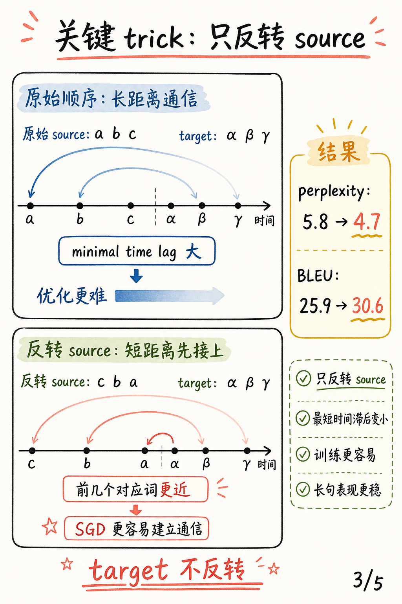
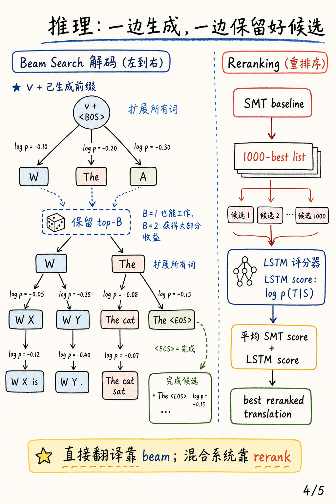
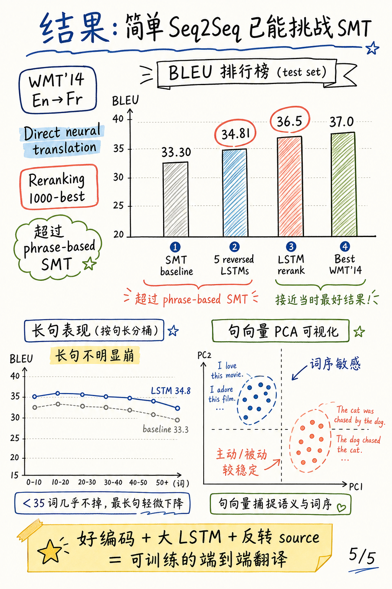

# Sequence to Sequence Learning with Neural Networks

论文：[Sequence to Sequence Learning with Neural Networks](https://arxiv.org/abs/1409.3215)

作者：Ilya Sutskever, Oriol Vinyals, Quoc V. Le

会议：NIPS 2014

### 一句话总结

这篇论文用一个深层 Encoder LSTM 读入完整源句，把任意长度输入压缩成固定向量 `v`，再用另一个深层 Decoder LSTM 逐词生成目标句子。它证明了足够大的端到端神经序列模型，配合一个简单但关键的 source 反转 trick，已经能在机器翻译上挑战传统 SMT。

## 0. 封面

Seq2Seq 的主线非常干净：先读完整个输入序列，再从一个固定向量开始生成输出序列。它不显式建模词对齐，而是直接学习 `p(target | source)`。

## 1. 方法总览

模型由两个不同的 LSTM 组成：Encoder 负责读取 source，Decoder 负责生成 target。Encoder 读到 `<EOS>` 后把最后状态作为句向量 `v`；Decoder 每一步基于 `v` 和此前生成的词预测下一个词，直到生成 `<EOS>`。

## 2. 核心 trick：只反转 source

论文最漂亮的工程洞察是：只把源句反转，不反转目标句。这样源句开头词和目标句开头词在展开时间线上更接近，降低 minimal time lag，让 SGD 更容易学到输入和输出之间的通信。这个 trick 把 test perplexity 从 `5.8` 降到 `4.7`，BLEU 从 `25.9` 提升到 `30.6`。

## 3. 推理：Beam Search 与 Reranking

直接翻译时，Decoder 用 beam search 从左到右扩展候选，只保留概率最高的若干前缀，遇到 `<EOS>` 的路径就进入完成候选。论文也把 LSTM 用作传统 SMT 的 reranker：先由 SMT 生成 1000-best list，再用 `log p(T|S)` 给候选重新评分。

## 4. 关键结果

在 WMT'14 English-French 测试集上，5 个 reversed LSTM ensemble 直接翻译达到 `34.81` BLEU，超过 phrase-based SMT baseline 的 `33.30`。如果用 LSTM rerank SMT 的 1000-best list，结果达到 `36.5` BLEU，接近当时最好结果 `37.0`。

## 3 个核心要点

1. **结构足够简单**：Encoder 把序列变成向量，Decoder 再从向量生成序列，这个框架后来成为许多 seq2seq 模型的出发点。
2. **优化 trick 很关键**：只反转 source 没有增加模型复杂度，却显著降低了早期输入与早期输出之间的通信难度。
3. **结果有范式意义**：大规模深层 LSTM 加 beam search / reranking，让端到端神经翻译第一次非常接近甚至超过强 SMT 系统。
