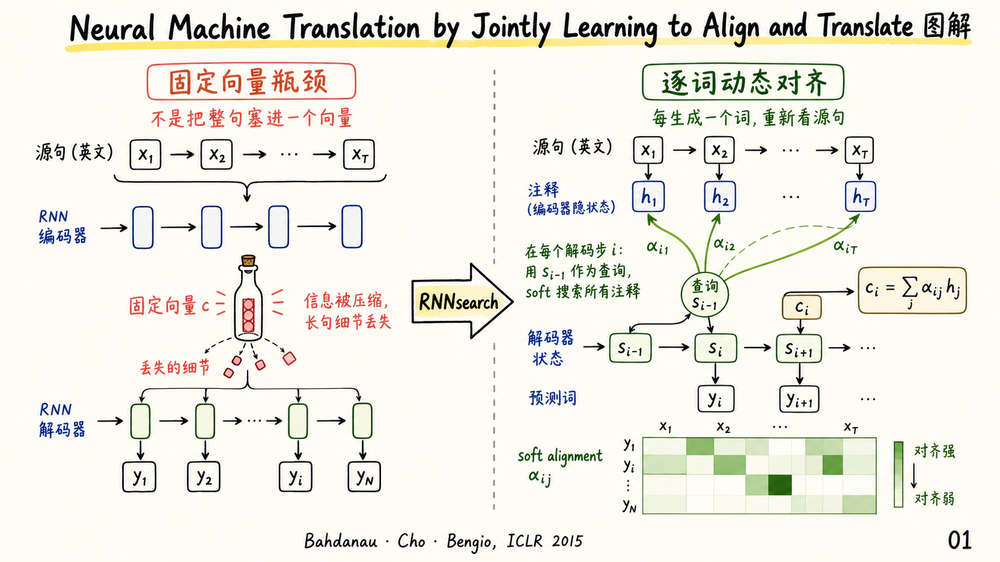
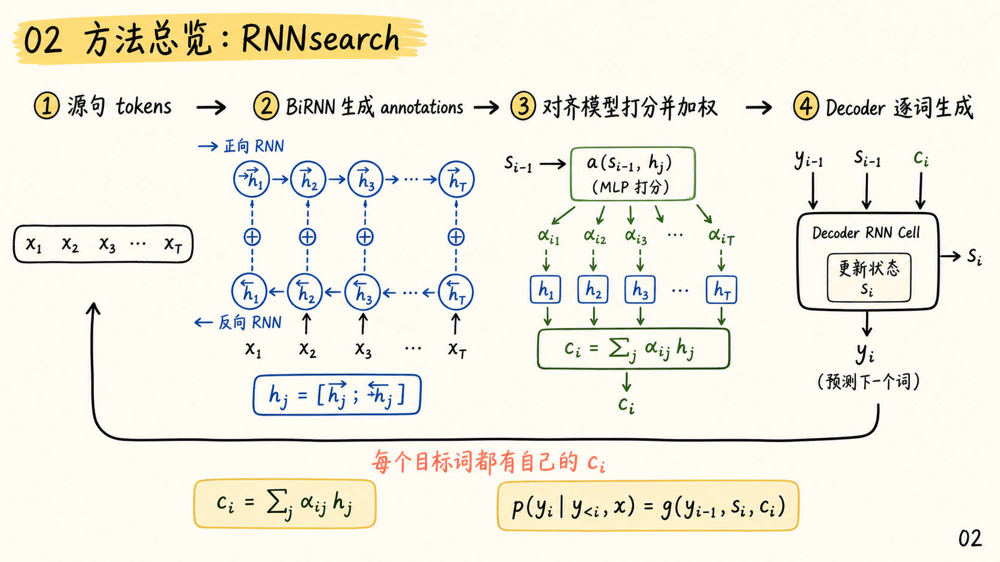
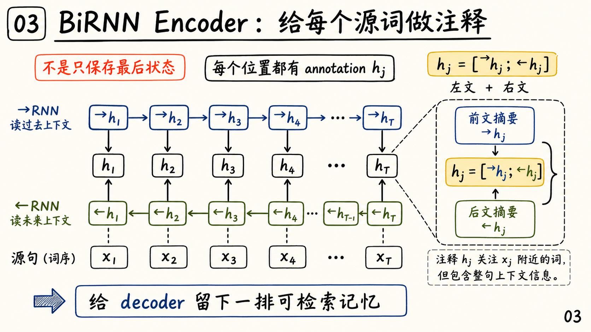
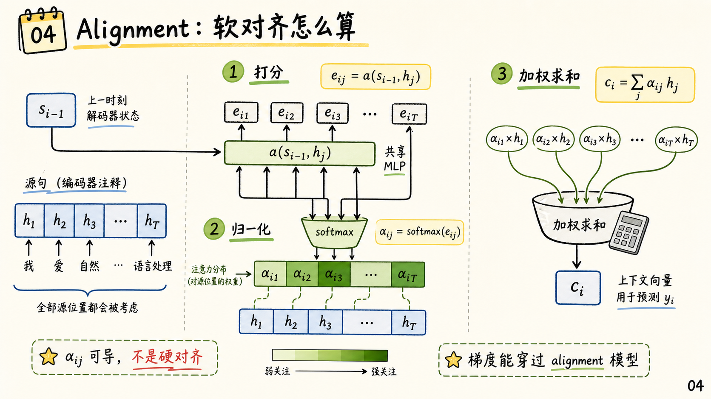
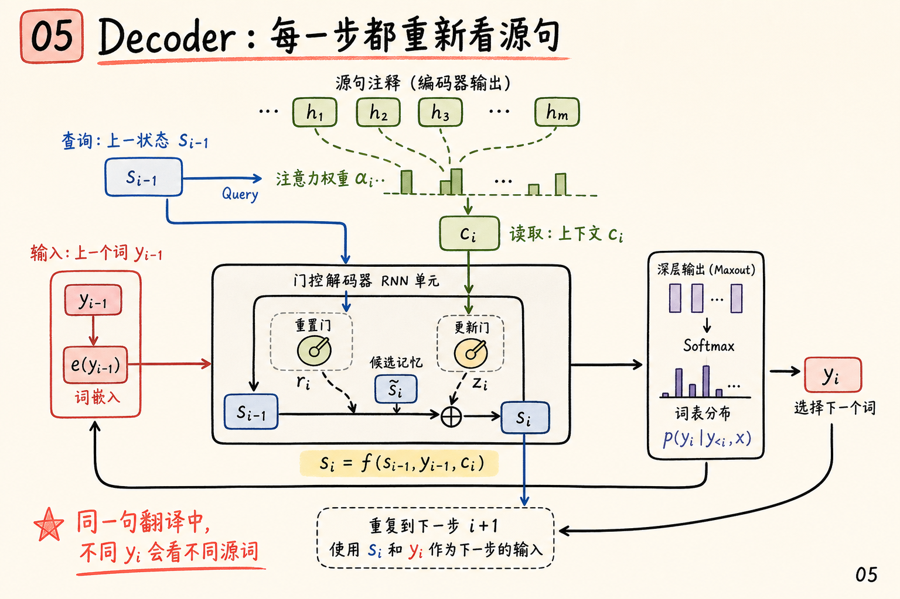
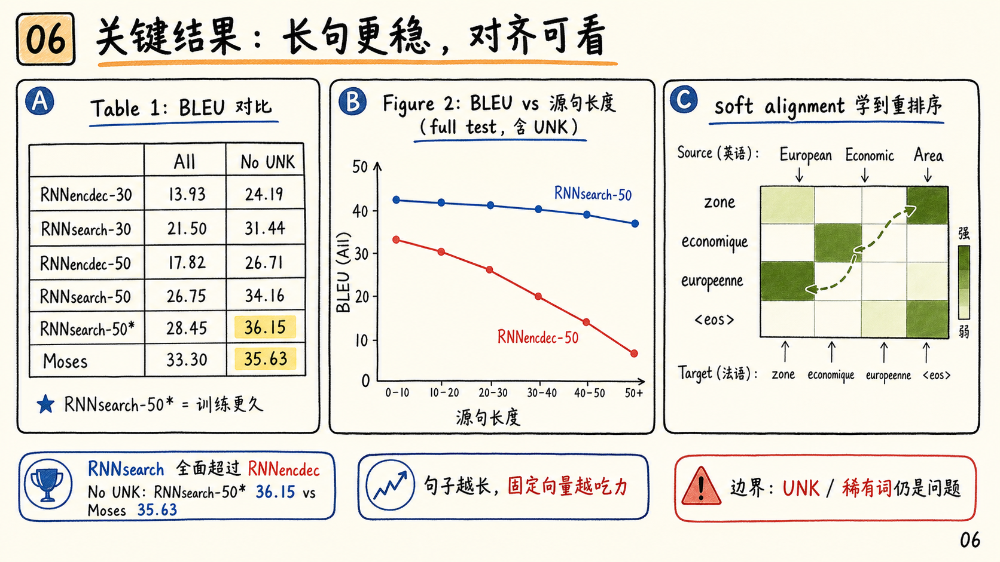

# Neural Machine Translation by Jointly Learning to Align and Translate 图解

论文：[Neural Machine Translation by Jointly Learning to Align and Translate](https://arxiv.org/abs/1409.0473)

作者：Dzmitry Bahdanau, Kyunghyun Cho, Yoshua Bengio

会议：ICLR 2015 oral

### 一句话总结

这篇论文把早期 Seq2Seq 的固定向量 `c` 改成了逐步生成的上下文向量 `c_i`：decoder 每预测一个目标词，都会用当前状态去 soft-search 源句所有位置，从而联合学习翻译和对齐。这就是后来被称为 Bahdanau attention 的核心思想。

## 0. 封面

早期 encoder-decoder 会把整句源语言压进一个固定长度向量。短句还能勉强工作，长句就容易丢掉细节。RNNsearch 的变化是：源句不再只留下一个总摘要，而是保留一排可检索的 annotations，decoder 每一步重新决定该看哪里。

## 1. 方法总览

RNNsearch 的整体流程可以拆成四步。

第一，源句 `x_1, ..., x_T` 进入 encoder。第二，BiRNN 为每个源词生成 annotation `h_j`。第三，在第 `i` 个目标词生成前，alignment model 用上一时刻 decoder 状态 `s_{i-1}` 和每个 `h_j` 打分，得到 attention 权重 `alpha_ij`。第四，decoder 用当前上下文 `c_i`、上一词 `y_{i-1}` 和状态来预测 `y_i`。

最关键的差别是：旧 Seq2Seq 中所有目标词共享同一个 `c`；RNNsearch 中每个目标词都有自己的 `c_i`。

## 2. BiRNN Encoder：给每个源词做注释

论文没有让 encoder 只输出最后一个隐藏状态，而是用双向 RNN 生成一排 annotations：

$$
h_j = [\overrightarrow{h_j}; \overleftarrow{h_j}].
$$

这里的 `h_j` 同时包含 `x_j` 左边和右边的上下文。因为 RNN 对近处输入更敏感，它会特别关注 `x_j` 附近的词，同时仍然带有整句信息。这一排 `h_j` 就像留给 decoder 的可检索记忆库。

## 3. Alignment：软对齐怎么算

第 `i` 个目标词生成前，模型先给每个源位置打分：

$$
e_{ij} = a(s_{i-1}, h_j).
$$

`a` 是一个小的前馈网络，和翻译模型一起端到端训练。然后对所有源位置做 softmax：

$$
\alpha_{ij} =
\frac{\exp(e_{ij})}{\sum_k \exp(e_{ik})}.
$$

最后用这些权重加权求和：

$$
c_i = \sum_j \alpha_{ij} h_j.
$$

这个设计漂亮的地方在于：对齐不是传统机器翻译里的离散隐变量，而是一组可导的 soft weights。梯度可以穿过 `alpha_ij` 回到 alignment model 和 encoder，所以“学会翻译”和“学会对齐”是同一个训练目标里的两件事。

## 4. Decoder：每一步都重新看源句

在第 `i` 步，decoder 不只是看上一词和上一状态，还会先通过 attention 读出 `c_i`：

$$
s_i = f(s_{i-1}, y_{i-1}, c_i).
$$

接着用 `s_i`、`y_{i-1}` 和 `c_i` 预测目标词分布。论文实验里的 RNN 单元采用 Cho et al. 2014 的 gated hidden unit，输出层用了 maxout 和 softmax。

直觉上，`s_{i-1}` 像当前翻译进度，`h_j` 是源句记忆，`alpha_ij` 是这一刻的读取权重，`c_i` 是从源句拿回来的上下文。因此同一句翻译里，不同目标词自然会关注不同源词。

## 5. 关键结果

实验在 WMT 2014 English-to-French 上比较 RNNencdec 和 RNNsearch。结果有三个重点。

第一，RNNsearch 全面超过固定向量 encoder-decoder。`RNNsearch-30` 的 BLEU 是 `21.50`，已经超过 `RNNencdec-50` 的 `17.82`。这说明动态读取源句比单纯允许更长训练句子更关键。

第二，长句表现更稳。随着源句长度增加，RNNencdec 的 BLEU 明显下滑；RNNsearch 的曲线更平，尤其 `RNNsearch-50` 在长句上没有出现同样严重的退化。这正好验证了论文最初的假设：固定长度上下文向量是长句翻译的瓶颈。

第三，soft alignment 有可解释性。论文展示的 attention heatmap 大多沿对角线，但也能处理英法词序差异。例如 “European Economic Area” 到 “zone economique europeenne” 不是简单单调对齐，模型会先把 “Area” 对到 “zone”，再回看修饰词。

需要注意的是，这篇论文也留下了明确边界：UNK 和稀有词仍然是问题。在全量测试集上，`RNNsearch-50*` 仍低于 Moses；但在 No-UNK 子集上，它达到 `36.15` BLEU，高于 Moses 的 `35.63`。这说明 attention 解决了信息读取瓶颈，却还没有解决开放词表问题。

## 3 个核心要点

1. **架构贡献**：把固定向量 `c` 改成逐步计算的 `c_i`，让 decoder 每生成一个目标词都能重新读取源句。
2. **机制贡献**：用可导的 soft alignment `alpha_ij` 连接 `s_{i-1}` 和所有 `h_j`，使对齐模型与翻译模型联合训练。
3. **实验贡献**：RNNsearch 显著改善长句翻译，并给出了直观 attention heatmap，证明模型学到的对齐大体符合语言直觉。

## 和前几篇笔记的关系

如果把 2014 年前后的神经机器翻译串起来看，脉络很清楚：

- [Learning Phrase Representations using RNN Encoder-Decoder for Statistical Machine Translation](./2026-07-29-learning-phrase-representations-using-rnn-encoder-decoder-for-statistical-machine-translation-comic.html) 把短语映射到连续向量，并把神经短语分数接入传统 SMT。
- [Sequence to Sequence Learning with Neural Networks](./2026-08-04-sequence-to-sequence-learning-with-neural-networks-comic.html) 证明深层 LSTM encoder-decoder 可以端到端做句子级翻译，但仍依赖固定向量。
- 本文则补上关键一步：不再强迫整句压进一个向量，而是让 decoder 每一步动态检索源句 annotations。

这一点后来被 Transformer 彻底放大：attention 从 encoder-decoder 对齐机制，变成了序列建模的通用信息路由方式。
