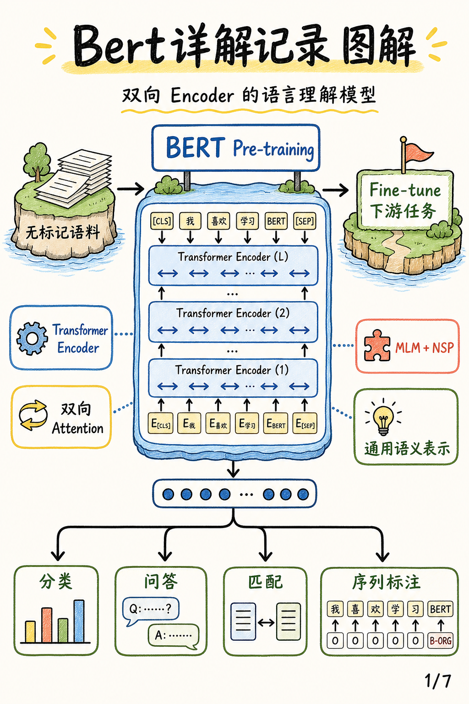
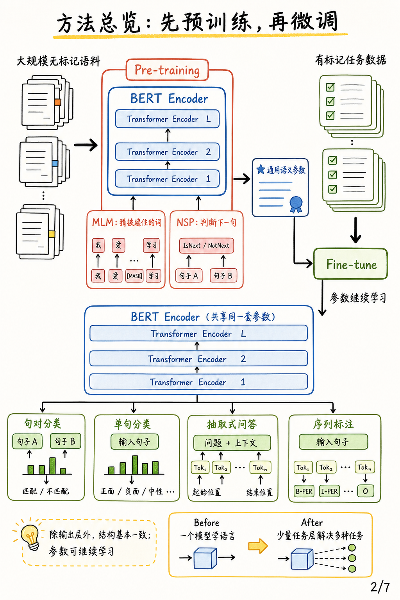
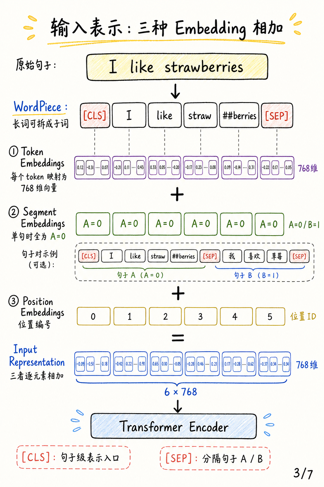
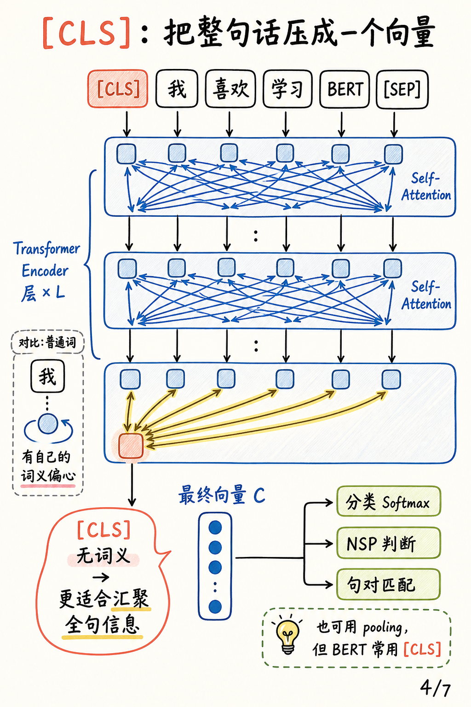
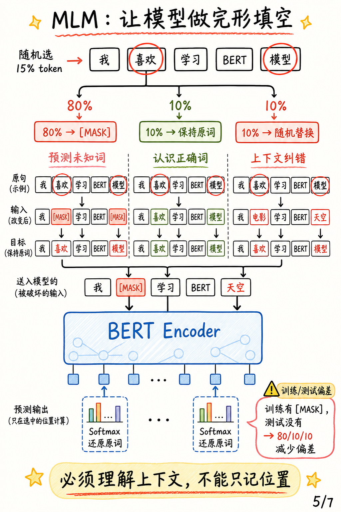
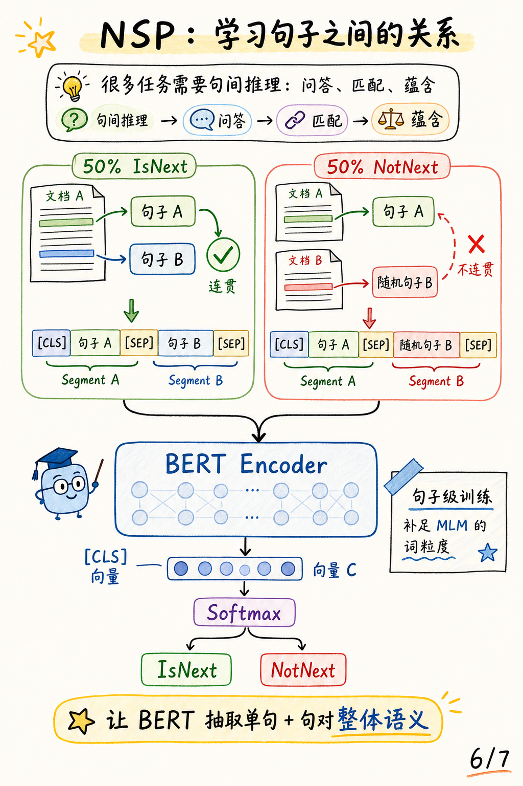
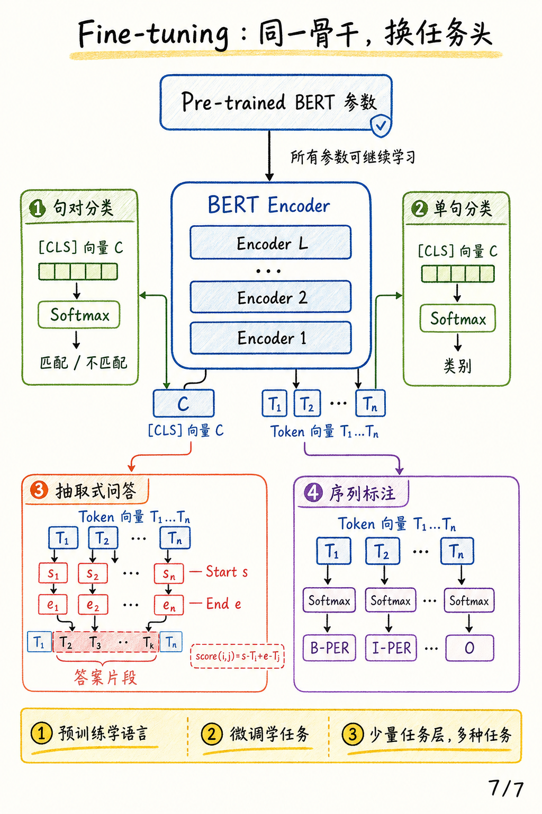

# Bert详解记录 图解

原文：[Bert详解记录](https://zhuanlan.zhihu.com/p/626889990)

作者：pppppx

来源：知乎专栏

### 一句话总结

这篇笔记把 BERT 的主线拆成了一个很清楚的预训练范式：先在大规模无标记语料上训练 Transformer Encoder，让模型获得通用语义表示，再用少量任务层把同一个骨干微调到分类、匹配、问答和序列标注等下游任务。

## 0. 封面

BERT 的关键不是简单堆叠 Encoder，而是把“双向 Attention 的语义抽取能力”和“可迁移的预训练参数”结合起来。它输出的不是生成文本，而是更适合语言理解任务的上下文表示。

## 1. 方法总览

整体流程分成两段。第一段是 `Pre-training`：用无标记语料训练同一个 BERT Encoder，并同时做 MLM 和 NSP。第二段是 `Fine-tune`：把预训练参数作为初始化，在有标记任务上继续学习，只需要替换或增加很少的任务输出层。

这种设计让“一个模型学语言”变成“同一套语言表示服务多种任务”。

## 2. 输入表示

BERT 的每个 token 输入不是单一词向量，而是三种向量逐元素相加：`Token Embeddings + Segment Embeddings + Position Embeddings`。其中 `Token Embeddings` 负责词或子词语义，`Segment Embeddings` 区分句子 A/B，`Position Embeddings` 提供位置信息。

`[CLS]` 放在序列开头，给后续句子级任务提供一个聚合位置；`[SEP]` 用来分隔单句或句对输入。

## 3. [CLS] 向量

普通 token 往往带有自己的词义重心，而 `[CLS]` 本身没有具体词义。经过多层 self-attention 后，它可以从整句或句对中汇聚信息，最终得到向量 `C`，再送入分类、匹配或 NSP 判断头。

这也是为什么很多 BERT 下游分类任务会直接使用最后一层的 `[CLS]` 表示。

## 4. MLM 预训练

MLM 像完形填空：随机选择 15% 的 token 作为预测目标。为了缓解“训练时有 `[MASK]`、测试时没有 `[MASK]`”的偏差，BERT 对被选中的 token 使用 80/10/10 策略：80% 替换为 `[MASK]`，10% 保持原词，10% 替换成随机词。

这样模型不能只记住某个位置是否被遮住，而必须利用上下文推断原词。

## 5. NSP 预训练

NSP 让 BERT 学习句子之间的关系。训练样本一半是真实连续句对 `IsNext`，另一半是随机拼接句对 `NotNext`。输入仍然使用 `[CLS] 句子A [SEP] 句子B [SEP]`，再用 `[CLS]` 输出接二分类头判断句对关系。

相比 MLM 偏词粒度，NSP 更强调句子级和句对级语义。

## 6. Fine-tuning

微调阶段复用同一个 BERT Encoder，只根据任务换输出头。句对分类和单句分类主要使用 `[CLS]` 向量 `C`；抽取式问答使用每个 token 的最终向量预测答案起止位置；序列标注则给每个 token 输出一个标签分布。

关键在于：BERT 的骨干参数也会继续学习，因此它不是固定特征提取器，而是在任务数据上整体适配。

## 总结：3 个核心要点

1. BERT 用 Transformer Encoder 做双向上下文编码，强项是语言理解而不是自回归生成。
2. MLM 和 NSP 分别从 token 粒度、句子关系粒度塑造通用语义表示。
3. Fine-tuning 让同一套预训练骨干通过少量任务头服务多种 NLP 任务。
