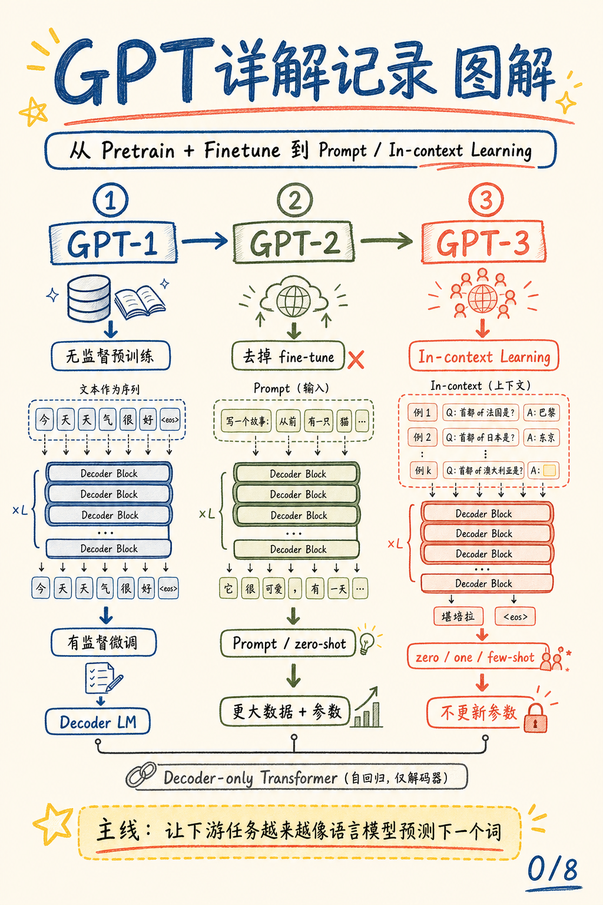
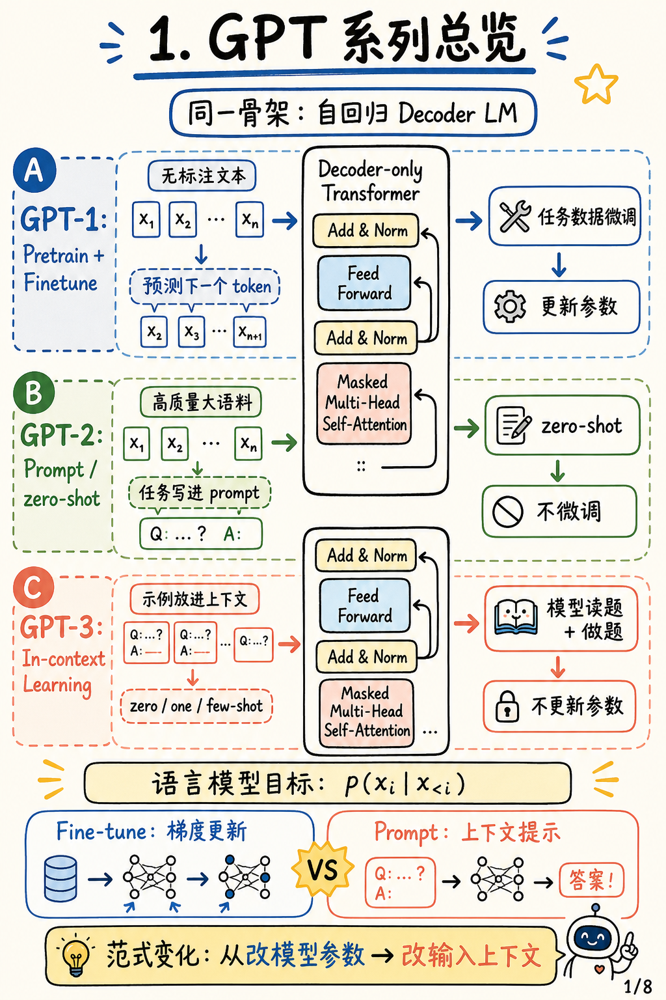
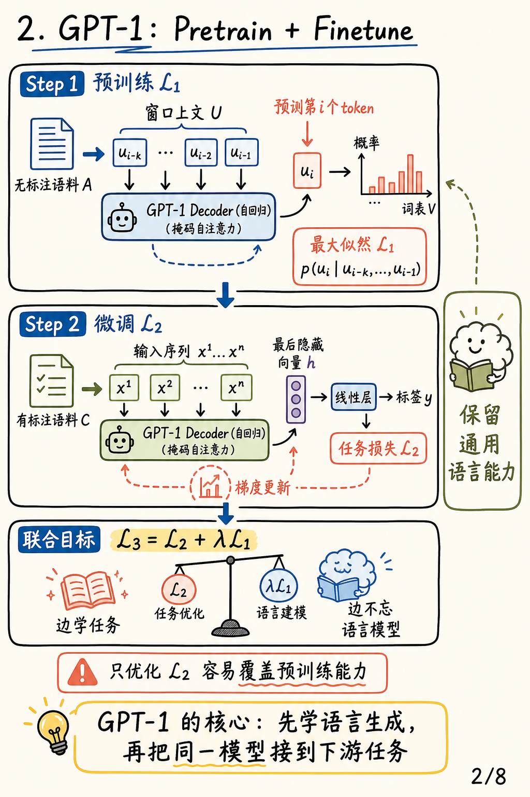
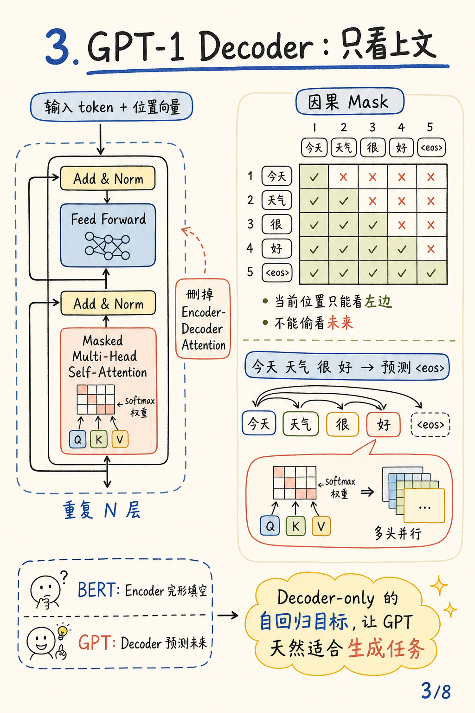
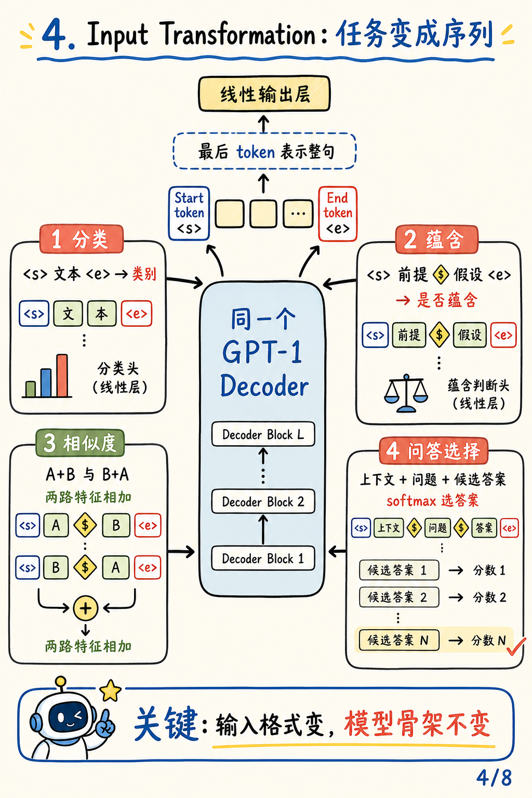
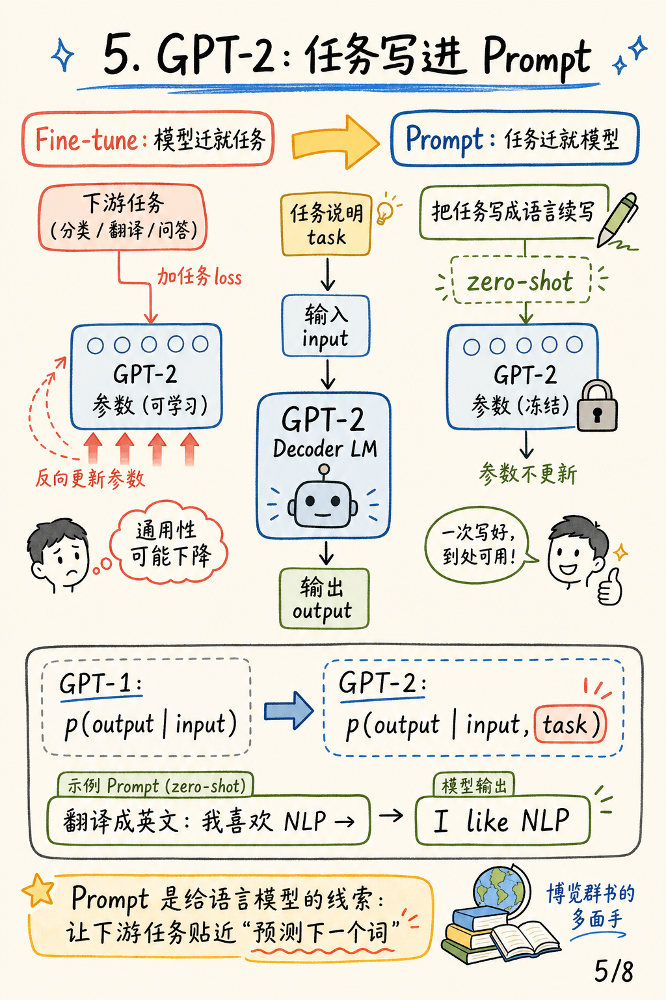
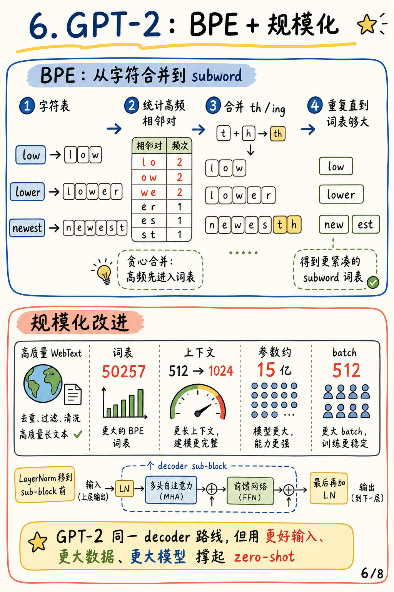
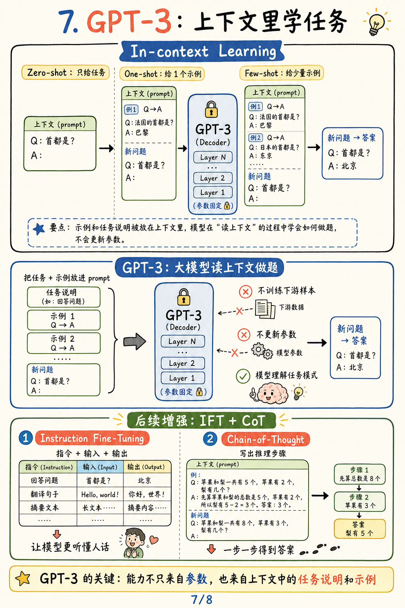

# GPT详解记录 图解

原文链接：[https://zhuanlan.zhihu.com/p/626899354](https://zhuanlan.zhihu.com/p/626899354)

作者：pppppx

来源：知乎专栏

### 一句话总结

这篇笔记串起了 GPT-1、GPT-2、GPT-3 的主线：模型骨架一直围绕 decoder-only Transformer 和自回归语言建模，但下游任务的使用方式从“更新模型参数”逐步转向“改写输入上下文”。

## 0. 封面

GPT 系列的演进可以看成一条越来越靠近“通用语言模型”的路线。GPT-1 先学语言模型再微调；GPT-2 去掉微调，尝试用 prompt 触发能力；GPT-3 则把任务说明和示例直接放进上下文，让模型在不更新参数的情况下理解任务模式。

## 1. GPT 系列总览

三代 GPT 的共性是自回归 decoder LM：给定上文，预测下一个 token。变化不在“是否还是 decoder”，而在任务信息怎么进入模型。

GPT-1 用预训练参数作为基础，再通过有标注数据微调到具体任务。GPT-2 把任务写进 prompt，让模型直接续写答案。GPT-3 进一步把少量示例也放进上下文，形成 zero-shot、one-shot、few-shot 的 in-context learning。

## 2. GPT-1：Pretrain + Finetune

GPT-1 的第一步是在无标注语料上做语言模型预训练：根据窗口内上文预测第 `i` 个 token，优化最大似然目标 `L1`。第二步是在有标注任务上微调：把输入序列送入同一个 decoder，在最后隐藏向量后接线性层预测标签，优化任务目标 `L2`。

文章里特别强调了联合目标 `L3 = L2 + λL1` 的意义：只优化下游任务可能覆盖预训练得到的通用语言能力，把语言模型目标保留下来，可以让模型边适配任务、边少忘一点。

## 3. GPT-1 Decoder：只看上文

GPT-1 使用的是 decoder-only 结构。相比原始 Transformer decoder，它删掉了 encoder-decoder attention，保留 masked multi-head self-attention、feed forward，以及每个子层后的 Add & Norm。

关键在因果 mask：当前位置只能看到左侧上文，不能看到未来 token。所以 GPT 的训练方式天然就是“预测未来”，这也让它比 encoder-only 的 BERT 更适合生成类任务。

## 4. Input Transformation：任务变成序列

GPT-1 做下游任务时，不为每类任务重写模型主体，而是把输入格式改造成统一序列。分类、蕴含、相似度、问答选择都会加上 `<s>`、`<e>` 等特殊 token，再把最后 token 的表示接到线性输出层。

这个设计的核心是：任务输入可以变，模型骨架不变。下游任务被“翻译”成同一个 decoder 可以处理的序列形式。

## 5. GPT-2：任务写进 Prompt

GPT-2 的关键转向是丢掉 fine-tune，尽量让下游任务迁就语言模型目标。与其为分类、翻译、问答分别加任务损失并更新参数，不如把任务说明写进 prompt，让模型继续做它最熟悉的事：根据上下文预测后续文本。

这对应文章里的目标变化：从 `p(output | input)` 走向 `p(output | input, task)`。`task` 不再主要通过梯度写入参数，而是作为上下文的一部分交给模型读取。

## 6. GPT-2：BPE + 规模化

GPT-2 还在输入表示和规模上做了增强。BPE 把文本从字符逐步合并成高频 subword，在固定词表大小内兼顾开放词和常见片段。文章也记录了 GPT-2 的若干规模化变化：更高质量的数据、更大的词表、更长上下文、更大参数量，以及 LayerNorm 位置调整。

这些变化没有改变 decoder-only 路线，但为 zero-shot 提供了更强的模型容量和更丰富的预训练经验。

## 7. GPT-3：上下文里学任务

GPT-3 把“任务写进上下文”推进到 in-context learning：zero-shot 只给任务说明，one-shot 给一个示例，few-shot 给少量示例。模型不训练下游样本，也不更新参数，而是在读取 prompt 的过程中推断当前任务模式。

文章最后补充的 IFT 和 CoT 可以看作后续增强方向。IFT 用“指令、输入、输出”样本让模型更听懂人类任务；CoT 用推理步骤引导模型一步一步得到答案。

## 3 个核心要点

1. **架构主线**：GPT-1 到 GPT-3 都围绕 decoder-only Transformer 和自回归语言模型目标展开。
2. **训练/使用范式变化**：GPT-1 依赖 pretrain + finetune，GPT-2/3 越来越强调 prompt、zero-shot 和 in-context learning。
3. **任务统一方式**：GPT 路线的一个关键思想是把任务改写成语言模型可读的上下文，让模型用同一套预测下一个 token 的能力处理多种任务。
