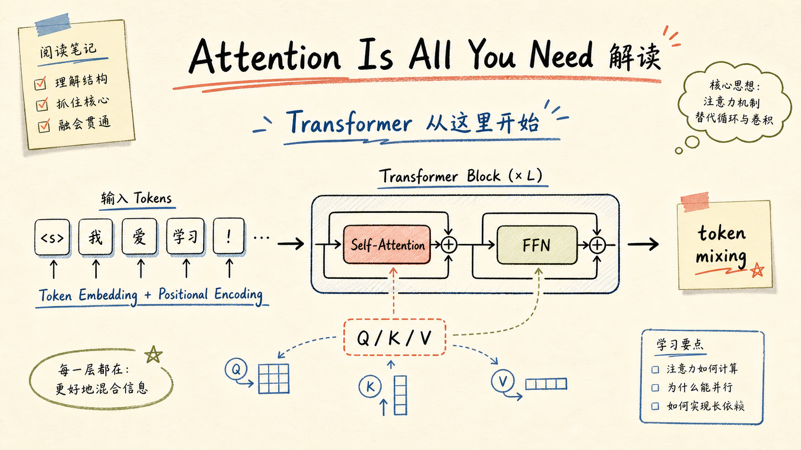
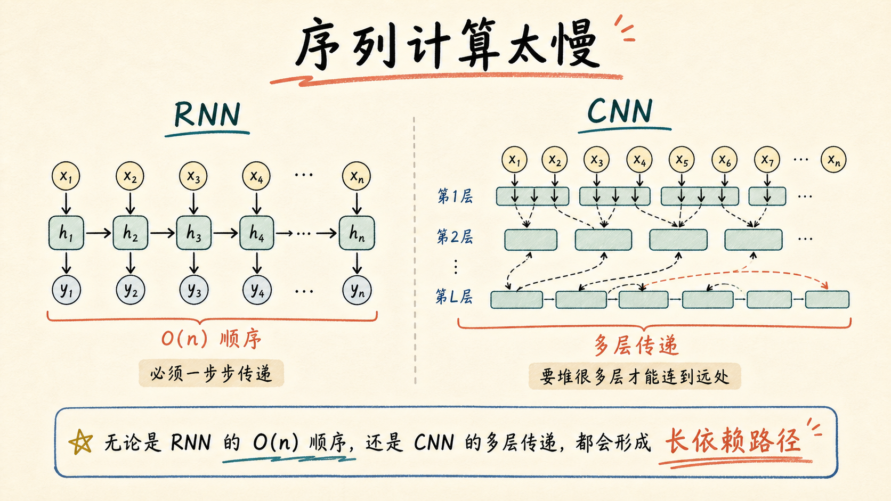
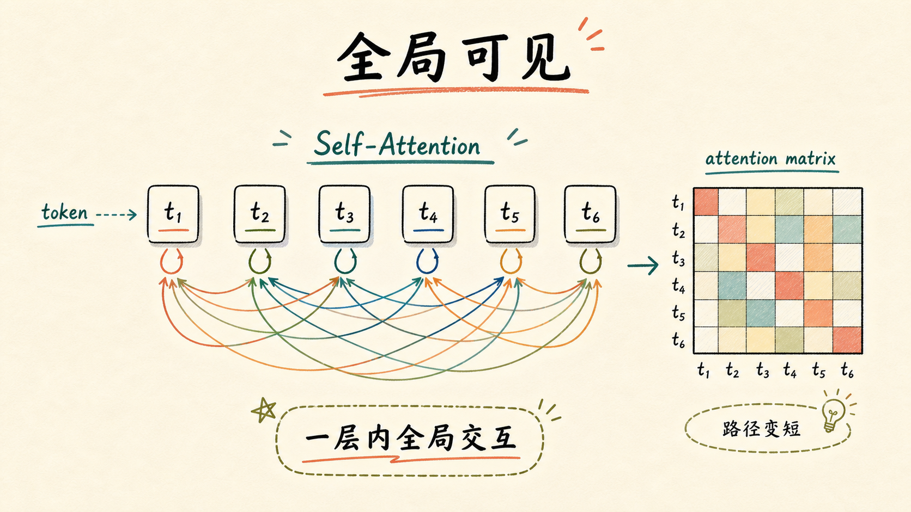
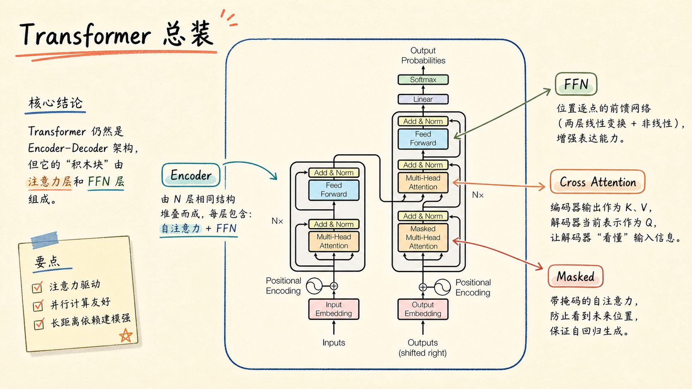
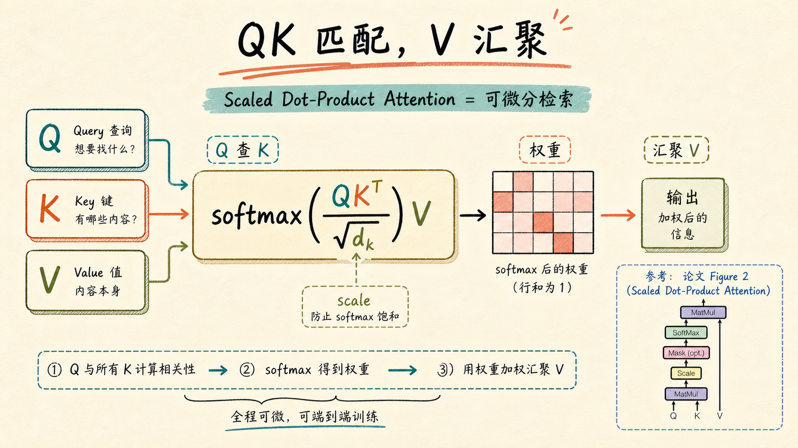
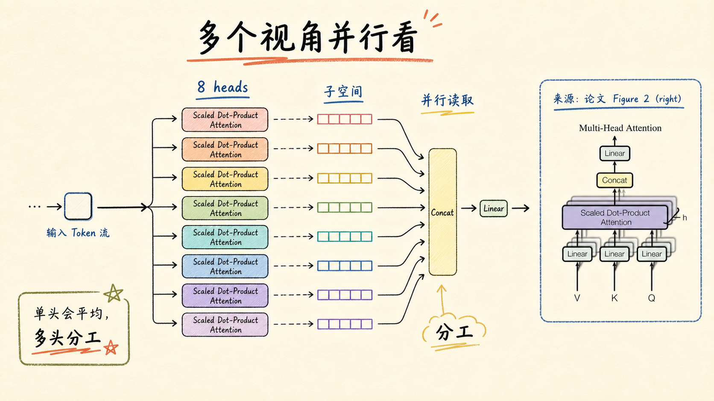
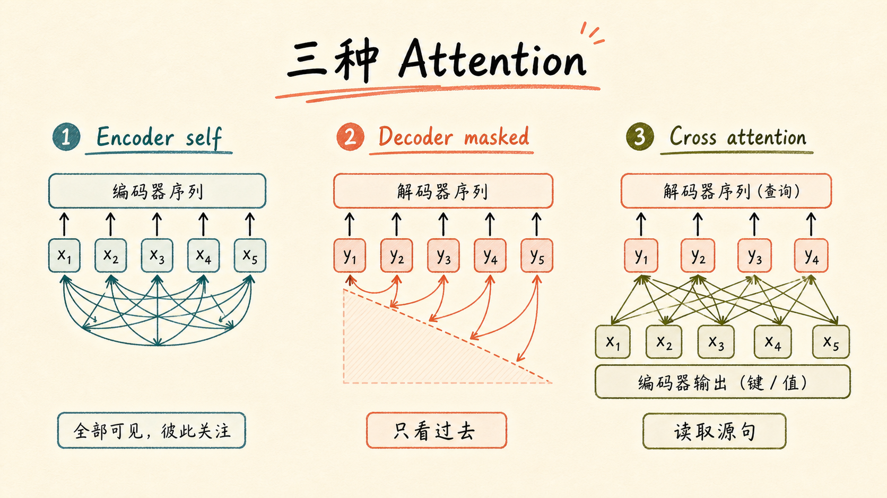
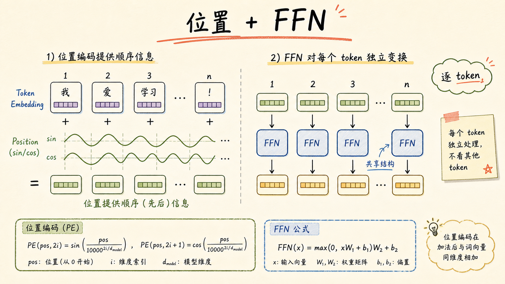
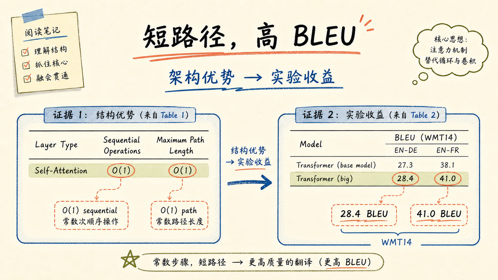
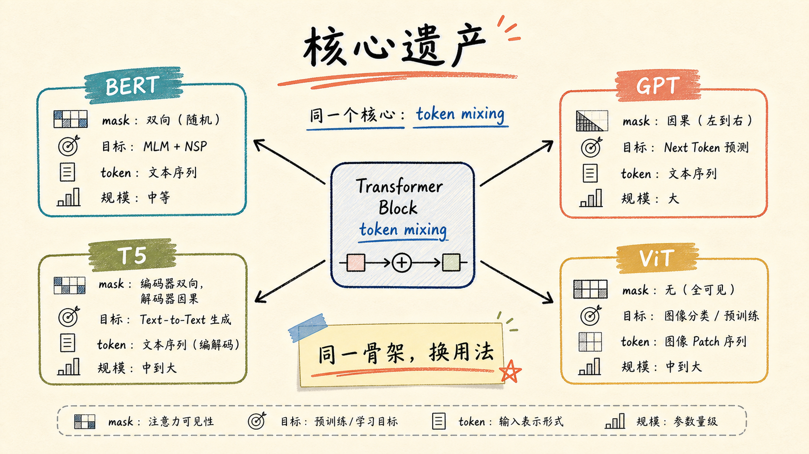

# Attention Is All You Need 解读

论文链接：[NeurIPS 官方页](https://papers.nips.cc/paper/7181-attention-is-all-you-need) / [官方 PDF](https://papers.nips.cc/paper_files/paper/2017/file/3f5ee243547dee91fbd053c1c4a845aa-Paper.pdf) / [arXiv](https://arxiv.org/abs/1706.03762)

作者：Ashish Vaswani, Noam Shazeer, Niki Parmar, Jakob Uszkoreit, Llion Jones, Aidan N. Gomez, Lukasz Kaiser, Illia Polosukhin

会议：NIPS 2017 / NeurIPS Proceedings

产物下载：[PPTX](../assets/images/attention-is-all-you-need-deck/attention-is-all-you-need-deck.pptx) / [PDF](../assets/images/attention-is-all-you-need-deck/attention-is-all-you-need-deck.pdf)

## 一句话总结

这篇论文的核心不是“发明了注意力”，而是把 attention 从 RNN/CNN 旁边的辅助对齐机制，提升成序列建模的主骨架：用 self-attention 直接连接所有 token，用 multi-head attention 分解不同关系，再用 FFN、残差归一化和位置编码组成可并行堆叠的 Transformer。

## 1. Attention Is All You Need 解读

这组图是自学复盘用的论文阅读笔记，不是正式课程讲义。主线只抓一个问题：Transformer 为什么敢把 recurrence 和 convolution 都拿掉，却还能在机器翻译上更快、更强？

## 2. 原问题：序列计算太慢

RNN 的问题是顺序计算：第 $t$ 个位置依赖前一个 hidden state，训练样本内部很难完全并行。CNN 可以并行，但远距离 token 之间的信息通常要通过多层局部窗口传递。论文把这个瓶颈压缩成三个维度：每层复杂度、顺序操作数、任意两位置之间的最长路径。

## 3. 核心转向：全局可见

Self-attention 的关键变化是：每个 token 都可以在一层里直接读取其他 token。这样长距离依赖不再需要沿时间链或卷积层逐步传递，而是通过 attention matrix 一次性建立全局连接。

## 4. Transformer 总装

Transformer 仍然是 encoder-decoder 架构。Encoder 每层包含 multi-head self-attention 和 position-wise FFN；Decoder 多一个 encoder-decoder attention，并且 masked self-attention 防止生成时看到未来 token。每个子层外面都有 residual connection 和 layer normalization。

## 5. QK 匹配，V 汇聚

Scaled Dot-Product Attention 可以理解成可微检索：

$$
\mathrm{Attention}(Q,K,V)=\mathrm{softmax}\left(\frac{QK^T}{\sqrt{d_k}}\right)V
$$

$QK^T$ 计算 query 和 key 的相似度，softmax 变成权重，再对 value 做加权汇聚。除以 $\sqrt{d_k}$ 是为了避免维度变大后点积幅度过大，让 softmax 进入梯度很小的区域。

## 6. Multi-Head：多个视角并行看

单头 attention 会把所有相关信息压成一次加权平均。Multi-head attention 先把 $Q/K/V$ 投影到多个子空间，在每个 head 里独立做 attention，再 concat 回来。论文 base model 使用 8 个 heads，每个 head 的 $d_k=d_v=64$，让总计算量仍然接近单头全维 attention。

## 7. 三种 Attention 角色

同一个 multi-head attention 在 Transformer 里有三种用法：encoder self-attention 让源序列内部互看；decoder masked self-attention 让目标序列只看过去；encoder-decoder attention 让 decoder 用当前表示作为 query，去读取 encoder 输出的 key/value。

## 8. 顺序与 FFN：补上位置，变换特征

纯 attention 本身不携带顺序归纳偏置，所以论文把 positional encoding 加到输入 embedding 上。FFN 则在每个位置独立应用同一组两层线性变换和 ReLU：token 之间的通信交给 attention，token 内部的特征变换交给 FFN。

## 9. 证据：短路径，高 BLEU

论文的证据分两层。结构上，self-attention 的顺序操作数和最长路径都是 $O(1)$，这直接对应更强的并行性和更短的信息路径。实验上，Transformer big 在 WMT 2014 English-German 上达到 28.4 BLEU，在 English-French 上达到 41.0 BLEU，并且训练成本显著低于当时许多强基线。

## 10. 留下的核心遗产

Transformer 后来的影响不只是一篇机器翻译论文。BERT、GPT、T5、ViT 等模型都可以看作在同一个 token mixing 骨架上改 mask、训练目标、输入 token 形式和规模。真正留下来的，是一套可并行、可堆叠、跨模态迁移很自然的通用计算结构。

## 3 个核心要点

1. Transformer 的关键替换对象是序列传播骨架：用 self-attention 替代 RNN/CNN 的逐步信息传递。
2. Multi-head attention 的价值在于分工：不同 head 可以在不同表示子空间里学习不同 token 关系。
3. 论文最强的说服力来自“结构优势 + 工程收益”同时成立：短路径、强并行、更高 BLEU、更低训练成本。

## 主要来源

- [Attention Is All You Need - NeurIPS Proceedings](https://papers.nips.cc/paper/7181-attention-is-all-you-need)
- [Attention Is All You Need - official PDF](https://papers.nips.cc/paper_files/paper/2017/file/3f5ee243547dee91fbd053c1c4a845aa-Paper.pdf)
- [Attention Is All You Need - arXiv:1706.03762](https://arxiv.org/abs/1706.03762)

