# Speed Always Wins: A Survey on Efficient Architectures for Large Language Models 解读

论文链接：[arXiv PDF](https://arxiv.org/pdf/2508.09834) / [项目仓库](https://github.com/weigao266/Awesome-Efficient-Arch)

作者：Weigao Sun, Jiaxi Hu, Yucheng Zhou, Jusen Du, Disen Lan, Kexin Wang, Tong Zhu, Xiaoye Qu, Yu Zhang, Xiaoyu Mo, Daizong Liu, Yuxuan Liang, Wenliang Chen, Guoqi Li, Yu Cheng 等

年份：arXiv 预印本，2025（v1：2025-08-13）

产物下载：[PPTX](../assets/images/speed-always-wins-a-survey-on-efficient-architectures-for-large-language-models-deck/speed-always-wins-a-survey-on-efficient-architectures-for-large-language-models-deck.pptx) / [PDF](../assets/images/speed-always-wins-a-survey-on-efficient-architectures-for-large-language-models-deck/speed-always-wins-a-survey-on-efficient-architectures-for-large-language-models-deck.pdf)

## 一句话总结

这篇 survey 的核心判断是：LLM 的下一轮扩展不能只靠更大的 Transformer，而要把 attention、FFN/MoE、生成范式、跨模态 token 处理和系统硬件约束一起重构，让模型在长上下文、推理、agent 和多模态场景里更快、更省、更可部署。

## 1. Speed Always Wins 解读

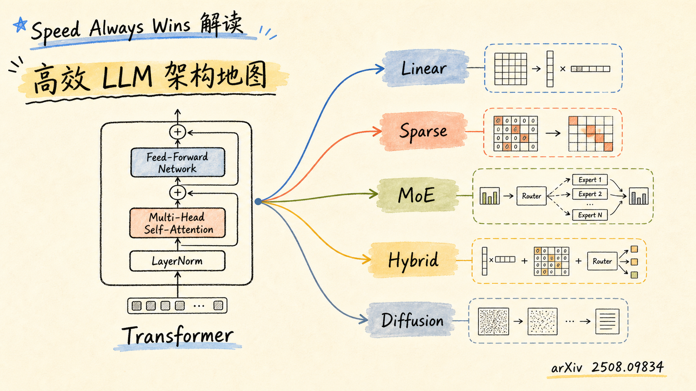

这组图把论文当成一张高效 LLM 架构地图来读。主线不是逐节罗列方法名，而是追问同一个问题：当上下文越来越长、推理链越来越深、模态越来越多时，哪些架构改造真正改变了计算和内存成本？

## 2. 为什么效率突然变硬约束

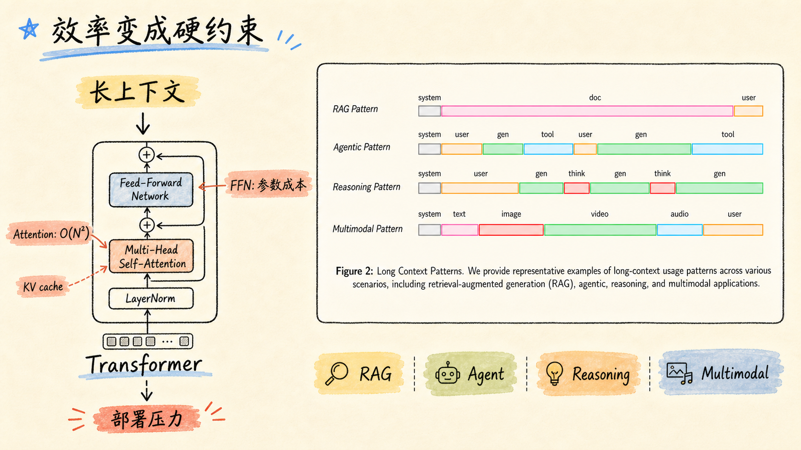

RAG、agent、reasoning 和 multimodal input 都会把序列拉长。Transformer 的 self-attention 成本随 token 数呈 $O(N^2)$ 增长，推理阶段还会叠加 KV cache 压力；FFN 和参数规模又决定了每个 token 的激活计算。效率因此不再只是加速技巧，而是模型能否落地的基础约束。

## 3. 全文地图：七条效率路线

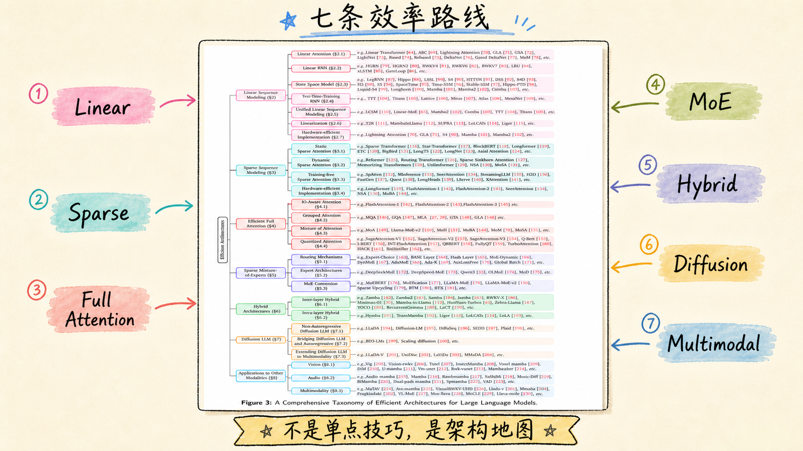

论文把高效 LLM 架构分成七条路线：Linear Sequence Modeling、Sparse Sequence Modeling、Efficient Full Attention、MoE、Hybrid Architectures、Diffusion LLM 和 Applications beyond text。它的价值在于把零散的 attention trick、状态空间模型、专家路由和生成范式放到同一张地图上比较。

## 4. Linear：把注意力写成状态更新

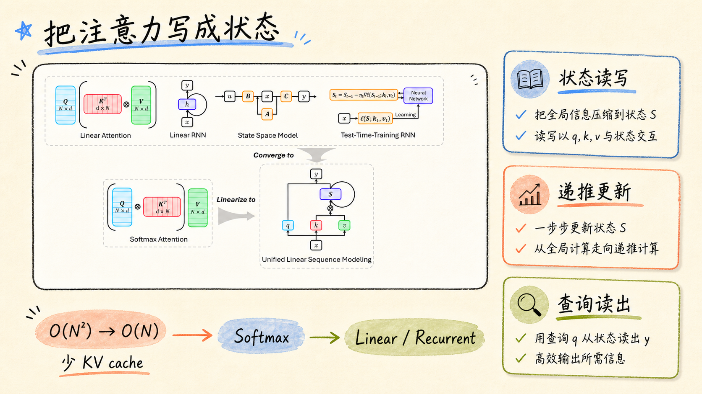

Linear sequence modeling 的共同目标，是把全局 token 交互改写成可递推的状态读写。Linear Attention、Linear RNN、SSM、TTT 等方法的细节不同，但都在尝试把复杂度从二次降到线性，并在长上下文推理时减少对巨大 KV cache 的依赖。

## 5. Linearization：复用已有 Transformer

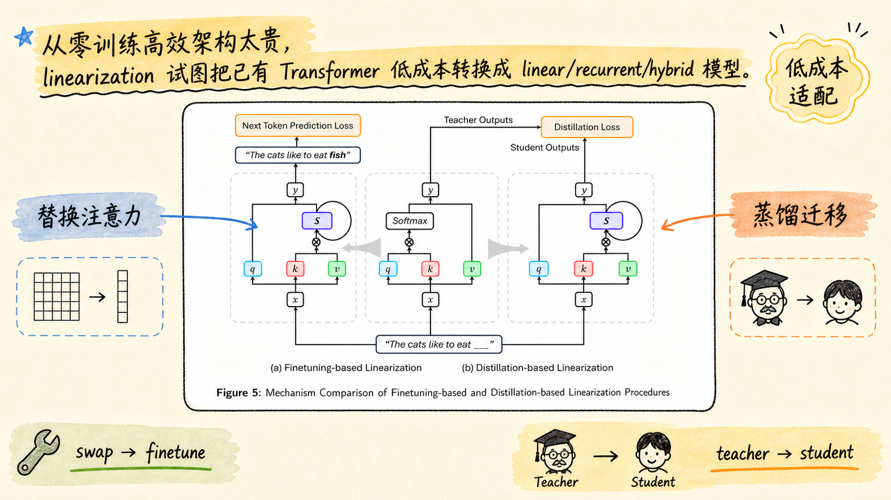

高效架构如果每次都从零预训练，成本会非常高。Linearization 关注更现实的问题：怎样把已有 Transformer 转成 linear、recurrent 或 hybrid 模型。论文整理了 finetuning-based 和 distillation-based 两条路径，本质上是在保留已有能力的同时替换计算骨架。

## 6. Sparse：不是所有 token 都互看

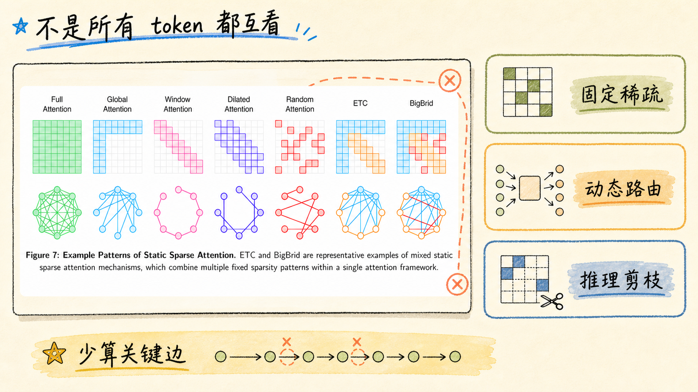

Sparse sequence modeling 的出发点很直接：长序列里并不是每个 token 都需要和所有其他 token 建边。固定窗口、块稀疏、内容动态路由、推理时剪枝分别服务不同场景。它保留了 attention 的选择性读写能力，但把计算集中到更关键的连接上。

## 7. Full Attention：不改范式，先减 IO

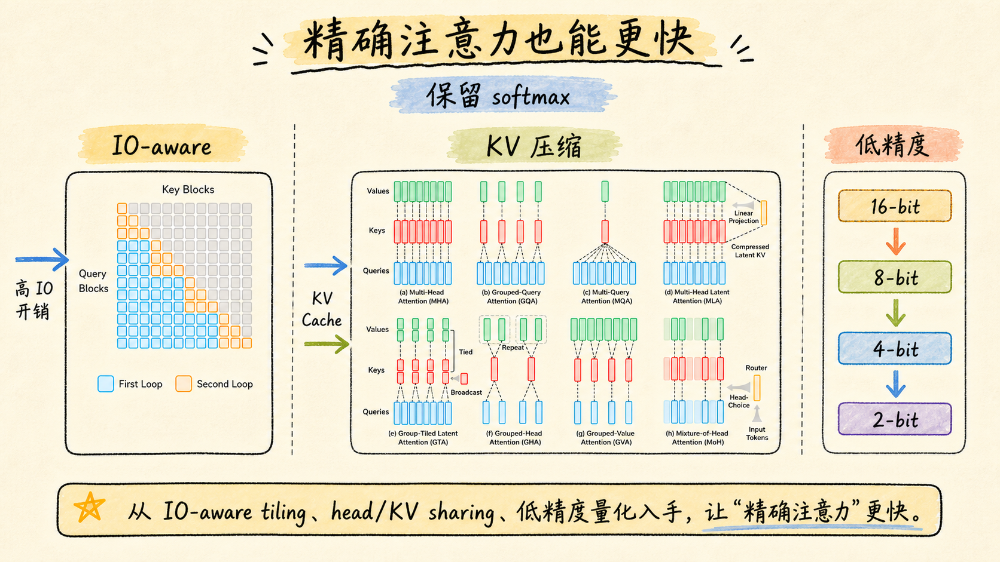

Efficient full attention 不急着放弃 softmax attention，而是先优化它的系统代价。FlashAttention 代表 IO-aware tiling，Grouped Attention 代表 head/KV sharing，Quantized Attention 代表低精度计算。共同目标是保留精确注意力语义，同时减少内存访问、KV cache 和带宽压力。

## 8. MoE：容量大，激活少

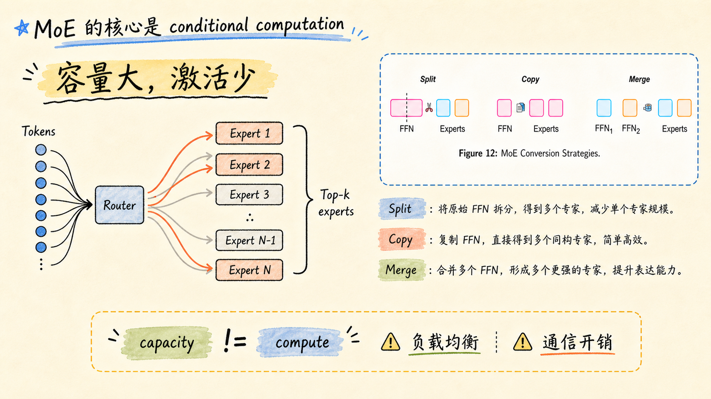

MoE 的关键是 conditional computation：模型总容量可以很大，但每个 token 只激活少数专家。这样就把“参数容量”和“实际计算量”拆开了。真正难点不在口号，而在 router 训练、负载均衡、专家通信、专家结构，以及如何从 dense model 低成本转换到 MoE。

## 9. Hybrid：现实世界的折中路线

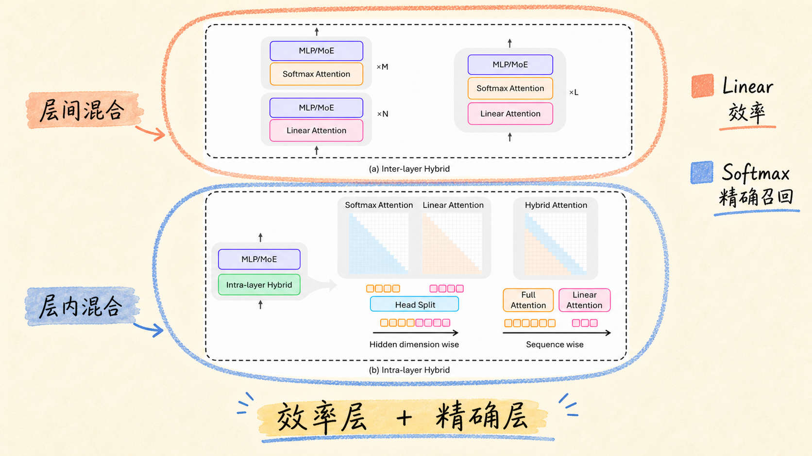

Hybrid architecture 是很工程化的一条路：用 linear、Mamba、RWKV、SSM 等层承担长上下文效率，用少量 softmax attention 层保留精确召回和表达能力。层间混合与层内混合的形态不同，但目标相同：把速度、记忆、精确交互放在同一个模型里平衡。

## 10. Diffusion LLM：跳出逐 token 解码

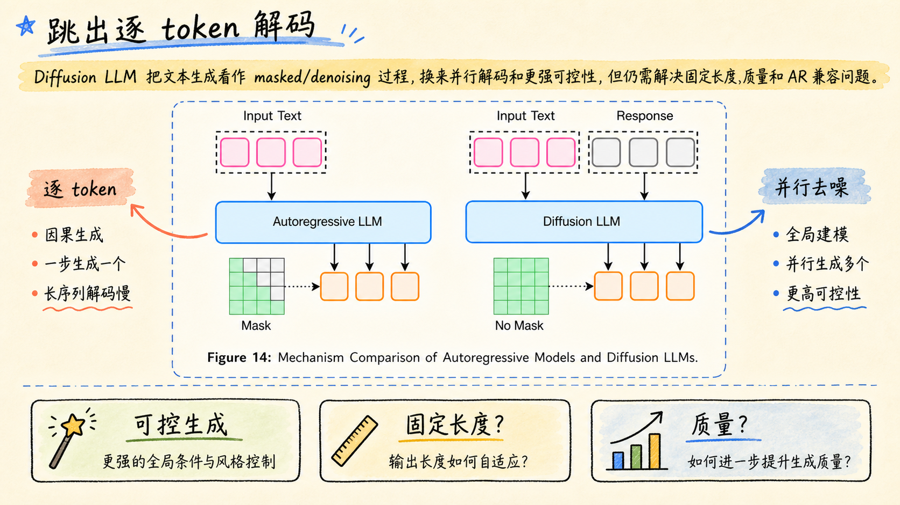

Diffusion LLM 是更激进的路线：把文本生成看作 masked/denoising 过程，而不是严格从左到右逐 token 生成。它的潜在收益是并行解码和更强的可控性，但还要处理固定长度、质量、似然建模，以及和 autoregressive 范式互补的问题。

## 11. Beyond Text：同一套效率原则外溢

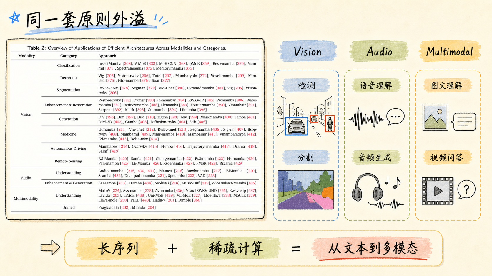

高效架构不只服务文本 LLM。Vision、audio、multimodality、VLA、agentic LLM 和 large reasoning model 都会遇到长序列、稀疏交互、专家分工和内存瓶颈。换句话说，这些方法正在从 NLP 小技巧变成基础模型的通用计算原则。

## 12. 最后的判断：快是系统命题

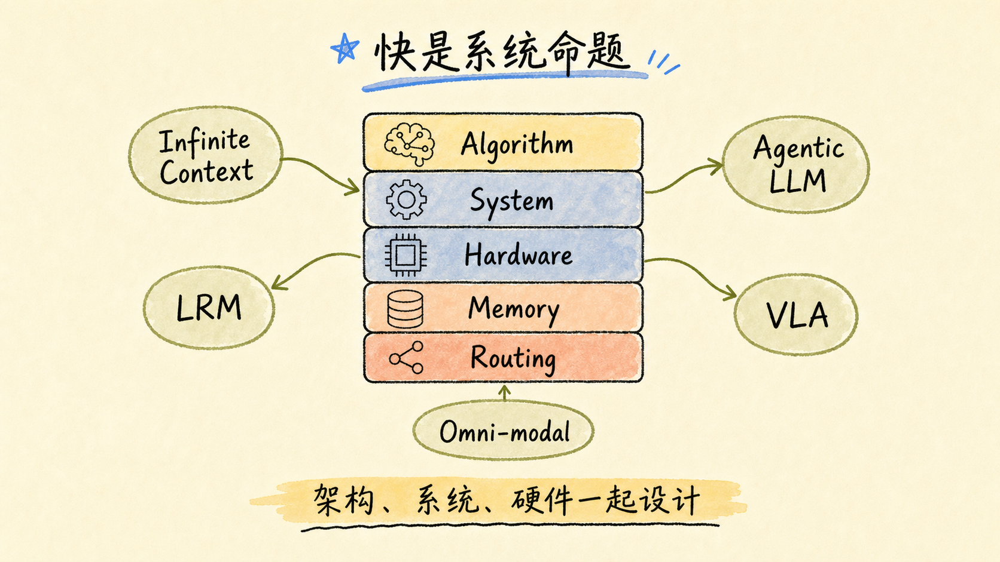

论文最后留下的判断很清楚：未来的高效 LLM 不会由单点算法单独胜出，而会由 algorithm、system、hardware、memory、routing 的联合设计决定。真正重要的不是某个模块“看起来更快”，而是整个训练和推理链路能否在长上下文、多模态和真实部署里持续变快。

## 3 个核心要点

1. Transformer 的效率瓶颈主要来自长序列 attention、KV cache 和 FFN/参数规模，长上下文与 agentic workflow 会把这些成本一起放大。
2. 高效架构不是一类方法：linear、sparse、full attention optimization、MoE、hybrid 和 diffusion 分别在改写序列交互、激活计算、生成范式和部署成本。
3. 最现实的方向很可能是组合式设计：保留少量精确 attention，加入线性或状态空间层，用 MoE 扩容量，再让系统和硬件一起参与架构选择。

## 主要来源

- [Speed Always Wins: A Survey on Efficient Architectures for Large Language Models - arXiv PDF](https://arxiv.org/pdf/2508.09834)
- [Awesome Efficient Arch - GitHub](https://github.com/weigao266/Awesome-Efficient-Arch)
