# 预训练语言模型的前世今生 - 从Word Embedding到BERT 解读

文章链接：[预训练语言模型的前世今生 - 从Word Embedding到BERT](https://www.cnblogs.com/nickchen121/p/16470569.html)

作者 / 来源：〖B站：水论文的程序猿〗 / 博客园

配套资源：[GitHub 仓库](https://github.com/nickchen121/Pre-training-language-model) / [Bilibili 主页](https://space.bilibili.com/383551518?spm_id_from=333.1007.0.0)

产物下载：[PPTX](../assets/images/yu-xun-lian-yu-yan-mo-xing-de-qian-shi-jin-sheng-cong-word-embedding-dao-bert-deck/yu-xun-lian-yu-yan-mo-xing-de-qian-shi-jin-sheng-cong-word-embedding-dao-bert-deck.pptx) / [PDF](../assets/images/yu-xun-lian-yu-yan-mo-xing-de-qian-shi-jin-sheng-cong-word-embedding-dao-bert-deck/yu-xun-lian-yu-yan-mo-xing-de-qian-shi-jin-sheng-cong-word-embedding-dao-bert-deck.pdf)

## 一句话总结

BERT 不是凭空出现的模型创新，而是 Word Embedding、上下文语言模型、Attention、Transformer 和两阶段预训练范式逐步汇合后的结果；它真正关键的拼法，是用 Transformer Encoder 做深层双向特征抽取，再用 MLM、NSP 和统一输入表示适配多类下游任务。

## 1. 从 Word Embedding 到 BERT

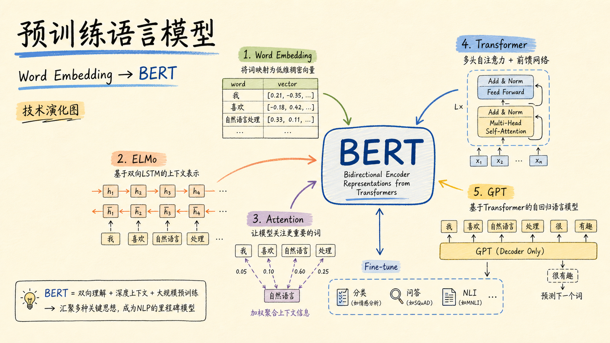

这组图把原文当作一条技术演化线来读：早期词向量解决“怎么把词变成向量”，ELMo 解决“同一个词在不同上下文里怎么变”，Transformer 解决“怎样更高效地做全局信息交互”，BERT 则把这些想法收束成一个可迁移的语言理解底座。

## 2. 一条走向 BERT 的时间线

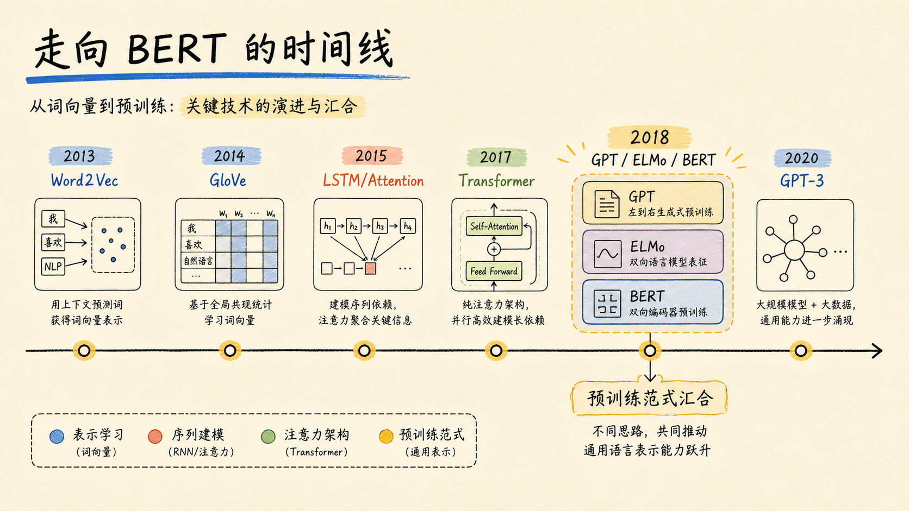

从 Word2Vec、GloVe 到 LSTM/Attention，再到 Transformer、GPT、ELMo、BERT，关键变化不是模型名越来越多，而是表示能力一步步变强：从静态词向量，到上下文表示，到可以大规模预训练并迁移到下游任务的通用编码器。

## 3. 预训练到底在迁移什么

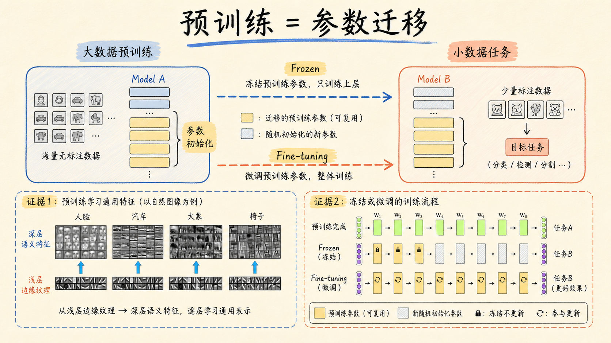

预训练的核心是参数迁移：先在大规模数据上学到通用特征，再把这些参数迁移到小数据任务。可以冻结部分层，只训练上层；也可以微调整个模型。NLP 里的 embedding 层预训练，本质上就是这个思想的早期版本。

## 4. 语言模型把问题变成概率

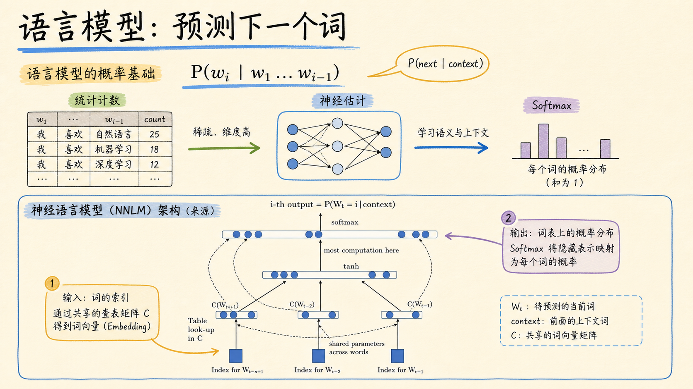

语言模型要估计一句话或下一个词的概率。传统统计方法会遇到稀疏和维度问题，神经网络语言模型则把词映射成向量，再通过隐藏层和 softmax 学习上下文到词概率的映射。后来的预训练语言模型仍然站在这个基础上。

## 5. Word Embedding 是第一代预训练

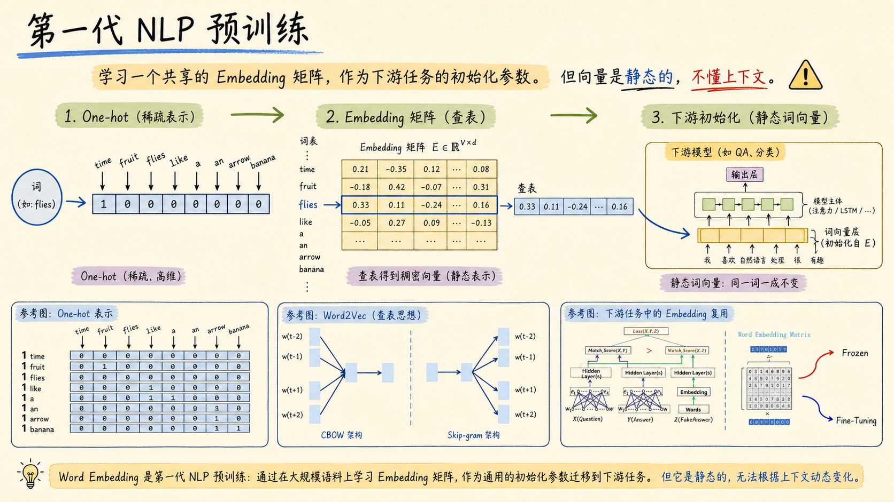

One-hot 能表示“哪个词出现了”，但不能表达词之间的相似性。Word Embedding 把词变成稠密向量，并且可以把大规模语料学到的 embedding 矩阵迁移到下游任务。它的限制也很明显：同一个词通常只有一个静态向量，难以处理一词多义。

## 6. 上下文让词义动起来

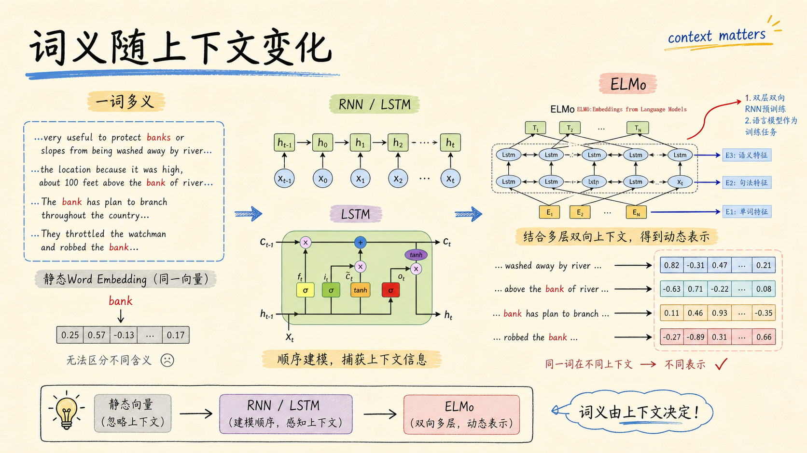

RNN/LSTM 把序列顺序引入表示学习，ELMo 进一步用双向语言模型生成上下文相关表示。同一个词在不同句子中可以得到不同向量，这一步把 NLP 预训练从“静态查表”推向“动态理解上下文”。

## 7. Attention 的最小内核

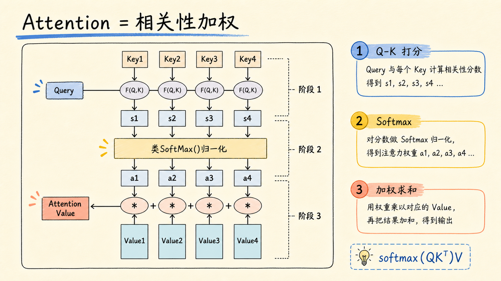

Attention 可以理解成一次可微的信息检索：Query 和 Key 计算相关性，softmax 得到注意力权重，再对 Value 加权求和。这个机制让模型不必只依赖固定长度隐藏状态，而是可以按内容选择需要读取的信息。

## 8. Self / Masked / Multi-head

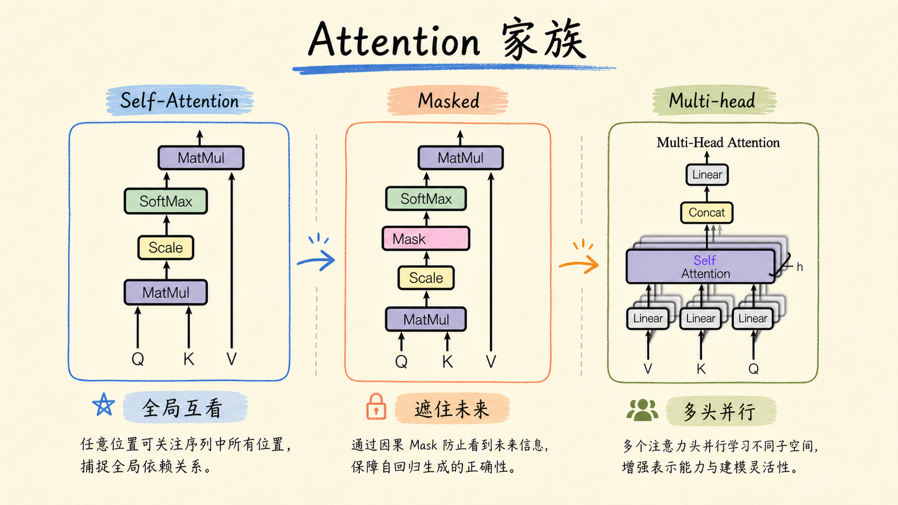

Self-Attention 让序列内部 token 互相读取；Masked Attention 遮住未来信息，适合自回归生成；Multi-head Attention 则让多个注意力头在不同子空间里并行学习关系。Transformer 正是把这些注意力变体组织成了可堆叠结构。

## 9. Transformer 把 Attention 堆成架构

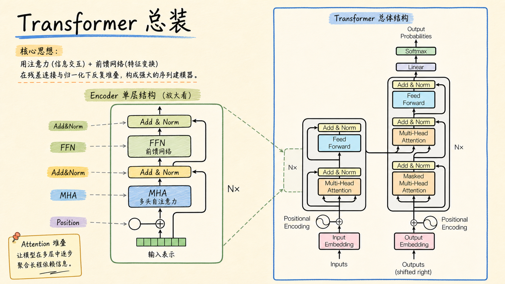

Transformer 的核心不是单个 attention 公式，而是完整架构：Position Encoding 补顺序，Multi-Head Attention 做 token 间信息交互，FFN 做逐 token 特征变换，Residual 和 LayerNorm 稳定深层堆叠。BERT 后来选择的正是 Transformer Encoder 这条路。

## 10. GPT 走单向生成路线

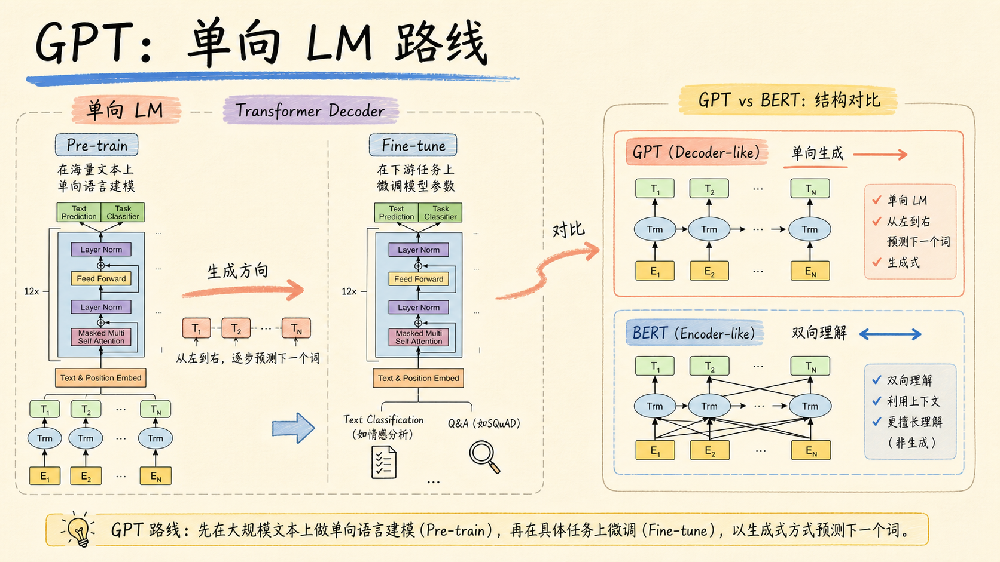

GPT 也采用预训练 + fine-tuning 的两阶段范式，但训练目标偏单向语言模型，更像 Transformer Decoder 路线：从左到右预测下一个词。它证明了大规模预训练的迁移价值，也为后面和 BERT 的路线分歧提供了参照。

## 11. BERT 的关键拼法

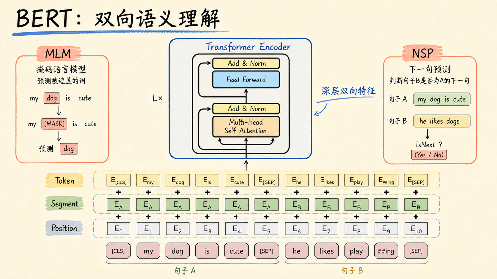

BERT 的核心拼法是 Transformer Encoder + 双向语义理解 + 两个预训练任务。MLM 通过遮住部分 token 让模型利用双向上下文预测词，NSP 则让模型学习句子间关系。输入侧把 Token、Segment、Position 三类 embedding 相加，形成统一表示。

## 12. 一个底座，四类任务

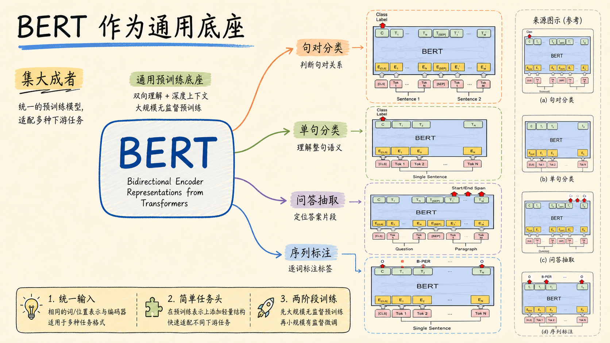

BERT 的普适性来自“一个预训练底座 + 少量任务头”：句对分类、单句分类、文本问答、序列标注等任务，都可以通过输入格式和输出层的小改造接入同一个 Encoder 表示。它因此成为后续 NLP 预训练范式的重要基线。

## 3 个核心要点

1. Word Embedding 解决了离散词到连续向量的问题，但静态词向量无法表达上下文语义变化。
2. ELMo、Attention 和 Transformer 分别补上了动态上下文、内容选择和可并行堆叠的序列建模能力。
3. BERT 的关键不是单个组件，而是把 Transformer Encoder、MLM/NSP、统一输入表示和下游微调范式组合成通用语言理解底座。

## 主要来源

- [预训练语言模型的前世今生 - 从Word Embedding到BERT](https://www.cnblogs.com/nickchen121/p/16470569.html)
- [Pre-training-language-model - GitHub](https://github.com/nickchen121/Pre-training-language-model)

