# A Programming Paradigm for Spatiotemporal Composability 解读（Part 1：问题与 Context Paradigm）

论文链接：[GitHub 仓库](https://github.com/cordiverse/paper) / [PDF](https://raw.githubusercontent.com/cordiverse/paper/main/paper.pdf)

作者：Yifan Shi, Wei Zhang, Tianyi Cui

版本：GitHub `paper.pdf`，PDF 生成时间为 2026-08-13

系列导航：Part 1（本文） / [Part 2：组件演算与元理论](2026-08-14-a-programming-paradigm-for-spatiotemporal-composability-part-2-deck.html) / [Part 3：Cordis 实现与系统意义](2026-08-14-a-programming-paradigm-for-spatiotemporal-composability-part-3-deck.html)

产物下载：[PPTX](../assets/images/a-programming-paradigm-for-spatiotemporal-composability-part-1-deck/a-programming-paradigm-for-spatiotemporal-composability-part-1-deck.pptx) / [PDF](../assets/images/a-programming-paradigm-for-spatiotemporal-composability-part-1-deck/a-programming-paradigm-for-spatiotemporal-composability-part-1-deck.pdf)

## 一句话总结

这篇论文想解决的是动态软件系统的根问题：组件会不断装载、卸载、热更新、相互依赖，但传统程序范式往往只擅长描述静态组合；论文提出的 Context Paradigm 试图把状态、可回滚副作用和反应式依赖都放进同一个运行时语境里。

## 1. Part 1：从问题开始

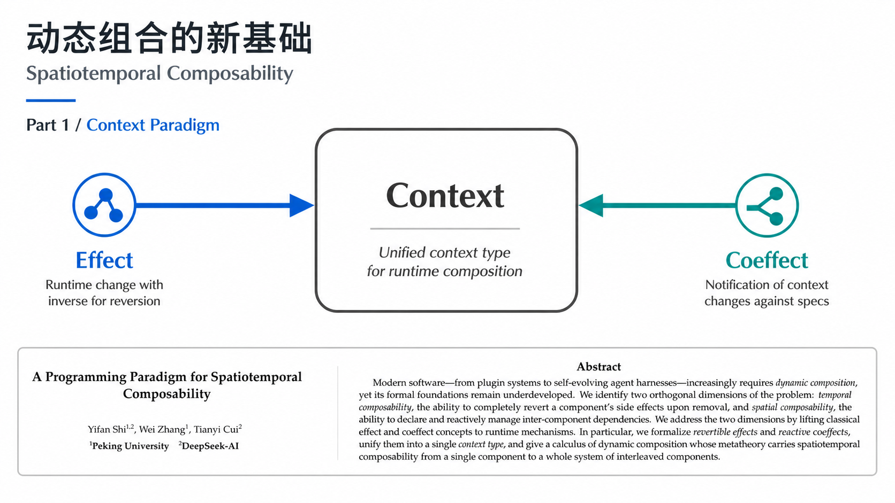

第一部分只回答一个问题：为什么动态组合不能只靠“重启一下”解决？论文把真实系统看成持续运行的 context，而组件只是不断进入、离开、替换这个 context 的局部结构。

## 2. 为什么不能重启

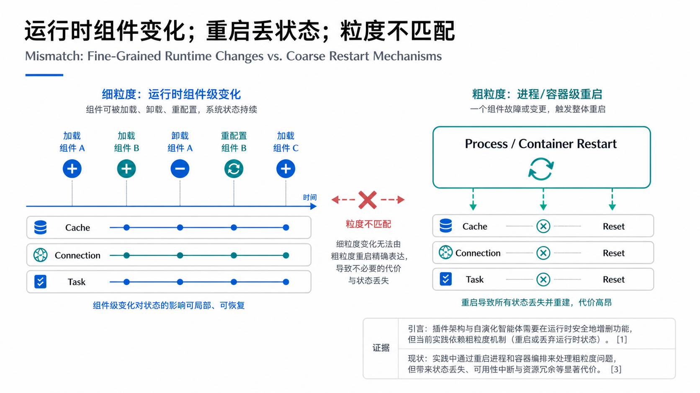

重启当然能回到干净状态，但代价是丢失运行中的连接、缓存、任务、会话和外部副作用。对机器人、插件平台、agent harness 这类系统来说，真正需要的是局部替换：只撤销相关组件的影响，同时保持其他部分继续运行。

## 3. 两条组合轴

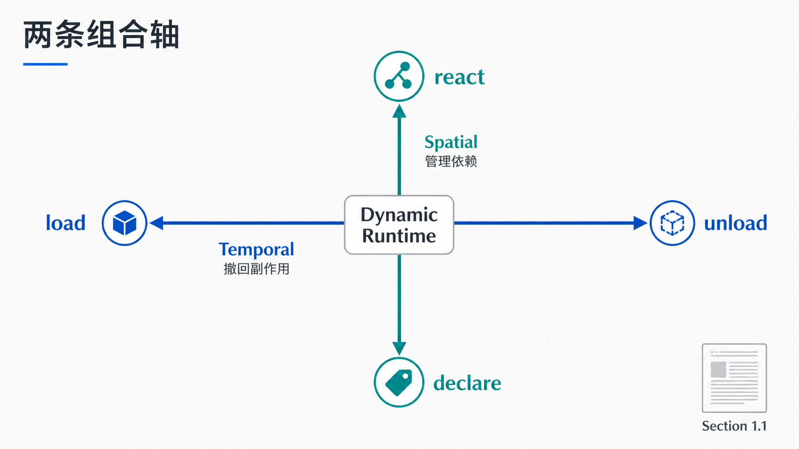

论文把问题拆成两条轴：temporal composability 关心“一个组件多次进入和离开时，副作用能否恢复”；spatial composability 关心“多个组件同时存在时，依赖和卸载顺序能否保持一致”。

## 4. 两个入口：Effect 与 Coeffect

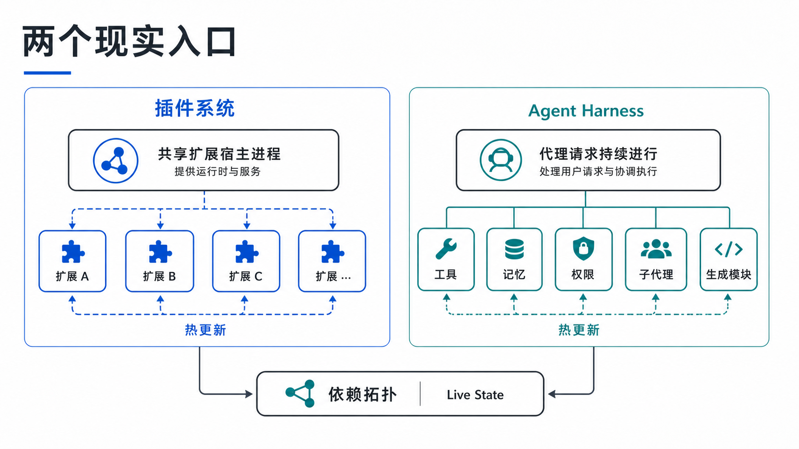

Effect 是组件对世界做了什么，coeffect 是组件从上下文读取了什么。论文的关键不是重新发明这两个词，而是把它们放到动态生命周期里：写入要可撤销，读取要可追踪。

## 5. 静态组合的三根柱子

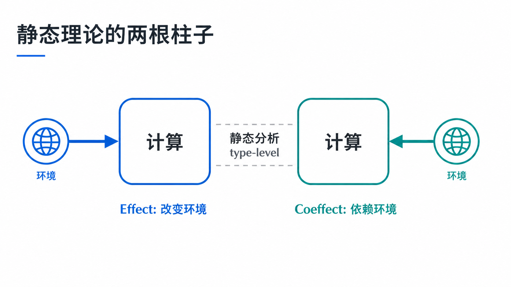

在静态视角下，组件可以声明依赖、提供能力、产生效果。这种描述能帮助构建依赖图，但还不够，因为它没有说明运行中如何安全撤销、重载和通知依赖者。

## 6. 从静态描述走向运行时

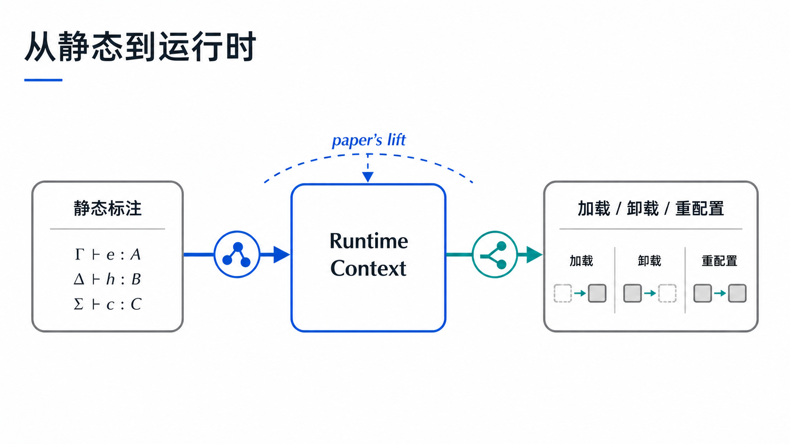

论文的转折点是把组件声明投射到 runtime：每个组件实例需要身份、状态、父子关系、清理函数和当前视图。换句话说，组合不再只是构建阶段的事情，而是持续发生的调度过程。

## 7. Revertible Effects

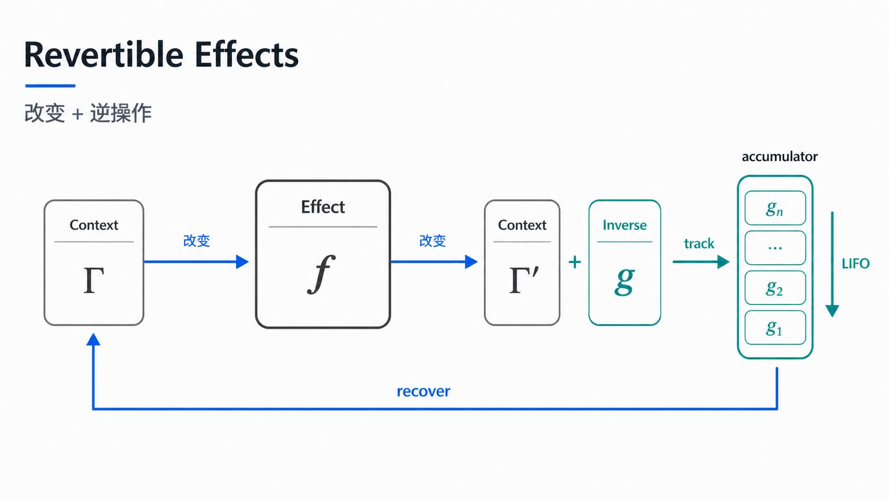

可回滚 effect 的核心约定很简单：做一件事时，同时登记如何撤销它。这样组件卸载时，运行时不必猜测它留下了什么，而是沿着清理路径把局部影响收回。

## 8. Effect 如何组合

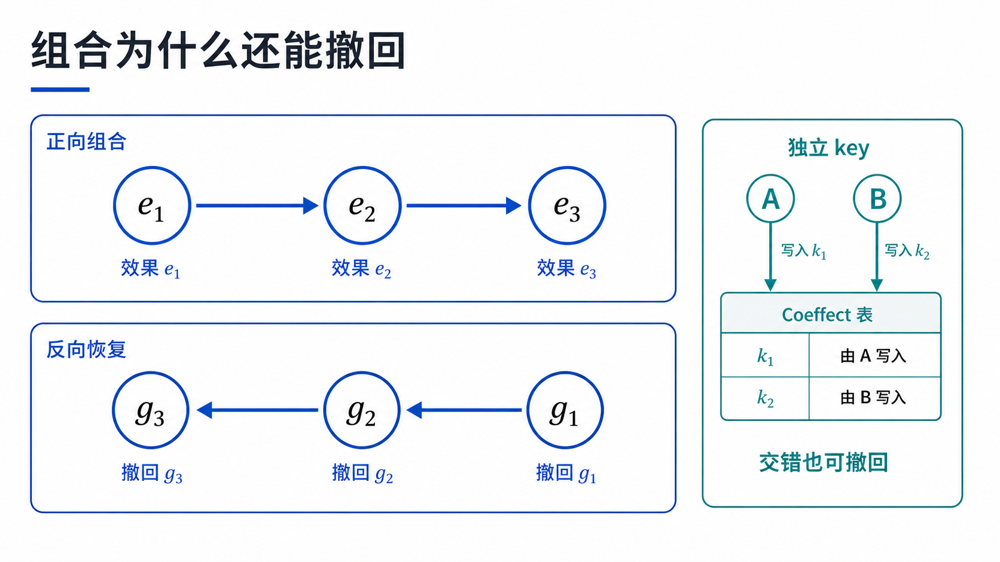

单个 effect 可回滚还不够，多个 effect 必须能按顺序组合。论文把这一点和生命周期绑定：装载时正向执行，卸载时反向清理，避免后创建的资源依赖已经被提前释放的资源。

## 9. Reactive Coeffects

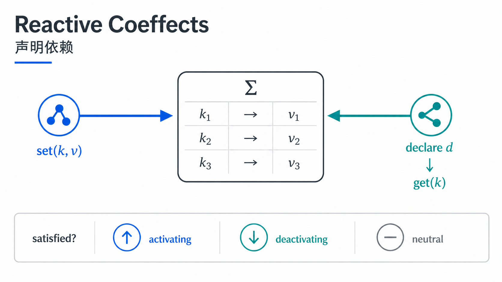

coeffect 的运行时含义是“我读过这个上下文键”。当 provider 改变时，读过它的 consumer 需要被通知和刷新。这样依赖关系不是靠人工维护，而是在访问 context 时自然记录下来。

## 10. 隔离与拦截

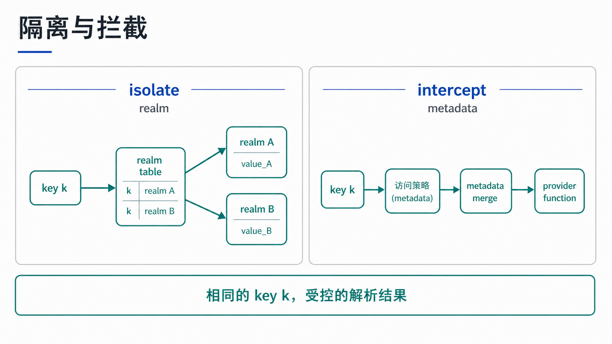

动态系统还需要隔离边界：组件只能看见它应当看见的 context，同时运行时可以拦截访问，记录依赖、检查生命周期状态、阻止无效读取。Context 因此既是能力容器，也是调度边界。

## 11. Context Paradigm

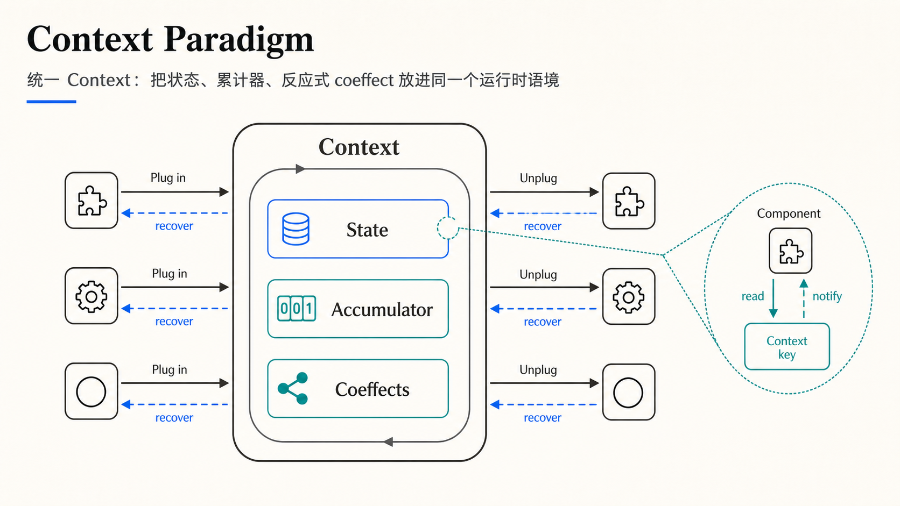

Context Paradigm 的统一点在这里：state 负责当前事实，accumulator 负责组合结果，coeffects 负责记录读依赖。组件进入 context 时产生影响，离开时恢复影响，读取 context 时留下反应式依赖。

## 12. Part 1 小结

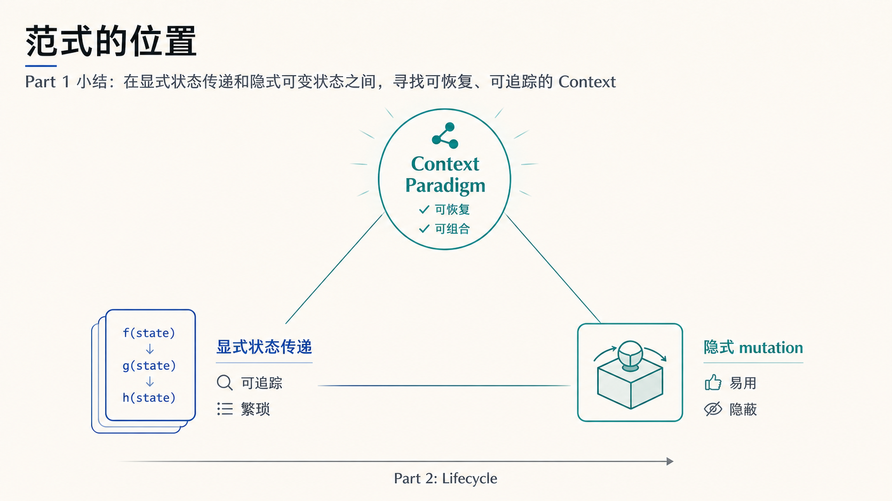

这篇论文不是简单地在显式状态传递和隐式全局状态之间二选一。它想要第三种路径：保留 context 的易用性，同时让状态读写、服务依赖和副作用都能被运行时追踪、恢复和重新调度。

## 3 个核心要点

1. 动态组合的难点不是“怎么加载插件”，而是组件持续变化时，副作用、依赖和局部状态能否被系统性恢复。
2. Temporal composability 解决时间上的进入和退出，spatial composability 解决空间上的依赖排序；两者缺一不可。
3. Context Paradigm 的价值在于把 state、effect、coeffect 统一成运行时可观察的结构，为 Part 2 的组件演算打基础。

## 主要来源

- [A Programming Paradigm for Spatiotemporal Composability - GitHub](https://github.com/cordiverse/paper)
- [paper.pdf](https://raw.githubusercontent.com/cordiverse/paper/main/paper.pdf)
