# A Programming Paradigm for Spatiotemporal Composability 解读（Part 2：组件演算与元理论）

论文链接：[GitHub 仓库](https://github.com/cordiverse/paper) / [PDF](https://raw.githubusercontent.com/cordiverse/paper/main/paper.pdf)

作者：Yifan Shi, Wei Zhang, Tianyi Cui

版本：GitHub `paper.pdf`，PDF 生成时间为 2026-08-13

系列导航：[Part 1：问题与 Context Paradigm](2026-08-14-a-programming-paradigm-for-spatiotemporal-composability-part-1-deck.html) / Part 2（本文） / [Part 3：Cordis 实现与系统意义](2026-08-14-a-programming-paradigm-for-spatiotemporal-composability-part-3-deck.html)

产物下载：[PPTX](../assets/images/a-programming-paradigm-for-spatiotemporal-composability-part-2-deck/a-programming-paradigm-for-spatiotemporal-composability-part-2-deck.pptx) / [PDF](../assets/images/a-programming-paradigm-for-spatiotemporal-composability-part-2-deck/a-programming-paradigm-for-spatiotemporal-composability-part-2-deck.pdf)

## 一句话总结

Part 2 是论文的形式化主体：它把组件声明、运行时身份、生命周期动作和依赖顺序写成一个小演算，用来说明动态组件系统在什么条件下不会卡死，并且在不同合法执行交错下收敛到同一个安静状态。

## 1. Part 2：组件演算与元理论

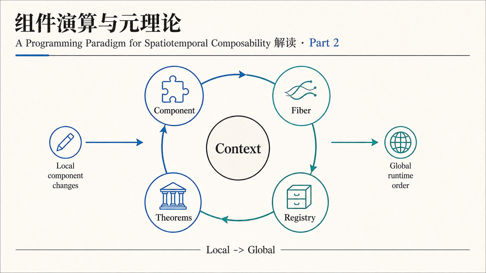

这一部分把 Part 1 的直觉落到形式系统上。局部组件声明会被提升成全局生命周期调度，运行时不再靠约定俗成，而是有一组可讨论、可证明的规则。

## 2. Component = d / p / e

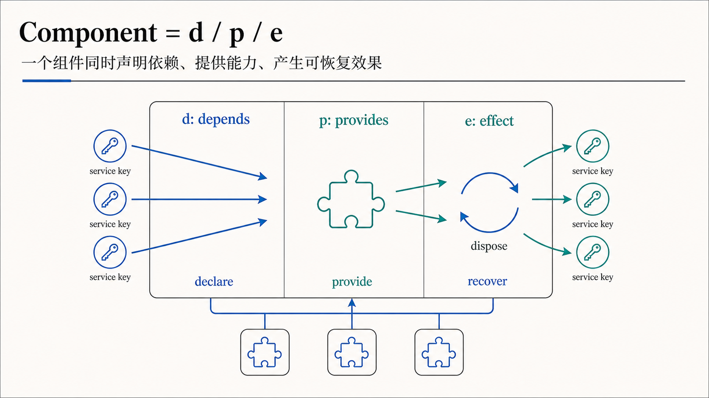

论文把组件抽象成三类信息：依赖什么、提供什么、产生什么 effect。这个三元结构看似朴素，但它给后面的依赖图、provider/consumer 关系和卸载顺序提供了统一入口。

## 3. Fiber：组件的运行时身份

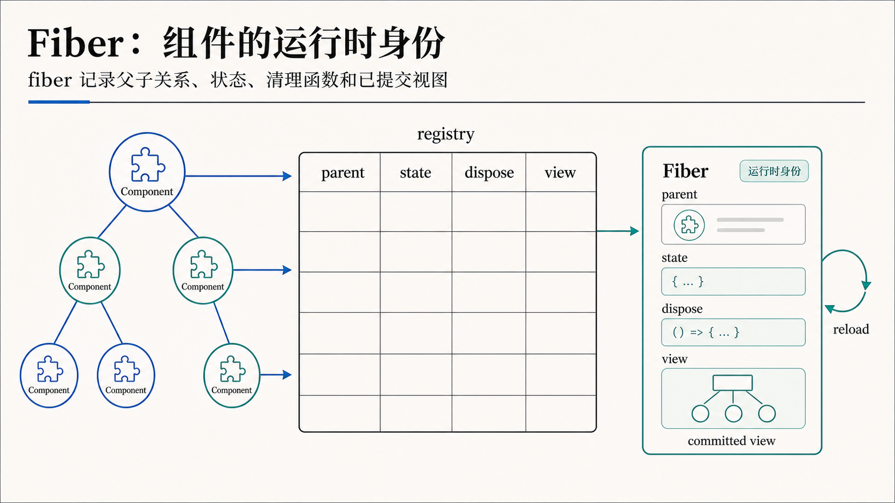

fiber 是组件实例在运行时的身份。它记录 parent、state、dispose 和 committed view。没有 fiber，系统只能知道“有个组件定义”；有了 fiber，系统才能知道“这个组件实例现在处在什么生命周期位置”。

## 4. Target View

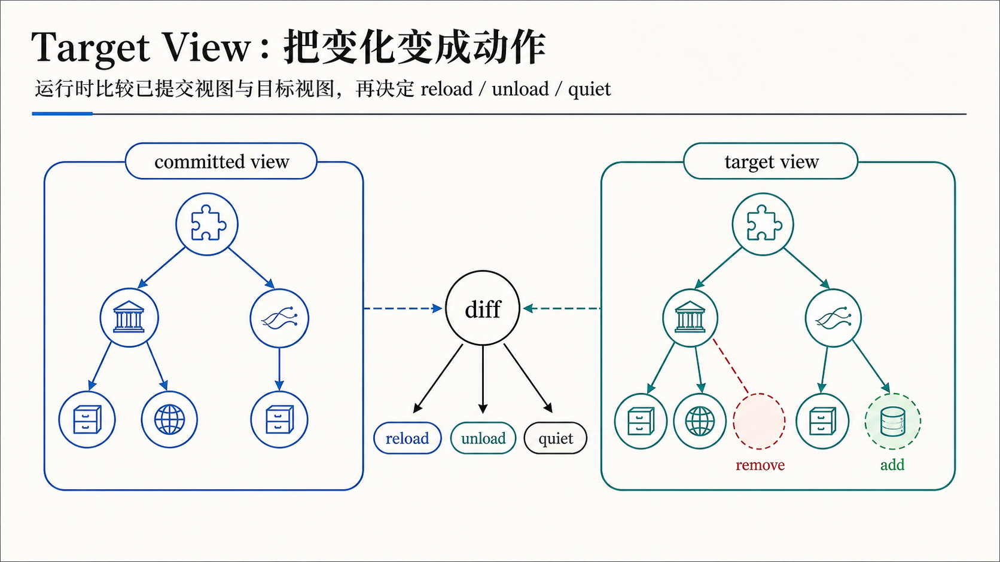

动态调度的核心动作是比较 committed view 和 target view。差异不是直接乱改全局状态，而是被翻译成 reload、unload 或 quiet 这类生命周期动作。

## 5. Base Calculus

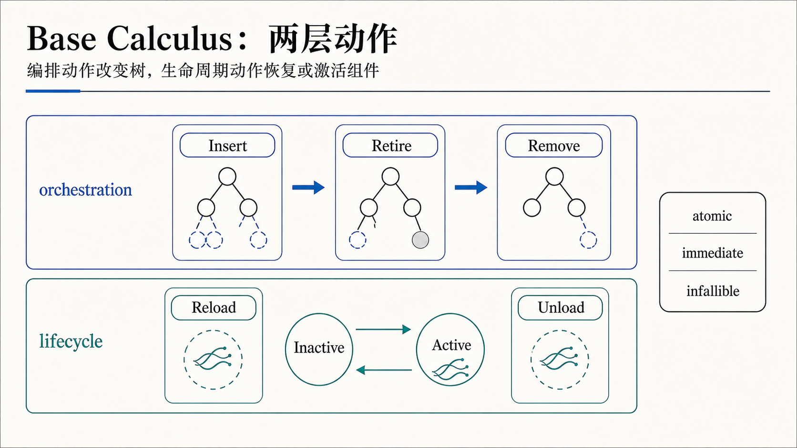

演算里有两层动作：orchestration 改变组件树，lifecycle 改变 fiber 状态。前者决定结构怎样变化，后者决定组件怎样安全进入或退出运行态。

## 6. 为什么需要 Unloading

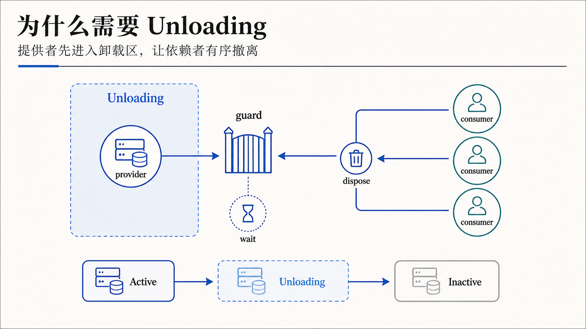

Unloading 是 Part 2 里很关键的中间态。provider 不能一消失就让 consumer 悬空；它需要先进入卸载区，等待依赖者有序 dispose，然后再真正转入 inactive。

## 7. 真实运行时的四个状态

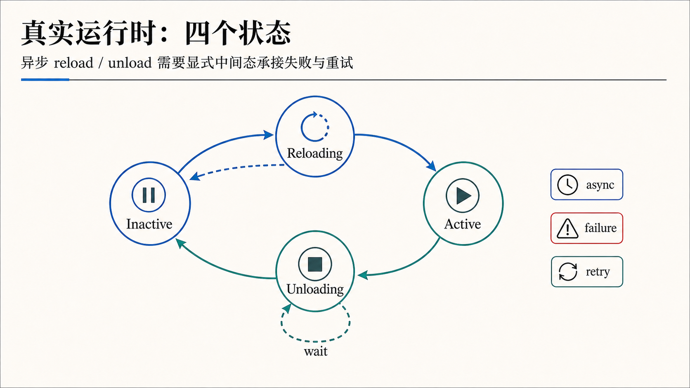

真实实现里 reload 和 unload 往往是异步的，也可能失败或重试。因此运行时不能只有 active/inactive 两态，还要显式表示 Reloading 和 Unloading，承接中间过程。

## 8. 规则就是对 Registry 的写入

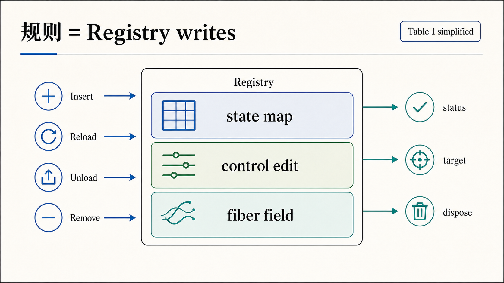

形式规则最终会落成 registry 上的少量写入：状态表怎么改、target 怎么改、dispose 怎么登记。这个视角很工程化，也解释了为什么这套演算可以直接映射到 Cordis。

## 9. 两个保证

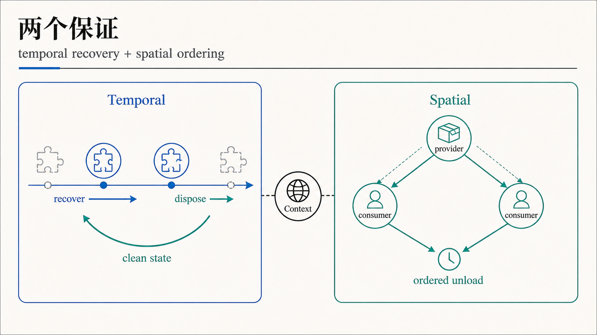

论文希望同时拿到两个保证：时间上，组件进入和退出后能够恢复到干净状态；空间上，provider 和 consumer 的依赖顺序不会被卸载过程破坏。

## 10. Progress：不会卡死

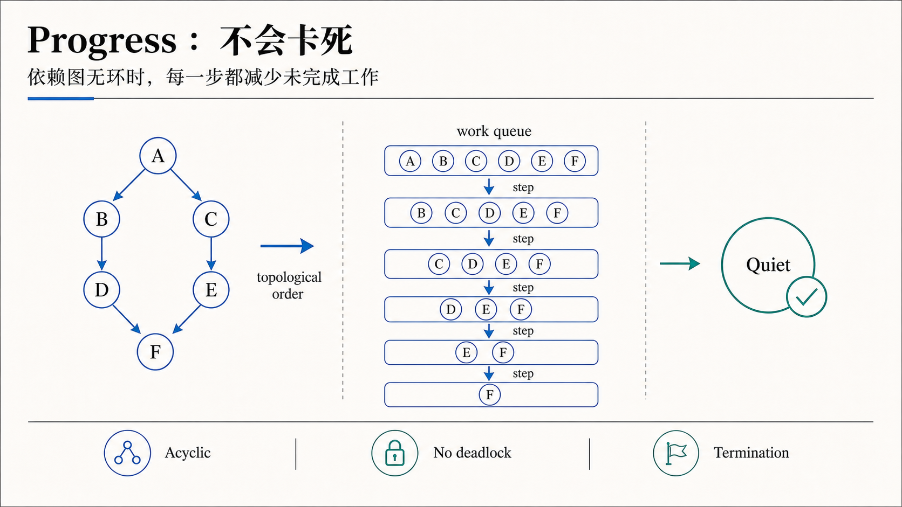

在依赖图无环等条件下，每一步调度都能减少未完成工作，系统最终会走到 quiet。这个结论不是说所有现实系统都自动安全，而是给出了运行时需要维护的结构性前提。

## 11. Confluence：执行顺序不应改变结果

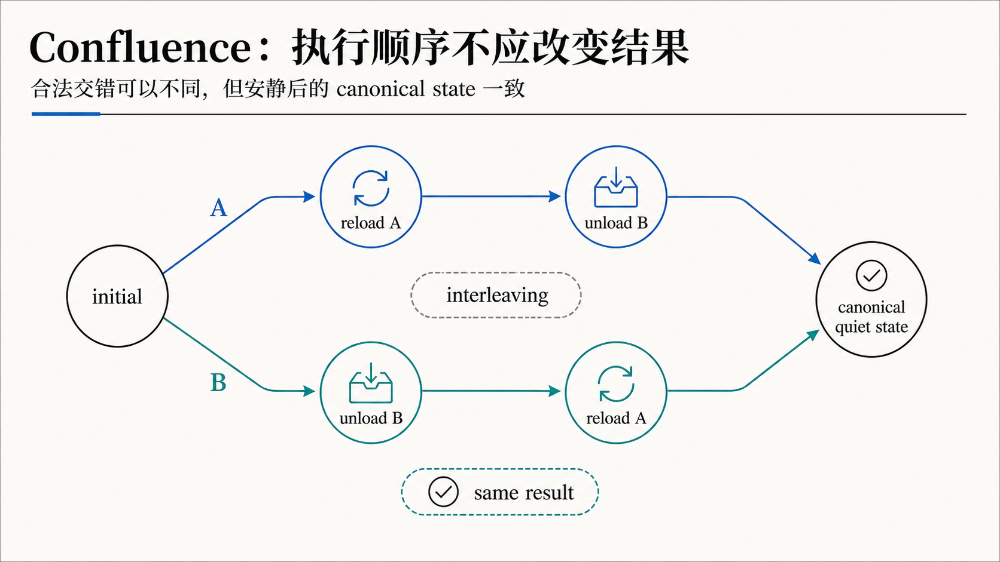

动态系统里不同事件可能交错发生。Confluence 关注的是：只要交错合法，最终安静状态应当一致。这对插件系统和热更新尤其重要，因为它们不可能假设所有变化严格串行、完全可预测。

## 12. Part 2 小结

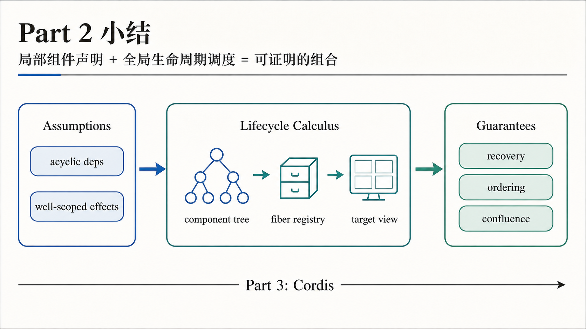

Part 2 的主线可以压缩成一句话：局部组件声明通过 fiber registry 和 target view 变成全局生命周期调度，再通过 progress、ordering 和 confluence 给动态系统一个可验证的骨架。

## 3 个核心要点

1. 组件声明只说明“想要什么”和“提供什么”，fiber 才让运行时知道组件实例当前该 reload、unload 还是保持 quiet。
2. Unloading 不是实现细节，而是保证依赖者先撤离、provider 后消失的空间排序机制。
3. Progress 和 confluence 把动态更新从经验工程提升成可分析对象，为 Part 3 的 Cordis 实现提供了理论接口。

## 主要来源

- [A Programming Paradigm for Spatiotemporal Composability - GitHub](https://github.com/cordiverse/paper)
- [paper.pdf](https://raw.githubusercontent.com/cordiverse/paper/main/paper.pdf)
