# A Programming Paradigm for Spatiotemporal Composability 解读（Part 3：Cordis 实现与系统意义）

论文链接：[GitHub 仓库](https://github.com/cordiverse/paper) / [PDF](https://raw.githubusercontent.com/cordiverse/paper/main/paper.pdf)

作者：Yifan Shi, Wei Zhang, Tianyi Cui

版本：GitHub `paper.pdf`，PDF 生成时间为 2026-08-13

系列导航：[Part 1：问题与 Context Paradigm](2026-08-14-a-programming-paradigm-for-spatiotemporal-composability-part-1-deck.html) / [Part 2：组件演算与元理论](2026-08-14-a-programming-paradigm-for-spatiotemporal-composability-part-2-deck.html) / Part 3（本文）

产物下载：[PPTX](../assets/images/a-programming-paradigm-for-spatiotemporal-composability-part-3-deck/a-programming-paradigm-for-spatiotemporal-composability-part-3-deck.pptx) / [PDF](../assets/images/a-programming-paradigm-for-spatiotemporal-composability-part-3-deck/a-programming-paradigm-for-spatiotemporal-composability-part-3-deck.pdf)

## 一句话总结

Part 3 说明这篇论文不是停在演算层面：Cordis 把 context、component、recover 和 target view 映射成实际 API 与运行时结构，并用 loader、HMR 和 Koishi 插件生态展示这套范式如何服务持续演化的软件系统。

## 1. Part 3：Cordis 实现与系统意义

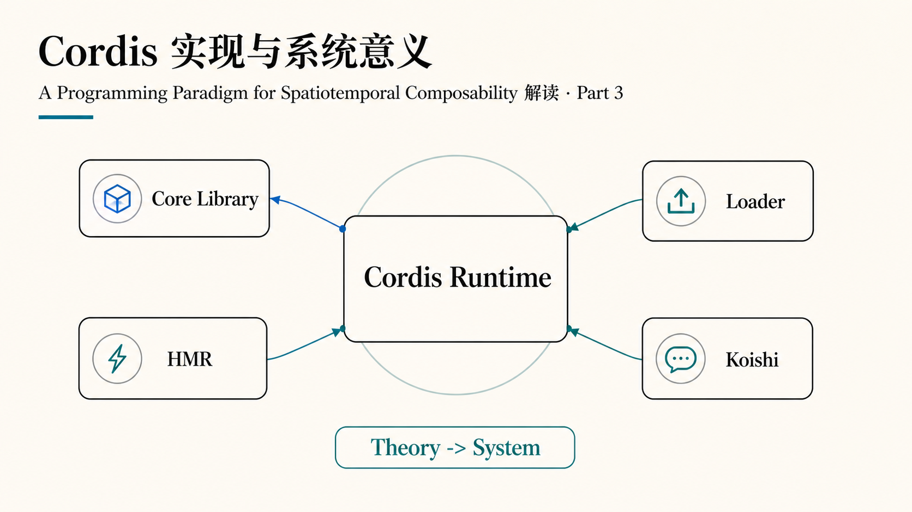

第三部分从理论走向系统：核心库管理 context 和 fiber，loader 负责配置树变化，HMR 负责热更新事务，Koishi 则提供一个长期演化的大插件生态案例。

## 2. 从演算到 Cordis

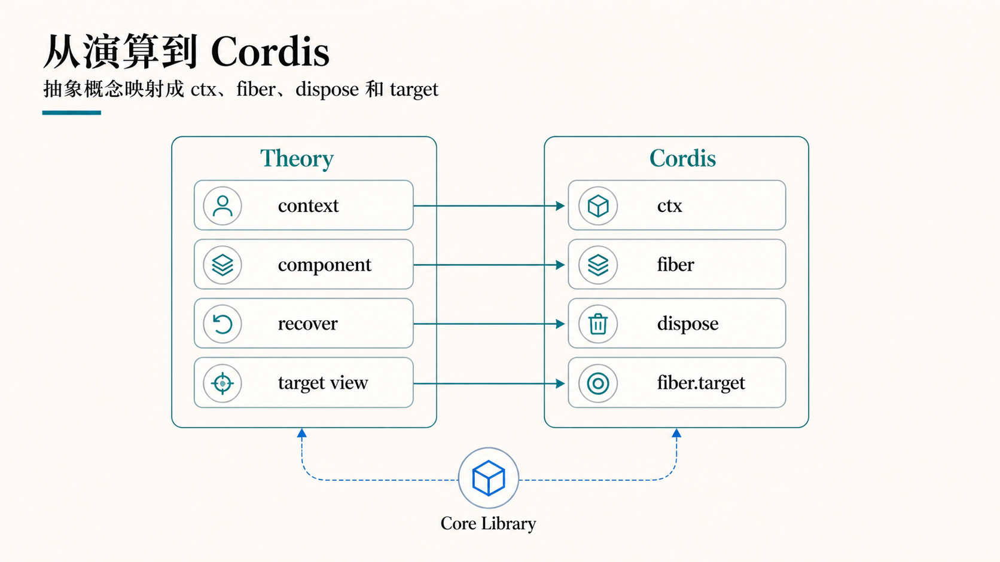

抽象概念在 Cordis 里都有对应物：context 变成 `ctx`，component 变成 fiber 管理的运行时实例，recover 变成 dispose 组合，target view 变成 fiber 的目标结构。

## 3. ctx.effect()

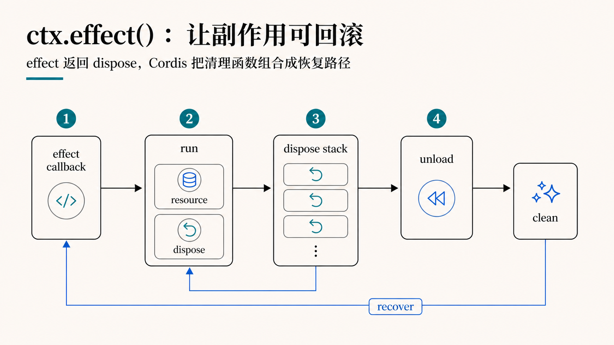

`ctx.effect()` 的意义是把副作用变成有恢复路径的操作。组件执行 effect 时返回清理函数，运行时把这些 dispose 函数组合起来，在 unload 时反向执行。

## 4. set / get / notify

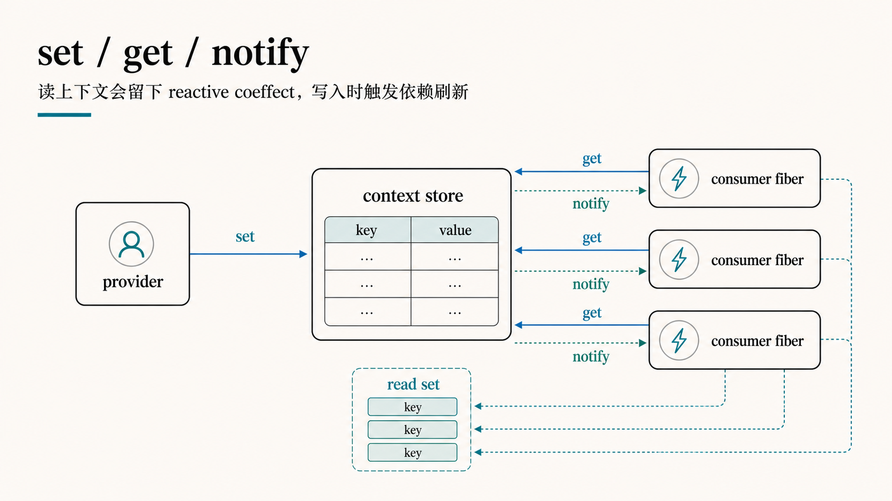

Cordis 的 context 访问不是普通字典读写。`get` 会留下 read set，`set` 会触发 notify，相关 consumer fiber 会被 refresh。这样 coeffect 从概念变成了运行时依赖追踪。

## 5. ctx.use()

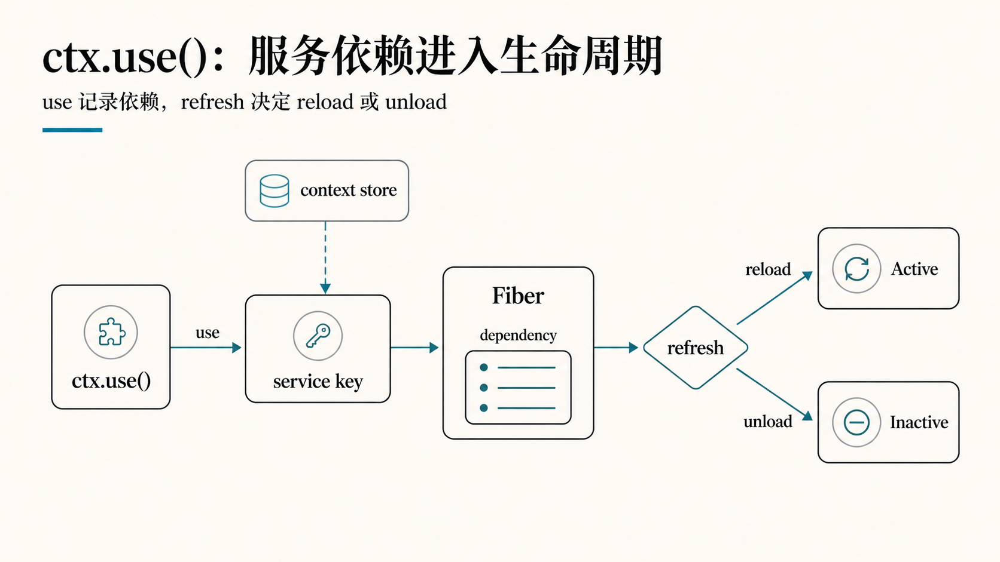

`ctx.use()` 把服务依赖纳入生命周期。组件读取服务键后，fiber 记录 dependency；当 provider 变化时，refresh 决定当前组件应该 reload、unload，还是继续 active。

## 6. Context Access

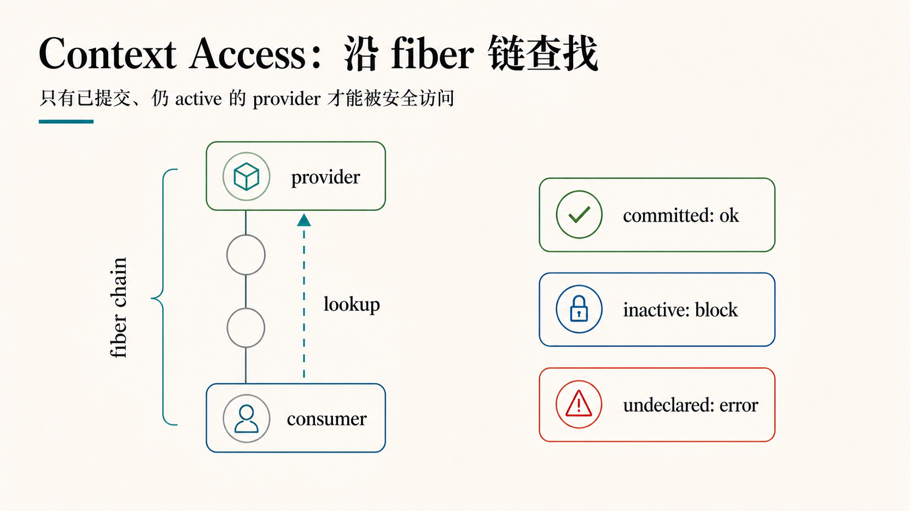

Context 访问沿 fiber 链查找 provider，但只有已经提交且仍 active 的 provider 才能被安全访问。这个规则防止组件读到正在卸载、尚未声明或生命周期不一致的服务。

## 7. Loader Reconciliation

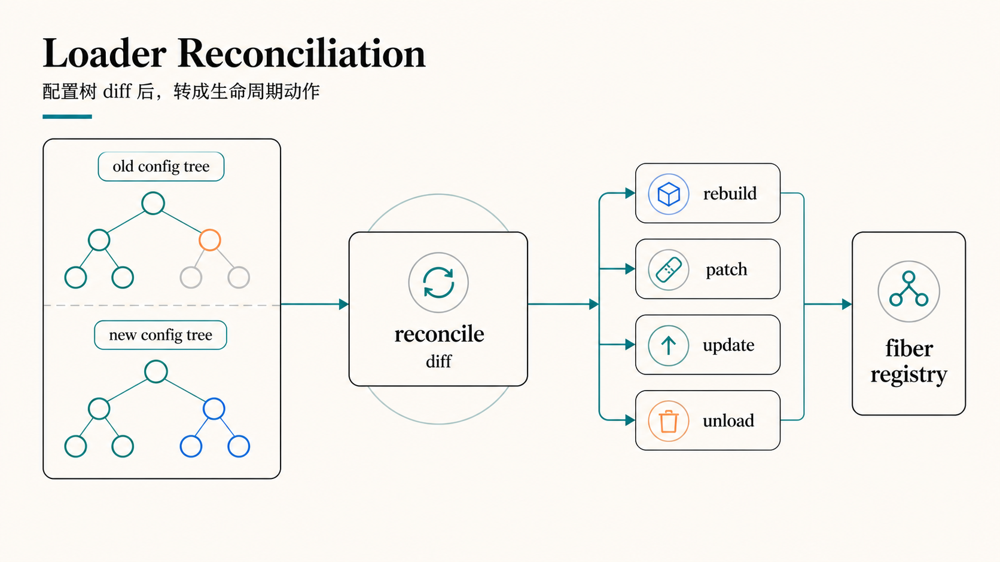

loader 把配置树变化转成生命周期动作。旧树和新树先 diff，再决定哪些 fiber 需要 rebuild、patch、update 或 unload。这就是 target view 思想在配置驱动系统里的落地。

## 8. HMR Transaction

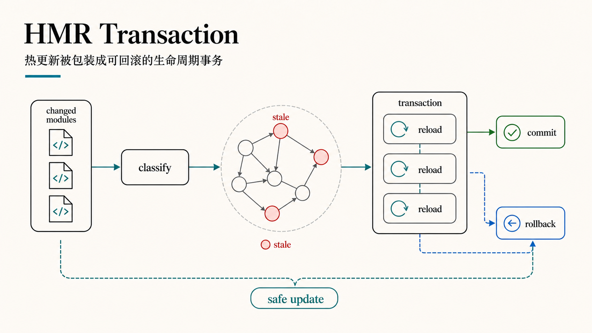

热更新在 Cordis 里被包装成事务：先分类变更模块，找出 stale 节点，再按依赖关系 reload。失败时 rollback，成功时 commit。它不是简单替换文件，而是生命周期调度。

## 9. Koishi 案例

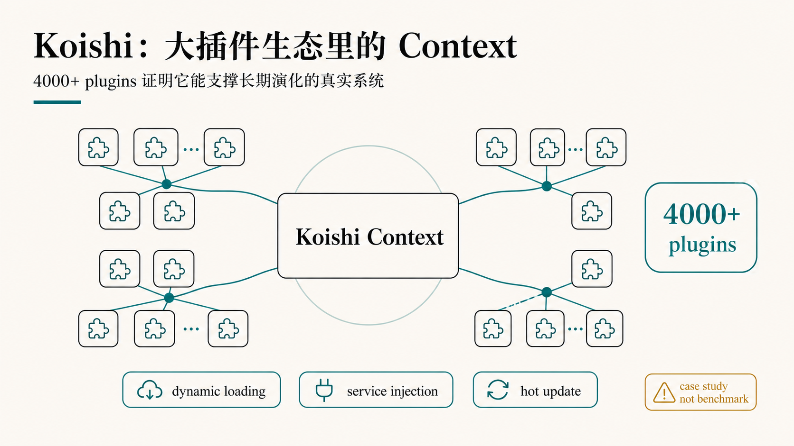

论文把 Koishi 作为真实系统案例：4000+ plugins 说明这套 context 机制经受了长期插件生态的压力。不过它更像 case study，而不是严格 benchmark；重点是展示动态加载、服务注入和热更新可以在同一个范式里工作。

## 10. 边界

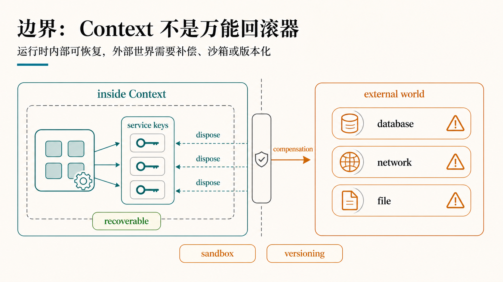

Context 不是万能回滚器。运行时内部的状态、服务和 dispose 可以被管理，但数据库、网络、文件等外部世界仍需要补偿、沙箱、版本化或事务边界配合。

## 11. 与已有方向的关系

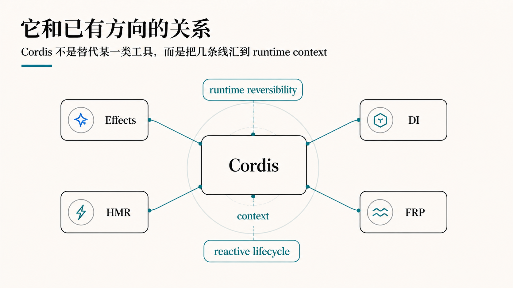

Cordis 和 effect systems、dependency injection、HMR、FRP 都有交集，但它的组合点更偏运行时：把可逆副作用和反应式生命周期放在同一个 context 机制里。

## 12. Agent Harness 的想象空间

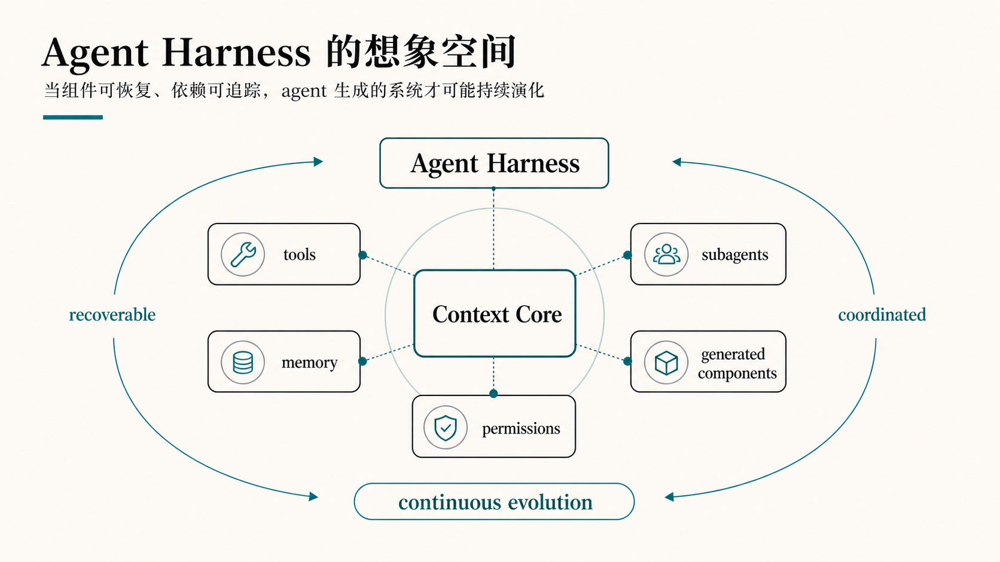

论文最后的 agent harness 方向很有启发：如果未来 agent 会持续生成工具、子组件、权限和记忆模块，那么系统必须支持可恢复、可追踪、可协调的动态演化。Context Paradigm 正是在为这种系统提供底层形状。

## 3 个核心要点

1. Cordis 把论文演算具体化为 `ctx`、fiber、dispose stack、loader reconciliation 和 HMR transaction，而不是只停留在理论符号层。
2. Koishi 案例说明这套范式适合长期演化的插件系统，但外部副作用仍需要额外的工程边界。
3. 对 agent harness 来说，真正重要的是让生成组件可撤销、依赖可追踪、更新可协调，否则系统会越运行越不可控。

## 主要来源

- [A Programming Paradigm for Spatiotemporal Composability - GitHub](https://github.com/cordiverse/paper)
- [paper.pdf](https://raw.githubusercontent.com/cordiverse/paper/main/paper.pdf)
