# The Illustrated Transformer 中文精读笔记

资料来源：

- 原文：[The Illustrated Transformer](https://jalammar.github.io/illustrated-transformer/)
- 中文译文参考：[The Illustrated Transformer 译 - CSDN](https://blog.csdn.net/yujianmin1990/article/details/85221271)
- 原论文：[Attention Is All You Need](https://arxiv.org/abs/1706.03762)
- 代码讲解：[The Annotated Transformer](https://nlp.seas.harvard.edu/2018/04/03/attention.html)

图像说明：本文配图使用 Jay Alammar 原文中的 Transformer 图解图片。原文页底部注明采用 [Creative Commons Attribution-NonCommercial-ShareAlike 4.0 International License](https://creativecommons.org/licenses/by-nc-sa/4.0/)；署名格式为：Alammar, J. (2018). The Illustrated Transformer [Blog post]. Retrieved from <https://jalammar.github.io/illustrated-transformer/>。

这篇笔记不是对译文的逐字搬运，而是基于原文结构整理的一版中文精读。它最适合回答一个问题：Transformer 的数据到底怎样从输入句子一路流到输出词概率？

## 一句话总结

Transformer 把序列建模从“沿时间步递归传递状态”改成“所有 token 之间直接做可微检索”。Self-attention 负责让每个 token 动态读取其他 token，多头机制让模型在多个表示子空间里并行建关系，位置编码补上顺序信息，encoder-decoder attention 让解码器在生成每个词时回看输入句子的相关位置。

## 0. 读这篇文章时应该抓住什么

Jay Alammar 的文章很适合入门，因为它不是从论文符号开始，而是从机器翻译的黑盒开始：输入一句源语言，模型输出一句目标语言。然后它逐层拆开黑盒：

1. 外层是 encoder-decoder 架构。
2. Encoder 由多个相同结构的 encoder layer 堆叠。
3. 每个 encoder layer 包含 self-attention 和 feed-forward network。
4. Decoder 也由多个 decoder layer 堆叠，但比 encoder 多一个 encoder-decoder attention。
5. Self-attention 的核心计算是 Q/K/V。
6. Multi-head attention 是多组 Q/K/V 并行工作。
7. Positional encoding 让没有递归结构的模型知道词序。
8. 最后用 linear + softmax 把 decoder 输出向量变成词表概率。

如果只记住一个主线，可以这么想：

```text
输入 token
  -> embedding + positional encoding
  -> encoder: 多层 self-attention + FFN
  -> decoder: masked self-attention + encoder-decoder attention + FFN
  -> linear + softmax
  -> 下一个 token 的概率分布
```

## 1. 高层结构：机器翻译黑盒

Transformer 最早在机器翻译任务中提出。高层看，它仍然是一个序列到序列模型：


- 输入：源语言句子，例如法语或英语句子。
- 输出：目标语言句子，例如英语或德语句子。
- 中间：模型把源句编码成上下文表示，再由解码器逐步生成目标句。


和传统 seq2seq 不同的是，Transformer 不靠 RNN 的 hidden state 逐步传递上下文，也不靠 CNN 的局部卷积窗口堆叠感受野。它用 attention 让任意两个位置可以直接建立信息连接。

这带来两个直接后果：

- 训练更容易并行。一个句子里的多个位置可以同时计算 self-attention，不必像 RNN 那样从左到右等状态传完。
- 长距离依赖路径更短。相隔很远的两个 token 在一层 self-attention 里就能互相影响。

原论文使用 6 层 encoder 和 6 层 decoder。这个数字是论文中的模型设计选择，不是 Transformer 的定义。后来的模型可以更浅、更深，也可以只保留 encoder 或只保留 decoder。

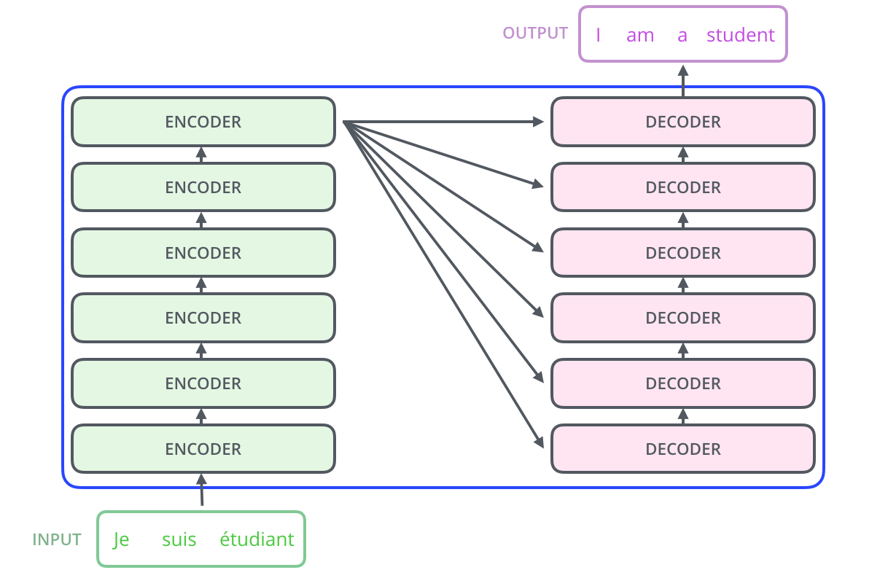

## 2. Encoder：把输入句子变成上下文表示

一个 encoder layer 主要有两个子层：


1. Multi-head self-attention
2. Position-wise feed-forward network

每个子层外面还有 residual connection 和 layer normalization。按原始论文的 post-LN 写法，可以粗略写成：

```text
x1 = LayerNorm(x + SelfAttention(x))
x2 = LayerNorm(x1 + FFN(x1))
```

Self-attention 做的是 token 之间的信息交换。FFN 做的是每个 token 内部的特征变换。两者分工很清楚：

- Attention：不同位置之间通信。
- FFN：同一位置的向量升维、非线性变换、再降维。

在 encoder 中，每个位置一开始只有自己的 token embedding。经过 self-attention 后，它的表示会混入其他位置的信息。堆叠多层后，每个 token 表示都变成了“带全句上下文的 token 表示”。


## 3. 张量视角：从词到向量

NLP 模型不能直接处理字符串，所以第一步是把 token 映射为向量。以原始 Transformer base model 为例：


- `d_model = 512`
- 每个 token embedding 是 512 维向量
- 一个长度为 `n` 的句子可以表示成矩阵 `X`
- `X` 的形状可以记为 `n x d_model`

如果输入句子有 10 个 token，则进入 encoder 的矩阵形状大致是：

```text
X: 10 x 512
```

这里每一行对应一个 token 的向量。Transformer 的关键优势之一，是很多计算都可以对整个矩阵一次性完成，而不是逐 token 循环。


需要注意：embedding 只发生在最底层输入处。后续 encoder layer 接收的不是原始词向量，而是上一层 encoder 输出的上下文表示。


## 4. Self-Attention：为什么需要“自己注意自己”

Self-attention 里的 self，不是说模型只看自己，而是说 query、key、value 都来自同一个序列。也就是说，句子内部的每个位置都可以读取同一句子中的其他位置。

文章常用一个指代消解例子来说明：当句子里出现 it 时，它到底指向前面的哪个名词？人可以结合上下文判断，模型也需要在编码 it 的时候读取其他词的信息。Self-attention 允许 it 对相关名词给出更高权重，再把这些信息合进 it 的表示里。

这和 RNN 的思路不同：

- RNN 通过 hidden state 把前文逐步压缩进当前位置。
- Self-attention 直接让当前位置与所有位置计算相关性。

所以 self-attention 更像一张动态生成的关系图。每个样本、每一层、每个 head 都可能产生不同的连接模式。


## 5. Q/K/V：注意力的核心抽象

Self-attention 的关键是为每个 token 生成三个向量：

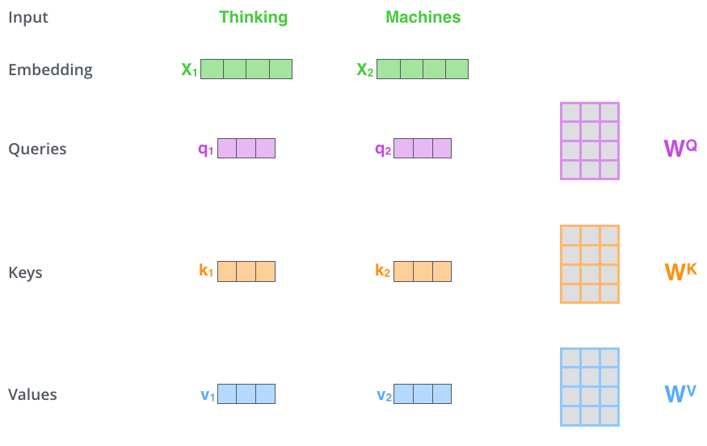

- `Query`：当前位置想找什么信息。
- `Key`：当前位置暴露给别人匹配的索引。
- `Value`：当前位置真正贡献出去的内容。

这三个向量来自同一个输入向量的三个线性投影：

```text
Q = X W_Q
K = X W_K
V = X W_V
```

如果 `X` 是 `n x d_model`，单个 head 的维度是 `d_k`，那么：

```text
X:   n x d_model
W_Q: d_model x d_k
W_K: d_model x d_k
W_V: d_model x d_v
Q:   n x d_k
K:   n x d_k
V:   n x d_v
```

在原始 Transformer base model 中，`d_model = 512`，`h = 8` 个 head，所以每个 head 常取：

```text
d_k = d_v = 512 / 8 = 64
```

这样做的好处是，多头并行之后总维度仍然保持在 512 左右，计算量可控。

## 6. 单个位置的 attention 怎么算

假设现在要更新第 `i` 个 token 的表示。它会拿自己的 query `q_i` 去和所有 token 的 key 做匹配：

```text
score(i, j) = q_i · k_j
```

这个分数表示：第 `i` 个位置在更新自己时，应该多关注第 `j` 个位置。

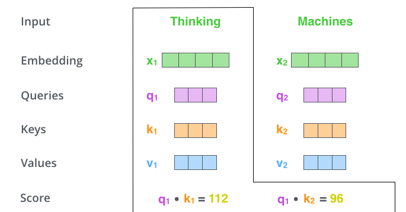

然后做三步：

1. 缩放：把分数除以 `sqrt(d_k)`。
2. 归一化：对所有分数做 softmax，得到一组权重。
3. 汇聚：用这些权重对所有 value 加权求和。

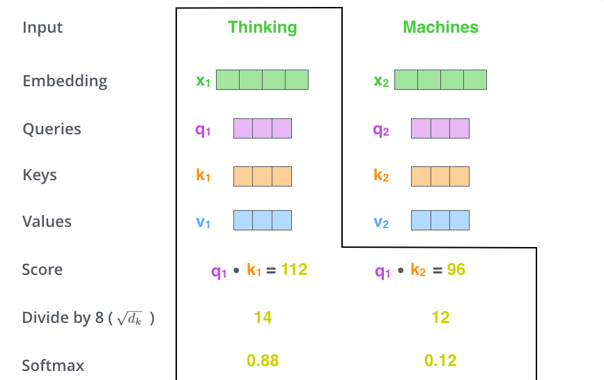

写成公式：

$$
\mathrm{Attention}(q_i, K, V)
= \sum_j \mathrm{softmax}\left(\frac{q_i k_j^T}{\sqrt{d_k}}\right) v_j
$$

为什么要除以 `sqrt(d_k)`？因为维度越大，点积值的方差通常越大。过大的 logits 会让 softmax 变得非常尖锐，梯度容易变小。缩放能让训练更稳定。

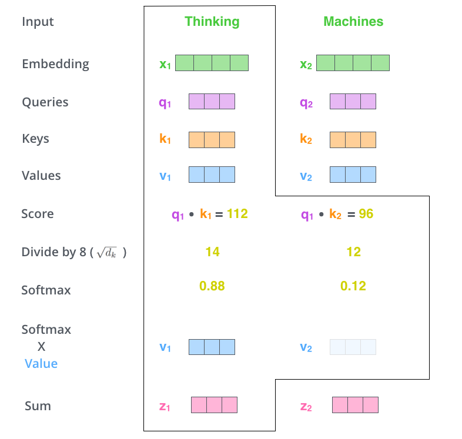

## 7. 矩阵形式：一次算完整个序列

实际实现不会对每个 token 手写循环，而是直接用矩阵乘法：


$$
\mathrm{Attention}(Q,K,V)
= \mathrm{softmax}\left(\frac{QK^T}{\sqrt{d_k}}\right)V
$$

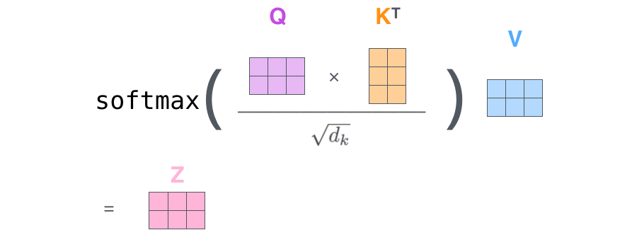

各部分含义：

- `QK^T`：得到 `n x n` 的注意力打分矩阵。
- 第 `i` 行：第 `i` 个 token 对所有 token 的关注分数。
- `softmax`：通常对每一行做，使每个 query 对所有 key 的权重和为 1。
- 乘以 `V`：把权重分布转成 value 的加权汇聚结果。

如果序列长度是 `n`，那么 attention matrix 是 `n x n`。这解释了 Transformer 的一个重要代价：标准 self-attention 的时间和显存复杂度都随序列长度平方增长。它能并行，但长上下文会变贵。

## 8. Multi-Head Attention：多张关系图并行

单头 attention 只有一套 Q/K/V 投影，容易把不同类型的关系混在一张注意力图里。Multi-head attention 的做法是：


1. 为每个 head 准备一组独立的 `W_Q`、`W_K`、`W_V`。
2. 每个 head 在自己的子空间里算 attention。
3. 把所有 head 的输出拼接起来。
4. 再乘一个输出投影矩阵 `W_O`，回到 `d_model` 维。


公式可以写成：

$$
\mathrm{head}_i = \mathrm{Attention}(QW_i^Q, KW_i^K, VW_i^V)
$$

$$
\mathrm{MultiHead}(Q,K,V)
= \mathrm{Concat}(\mathrm{head}_1,\ldots,\mathrm{head}_h)W^O
$$


直觉上，每个 head 都像一张不同的关系图：

- 有的 head 可能偏向局部相邻 token。
- 有的 head 可能偏向主谓宾或修饰关系。
- 有的 head 可能捕捉代词和先行词。
- 有的 head 可能关注标点、分隔符或句子边界。

这些分工不是人工指定的，而是在训练中由任务目标推动出来的。


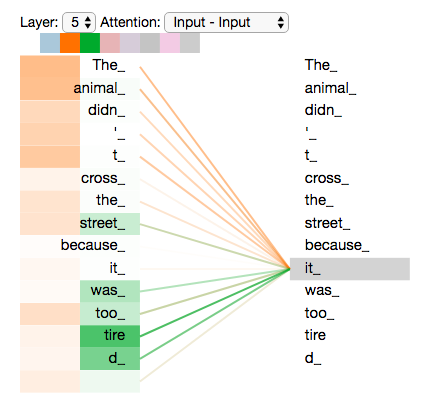

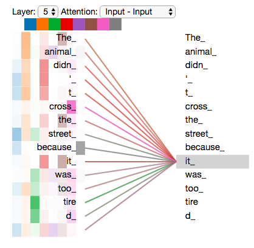

## 9. Position Encoding：没有 RNN，怎么知道顺序

Self-attention 本身对顺序不敏感。如果只看一组 token 向量，不额外加入位置信息，模型很难区分“猫追狗”和“狗追猫”这种词集合相同但顺序不同的句子。

Transformer 的做法是：给每个位置生成一个 positional encoding，并把它加到 token embedding 上。

```text
输入表示 = token embedding + positional encoding
```

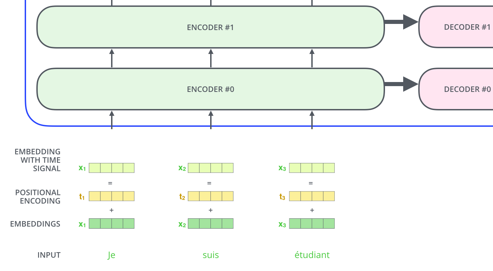

原论文使用正弦和余弦函数构造位置编码：

$$
PE_{(pos, 2i)} = \sin\left(pos / 10000^{2i / d_{model}}\right)
$$

$$
PE_{(pos, 2i+1)} = \cos\left(pos / 10000^{2i / d_{model}}\right)
$$

这里：

- `pos` 是位置编号。
- `i` 是维度编号。
- 偶数维用 sine，奇数维用 cosine。
- 不同频率让模型能表达不同尺度的位置变化。

这种设计的一个优点是可以外推到比训练时更长的位置，因为位置向量由函数生成，而不是只能查固定表。当然，后来的模型也常使用可学习位置编码、相对位置编码、RoPE、ALiBi 等变体。


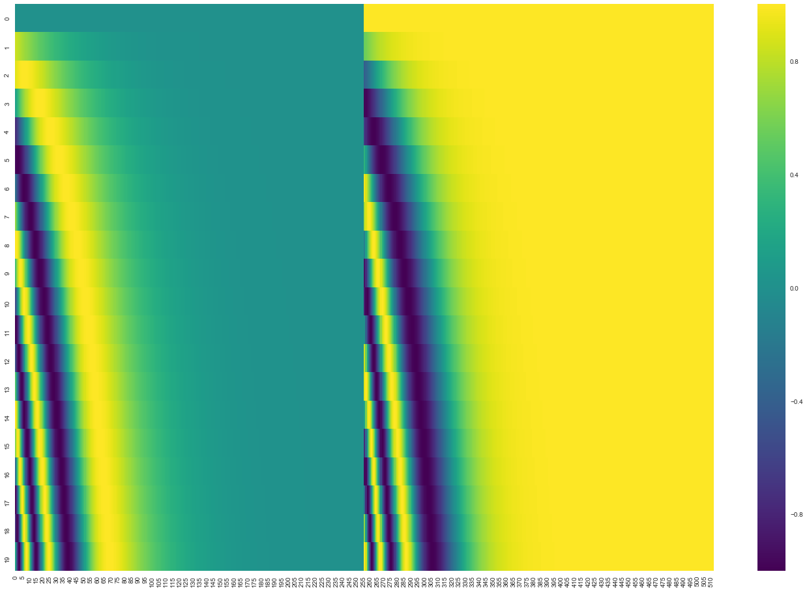

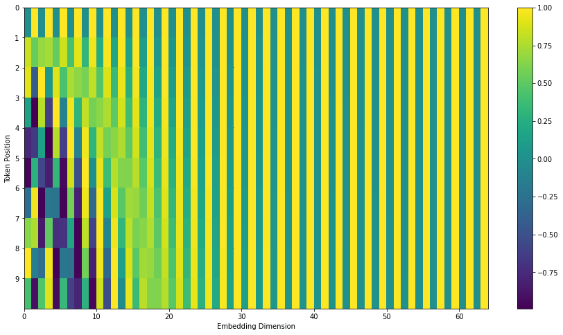

## 10. Residual + LayerNorm：让深层堆叠更稳定

每个 attention 或 FFN 子层外面都有残差连接和层归一化。残差连接的作用是给信息和梯度一条更直接的路径：


```text
输出 = LayerNorm(输入 + 子层(输入))
```

如果没有残差，深层网络容易在训练中丢失底层信息，也更难优化。残差让每一层只需要学习“在原表示基础上补充什么变化”。

LayerNorm 则在特征维度上做归一化，让每个 token 的向量分布更稳定。对 Transformer 这类深层堆叠模型来说，归一化不是装饰，而是训练稳定性的重要组成部分。


一个小提醒：原始 Transformer 论文采用 post-LN，也就是子层后做 LayerNorm；很多后来的大模型更偏好 pre-LN，把 LayerNorm 放在子层之前，以改善更深网络的训练稳定性。


## 11. Decoder：生成端为什么多一层 attention

Decoder layer 通常包含三个子层：

1. Masked multi-head self-attention
2. Encoder-decoder attention
3. Feed-forward network

第一层 masked self-attention 只允许目标端当前位置看到已经生成的 token，不能偷看未来答案。例如生成第 3 个词时，只能看第 1、2 个词和当前位置，不能看第 4、5 个词。

这个限制通常通过 mask 实现：在 softmax 之前，把未来位置的分数设为负无穷。softmax 后，这些位置的权重就接近 0。

第二层 encoder-decoder attention 是 decoder 和 encoder 的连接点：

- Query 来自 decoder 当前层。
- Key 和 Value 来自 encoder 最后一层输出。

这意味着 decoder 在生成每个目标 token 时，都可以用当前生成状态去源句表示里检索相关信息。它和早期 seq2seq attention 的精神类似，但被整合进了 multi-head attention 框架。


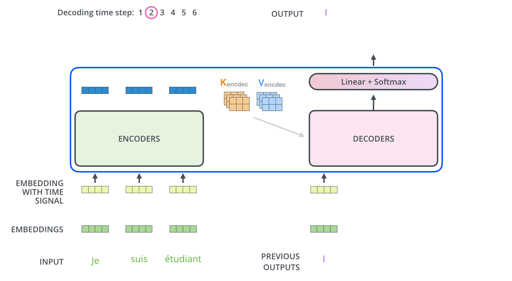

## 12. Linear + Softmax：从向量到词

Decoder 最后一层输出的是隐藏向量，不是词。要把它变成具体 token，需要两个步骤：

1. Linear layer：把隐藏向量映射到词表大小。
2. Softmax：把 logits 转成概率分布。

如果目标词表大小是 `VocabSize`，decoder 某一步输出向量是 `d_model` 维，那么线性层会输出一个 `VocabSize` 维向量：

```text
hidden: d_model
logits: VocabSize
probs:  VocabSize
```

概率最高的 token 可以作为当前步输出。这就是 greedy decoding 的基本思路。


## 13. 训练：让概率分布靠近真实答案

训练机器翻译模型时，输入是源句，目标是正确译文。模型每个时间步都会输出一个词表概率分布，训练目标是让正确 token 的概率尽量高。


例如目标句是：

```text
i am a student <eos>
```

模型需要在第 1 步把概率集中到 `i`，第 2 步集中到 `am`，第 3 步集中到 `a`，依此类推，最后预测结束符 `<eos>`。


常用损失是交叉熵：

$$
L = -\sum_t \log p(y_t \mid y_{<t}, x)
$$

其中：

- `x` 是源句。
- `y_t` 是目标句第 `t` 个 token。
- `y_{<t}` 是之前的目标 token。

训练时通常使用 teacher forcing：decoder 的输入来自真实目标序列右移一位，而不是模型自己上一步采样出的词。这样训练更稳定，也能并行计算目标端所有位置的损失。


## 14. 推理：Greedy Search 和 Beam Search

训练时我们知道完整目标句；推理时不知道，只能一步步生成。

最简单的方法是 greedy search：

1. 从起始符 `<bos>` 开始。
2. 模型输出下一个 token 的概率分布。
3. 选择概率最高的 token。
4. 把它拼到已生成序列后面。
5. 重复直到生成 `<eos>` 或达到长度上限。

Greedy search 简单、快，但每一步只保留一个选择，容易错过全局更好的句子。

Beam search 会在每一步保留多个候选序列。比如 beam size 为 4，就保留当前总分最高的 4 条路径，再继续扩展。它通常比 greedy search 稳一些，但更慢，也不保证一定产生人类最喜欢的输出。

## 15. Transformer 的三个关键洞见

第一，attention 是一种动态信息路由。传统层的连接模式相对固定，而 self-attention 根据当前输入临时计算 token 之间的连接强度。模型不是被迫按距离读信息，而是学习“该向哪里取信息”。

第二，多头机制让关系建模不必挤在一张图里。语言里的关系非常多：位置邻近、句法依赖、指代、省略、实体属性、短语边界等。Multi-head attention 给模型提供了多个并行子空间，让这些关系有机会分开表达。

第三，Transformer 把强并行和短路径结合起来。RNN 的路径长，CNN 的感受野需要堆叠，self-attention 则让任意位置在一层内直接交互。这解释了它为什么适合大规模数据和硬件并行。

## 16. 常见易混点

### Q/K/V 不是三份不同输入

在 self-attention 中，Q、K、V 通常都来自同一个序列，只是经过不同线性投影。它们代表三种角色，而不是三份原始数据。

### Attention 权重不是解释的全部

可视化 attention 权重很直观，但不要把它等同于完整解释。一个 head 的高权重说明该层该 head 在做一次加权读取，但最终预测还经过多层、多头、FFN、残差和输出层共同作用。

### Encoder-only、decoder-only 和 encoder-decoder 不是同一种用法

原始 Transformer 是 encoder-decoder，适合机器翻译这类输入到输出的生成任务。BERT 常用 encoder-only，适合理解和表征学习。GPT 常用 decoder-only，适合自回归生成。它们共享 Transformer block 的思想，但 attention mask、训练目标和使用方式不同。

### 位置编码不是可选装饰

没有位置信息时，self-attention 很难知道 token 顺序。无论是绝对位置、相对位置还是旋转位置，本质上都在补“序列顺序”这个信息。

### 标准 attention 的长上下文成本很高

如果序列长度翻倍，`n x n` attention matrix 的规模会变成四倍。这也是后来很多长上下文模型要研究稀疏 attention、线性 attention、滑动窗口、分块计算和 KV cache 优化的原因。

## 17. 和原论文的对应关系

| 文章讲法 | 原论文概念 | 需要记住的点 |
| --- | --- | --- |
| 编码组件和解码组件 | Encoder-decoder architecture | 源句先编码，目标句逐步解码 |
| Self-attention | Scaled dot-product attention | 用 Q/K 匹配，用权重汇聚 V |
| 多个 attention heads | Multi-head attention | 多个子空间并行建关系 |
| 词序信息 | Positional encoding | 因为没有 RNN，需要显式加入顺序 |
| 子层外的跳连 | Residual connection + LayerNorm | 帮助深层网络稳定训练 |
| 解码器看输入句子 | Encoder-decoder attention | decoder query 读取 encoder key/value |
| 输出词概率 | Linear + softmax | 隐藏向量映射到词表分布 |

## 18. 自己复述一遍完整前向过程

以机器翻译为例，Transformer 的一次前向过程可以这样复述：

1. 源句被分词，每个 token 查 embedding。
2. 每个 token embedding 加上 positional encoding。
3. 输入矩阵进入第一层 encoder。
4. Encoder self-attention 为每个 token 计算它应该读取其他 token 的权重。
5. Attention 输出经过残差、LayerNorm、FFN，再进入下一层 encoder。
6. 多层 encoder 后，得到源句每个位置的上下文表示。
7. 目标端已生成 token 进入 decoder，并同样加位置编码。
8. Decoder masked self-attention 只读取当前位置及其之前的目标 token。
9. Decoder 用当前状态作为 query，通过 encoder-decoder attention 读取源句表示。
10. Decoder 输出经过 FFN 和堆叠层后，得到当前目标位置的隐藏向量。
11. Linear + softmax 把隐藏向量转成词表概率。
12. 训练时用真实目标 token 计算交叉熵；推理时选择下一个 token 继续生成。

## 19. 读完后最该带走的 5 个点

1. Transformer 的核心不是单个公式，而是一套序列信息路由架构。
2. Self-attention 让每个 token 可以直接读取全序列信息。
3. Q/K/V 把“找什么、怎么匹配、取什么内容”拆成了可学习的三种投影。
4. Multi-head attention 让模型同时学习多种关系图。
5. Decoder 的 mask 和 encoder-decoder attention 决定了它既不能偷看未来，又能回看源句。

## 延伸阅读顺序

如果按学习坡度来读，可以这样安排：

1. 先读 Jay Alammar 的图解文章，建立整体视觉直觉。
2. 再读这篇笔记，把 Q/K/V、矩阵形状和数据流补完整。
3. 接着读 The Annotated Transformer，用代码把每个模块跑通。
4. 最后读 Attention Is All You Need 原论文，对照公式、复杂度表和实验结果。
