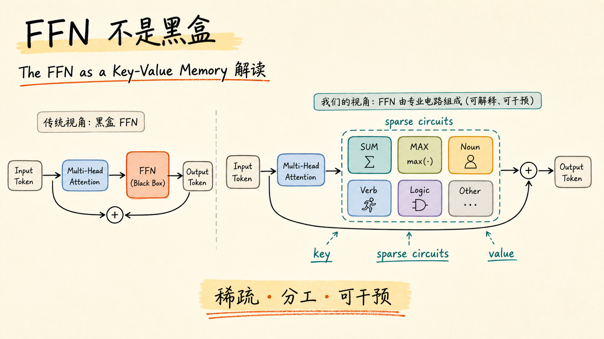
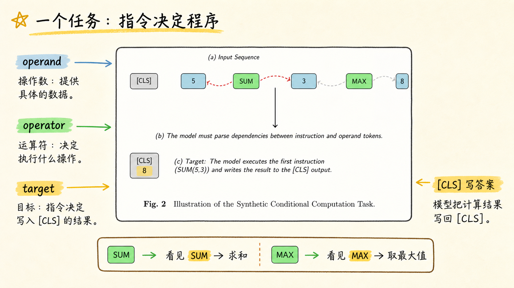
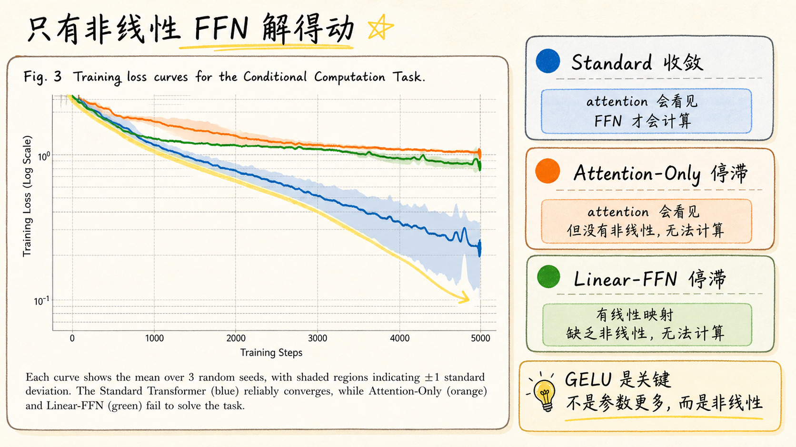
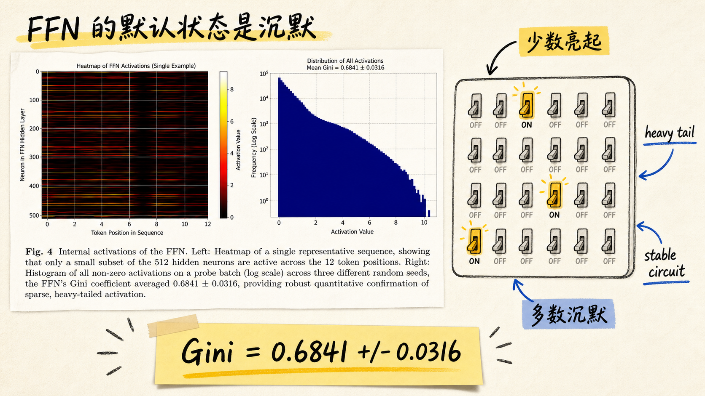
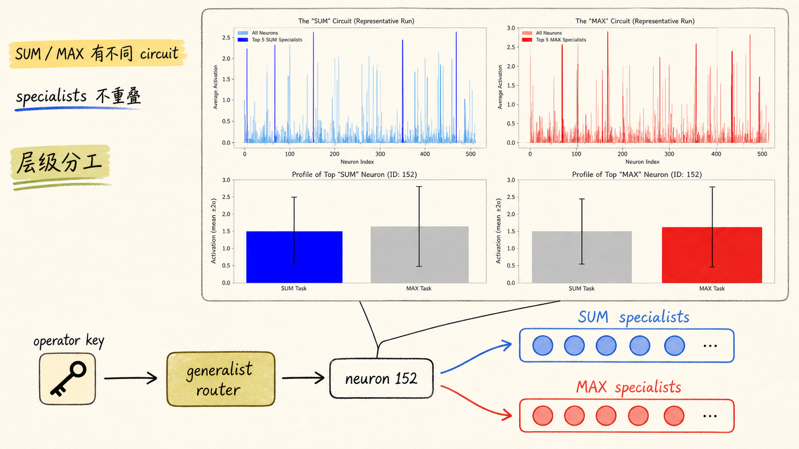
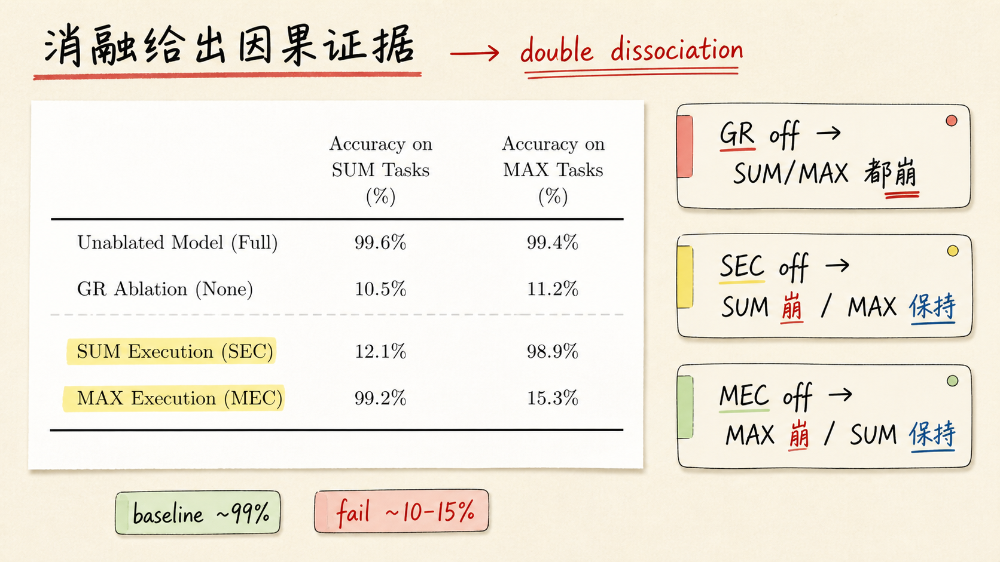
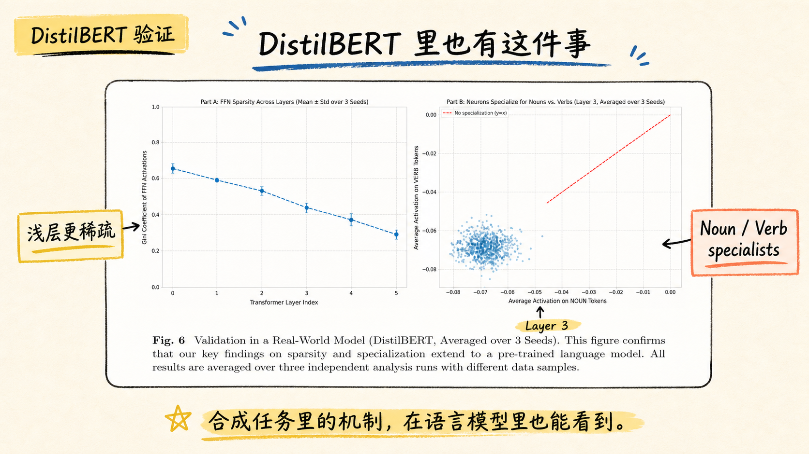
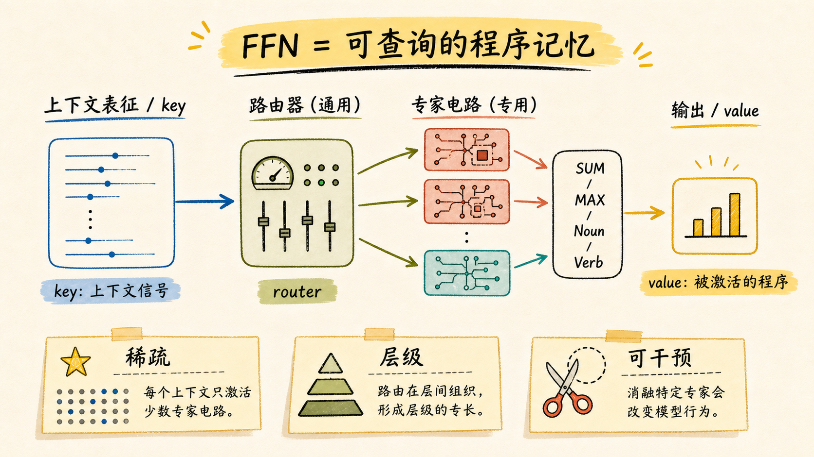

# The FFN as a Key-Value Memory: Functional Specialization in Transformer Computation 解读

论文链接：[DOI](https://doi.org/10.1007/s10994-025-06948-1) / [DBLP](https://dblp.org/rec/journals/ml/RahmanDKK26) / [ML Anthology](https://mlanthology.org/mlj/2026/)

作者：Zaryab Rahman, Fakhrud Din, Shah Khalid, Rishi Karthikeyan

期刊：Machine Learning 115(1):2，2026；线上发布时间为 2025-12-14

产物下载：[PPTX](../assets/images/the-ffn-as-a-key-value-memory-deck/the-ffn-as-a-key-value-memory-deck.pptx) / [PDF](../assets/images/the-ffn-as-a-key-value-memory-deck/the-ffn-as-a-key-value-memory-deck.pdf)

## 一句话总结

这篇论文想把 FFN 从“给 Transformer 加容量的黑盒层”重新解释为一个可查询的程序记忆：attention 产生上下文 key，FFN 通过稀疏激活选择层级化的 specialist circuit，并输出对应的 computational value。

## 1. FFN 不是黑盒

传统讲 Transformer 时，attention 往往是主角，FFN 则被说成每个 token 上独立运行的 MLP。论文要挑战的正是这种“容量补丁”视角：FFN 内部可能不是一团纠缠的 dense computation，而是许多可被上下文选择的稀疏 circuit。

## 2. 一个任务：指令决定程序

作者设计了 Conditional Computation 任务：输入序列同时包含数字 operand 和 operator token，模型要根据指令选择 SUM 或 MAX，并把第一个指令的计算结果写回 `[CLS]`。这个任务的好处是把“看见所有 token”和“根据指令做非线性计算”拆开了。

## 3. 只有非线性 FFN 解得动

三种模型对比很直接：Standard Transformer 可以稳定收敛；Attention-Only 虽然能全局混合信息，但 loss 停滞；Linear-FFN 增加了参数和深度，却因为去掉 GELU 非线性，同样学不会。这里的结论是：FFN 的价值不是“多一些参数”，而是提供 input-dependent logic 所需的非线性计算。

## 4. FFN 的默认状态是沉默

在训练好的 Standard Transformer 里，作者抓取 FFN hidden layer activation。512 个 hidden neurons 并不是密集共同工作，而是大部分接近 0，少数 neuron 形成稳定亮带。论文用 Gini coefficient 量化这种不均匀性：`0.6841 +/- 0.0316`，说明 FFN 更像一个 sparse switchboard。

## 5. SUM 和 MAX 有不同 circuit

更关键的是，稀疏并不是随机省计算。SUM-only 和 MAX-only 测试集会激活 largely non-overlapping specialist neurons，说明 FFN 学出了任务专用 circuit。同时，最活跃的 neuron 152 在 SUM 和 MAX 中都强激活，像一个 generalist router：先识别“这里需要 arithmetic”，再把计算导向下游 specialist。

## 6. 消融给出因果证据

观察到 specialization 还不够，论文进一步做 targeted ablation。Baseline 在 SUM/MAX 上分别是 99.6% / 99.4%；打掉 Generalist Router 后两者都降到约 10%；打掉 SUM Execution Circuit 后 SUM 降到 12.1%，MAX 仍有 98.9%；打掉 MAX Execution Circuit 后 MAX 降到 15.3%，SUM 仍有 99.2%。这就是典型 double dissociation：不同 circuit 对应不同功能。

## 7. DistilBERT 里也有这件事

为了避免“只是合成任务特例”的质疑，论文在预训练 DistilBERT 上验证。六层 FFN 都表现出较高稀疏性，而且浅层更稀疏、深层稍微变密；Layer 3 的 noun/verb activation scatter 也偏离无 specialization 的对角线，说明真实语言模型里也能看到按语言类别分工的 neuron 群。

## 8. 最后的机制闭环

把证据串起来，论文给出的 FFN-as-memory 版本更接近“可查询程序库”：attention 先把上下文压成 key，FFN 中的 generalist router 和 specialist circuits 根据 key 被稀疏激活，输出对应的 value。这个 value 不只是词表事实，也可以是 SUM、MAX、noun/verb 这类计算或语言功能。

## 3 个核心要点

1. FFN 的角色不只是扩容；在需要条件逻辑的任务上，非线性 FFN 是真正执行计算的组件。
2. 稀疏激活是机制线索：它让一个 FFN 容纳多个相对独立的 computational circuits，减少不同功能之间的干扰。
3. targeted ablation 是这篇论文最有力的证据：SEC/MEC 的选择性失效和 GR 的全局失效，把“相关性”推进到“因果结构”。

## 主要来源

- [The FFN as a Key-Value Memory: Functional Specialization in Transformer Computation - DOI](https://doi.org/10.1007/s10994-025-06948-1)
- [The FFN as a Key-Value Memory: Functional Specialization in Transformer Computation - DBLP](https://dblp.org/rec/journals/ml/RahmanDKK26)
- [MLJ 2026 - ML Anthology](https://mlanthology.org/mlj/2026/)
- 本地 PDF：`The_FFN_as_a_Key_Value_Memory-Highlighted.pdf`
