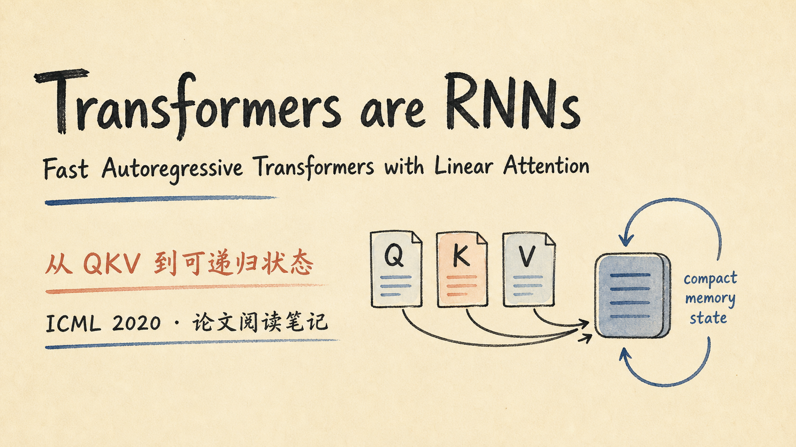
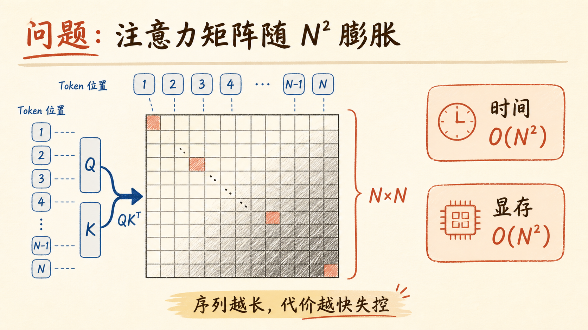
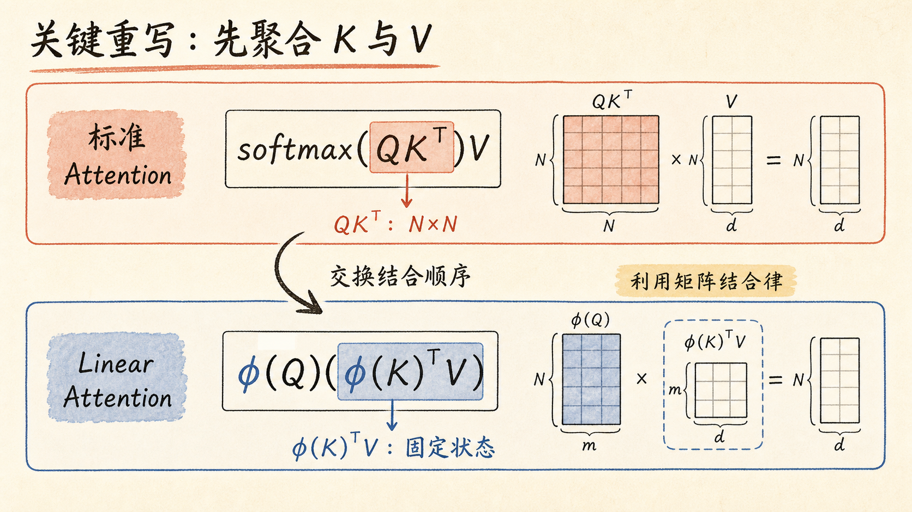
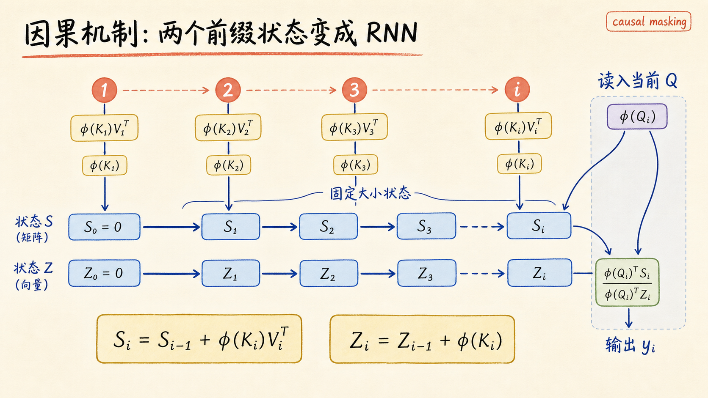
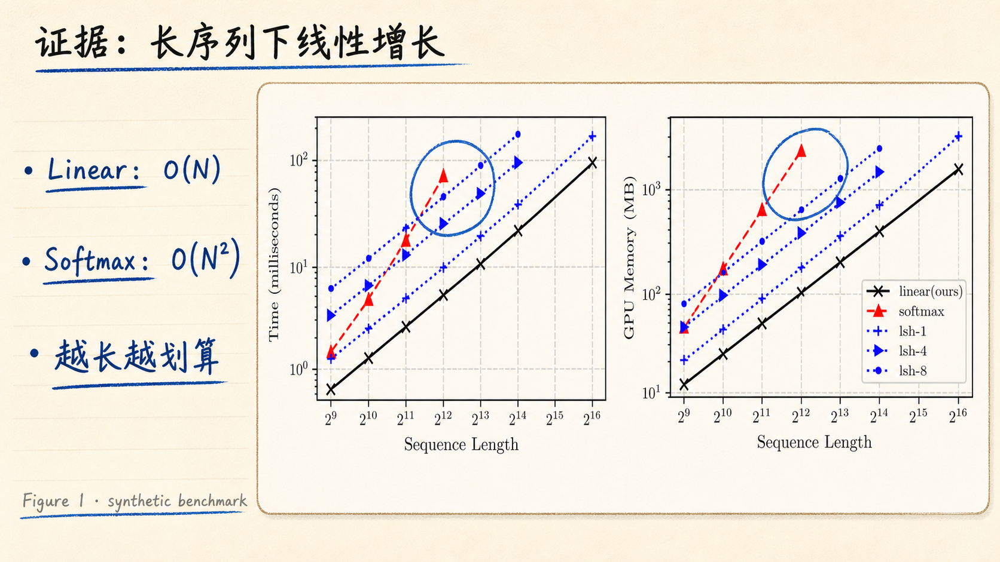
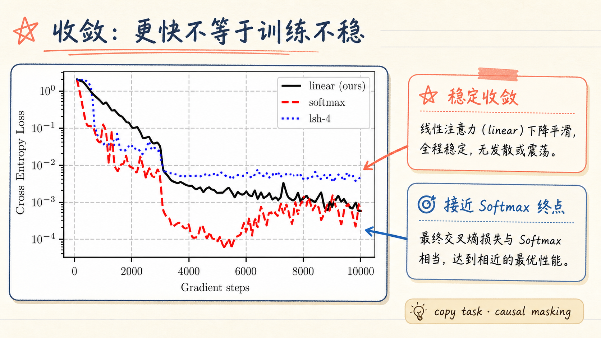
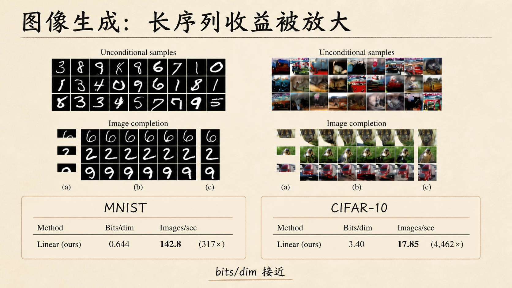
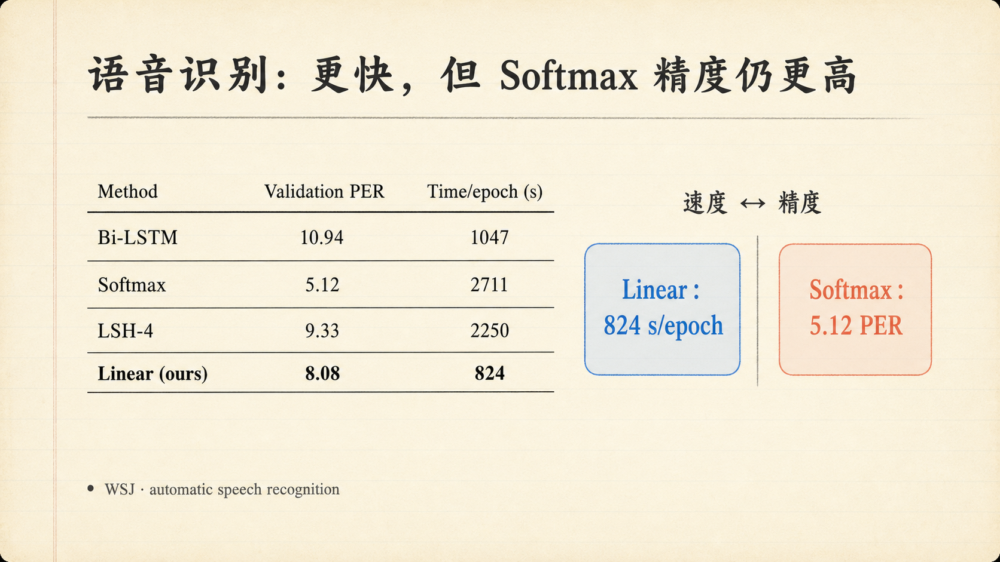
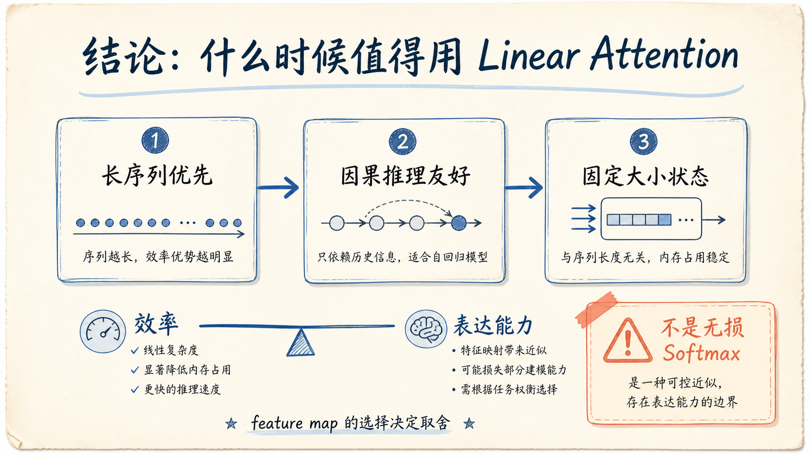

# Transformers are RNNs: Fast Autoregressive Transformers with Linear Attention 解读

论文链接：[ICML / PMLR 正式页面](https://proceedings.mlr.press/v119/katharopoulos20a) / [官方 PDF](https://proceedings.mlr.press/v119/katharopoulos20a/katharopoulos20a.pdf) / [arXiv:2006.16236](https://arxiv.org/abs/2006.16236)

作者：Angelos Katharopoulos, Apoorv Vyas, Nikolaos Pappas, François Fleuret

会议：ICML 2020（Proceedings of Machine Learning Research, Volume 119）

产物下载：[PPTX](../assets/images/transformers-are-rnns-fast-autoregressive-transformers-with-linear-attention-deck/transformers-are-rnns-fast-autoregressive-transformers-with-linear-attention-deck.pptx) / [PDF](../assets/images/transformers-are-rnns-fast-autoregressive-transformers-with-linear-attention-deck/transformers-are-rnns-fast-autoregressive-transformers-with-linear-attention-deck.pdf)

## 一句话总结

这篇论文不是简单地把标准 Softmax Attention “算快一点”，而是用 feature map 改写相似度，再利用矩阵结合律先汇总 K 与 V；这样可以绕开 (N\times N) 注意力矩阵，让因果模型只维护固定大小的状态，在长序列自回归推理中呈现 RNN 式的线性时间与常数记忆。

## 1. Transformers are RNNs：Linear Attention 解读

封面把论文主张压缩成一条路径：Q、K、V 进入 compact memory state，再沿时间递归更新。这里的“RNN”不是说 Transformer 层深度变成递归，而是说在因果自回归推理时，attention 可以用随时间更新的内部状态实现。

## 2. 问题：注意力矩阵随 (N^2) 膨胀

标准 scaled dot-product attention 的核心是：

$$
\mathrm{Attention}(Q,K,V)=\mathrm{softmax}\left(\frac{QK^T}{\sqrt{d_k}}\right)V
$$

如果序列长度是 (N)，(QK^T) 就是 (N\times N) 的关系矩阵。它既带来 (O(N^2)) 的时间开销，也需要保存与序列长度平方增长的中间注意力矩阵，长上下文因此很快变得昂贵。

## 3. 关键重写：先聚合 K 与 V

论文用正值 feature map (φ) 替换原始指数相似度的一种可结合形式。核心变形可以写成：

$$
\left(\phi(Q)\phi(K)^T\right)V
=\phi(Q)\left(\phi(K)^TV\right)
$$

左边需要先形成 (N\times N) 的矩阵；右边先得到较小的 (φ(K)^TV) 汇总状态，再让 (φ(Q)) 查询它。论文实验采用 (φ(x)=\mathrm{elu}(x)+1)，以保证相似度为正并保持归一化稳定。

## 4. 因果机制：两个前缀状态变成 RNN

因果掩码要求第 (i) 个位置只能看见 (j\le i) 的历史。Linear Attention 不必保存完整的下三角矩阵，而是递推两个前缀状态：

$$
S_i=S_{i-1}+\phi(K_i)V_i^T,
\qquad
Z_i=Z_{i-1}+\phi(K_i)
$$

当前查询通过 (φ(Q_i)^TS_i / \phi(Q_i)^TZ_i) 读取状态并产生输出。训练时整段序列仍可并行；自回归推理时，每一步只更新固定大小的 (S_i) 与 (Z_i)，这正是论文称其“像 RNN”的原因。

## 5. 证据：长序列下线性增长

论文 Figure 1 对比了 softmax attention、Reformer 和 Linear Attention 的 forward/backward 时间与 GPU 显存。随着序列长度增加，softmax 曲线呈平方增长，而 Linear 与 Reformer 近似线性；Linear 在这组 synthetic benchmark 中同时更快、更省显存。

这里的“线性”是关于序列长度 (N) 的渐近复杂度。常数项仍取决于 feature map 维度、head dimension 和具体实现，不能把 (O(N)) 直接理解成所有场景都更快。

## 6. 收敛：更快不等于训练不稳

在 sequence duplication 的 copy task 上，Linear Attention 的 loss 下降平稳，最终达到与 softmax 相近的水平；LSH-4 则受到 hashing 噪声影响。这个实验说明，改变 attention 计算形式并不必然破坏优化稳定性，但它也不是对原始 softmax attention 的无损重排。

## 7. 图像生成：长序列收益被放大

在自回归图像生成中，Linear Transformer 的质量指标与 softmax 接近，但吞吐提升随序列变长而显著放大：

- MNIST：Linear 为 (0.644) bits/dim、(142.8) images/sec，约为 softmax 的 (317\times)；
- CIFAR-10：Linear 为 (3.40) bits/dim、(17.85) images/sec，约为 softmax 的 (4{,}462\times)。

论文还强调，Linear 模型在推理时只需保存 (S_i) 和 (Z_i)，显存不随已生成像素数平方增长。这个优势在 CIFAR-10 这种更长的像素序列上尤其明显。

## 8. 语音识别：更快，但 Softmax 精度仍更高

WSJ 自动语音识别实验把取舍展示得很直白：

- Softmax 的 validation PER 最低，为 (5.12)，但每个 epoch 需要 (2711) 秒；
- Linear 的 PER 为 (8.08)，每个 epoch 只需 (824) 秒，速度超过 (3\times)；
- Linear 也比 Bi-LSTM（(1047) 秒）和 LSH-4（(2250) 秒）更快。

因此，Linear Attention 的价值不是在每项指标上都压过 softmax，而是用可控的表达能力代价换取更低的长序列计算与推理成本。

## 9. 结论：什么时候值得用 Linear Attention

可以把适用条件记成三张卡：序列足够长、任务需要因果自回归、历史信息可以压缩到固定状态。此时，线性复杂度和常数记忆会直接转化为更高吞吐与更低延迟。

边界也同样重要：Linear Attention 改变了相似度和归一化结构，feature map 的选择会影响表达能力、稳定性与可迁移性。它更像是一种效率—表达能力的可控取舍，而不是对标准 Softmax Attention 的无损替代。

## 3 个核心要点

1. **瓶颈在 (QK^T)**：标准 Attention 显式构造 (N\times N) 关系矩阵，长序列的时间和显存因此呈平方增长。
2. **结合律带来固定状态**：通过 (φ(Q)(φ(K)^TV)) 和两个前缀状态 (S/Z)，因果推理可以用 RNN 式递推完成。
3. **收益伴随取舍**：图像生成实验展示了数百到数千倍吞吐提升，但 WSJ 结果也提醒我们，效率提升不等于所有任务上的精度领先。

## 主要来源

- [Transformers are RNNs: Fast Autoregressive Transformers with Linear Attention - PMLR](https://proceedings.mlr.press/v119/katharopoulos20a)
- [论文官方 PDF](https://proceedings.mlr.press/v119/katharopoulos20a/katharopoulos20a.pdf)
- [arXiv:2006.16236](https://arxiv.org/abs/2006.16236)
